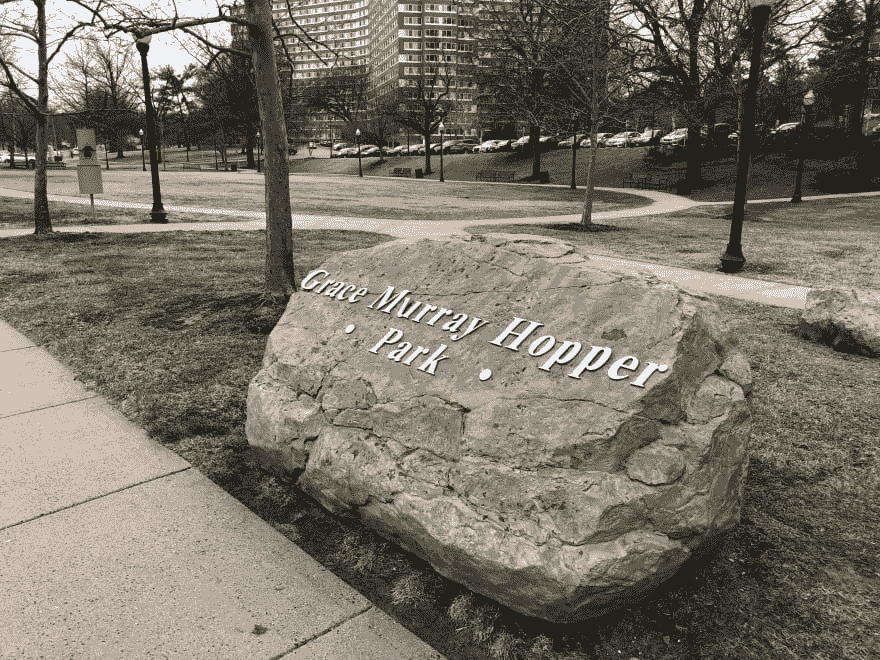

# 关于做大事

> 原文：<https://dev.to/victoria/on-doing-great-things-j0h>

今天是国际妇女节，我想到了格蕾丝·赫柏。

格蕾丝·赫柏是一位了不起的女士，她做了很多伟大的事情。她设想并帮助创造了将英语术语翻译成机器代码的编程语言。从 34 岁被拒绝加入美国海军开始，到 3 年后宣誓加入美国海军预备役，再到 60 岁以指挥官军衔退休，她一直坚持自己的意图...然后被召回(两次)并在 67 岁时晋升为上尉。她倡导分布式网络，开发了我们今天使用的计算机测试标准，还有其他不胜枚举的成就。

据我所知，在她一生中，她一直专注于自己的工作。她做了伟大的事情，因为她能做这些事情，并且觉得有责任去做这些事情。她的作品不言自明。

最近，我偶然发现一块相当大的石头，表示一个相当小而安静的公园。看起来是这样的:

当我第一次看到这个公园时，我认为这位伟大的女士一点也不公正。但经过一番思考，我渐渐觉得它缺乏假设和宏伟。今天，它把我一直在想的事情推到了最前沿。

我试着定期为广阔的技术世界做贡献，通常是通过建造东西、写作和指导。我有时会被邀请参加以女性为主的科技活动。我听到这样的话，“女性开发人员太少了”，或者“我们区块链需要更多女性”，或者“我们需要更多女性程序员”

有一段时间我不知道该如何回答，因为虽然我的答案不是“是”，但也不完全是“不是”。真的是“不，因为……”因为我害怕。我害怕歪曲我自己、我的价值观和我的目标。

歧视和种族主义是真实存在的。它们存在于极少数声音很大的人的头脑和态度中，一如既往。然而，这些人并不是大多数。它们很小。

我认为，在我们偶尔遇到这些人的时候，我们应该尽力以身作则。我们应该开放思想，讲述我们的故事，倾听他们的故事。试着学点东西。仅此而已。

当我介绍自己的时候，我不会指出我是一个女人。我不支持“科技女性”，也不代表她们。我不参加女性专属的会议，也不支持歧视男性的组织，或者根本不支持任何人。这并不是因为我作为一个女人没有安全感，或者因为我是一个女人而感到羞耻，或者其他一些最近与女性联系在一起的煽动性形容词。这是因为我没有理由指出我的性别，就像不需要指出我的头发是黑色的，或者我很矮一样。这是显而易见的，同时也是不相关的。

当我认同一个群体时，我会谈到那些每天早上 5 点起床，不管天气如何，也不管他们是否喜欢，都去锻炼的积极进取的人。我讲述了我在世界各地不同国家遇到的人的故事，他们离开了家，独自创业，进行了一次冒险，因为他们在经历中看到了价值。我认同那些不断建造东西、尝试东西、设计和制造东西，然后与世界分享这些东西的人，因为他们喜欢这样做。这是我对自己的看法。这对我来说很重要。

就像以一位了不起的女性命名的朴实无华的公园一样，当真正伟大的事情发生时，它们都是相对平静地完成的。不是为了向世界大肆宣扬，而是为了对事物本身的热爱。所以去做伟大的事情吧。世界仍然需要他们。