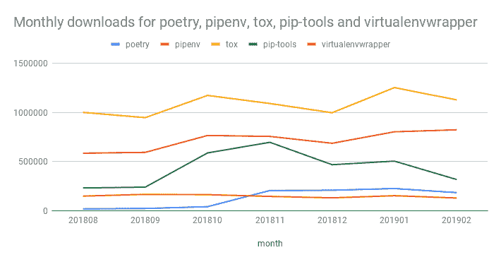

# 理解 python 在 2019 年的开发工具

> 原文：<https://dev.to/matmooredev/making-sense-of-pythons-development-tools-in-2019-2fak>

最近在工作中，我参加了一个面向 python 新手的学习小组，我意识到我习惯使用的工具对新手来说非常困惑:

*   他们中的许多人有非常相似的名字，但做不同的事情，所以在随意的交谈中很容易混淆他们(virtualenv，venv，pyenv，pipenv)
*   没有一种显而易见的方法来完成日常开发任务
*   围绕 python 打包工具有很多活跃的开发，所以今天做某事的最好方法可能在一两年后也不是最好的方法
*   如果你用谷歌搜索资料，你必须搜索大量过时的信息

因为这个原因，我决定演示一些不同的工具，让大家了解有哪些工具可用，以及为什么你会想使用它们。你可以在 github 上阅读我所有的笔记。

与我一起工作的一些开发人员熟悉 ruby，我意识到我的开发工作流程在 python 和 ruby 中基本上是相同的，所以我把这个 rosetta stone 放在一起，用于 Ruby 和 python 工具:

| 红宝石的东西 | Python 的东西 | 描述 |
| --- | --- | --- |
| Rubygems | 好吧 | 集中式包存储库 |
| `gem install bundler` | `pip install pipenv` | 安装软件包 |
| Gemspec | setup.py | 指定包的元数据和依赖项 |
| Gemfile | Pipenv | 指定应用程序的依赖关系 |
| Gemfile.lock | Pipenv.lock | 应用程序的完整依赖关系树的固定版本 |
| `bundle install` | `pipenv install` | 为项目安装软件包 |
| rbenv | pyenv | 管理多个版本的解释器 |
| `bundle init` | `pipenv --python 3.7` | 启动新的应用程序项目 |
| `bundle gem` | ？？？ | 生成包框架 |
| rspec | pytest | 流行的测试框架 |
| 机器人足球赛 | 薄片 8 | 流行的林挺工具 |
| `binding.pry` | `breakpoint()` (3.7+) | 内置调试器 |

在准备这个演示的过程中，我也学到了一些新东西:

# 1。不再真正需要 Virtualenv 了

在现代版本的 python 中，你可以使用`python -m venv`来创建一个 virtualenv。所以你再也不需要通过 pip 安装工具了(万岁)。

像`pipenv`这样的工具在幕后使用 virtualenvs，所以你不需要自己管理它们。这很好，因为只要项目是相互隔离的，谁会关心包被安装到哪里呢？

如果 [PEP 582](https://www.python.org/dev/peps/pep-0582/) 被接受，那么取代使用 virtualenvs，在项目目录中会有一个标准文件夹，包可以被安装到其中，有点像 javascript 中的`node_modules`。

# 2。Pipenv 可能会逗留一段时间

在我的演示中，我想提到替代工具，即使我个人没有使用过它们。我意识到，虽然 pipenv [似乎确实是旅行的方向](https://packaging.python.org/guides/tool-recommendations/)，但在互联网上也有很多关于它的[恐惧、不确定和怀疑](https://en.wikipedia.org/wiki/Fear,_uncertainty_and_doubt)。

我很好奇这是否会影响采用，所以我使用 google bigquery 上的 [PyPI 下载数据集](https://packaging.python.org/guides/analyzing-pypi-package-downloads/)来统计一些工具的下载次数:

*注意:二月的数据点不是一个整月，这包括了所有的下载，即使这个包是作为另一个工具的依赖项下载的*

虽然肯定有其他竞争者，但如果你在 2019 年开始一个新的 python 项目，pipenv 似乎仍然是一个不错的选择。

# 3。语义版本化需求将使您的生活变得更加轻松

在这个演示中，我想关注的一个任务是更新项目的依赖项。这很重要，因为无法跟上软件包更新是一种技术债务。它不断积累，随着时间的推移，很难更新任何东西。

当你依赖于像 Django 或 Flask 这样的框架时，这尤其成问题。根据[OWASP 2017 年十大安全风险](https://www.owasp.org/index.php/Top_10-2017_A9-Using_Components_with_Known_Vulnerabilities)，使用中存在已知漏洞的软件版本是第二大应用安全风险。

为了能够管理随时间变化的依赖关系，您应该能够在任何时间点从完整的依赖关系图中分离出关于您的应用程序真正关心的信息(直接依赖关系)。

前者完全是关于*灵活性*——你想要定义当你的依赖关系的新版本发布时，你的应用程序如何改变。这就是`Pipenv`文件的用途。后者完全是关于*的特异性*——它确保你在不同的机器上运行相同的代码。这就是`Pipenv.lock`文件的用途。我使用 pipenv 作为例子，但是这适用于您使用的任何工具。

早在 [PEP 440](https://www.python.org/dev/peps/pep-0440/#version-specifiers%3E) 中，Python 就引入了描述版本需求的语法。如果一个库遵循[语义版本](https://semver.org)，那么你可以写类似`requests~=2.2`的东西来表示任何大于或等于`2.2`但小于`3`的版本。如果你想更严格，你可以使用`requests~=2.2.1`，这意味着大于或等于`2.2.1`但小于`2.3`(也就是说，你只接受错误修复)。

如果您遵循这种模式，那么应用错误修复和安全补丁的例行更新可以完全自动化。我是[dependent bot](https://dependabot.com/)的超级粉丝，因为它为你做了所有无聊的工作:它监控你的依赖关系的变化，然后创建拉请求供你审阅。