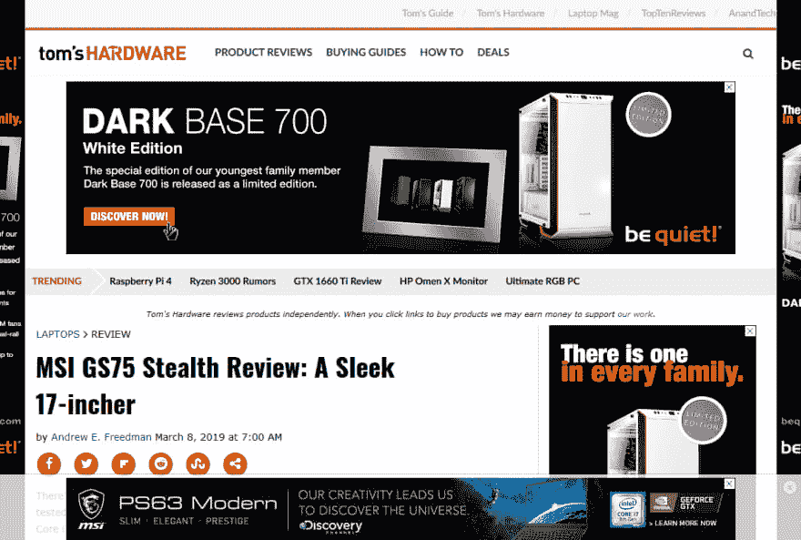
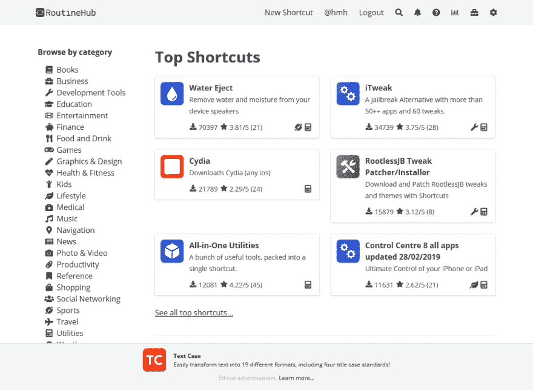

# 道德广告

> 原文：<https://dev.to/hmhrex/ethical-advertising-5157>

*最初发布于 RoutineHub 博客:[https://routinehub.co/blog/1/ethical-advertising](https://routinehub.co/blog/1/ethical-advertising)T3】*

### 现代广告烂透了。

一想到网络广告，我通常会生气。很快。脑海中浮现的是许多网站、网络应用和社交媒体网站被广告慢慢毁掉的画面。我通常会想到两类网站:

1.  我只看到 20%内容和 80%广告的网站。
2.  跟踪、打包并出售我的数据给几乎所有人的网站。

大多数时候，这些网站都做这两项工作。

 
*是的，我必须关闭广告拦截器才能看到这张截图。*

但是网站必须产生收入才能继续增长和托管。对于大多数试图发展和维护网站的人来说，现代互联网广告只是被视为一种必要的罪恶。此外，他们懒得去寻找广告客户，这只是需要更多的工作。

### 入我。

我一直有点理想主义。如果我真的相信这是道德上最正确的道路，我不介意走这条艰难的道路。当我试图解释我的立场时，我有时会得到奇怪的目光，但这没关系。我不是想皈依别人，我只是想做我认为最好的事，这样我晚上才能睡得着。如果第三方广告网络违背我的用户意愿并在他们不知情的情况下跟踪他们，我会夜不能寐。

我想要一个能满足这些要求的广告网络:

*   不跟踪我的用户。
*   不出售我的用户数据。
*   不根据个人资料锁定用户。
*   不会在我的页面上产生很大的滞后时间来呈现他们的广告。

我花了几个星期的时间进行研究，对缺乏选择完全不满意。

### 所以我建立了自己的广告服务。

我决定，如果我想要的东西不存在，那我就自己去造。我真的受到了[cover 的自动广告](https://overcast.fm/ads)、 [CodeFund](https://www.codefund.io/) 和[Read Docs 伦理广告](https://docs.readthedocs.io/en/latest/advertising/ethical-advertising.html)的启发。

我从阅读文档中采用了一个类似的框架，并根据自己的需要做了一点点修改，得出了这个结论:

*   我们不跟踪用户。
*   我们不卖用户数据。
*   我们不会为了投放广告而建立用户档案。
*   我们只记录浏览量和点击量。
*   我们自己主持一切。没有第三方图像或脚本。
*   我们把所有广告收入的 10%给 RoutineHub 所基于的开源项目，比如 Django 和布尔玛。

一旦我想出了框架，我就用 CodeFund 的广告作为灵感。我把广告空间设计成极简主义的，非侵入性的，但是突出的。它很容易被忽略，但仍然引人注目。

最后，我借鉴了阴的广告页，设计了[广告页](https://routinehub.co/advertising)。这个页面既解释了广告，也让你创建了广告。它很简单，信息丰富，是人们制作广告的一个简单快捷的切入点。

### 前途一片光明

最疯狂的是，在创建这个网站的过程中，CodeFund 的 Eric Berry 联系了我，并邀请我和他以及 T2 的 David Fischer(Read Docs 的广告、隐私和安全专家)一起参加每月一次的会议，讨论道德广告。本周我第一次加入他们，感觉很棒。我从他们身上学到了很多，我很高兴还有其他人在尝试做同样的事情。

这将是艰难的，而且会有颠簸，但我对这条道路感到更加平静，我很高兴在支付服务器账单的同时，知道我的用户数据不是按照我自己的意愿存储在数据仓库中的。