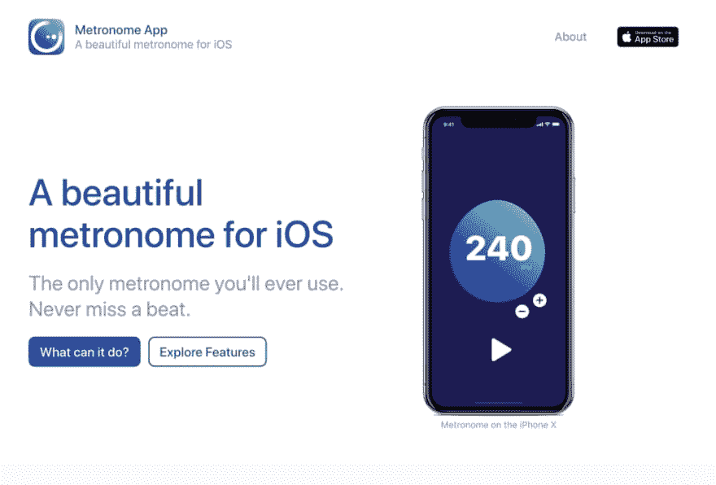
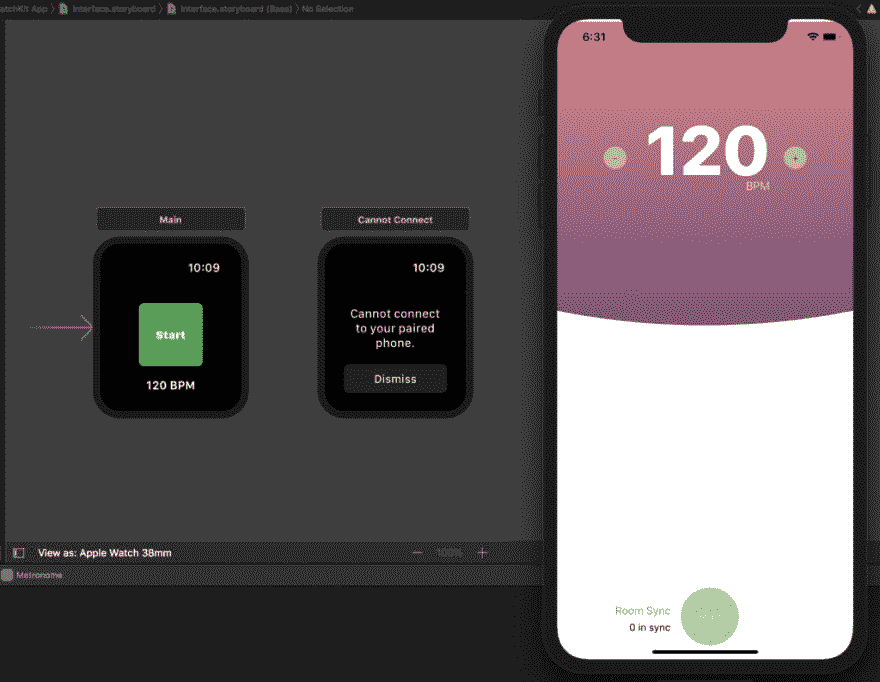
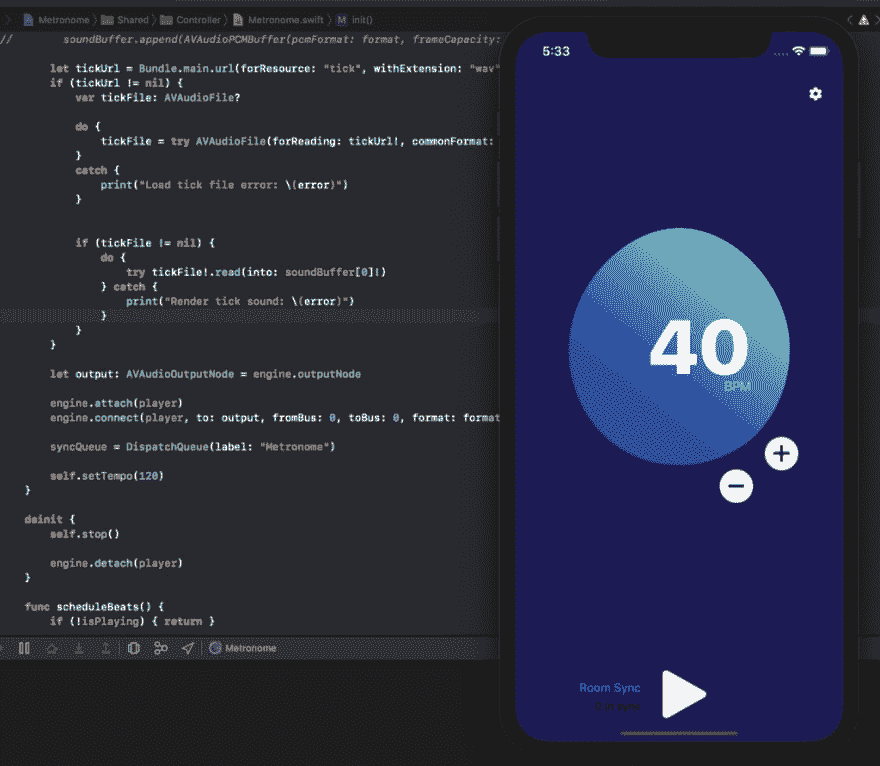
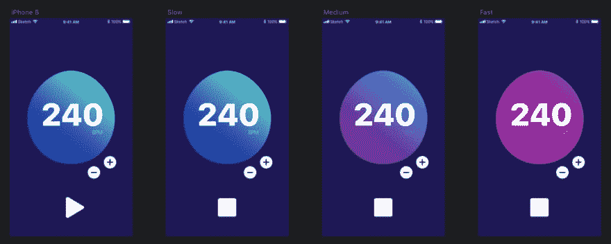
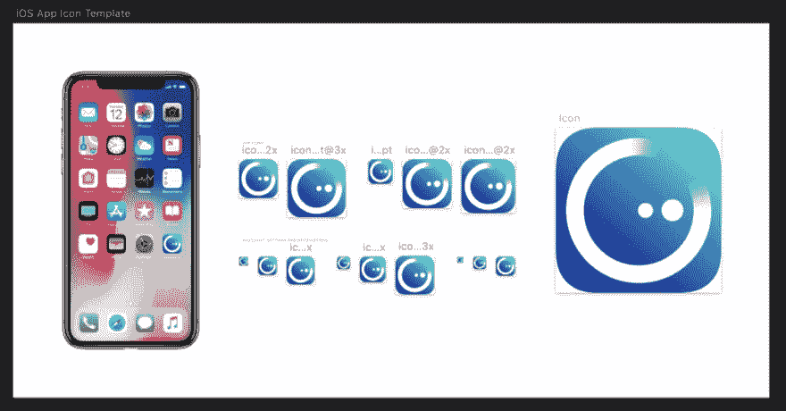

# 如何想象一个 App

> 原文：<https://dev.to/darthknoppix/how-to-imagine-an-app-3237>

#### 假装它，直到你成功，并帮助分享你的愿景

 

<figcaption>我在试用[雨果](https://gohugo.io/)静态网站生成</figcaption>

时为我的节拍器应用程序制作的真实网站

盯着一张白纸，等待可能永远不会出现的想法，可能会令人望而生畏。当一个想法出现时，抓住它。探索这个想法。通常的做法是收集你的想法，并形成一个计划来实现你的想法。只有形成一个产品可能是什么的想法只是过程的一部分。重要的一步是想象产品最终的外观和感觉。完成后可能看起来不一样，但创建和展示一些高保真的模型会让你有所追求。它决定了人们的情绪，并把他们团结在一个共同的目标周围。

Metronome 是我去年想出来的一个小项目，用来试验 iOS 开发。它开始是一个非常粗糙的原型，但一旦它工作了，我知道用户感兴趣，我建立了一个高保真的模拟作为我的目标。然后，我努力尝试弥合现实和理想之间的差距。以下是我尝试弥合这一差距的过程。

#### **原型制作**

 

<figcaption>左边最初的 watchOS 原型和第一个支点聚焦 iOS</figcaption>

原型是在你花太多时间在它上面之前识别问题的一个基本工具。很容易从稀少的需求开始，这是一个粗略的想法，但是也很容易忽略你正在构建的东西。在你意识到之前，你已经过度设计了一个特性。你创造了一些东西，当有人(可能是你自己)发现不需要它的时候，你就注定要被砍掉。

有不同层次的原型，你可以建立，这不是一个尺寸适合所有人。

**低保真度**

> 低保真度原型是零投资测试功能的最快最简单的方法。它可以是一支笔，一张纸和一些创造性的想象。

 

<figcaption>一台核心功能运转良好的高保真样机</figcaption>

**高保真**

> 高保真原型更复杂，需要更多的时间，但有助于以更生动的方式进行交流。这可以呈现给真正的用户。这可能是一个突出你产品核心特性的完整的用户旅程，只是不要在幕后偷看，因为它可能会崩溃。

最初的想法是为 watchOS 创建一个节拍器，我认为在 Apple Watch 上安装一个节拍器会很酷。第一个原型完全失败了。我发现以我想象的方式是不可能的。由于在手表不工作的情况下播放声音的限制，这个想法胎死腹中。虽然我花时间试图创建一个工作原型，但失败了，这种失败是必不可少的。这迫使我重新思考这个想法，并转向一个可行的实现。我把主要的节拍器功能转移到了 iPhone 上，并让手表扮演了遥控器的新角色。随着我的新原型的完成，是时候创建一些实物模型来感受最终产品了。

#### **实物模型**

<figcaption>[草图中的实体模型](https://www.sketchapp.com/)展示了 BPM 如何影响 UI</figcaption>

粗略的模型可以帮助识别用户体验中可能存在的问题，并在构建新功能时减少不必要的工作。高保真原型可以将用户界面推至超乎寻常的水平，以提供视觉上有凝聚力的体验。这有助于让所有人都在相同的页面上设置标杆。它可能会激发更多关于你正在建造的东西的兴奋。

创建 metronome 实体模型的目的是试图向我自己和我展示过的用户推销这个想法。这也有助于解决对该应用程序某些功能的疑问和担忧。这个设计经历了几次迭代，但它给了我一个开始构建的地方。高保真模型也有助于向他人推销这个想法。在展示模型时，我从用户那里获得了有用的见解。他们告诉我他们的期望是什么，他们想看到什么，而我根本不需要创建一个工作原型。一旦蓝图就绪，构建 UI 就变得容易多了。

 

<figcaption>一个带有 iOS 应用图标模板的节拍器应用图标模型</figcaption>

由于时间和可行性，我没有进一步推进这个项目，但我仍然相信这个弥合差距的过程。它帮助我创造了我引以为豪的经历，我希望它能帮助我创造更多的经历。

*   通过原型测试来测试您不确定的东西，以最小化风险并快速失败
*   通过创建实物模型来激发你努力实现的目标
*   弥合最低可行产品和理想目标之间的差距

如果你想更多地了解我的过程，你有问题或者想知道我做过的其他项目，请告诉我。

> 你可能永远不会在 App Store 上看到这个应用程序，但我希望展示我采取的过程，将激励你去想象、创造和弥合差距。

* * *