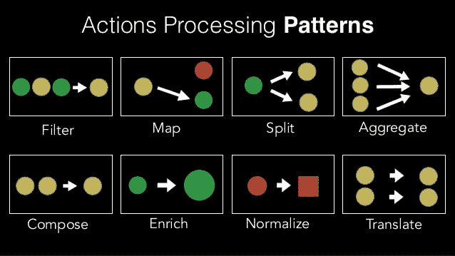

# 将中间件还原为纯功能

> 原文：<https://dev.to/pigozzifr/lets-play-with-redux-middleware-2d1f>

## 灵感的来源

在看了 Nir Kaufman 的这个视频后，我决定写这篇文章。不要被标题吓到，这是任何一个缺乏想象力和幽默感的开发者都能做到的。

## 什么是 Redux 中间件？

一个功能。真的，没别的了。

实际上，它是一个函数，它返回一个函数，这个函数返回一个做某事的函数。

大概是这样:

```
const middleware = () => () => () => {
  // Do something
} 
```

这看起来很像普通 Javascript 的闭包，不是吗？

让我们回顾一下它由一些参数填充:

```
const middleware = (store) => (next) => (action) => {
  next(action)
} 
```

让我们分析传递给它的参数:

*   `store`:Redux 的实际店铺，从中我们可以解构`getState`和`dispatch`
*   `next`:下一代中间件
*   `action`:已经调度的动作

*需要*调用`next(action)`，否则流量会被阻塞(这不一定是负面的事情)。

## 关于使用一个或多个定制中间件的利弊

### 优点

*   实施的自由
*   没有模式限制，只是一些建议
*   没有隐藏的瓶颈，只有纯粹的功能

### 弊

*   实施的自由
*   没有模式限制，只是一些建议
*   没有隐藏的瓶颈，只有纯粹的功能

不，你没有变疯:我故意还了同样的分。这种免费的方法非常强大，但如果使用不当也非常危险:您可能会发现自己管理性能下降仅仅是因为糟糕的实现或对副作用的管理。

这是一个经典的场景，开发者同时扮演了**警长**和**强盗**的角色。

记住本大叔的话:

[](https://i.giphy.com/media/MCZ39lz83o5lC/giphy.gif)

## 那么，我为什么要构建一个或多个中间件呢？

你真的不需要。

可供选择的方案多种多样:想想`redux-thunk`、`redux-saga`以及其他许多方案。它们都是依次运行的中间件，完成各自的工作，其中一些还非常高效。

也就是说，如果你仍然认为你想使用一个库，我不会阻止你。其实我是`redux-saga`的超级粉丝！

## 只是一些建议

现在让我们一起来看看，参考 Nir 的建议，一些可以立即使用的模式。

[](https://res.cloudinary.com/practicaldev/image/fetch/s--1XcfmZrZ--/c_limit%2Cf_auto%2Cfl_progressive%2Cq_auto%2Cw_880/https://image.slidesharecdn.com/reduxpattens-180423104117/95/redux-pattens-jsheroes-2018-35-638.jpg%3Fcb%3D1524480297)

### 滤镜

```
const middleware = (store) => (next) => (action) => {
  // Avery action with type BAD_ACTION will be removed from the flow
  if (action.type === 'BAD_ACTION') return

  next(action)
} 
```

### 地图

```
const middleware = ({ dispatch }) => (next) => (action) => {
  // We don't want to remove this action from the flow
  next(action)

  if (action.type === 'ACTION_FROM') {
    // Instead, we want to fire a side-effect
    dispatch({ type: 'ACTION_TO' })
  }
} 
```

### 分割

```
const middleware = ({ dispatch }) => (next) => (action) => {
  // We don't want to remove this action from the flow
  next(action)

  if (action.type === 'ACTION_COMPOSED') {
    dispatch({ type: 'ACTION_FIRST' })
    dispatch({ type: 'ACTION_SECOND' })
  }
} 
```

### 合成/聚合

合成和聚合在行为上是相似的。

为了区分它们，我们可以简单地说，第一种逻辑期望更多相同类型的动作，然后产生一个独特的副作用，类似于缓冲区；第二种逻辑期望不同类型的动作。

为了实现这一点，我们需要引入中间件状态的概念。因此产生了我喜欢称之为**的有状态中间件**。

让我们看看如何实现这种模式，以便在不阻塞流程的情况下产生副作用。

```
// We are not defining a middleware, we are defining a middleware's factory
const makeMiddleware = (waitFor, waitTimes, handler) => {
  let actions = []

  // Here we are returning a middleware
  return (store) => (next) => (action) => {
    next(action) // We aren't blocking the flow

    if (action.type === waitFor) {
      actions.push(action)

      if (actions.length === waitTimes) {
        // We then pass to the handler all the actions
        handler(store, actions)

        // We may then reset the "state" to start again
        actions = []
      }
    }
  }
} 
```

或者使用阻塞方法。

```
// We are not defining a middleware, we are defining a middleware's factory
const makeMiddleware = (waitFor, waitTimes, handler) => {
  let actions = []

  // Here we are returning a middleware
  return (store) => (next) => (action) => {
    if (action.type === waitFor) {
      actions.push(action)

      if (actions.length === waitTimes) {
        // We then pass to the handler all the actions blocked before
        handler(store, actions)

        // We may then reset the "state" to start again
        actions = []
      }
    } else {
      next(action)// We are blocking the flow
    }
  }
} 
```

决定阻塞还是不阻塞该流取决于您，这两种情况对于解决不同的问题都是有用的。

从组合到聚合，这足以让工厂验证它所截取的动作是应该等待的动作之一。

```
// snip
// Where waitFor is an array of action types like ['ACTION_A', 'ACTION_B', 'ACTION_C']
// Boolean is unecessary, just for clarity
if (Boolean(~waitFor.indexOf(action.type))) { /* snip */ }
// snip 
```

### 充实

这种模式对我来说非常有用，例如，为一些动作添加时间戳。

```
const middleware = (store) => (next) => (action) => {
  if (action.type === 'ACTION_TO_ENRICH') {
    next({
      ...action,
      payload: {
        ...action.payload,
        '@': Date.now(),
      }
    })
  } else {
    next(action)
  }
} 
```

### 规范化

```
const middleware = (store) => (next) => (action) => {
  if (action.type === 'ACTION_TO_NORMALIZE') {
    // Clone payload, it will be less painful to modify it
    const payload = { ...action.payload }
    if (typeof payload.postId === 'number') payload.postId = payload.postId.toString()

    next({
      ...action,
      payload,
    })
  } else {
    next(action)
  }
} 
```

### 翻译

事实上，我不认为我有这种模式的真实例子。如果你能想到更好的，请在评论中告诉我！

```
const middleware = (store) => (next) => (action) => {
  if (action.type === 'ACTION_TO_TRANSLATE') {
    next({
      ...action,
      type: 'ACTION_TRANSLATED',
    })
  } else {
    next(action)
  }
} 
```

## 如何整合这些新创建的中间件

我不会深入探讨如何创建一个 Redux store 的优点，你已经做了成千上万次了。相反，我将向您展示如何将这些中间件应用到新创建的商店。

不要从字面上理解这个例子，有很多方法可以处理代码库中越来越多的中间件。这是我想到的最简单的方法。

```
import { createStore, applyMiddleware, compose } from 'redux'

import rootReducer from './rootReducer'
import initialState from './initialState'
import { someFilterMiddleware, someMapMiddleware, someComposeMiddleware } from './middlewares'

const customMiddlewares = [
  someFilterMiddleware,
  someMapMiddleware,
  someComposeMiddleware('ACTION_TO_WAIT', 2, (store, actions) => console.log(actions))
]

const configureStore = () => {
  // Spread them as arguments for applyMiddleware
  const middlewares = applyMiddleware(...customMiddlewares)

  const store = createStore(
    rootReducer,
    initialState,
    compose(middlewares),
  )

  return store
}

export default configureStore 
```

### 注意！

所有这些都很好，但事实仍然是，创建的中间件越多，动作在到达目的地之前必须通过的函数数量就越多。相反，您可能更喜欢一种单中间件方法，当且仅当满足一些标准时，这种方法可以处理一系列主要情况:类似于`redux-saga`。

被构建在一个单一的中间件中，只要有动作要被解释或者有效果要被分派，这个中间件就会一遍又一遍地运行一个发电机运行器。我们不会走得更远。

## 有什么意义？

关键是，您并不真的需要一个特别复杂或工程化的库来以模块化的方式管理应用程序副作用或业务逻辑。

您需要管理登录吗？创建一个中间件。你不再需要它了吗？将中间件从流程中分离出来，您就不必在其他地方采取行动。

没有比能够使用任何模式、约定或浏览器 API 来实现目标更通用的事情了。

可以使用 closures、factory、iterator(何乐而不为)、setTimeout、setInterval 或者最新的 [requestIdleCallback](https://developer.mozilla.org/en-US/docs/Web/API/Window/requestIdleCallback) API。

同样，我并不是说这种方法可以完全取代单一的、更加结构化的中间件。毕竟，如果某些图书馆诞生了，他们有极好的理由。我只是想和你分享一个处理一些不同于平常的逻辑的方法。

## 谢谢大家！

谢谢你看完这篇文章！如果你喜欢，留下一个🦄！

如果你不同意我写的，留下评论，分享一些想法！