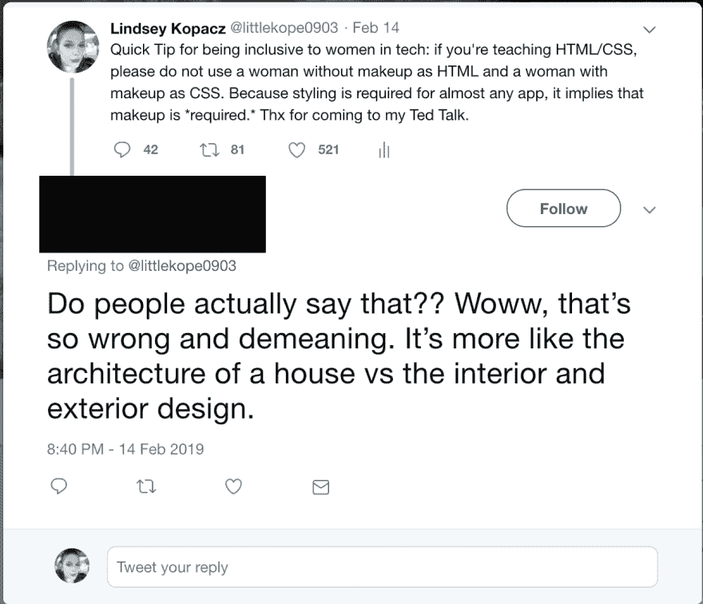
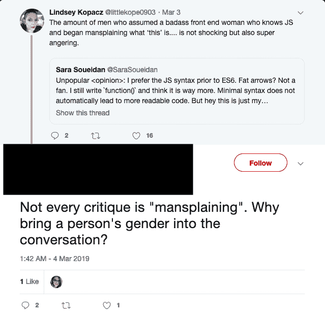
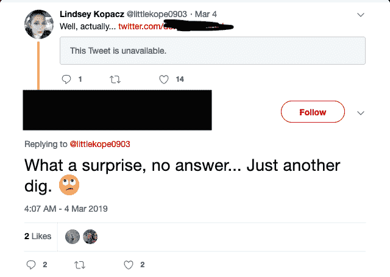

# 然而，林赛编码

> 原文：<https://dev.to/lkopacz/nevertheless-lindsey-coded--1l8e>

仅在过去的一个月里，我就经历了以下一些事情:

> 包容科技行业女性的快速提示:如果你在教 HTML/CSS，请不要用一个不化妆的女人做 HTML，而用一个化妆的女人做 CSS。因为几乎任何 app 都需要造型，这就暗示了化妆是*必须的。*感谢你来参加我的 Ted 演讲。
> 
> — Lindsey Kopacz (@littlekope0903) [February 14, 2019](https://twitter.com/littlekope0903/status/1096038008451723264?ref_src=twsrc%5Etfw)

我从一个试图感同身受，但首先质疑我的经历的人那里得到了真实的回应。

我引用了一个我赞同的人的微博

> 就在昨天，有人告诉我，我作为一名科技界女性的经历在男性和女性身上都会发生。你们都需要停止为了自己该死的自我而减少经历。[https://t.co/VjWvA4LWOI](https://t.co/VjWvA4LWOI)
> 
> — Lindsey Kopacz (@littlekope0903) [February 23, 2019](https://twitter.com/littlekope0903/status/1099338457460154369?ref_src=twsrc%5Etfw)

对此我得到了这样的回应，我立即屏蔽了。

我当然很高兴有一天专门庆祝女性，但我觉得很多都是“啊啊，女性，让我们支持她们”，而没有任何我们许多人每天都面临的真实经历。

> 有多少男人认为一个坏坏的前端女人知道 JS，并开始解释“这”是什么....并不令人震惊，但也非常令人愤怒。[https://t.co/r1TBVDlxza](https://t.co/r1TBVDlxza)
> 
> — Lindsey Kopacz (@littlekope0903) [March 3, 2019](https://twitter.com/littlekope0903/status/1102170538036875265?ref_src=twsrc%5Etfw)

当然，有一个男人带来了典型的“为什么你要把它和性别联系起来”的东西:

我们有应对机制。很多时候我用幽默来应对。例如，对于整个“为什么把性别带入对话”我引用了上面的推文(你看不到，因为我屏蔽了他):

我不得不阻止这个家伙，因为他无权占用我的时间:

对他关于我无视他的推文的回应特别虚假和无礼。

我们屏蔽、沉默、忽视，所以请不要给我或任何女人这样的建议，好像这很容易。言语伤人，有时忽视行为会让犯罪者继续他们有害的行为。他们可能不会改变，但他们知道他们不能为我逃脱惩罚。任何时候，技术领域的女性把自己放在那里，我们就把自己置于危险之中。尤其是勇敢面对有毒男性的女性。

谢天谢地，支持我的人比不支持我的人多，但我真的希望人们能意识到他们的话有多重要，即使是那些善意的人。

## 我在 2019 年开始/继续编码是因为...

我想创造东西。我想帮助别人。我想产生影响。我想要一份能让我为未来储蓄的薪水。

## 我应得的功劳...

*   我学新东西多快啊。我只写了 3 个月的测试，我的老板告诉我他非常喜欢这些测试的全面性。我通常以指数速度增长。
*   我能多好地融入社区。
*   我为自我提升和帮助他人付出了多少努力

## 我希望看到我的工作/开发人员/技术社区...

实际上，关心女性，投资于包容努力，而不是仅仅象征性地邀请她们在你的活动上发言。为他们的会议、休闲小组和活动制定 CoC。