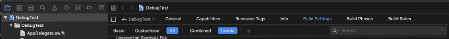
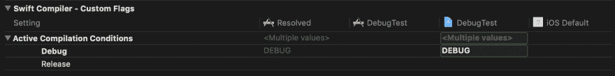
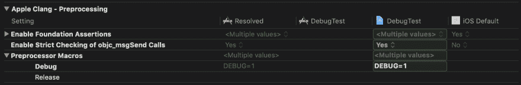

# 使用条件编译将调试工具包藏在手边

> 原文：<https://dev.to/evandeaubl/keep-your-debug-toolkit-handy-but-hidden-using-conditional-compilation-2309>

当你在一个应用上工作了一段时间，特别是当它变得很大的时候，你通常会开始在应用中加入一些代码片段，这些代码片段在过去对调试你的应用很有用。这种调试代码可能像日志语句一样简单，也可能像在界面上添加全屏一样复杂，由您添加到界面上仅用于调试的控件激活。

这类工具成为调试环境不可或缺的一部分；你不想扔掉它们。但是你真的想在你的应用中发布这些吗？它让你的应用变得更大更慢。你可以在发布之前注释掉它们，但是在马拉松式的调试会议之后，你相信你会再次注释掉**所有你启用的调试工具吗？**

如何保留我的调试插件，但确保它们不在我部署到 App Store 的版本中？

有一种方法:您可以使用 Swift 的一个称为条件编译的特性，在您的调试版本上启用调试代码。如果您还有 Objective-C 代码，那么您还是幸运的:一个叫做预处理宏的类似特性可以提供相同的功能。

* * *

我们从快乐之路开始。如果您已经使用最新版本的 Xcode(至少是 9.3，所以是在过去一年左右)创建了您的项目，那么您已经设置好了，您可以跳到我们讨论代码本身的部分(或者您可以浏览它以验证您的设置是否存在)。

如果您有一个较旧的项目，您需要添加几个构建设置，以便下面的代码能够工作:

[](https://res.cloudinary.com/practicaldev/image/fetch/s--9owJZUP0--/c_limit%2Cf_auto%2Cfl_progressive%2Cq_auto%2Cw_880/https://www.appsdissected.com/wp-content/uploads/2019/02/Screen-Shot-2019-02-28-at-19.03.57.png)

打开项目，切换到“构件设置”选项卡，显示所有构件设置，然后选择级别。

[](https://res.cloudinary.com/practicaldev/image/fetch/s--ZvjsDkZv--/c_limit%2Cf_auto%2Cfl_progressive%2Cq_auto%2Cw_880/https://www.appsdissected.com/wp-content/uploads/2019/02/Screen-Shot-2019-02-28-at-18.52.35.png)

找到主动编译条件，在项目设置下添加`DEBUG`，如上。

[](https://res.cloudinary.com/practicaldev/image/fetch/s--HCrePGHQ--/c_limit%2Cf_auto%2Cfl_progressive%2Cq_auto%2Cw_880/https://www.appsdissected.com/wp-content/uploads/2019/02/Screen-Shot-2019-02-28-at-18.53.12.png)

如果您也有 Objective-C 代码，找到预处理器宏并将`DEBUG=1`添加到项目设置中。

一旦完成这些设置，就可以隐藏调试代码了。

尽管这两个特性有不同的名称、编译条件和预处理器宏，但是用来包装调试代码的代码是完全相同的，而且非常简单:

```
#if DEBUG
   // My debug code is here
#endif 
```

当您为模拟器和开发设备进行构建时，您的所有调试代码都将被启用，供您使用。当您为 App Store 发布或 TestFlight 构建档案时，将不会定义调试，所有代码都将消失，从而确保您的应用保持快速和精简。

你可以保留你所有的调试插件，自己使用。

* * *

你喜欢这个建议吗？下一个关于[你的 Xcode 延迟(不完全)是 Xcode 的错](https://www.appsdissected.com/slow-laggy-xcode-memory/)的提示已经在等着你了。

或者[注册，将所有提示直接发送到您的收件箱](https://www.appsdissected.com/newsletter/)，另外还有时事通讯提示和网站文章的深度挖掘以及未来产品发布的折扣。

这篇文章最初发表在 [Apps 剖析。](https://www.appsdissected.com/hide-debug-code-conditional-compilation/)