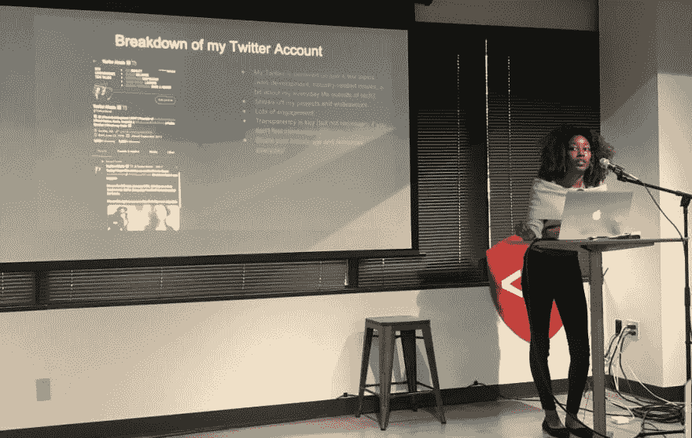

# 然而，塔鲁尔·亚历克西斯

> 原文：<https://dev.to/taeluralexis/nevertheless-taelur-alexis-coded--4l1g>

<figure>

<figcaption>TLDR; Embrace failure, share your knowledge and focus on your progress</figcaption>

</figure>

# 回顾我的科技之旅和 2019 年的目标

## 2019 年我继续编码是因为...

2018 年是转型的狂野之年，我决心在今年驾驭那场大火。正如你们中的一些人可能知道的，我来自一个非传统的背景，以前没有接触过计算机科学。我总是对艺术和历史更感兴趣，当然也不倾向于数学，所以我从来不认为 STEM 是我的职业选择。然而，我在浏览互联网寻求更好的生活时偶然发现了编码。我学会了过滤绝大多数的学习资源来开发自己的课程，而不是回到学校或参加新兵训练营。我真的不知道我在做什么。就像我说的，我没有任何编码经验。

我的旅程并不完美。我一遍又一遍地重新学习像 DOM 操纵这样的概念，直到它在我进入下一个主题之前有点意义。我努力学习，最终在 2018 年 7 月 18 日接受了我的第一个角色，网页开发员。我从佛罗里达州的奥兰多搬到华盛顿州的西雅图，开始新的冒险。

当我在 2017/2018 年第一次学习如何编码时，我的目标是简单地找到一份工作。2019 不一样。我想更深入地进行内容创作(写关于我构建的项目的博客，写和记录教程，等等)。为什么？

一个优秀的开发人员拥有流畅地表达他们的决策过程的能力。他们能够以他人能够理解的方式交流和分解技术概念。我想练习，努力成为一个伟大的代码交流者。

我还通过在社交媒体和博客上变得更加活跃来对抗我的社交焦虑和天生的内向。作为一名内向的作家，我一直对自己的想法非常谨慎，社交媒体帮助我获得了自信。由于 Twitter 上的技术社区是如此开放和受欢迎，我已经能够走出自己的茧，真正表达自己。

就我的学习而言，我选择更深入地关注可访问性和渐进式网络应用。我选择这两个主题的原因是因为我深深地致力于帮助使网络更容易访问。我全心全意地相信，任何用户都不应该因为糟糕的网络连接或拥有视觉障碍或残疾而被落下。我们永远不应该为自己编码，只是假设我们的最终用户的条件是事后才想到的，相反的说法是承认你可以不关心用户体验。我想花点时间感谢 Marcy Sutton，一位杰出的无障碍专家和技术领域的女性，她向我介绍了网页无障碍，以及她的鼓励和支持！

我还对 ThreeJS 和 WebVR 产生了兴趣，所以让我们看看进展如何。

## 我应得的功劳...

努力解决我的心理健康问题，多练习自我保健。但你不会知道，因为我没有尽可能多地发微博。

当你是一个雄心勃勃的女人，渴望利用机会时，有时你会忘记照顾自己。我反复感到精疲力竭，不得不中断编码工作，这只会助长我的冒名顶替综合症。我觉得我有很多东西要证明，因为我来自哪里，我决心利用每一个机会不回去。我经常问自己为什么会在这个行业中存在，但我把它藏在心里，因为我从小就相信脆弱是软弱的标志。当我还是个孩子的时候，如果我表现出情绪，我从来没有真正表现出同理心，所以直到今天，我有时都在努力表达自己。然而，我开始认识到脆弱中有力量，并开始对自己表现出更多的同情。

## 我希望看到我的技术社区...

<figure>

<figcaption>Giving a talk on how to build a personal brand on Twitter as a developer at CodeFellows in Seattle, WA. So nervous yet chill!</figcaption>

</figure>

...继续优先考虑让每个人都可以使用软件开发。

我希望看到更多的人——无论是有经验的还是没有经验的——敢于承认他们在知识上的差距，并一起成长。

我也希望看到更多的个人和公司放弃这种心态，即我们需要每周工作 80 小时以上，包括周末，以证明我们值得在这个行业工作。这让上班的父母或患有精神/身体疾病的人感到非常沮丧，他们不应该为了在科技界获得认可而牺牲自己的生计。

我们可以让科技社区更具包容性的更多方法是，让我们的旅程变得透明，不要害怕分享我们的失败，分享我们的资源。我也希望看到更多的人检查自己的偏见，更多地理解他人的困境。当然，我们中有些人买不起笔记本电脑，或者我们可能有残疾，这可能会妨碍我们的学习。同情心和透明度会带来一个更好、更包容的社区。

## 前方是什么...

我有值得骄傲的事情要期待。我被选中在四个关于用 React 和 React Native 构建可访问用户界面的会议上做技术演讲。我还想继续在 Twitch 上直播我学习不同代码的尝试。

对于 2019 年及以后，让我们都把我们的自我保健放在第一位，建立 dope 的东西，分享知识和回馈。

在推特上关注我让我们一起成长♡