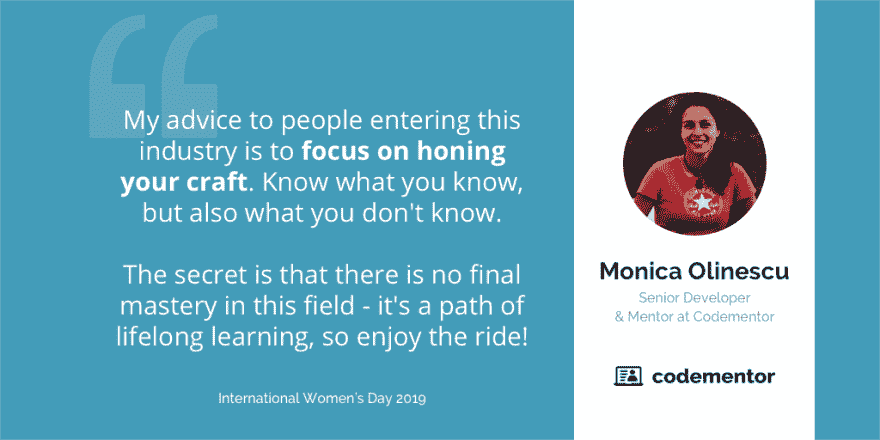
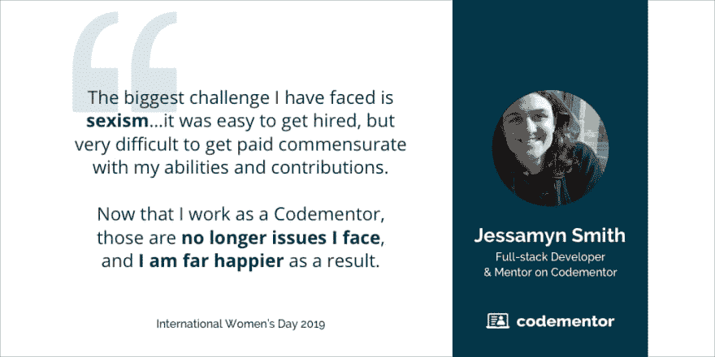
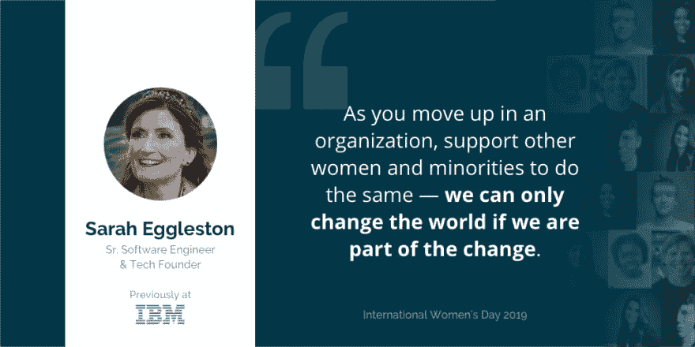
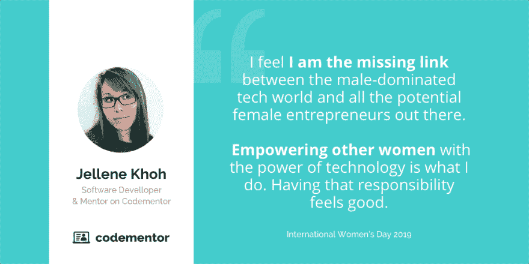

# 在 2019 年，做一名科技界女性意味着什么

> 原文：<https://dev.to/codementor/what-it-means-to-be-a-women-in-tech-in-2019--4el6>

今天是国际妇女节！

上周末，*60 minutes 播出了一个关于计算机科学中的女孩和缩小科技领域性别差距的片段，但没有提到任何(许多)女性领导的努力。编程女孩的创始人 Reshma Saujani 在[最近的博客文章](https://onezero.medium.com/erasing-women-in-tech-how-60-minutes-ignored-womens-voices-stories-and-expertise-7ee8e157c262?fbclid=IwAR1-NBCoIbrewsihUtTB5zWn2ytGsPd6D73UiJmFTtIcYKy8m5pFIbGrl8Q)中谈到了这一点，以及媒体如何倾向于忽视女性在技术领域的贡献。*

 *“与节目中所说的相反，让女孩在早期(如幼儿园)接触计算机科学不足以缩小科技领域的性别差距。Reshma 说:“女孩在整个过程中都需要支持系统，科技公司也需要尽自己的力量来根除骚扰和歧视。

在这篇文章中，我想把女性开发者放在聚光灯下，突出她们在科技行业的经历。有许多了不起的榜样正在取得进步，无论是大的还是小的，都应该分享和庆祝。让我们听听他们要说什么！

## 成为榜样

斯坦福大学计算机科学系的研究得出结论，缺乏榜样是女性不再选择从事计算机科学的主要原因之一。

也许这里的部分问题是可见性。除了阿达·洛芙莱斯，还有几位著名的女性开发人员对软件开发产生了重大影响，但大多数开发人员可能从未听说过她们。

我们采访的女性还提到了其他鼓舞人心的女性开发人员，包括**格温·巴兹**(一名[黑人多伦多女性](http://braythwayt.com/posterous/2012/03/29/a-womans-story.html)，她是加拿大第一批程序员之一)**琳达·柳卡斯**(共同创立 [Rails Girls](http://railsgirls.com/) ，并帮助编程变得“更加平易近人】)**桑迪·梅斯** ( [作者](https://www.poodr.com/)和演讲者，她“热衷于推进编程技术”)。这些榜样不仅是已经表明他们是这个领域不可或缺的开拓者，他们也是倡导者，他们的故事有助于赋予他人权力。

无论你是初级还是高级开发人员，即使你觉得自己没有做一些非常规的事情，你也能激励他人。成为其他从事科技行业或对科技行业感兴趣的女性的向导，可以产生微小但重要的影响。

如果你正在读这篇文章，你仍然可以成为其他女性的榜样，即使你不是一个开发者或者女性！一些开发人员告诉我们，他们受到了像**马拉拉·优萨福扎伊**、**梅林达(和比尔)盖茨**、**米歇尔·奥巴马**等人的启发。一些人还受到他们生活中男性形象的极大鼓舞，无论是他们的父亲、配偶、同龄人还是更高级别的同事。

## 不怕失败

一个常见的挑战是可怕的[冒名顶替综合征](https://insights.dice.com/2016/05/06/overcoming-imposter-syndrome/)，当你觉得自己配不上你的角色，并且总体上缺乏信心，这个挑战不仅引起了女性开发人员的共鸣，也引起了许多刚刚起步的开发人员的共鸣。

正如 Envato 公司的软件工程师 Jaime Gunther 所说:

> 当你是一名开发人员，尤其是一名初级开发人员时，**每天都是一次巨大的学习经历**。您正在解决问题和调试问题，这可能会令人沮丧。在那些沮丧的时刻，很容易陷入感觉不够好、感觉没有能力等陷阱。

Promptworks 的软件工程师 Mary Kate Fain 认为“克服恐惧和自我怀疑比学习任何一种编程语言或技能都更具挑战性”。她认为这个问题甚至可以追溯到更早，并引用 Reshma Saujani(《编程女孩》的作者和创始人)的话说，女孩被教导要努力追求完美，而不是被鼓励要勇敢。

> 我们不知道如何应对失败，这阻碍了我们应对新的挑战，并导致自我设限。—玛丽·凯特·费恩

詹姆认为，克服这一点的关键是“认清形势，深呼吸，意识到每个人都有这样的时刻，善待自己。”

## 利用你的优势

Codementor 上的一位 Python 导师[贾芳](https://www.codementor.io/sheena)说，作为一名女性开发人员会让你“自然而然地令人难忘”。找出你的优势有助于你学习如何利用它们来获得更高的自信心，并促进你作为开发人员的职业生涯。

 *引自[莫妮卡·奥利内斯库](https://www.codementor.io/monicaolinescu)。高级开发人员、技术负责人和导师*

如果你感到迷茫，不知道从哪里开始， [Jellene Khoh](https://www.codementor.io/jellenekhoh) 建议“如果你想得到一份工作，学习一个框架；如果你想走得更远，学习处理数据。”

即使你没有科技背景，纽约公用事业公司的杰伊·斯特朗(之前主修文学)说，“找到一种方法来使用我已经拥有的技能，并把它们应用到科技中，真的帮助我在职业生涯中学习和成长。”

## 指导他人

我采访过的大多数女性开发人员的导师在她们的职业发展中发挥了关键作用。不是所有的导师都做了创新的事情，也不是所有的导师都是女性。

指导通常是双向的。我过去交谈过的导师也从他们的学员身上学到了很多东西，当他们看到他们的学员取得成功时，会感到自豪。2019 年，我和 Codementor 团队的其他人希望鼓励和看到更多的女性开发者成为这个领域的导师。

对于杰莎敏·史密斯来说，成为一名导师帮助她结束了在工作场所面临的最大挑战。

## 不怕提问

当你作为一名开发人员开始你的第一份工作时，有时你并不真正知道你将进入什么样的领域，直到你开始更多地动手操作。对于曾经是谷歌软件工程师的[贾德威加·波科尔斯卡](https://www.codementor.io/jadwigapokorska)，组织的规模(以及类似的，他们的代码库)意味着她不得不习惯于向他人寻求帮助，比如代码中的什么地方——即使这看起来是一个“愚蠢”的问题。

> 如果你在一个项目中，你觉得有些事情不清楚或者没有完全解决，一定要说出来。通常情况下，你不是唯一一个有这种感觉的人，澄清对每个人都有帮助。— [卡罗琳娜](https://www.codementor.io/carolinux)，Python 导师

Codementor 团队的第一位女性开发人员 Sylvia 分享了她在第一份工作中面临的一个巨大挑战，即不得不与缺乏适当软件开发流程和文档的开发团队合作，这需要不断地与利益相关者就需求进行沟通。这也意味着要有提出问题的勇气，并让人们负起责任，以帮助结束无效率的工作。

## 属于支持性团体的

正如玛丽·凯特所说:

> 找到你的社区。有人帮我调试，告诉我下一步该学什么，教我，启发我，在我情绪低落时鼓励我，这一切都变得不同了。找出你是否有当地的女性技术组织，尽可能参加所有的聚会和课程。你会学到你需要的技能，更重要的是**结识让你继续前进的人脉**。

和与你有相同兴趣或背景的人在一起。在那里，你可以和曾经和你一样的人互动，遇到潜在的导师，听励志演讲，等等。

## 庆祝我们走了多远

国际妇女节也应该是一个庆祝我们已经走了多远来帮助推动我们前进的时刻。

那么，**作为一名科技界女性最大的好处是什么？以下是他们的一些回应:**

*   “[它]为我打开了许多重视多元化的公司的大门。”—莫妮卡
*   **解题**。当我(终于)解决了一个棘手的问题时，我会听到脑子里响起印第安纳·琼斯的主题曲。”—莎拉
*   "**认识科技界其他了不起的女性**。我遇到的女性都是在这些领域奋斗出来的，她们比我认识的大多数人都更聪明、更勇敢。每次我见到另一位女性技术专家**，都会给我带来希望**，并重新激发我对成功的渴望。”—玛丽·凯特
*   "**指导其他人**属于在技术领域代表性不足的人群。"—杰西敏
*   “我可以证明**不是只有男人**才能做工程。”——云纹在[共同导师](https://www.codementor.io)
*   “科技界的女性非常支持我们，虽然我们中可能没有多少人，但我们在 T2 的奉献精神和帮助他人的真诚愿望弥补了我们人数上的不足。”——黛安在[吉克拉肯](https://www.gitkraken.com/)

我希望这篇文章能激励更多的女性——以及其他在科技领域未被充分代表的群体——感到鼓舞，互相帮助，并一起打破这种模式。对于那些已经从事技术工作的人来说，继续努力吧！

最后，特别感谢所有与我分享经验的女性开发人员。国际妇女节快乐！

*本帖原载于 Codementor 的博客:[https://www . code mentor . io/blog/women-in-tech-2019-6ev3m 997 u 3](https://www.codementor.io/blog/women-in-tech-2019-6ev3m997u3)T3】**