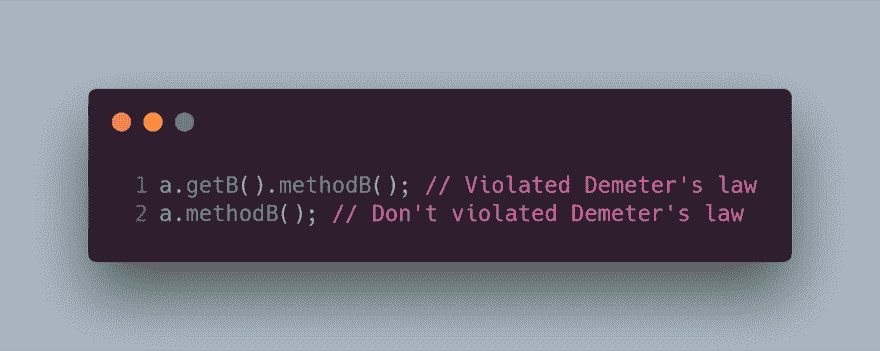
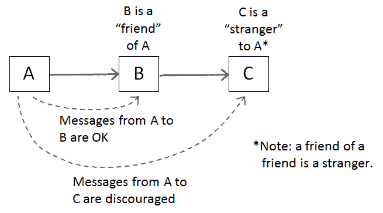
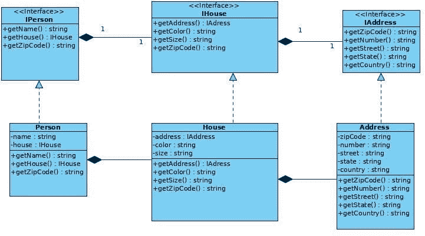
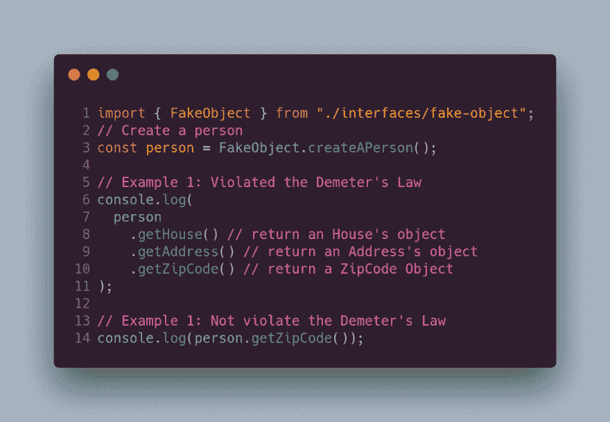
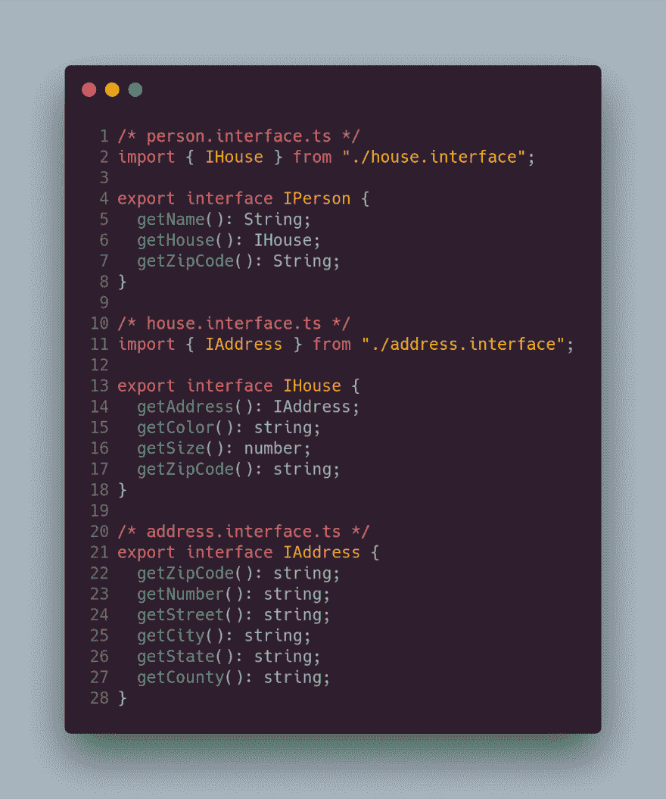
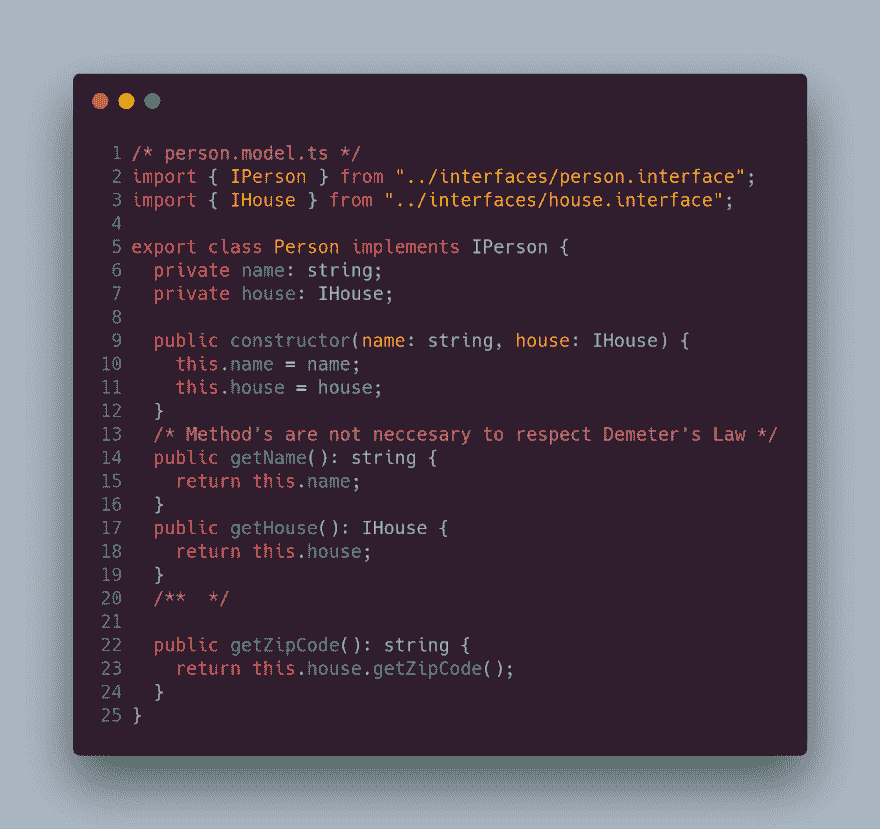
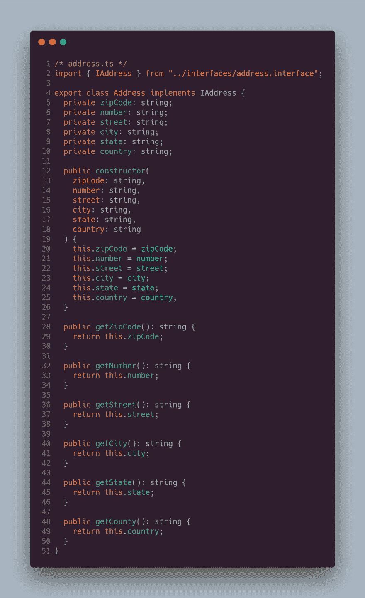
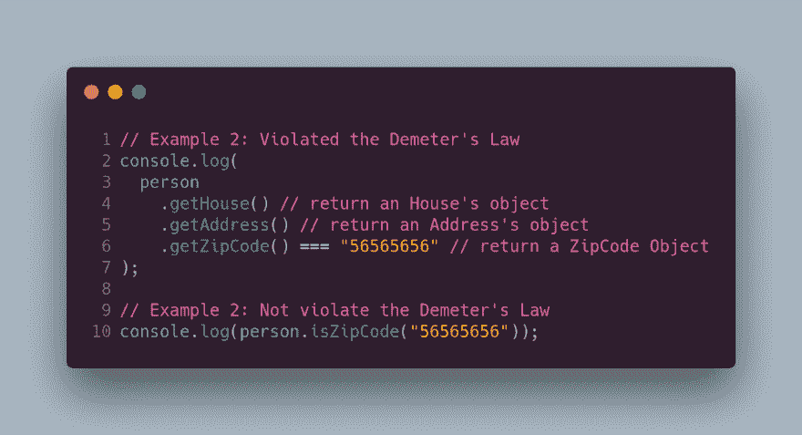
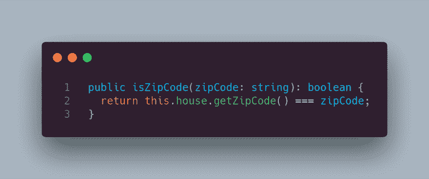

# 德米特里定律:不要和陌生人说话！

> 原文：<https://dev.to/carlillo/demeters-law-dont-talk-to-strangers-10ep>

> 最少知识法则 的 ***德米特(LoD)*** 或 ***法则是开发软件，特别是面向对象程序的设计指南
> —维基百科****

这个定律是由伊恩·霍兰德在 1987 年提出的，当时他和他的同事们正在使用面向对象编程技术对一个名为“得墨者”的系统进行编程。在系统的开发过程中，他们意识到满足一系列 T4 规则的代码耦合度更低。

得墨忒耳定律被称为**不要和陌生人说话**，因为
对象的任何方法只能调用:

1.  每个单元应该只对其他单元有有限的了解:只有与当前单元“密切”相关的单元。
2.  每个单位应该只和自己的朋友说话；不要和陌生人说话。
3.  只和你最亲近的朋友说话。

更正式地说，Demeter 法则要求对象 *O*
的方法 *m* 只能调用以下几种对象的方法:

*   *O* 本身。
*   *m 的*参数。
*   在 m 内创建/实例化的任何对象*。*
*   o 的直接组件对象。
*   一个全局变量，*可由 O 访问，在 m* 的范围内。

总之，以上所有的规则都可以说是你应该避免
调用由另一个方法返回的成员对象的方法。在现代的
面向对象语言中，使用的标识符是`dot`或`->`。因此，当代码在类之间有多个步骤时，就违反了
德米特定律，
即下面的代码显示了违反德米特定律的一个例子:

在这种情况下，来自 A 类的对象`a`可以请求 B 类实例化的对象
的方法，但是对象 A **不应该直接到达**对象 B，因为
意味着对象 A 对对象 B 的内部
结构有更多的了解(紧耦合)。

下图说明了阶级之间谁是朋友的关系。

### 真实例子——人→房子→地址

现在，我将展示一个使用 TypeScript 作为
编程语言实现的真实例子。在下面的 UML 图中，你可以看到作为一个`Person`是与`House`相关的
和与`Address`相关的`House`。

原始代码来自 https://github.com/tavaresasilva/LoDRaV 的

，并且是用 JAVA 编写的。

下面的代码可以在客户端/上下文中运行，而第一个代码违反了
德米特定律，因为`Person`需要了解类`House`的内部
实现。另一方面，第二个
实现遵守德米特里定律，代码耦合度较低。

下面的步骤显示了您必须实现代码，以遵守 Demeter 的
定律，并获得一个低耦合的代码。因此，第一步是创建接口
，它将在我们的具体类中实现。

下一步将是具体类的实现，正如你在下面看到的
。

代码中最重要的一点是没有方法违反德米特里定律(这里
不超过两次连续调用包含的对象)。

德米特里定律被打破的另一个例子如下:

在这种情况下，解决方案是在类`person`
中实现`isZipCode`方法，您可以在下面的代码中看到:

 
为图像键入标题(可选)

### 优点

满足德米特里定律的主要优点如下:

1.  类之间的**依赖**和**耦合**被**缩减**。
2.  轻松重用类。
3.  代码更容易测试。
4.  代码更容易维护，对变化更灵活。

### 越来越多，越来越多

[http://www.ccs.neu.edu/home/lieber/LoD.html](http://www.ccs.neu.edu/home/lieber/LoD.html)
[https://en.wikipedia.org/wiki/Law_of_Demeter](https://en.wikipedia.org/wiki/Law_of_Demeter)
[https://hacker noon . com/the-law-of-Demeter-in-the-era-of-micro services-3186 f4c 399 a1](https://hackernoon.com/the-law-of-demeter-in-the-era-of-microservices-3186f4c399a1)
[https://testing . Google blog . com/2008/07/breaking-law-of-of-Demeter-is-like-looking . html](https://testing.googleblog.com/2008/07/breaking-law-of-demeter-is-like-looking.html)
[http://www . virtuouscode .](http://www.virtuouscode.com/2011/07/05/demeter-its-not-just-a-good-idea-its-the-law/)

—

这个岗位的 GitHub 分支是[https://github.com/Caballerog/blog/tree/master/demeter](https://github.com/Caballerog/blog/tree/master/demeter)

* * *

最初发布于 [www.carloscaballero.io](https://carloscaballero.io/demeter-law/)