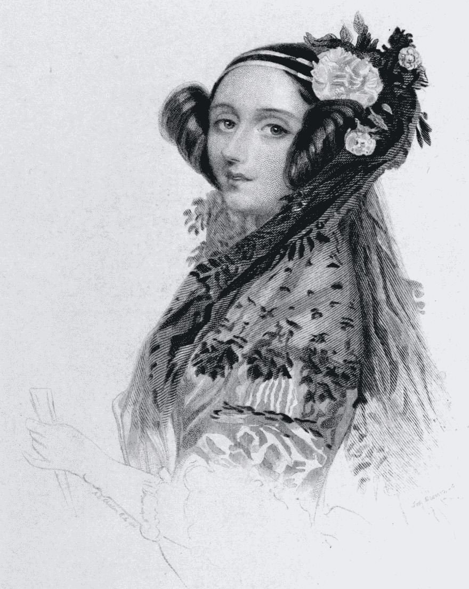
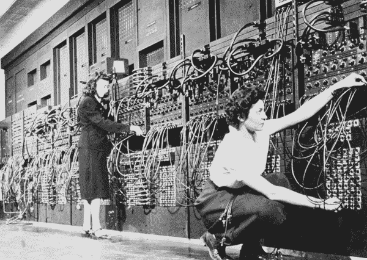

# 女性创造的技术

> 原文：<https://dev.to/glennmen/tech-created-by-women-1f6g>

*这个帖子的灵感来自 [#SheCoded](https://dev.to/devteam/calling-all-devs-please-join-us-for-shecoded-2019--4ia4)*

# 十九世纪四十年代，阿达·洛芙莱斯

 
阿达·洛芙莱斯被认为是计算机程序员(然而并不是每个人都同意这一点)。
1833 年，洛夫莱斯遇到了查尔斯·巴贝奇，他给她看了他关于一种他称之为分析引擎的机器的论文。洛夫莱斯不仅把这篇用意大利语写的论文翻译成了英语，还纠正了她在论文中发现的错误。她看到了机器的潜力，并编写了第一个计算机程序，一个计算伯努利数列的算法。不幸的是，Babbge 从未能制造出他的机器，Lovelace 在 36 岁时因癌症去世，从未看到她的程序被执行。

# 20 世纪 40 年代，《冰箱女郎》

20 世纪 40 年代以前的女数学家在哪里都很常见。在第二次世界大战期间，他们实际上被称为“计算机”,为军队手动计算弹道轨迹方程。
战后，一个由六名年轻女性组成的团队被选为 ENIAC 的第一批程序员。历史学家起初误认为她们是“冰箱女郎”，即在机器前摆姿势的模特。这些杰出的女性没有使用编程工具或手册，因为当时这些工具或手册还不存在。相反，他们使用逻辑图和表格来编程。当他们完成 ENIAC 的编程时，它能够在几秒钟内计算出弹道轨迹。
大多数女性在有生之年都没有因为在 ENIAC 的工作得到认可。事实上，在官方演示之后，大学举办了一个昂贵的庆祝晚宴，ENIAC 六人都没有被邀请。

# 20 世纪 50 年代，格蕾丝·赫柏

格蕾丝·赫柏一生对科技贡献良多，但我想写的是她创造的第一个编译器。
Hopper 做了第一个把单词转换成机器代码的编译器，它被称为 COBOL(面向商业的通用语言)。因此，我们现在可以用人类可读的文本编写代码。
COBOL 至今仍在许多使用订单处理业务软件的大型组织中使用。

# 20 世纪 60 年代，玛格丽特·哈米尔顿

玛格丽特·哈米尔顿是阿波罗 11 号团队的一员，该团队首次将两人送上月球。成千上万的人一起工作，使这成为可能，但这是汉密尔顿她的代码，这是成功的一大部分。
她开发了包含优先系统的机载导航软件。在着陆过程中，有一个超负荷的任务，因为她的优先级系统，它可以杀死较低优先级的任务，并重新建立更重要的任务。正因为如此，登陆成功了。2003 年，她因在科学和技术方面的贡献而被授予美国宇航局特殊空间法案奖。

# 20 世纪 70 年代，阿黛尔·戈德堡

Adele Goldberg 是开发 Smalltalk 的七名程序员之一，并编写了大部分文档。Smalltalk 是最早的面向对象编程语言之一，它也影响了此后的许多其他面向对象语言(Java、Python、Ruby 等等)。
Smalltalk 环境通常是第一个开发现在常见的面向对象软件设计模式的。其中最流行的是用户界面设计的模型-视图-控制器(MVC)模式。Smalltalk 语言和环境在图形用户界面(GUI)和所见即所得(WYSIWYG)用户界面、字体编辑器和 UI 设计的桌面隐喻的历史上具有很高的影响力。1983 年，苹果公司用 Smalltalk 推出了第一台带有图形用户界面的个人电脑 Apple Lisa，一年后又推出了 Macintosh。

* * *

这当然是一个非常简短的女性汇编，她们在技术世界中做出了巨大的改变，也创造了我们这里许多人拥有的工作。有更多的女性在我们今天所了解的世界中发挥了作用。

编程/计算部门主要由女性管理，但在 20 世纪 90 年代，这种情况迅速转变为男性主导的世界(女性约占 37%)。我希望看到女性程序员的增加，在这个领域，没有什么是男性可以从中受益的。

最后，我想说的是，本周我们公司雇佣了第一位女性程序员，iOS 开发。让我们希望到明年这个数字会增加。