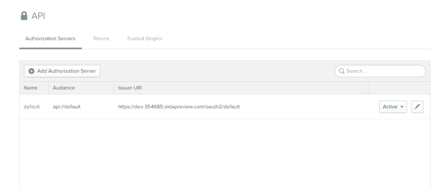
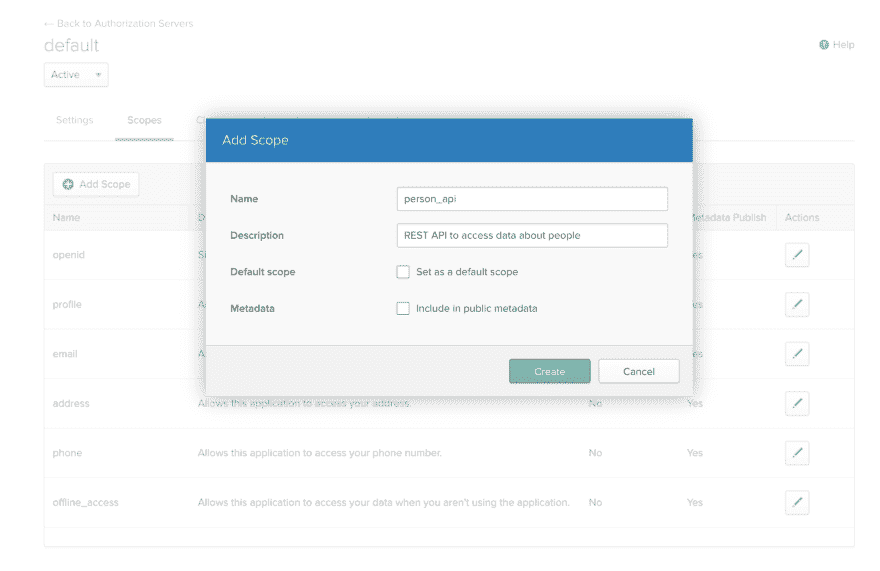

# 用 PHP 构建一个简单的 REST API

> 原文：<https://dev.to/oktadev/build-a-simple-rest-api-in-php-2k0k>

REST APIs 是现代 web 开发的支柱。如今，大多数 web 应用程序都是作为前端的单页面应用程序开发的，连接到用各种语言编写的后端 API。有很多很棒的框架可以帮助你快速构建 REST APIs。Laravel/Lumen 和 Symfony 的 API 平台是 PHP 生态系统中最常用的例子。它们提供了很好的工具来处理请求并生成带有正确 HTTP 状态代码的 JSON 响应。它们还简化了常见问题的处理，如身份验证/授权、请求验证、数据转换、分页、过滤器、速率调节、带有子资源的复杂端点以及 API 文档。

当然，您不需要复杂的框架来构建简单而安全的 API。在本文中，我将向您展示如何用 PHP 从头开始构建一个简单的 REST API。我们将通过使用 Okta 作为我们的授权提供者并实现客户端凭证流来确保 API 的安全性。

Okta 是一个 API 服务，允许您创建、编辑和安全地存储用户帐户和用户帐户数据，并将它们与一个或多个应用程序连接。注册一个永远免费的开发者账户，当你完成后，回来学习更多关于用 PHP 构建一个简单的 REST API。

OAuth 2.0 中有不同的身份验证流程，这取决于客户端应用程序是公共的还是私有的，以及是否涉及用户或者通信是否只是机器对机器的。客户端凭证流最适合于机器对机器的通信，在这种通信中，客户端应用程序是私有的(并且可以被信任来保守秘密)。在本文的最后，我还将向您展示如何构建一个测试客户端应用程序。

## 为你的 REST API 创建 PHP 项目框架

我们将首先创建一个`/src`目录，并在顶层目录中创建一个简单的`composer.json`文件，其中只有一个依赖项(目前):DotEnv 库，它允许我们将 Okta 认证细节保存在代码存储库之外的一个`.env`文件中:

`composer.json`

```
{  "require":  {  "vlucas/phpdotenv":  "^2.4"  },  "autoload":  {  "psr-4":  {  "Src\\":  "src/"  }  }  } 
```

我们还配置了一个 PSR-4 自动加载器，它会自动在`/src`目录中寻找 PHP 类。

我们现在可以安装依赖项了:

```
composer install 
```

我们现在有了一个`/vendor`目录，并且安装了 DotEnv 依赖项(我们也可以使用我们的自动加载器从`/src`加载我们的类，而不需要`include()`调用)。

让我们为我们的项目创建一个包含两行的`.gitignore`文件，因此`/vendor`目录和我们的本地`.env`文件将被忽略:

```
vendor/
.env 
```

接下来，我们将为 Okta 认证变量创建一个`.env.example`文件:

`.env.example`

```
OKTAAUDIENCE=api://default
OKTAISSUER=
SCOPE=
OKTACLIENTID=
OKTASECRET= 
```

以及一个`.env`文件，稍后我们将在其中填写我们 Okta 帐户的实际细节(Git 将忽略它，因此它不会出现在我们的存储库中)。

我们需要一个`bootstrap.php`文件来加载我们的环境变量(稍后它还会为我们的项目做一些额外的引导)。

`bootstrap.php`

```
<?php
require 'vendor/autoload.php';
use Dotenv\Dotenv;

$dotenv = new DotEnv( __DIR__ );
$dotenv->load();

// test code, should output:
// api://default
// when you run $ php bootstrap.php
echo getenv('OKTAAUDIENCE'); 
```

## 为你的 PHP REST API 配置一个数据库

我们将使用 MySQL 来增强我们简单的 API。我们将为我们的应用创建一个新的数据库和用户:

```
mysql -uroot -p
CREATE DATABASE api_example CHARACTER SET utf8mb4 COLLATE utf8mb4_unicode_ci;
CREATE USER 'api_user'@'localhost' identified by 'api_password';
GRANT ALL on api_example.* to 'api_user'@'localhost';
quit 
```

我们的 rest API 将只处理一个实体:Person，包含以下字段:`id`、`firstname`、`lastname`、`firstparent_id`、`secondparent_id`。它将允许我们定义人和每个人最多两个父母(链接到我们的数据库中的其他记录)。让我们在 MySQL 中创建数据库表:

```
mysql -uapi_user -papi_password api_example

CREATE TABLE person (
    id INT NOT NULL AUTO_INCREMENT,
    firstname VARCHAR(100) NOT NULL,
    lastname VARCHAR(100) NOT NULL,
    firstparent_id INT DEFAULT NULL,
    secondparent_id INT DEFAULT NULL,
    PRIMARY KEY (id),
    FOREIGN KEY (firstparent_id)
        REFERENCES person(id)
        ON DELETE SET NULL,
    FOREIGN KEY (secondparent_id)
        REFERENCES person(id)
        ON DELETE SET NULL
) ENGINE=INNODB; 
```

我们将把数据库连接变量添加到我们的`.env.example`文件中:

`.env.example`

```
DB_HOST=localhost
DB_PORT=3306
DB_DATABASE=
DB_USERNAME=
DB_PASSWORD= 
```

然后，我们将在。env 文件(它不存储在 repo 中，记得吗？):

`.env`

```
DB_HOST=localhost
DB_PORT=3306
DB_DATABASE=api_example
DB_USERNAME=api_user
DB_PASSWORD=api_password 
```

我们现在可以创建一个类来保存我们的数据库连接，并将连接的初始化添加到我们的 bootstrap.php 文件中:

`src/System/DatabaseConnector.php`

```
<?php
namespace Src\System;

class DatabaseConnector {

    private $dbConnection = null;

    public function __construct()
    {
        $host = getenv('DB_HOST');
        $port = getenv('DB_PORT');
        $db = getenv('DB_DATABASE');
        $user = getenv('DB_USERNAME');
        $pass = getenv('DB_PASSWORD');

        try {
            $this->dbConnection = new \PDO(
                "mysql:host=$host;port=$port;charset=utf8mb4;dbname=$db",
                $user,
                $pass
            );
        } catch (\PDOException $e) {
            exit($e->getMessage());
        }
    }

    public function getConnection()
    {
        return $this->dbConnection;
    }
} 
```

`bootstrap.php`(完整版)

```
<?php
require 'vendor/autoload.php';
use Dotenv\Dotenv;

use Src\System\DatabaseConnector;

$dotenv = new DotEnv( __DIR__ );
$dotenv->load();

$dbConnection = (new DatabaseConnector())->getConnection(); 
```

让我们创建一个`dbseed.php`文件，该文件创建我们的`Person`表，并在其中插入一些记录用于测试:

`dbseed.php`

```
<?php
require 'bootstrap.php';

$statement = <<<EOS
    CREATE TABLE IF NOT EXISTS person (
        id INT NOT NULL AUTO_INCREMENT,
        firstname VARCHAR(100) NOT NULL,
        lastname VARCHAR(100) NOT NULL,
        firstparent_id INT DEFAULT NULL,
        secondparent_id INT DEFAULT NULL,
        PRIMARY KEY (id),
        FOREIGN KEY (firstparent_id)
            REFERENCES person(id)
            ON DELETE SET NULL,
        FOREIGN KEY (secondparent_id)
            REFERENCES person(id)
            ON DELETE SET NULL
    ) ENGINE=INNODB;

    INSERT INTO person
        (id, firstname, lastname, firstparent_id, secondparent_id)
    VALUES
        (1, 'Krasimir', 'Hristozov', null, null),
        (2, 'Maria', 'Hristozova', null, null),
        (3, 'Masha', 'Hristozova', 1, 2),
        (4, 'Jane', 'Smith', null, null),
        (5, 'John', 'Smith', null, null),
        (6, 'Richard', 'Smith', 4, 5),
        (7, 'Donna', 'Smith', 4, 5),
        (8, 'Josh', 'Harrelson', null, null),
        (9, 'Anna', 'Harrelson', 7, 8);
EOS; 
try {
    $createTable = $dbConnection->exec($statement);
    echo "Success!\n";
} catch (\PDOException $e) {
    exit($e->getMessage());
} 
```

我们的数据库都设置好了！如果你想重置它，只需在 MySQL 中删除`person`表，然后运行`php dbseed.php`(我没有将 drop 语句添加到 seeder 中，以防错误运行)。

## 为人员表添加一个网关类

在面向对象的上下文中使用数据库有许多模式，从需要时直接 SQL 语句的简单执行(以过程方式)到复杂的 ORM 系统(PHP 中两个最流行的 ORM 选择是雄辩和教条)。对于我们的简单 API，使用简单模式也是有意义的，因此我们将使用表网关。我们甚至会跳过创建一个`Person`类(正如经典模式所要求的那样),而直接使用`PersonGateway`类。我们将实现返回所有记录、返回特定人员以及添加/更新/删除人员的方法。

`src/TableGateways/PersonGateway.php`

```
<?php
namespace Src\TableGateways;

class PersonGateway {

    private $db = null;

    public function __construct($db)
    {
        $this->db = $db;
    }

    public function findAll()
    {
        $statement = "
            SELECT 
                id, firstname, lastname, firstparent_id, secondparent_id
            FROM
                person;
        ";

        try {
            $statement = $this->db->query($statement);
            $result = $statement->fetchAll(\PDO::FETCH_ASSOC);
            return $result;
        } catch (\PDOException $e) {
            exit($e->getMessage());
        }
    }

    public function find($id)
    {
        $statement = "
            SELECT 
                id, firstname, lastname, firstparent_id, secondparent_id
            FROM
                person
            WHERE id = ?;
        ";

        try {
            $statement = $this->db->prepare($statement);
            $statement->execute(array($id));
            $result = $statement->fetchAll(\PDO::FETCH_ASSOC);
            return $result;
        } catch (\PDOException $e) {
            exit($e->getMessage());
        }    
    }

    public function insert(Array $input)
    {
        $statement = "
            INSERT INTO person 
                (firstname, lastname, firstparent_id, secondparent_id)
            VALUES
                (:firstname, :lastname, :firstparent_id, :secondparent_id);
        ";

        try {
            $statement = $this->db->prepare($statement);
            $statement->execute(array(
                'firstname' => $input['firstname'],
                'lastname' => $input['lastname'],
                'firstparent_id' => $input['firstparent_id'] ?? null,
                'secondparent_id' => $input['secondparent_id'] ?? null,
            ));
            return $statement->rowCount();
        } catch (\PDOException $e) {
            exit($e->getMessage());
        }    
    }

    public function update($id, Array $input)
    {
        $statement = "
            UPDATE person
            SET 
                firstname = :firstname,
                lastname = :lastname,
                firstparent_id = :firstparent_id,
                secondparent_id = :secondparent_id
            WHERE id = :id;
        ";

        try {
            $statement = $this->db->prepare($statement);
            $statement->execute(array(
                'id' => (int) $id,
                'firstname' => $input['firstname'],
                'lastname' => $input['lastname'],
                'firstparent_id' => $input['firstparent_id'] ?? null,
                'secondparent_id' => $input['secondparent_id'] ?? null,
            ));
            return $statement->rowCount();
        } catch (\PDOException $e) {
            exit($e->getMessage());
        }    
    }

    public function delete($id)
    {
        $statement = "
            DELETE FROM person
            WHERE id = :id;
        ";

        try {
            $statement = $this->db->prepare($statement);
            $statement->execute(array('id' => $id));
            return $statement->rowCount();
        } catch (\PDOException $e) {
            exit($e->getMessage());
        }    
    }
} 
```

显然，在生产系统中，您会希望更优雅地处理异常，而不是只给出一个错误消息就退出。

以下是使用网关的一些示例:

```
$personGateway = new PersonGateway($dbConnection);

// return all records
$result = $personGateway->findAll();

// return the record with id = 1
$result = $personGateway->find(1);

// insert a new record
$result = $personGateway->insert([
    'firstname' => 'Doug',
    'lastname' => 'Ellis'
]);

// update the record with id = 10
$result = $personGateway->update(10, [
    'firstname' => 'Doug',
    'lastname' => 'Ellis',
    'secondparent_id' => 1
]);

// delete the record with id = 10
$result = $personGateway->delete(10); 
```

## 实现 PHP REST API

我们现在将使用以下端点实现 REST API:

```
// return all records
GET /person

// return a specific record
GET /person/{id}

// create a new record
POST /person

// update an existing record
PUT /person/{id}

// delete an existing record
DELETE /person/{id} 
```

我们将创建一个`/public/index.php`文件作为前端控制器并处理请求，还将创建一个`src/Controller/PersonController.php`文件来处理 API 端点(在验证 URI 后从前端控制器调用)。

`public/index.php`

```
<?php
require "../bootstrap.php";
use Src\Controller\PersonController;

header("Access-Control-Allow-Origin: *");
header("Content-Type: application/json; charset=UTF-8");
header("Access-Control-Allow-Methods: OPTIONS,GET,POST,PUT,DELETE");
header("Access-Control-Max-Age: 3600");
header("Access-Control-Allow-Headers: Content-Type, Access-Control-Allow-Headers, Authorization, X-Requested-With");

$uri = parse_url($_SERVER['REQUEST_URI'], PHP_URL_PATH);
$uri = explode( '/', $uri );

// all of our endpoints start with /person
// everything else results in a 404 Not Found
if ($uri[1] !== 'person') {
    header("HTTP/1.1 404 Not Found");
    exit();
}

// the user id is, of course, optional and must be a number:
$userId = null;
if (isset($uri[2])) {
    $userId = (int) $uri[2];
}

$requestMethod = $_SERVER["REQUEST_METHOD"];

// pass the request method and user ID to the PersonController and process the HTTP request:
$controller = new PersonController($dbConnection, $requestMethod, $userId);
$controller->processRequest(); 
```

`src/Controller/PersonController.php`

```
<?php
namespace Src\Controller;

use Src\TableGateways\PersonGateway;

class PersonController {

    private $db;
    private $requestMethod;
    private $userId;

    private $personGateway;

    public function __construct($db, $requestMethod, $userId)
    {
        $this->db = $db;
        $this->requestMethod = $requestMethod;
        $this->userId = $userId;

        $this->personGateway = new PersonGateway($db);
    }

    public function processRequest()
    {
        switch ($this->requestMethod) {
            case 'GET':
                if ($this->userId) {
                    $response = $this->getUser($this->userId);
                } else {
                    $response = $this->getAllUsers();
                };
                break;
            case 'POST':
                $response = $this->createUserFromRequest();
                break;
            case 'PUT':
                $response = $this->updateUserFromRequest($this->userId);
                break;
            case 'DELETE':
                $response = $this->deleteUser($this->userId);
                break;
            default:
                $response = $this->notFoundResponse();
                break;
        }
        header($response['status_code_header']);
        if ($response['body']) {
            echo $response['body'];
        }
    }

    private function getAllUsers()
    {
        $result = $this->personGateway->findAll();
        $response['status_code_header'] = 'HTTP/1.1 200 OK';
        $response['body'] = json_encode($result);
        return $response;
    }

    private function getUser($id)
    {
        $result = $this->personGateway->find($id);
        if (! $result) {
            return $this->notFoundResponse();
        }
        $response['status_code_header'] = 'HTTP/1.1 200 OK';
        $response['body'] = json_encode($result);
        return $response;
    }

    private function createUserFromRequest()
    {
        $input = (array) json_decode(file_get_contents('php://input'), TRUE);
        if (! $this->validatePerson($input)) {
            return $this->unprocessableEntityResponse();
        }
        $this->personGateway->insert($input);
        $response['status_code_header'] = 'HTTP/1.1 201 Created';
        $response['body'] = null;
        return $response;
    }

    private function updateUserFromRequest($id)
    {
        $result = $this->personGateway->find($id);
        if (! $result) {
            return $this->notFoundResponse();
        }
        $input = (array) json_decode(file_get_contents('php://input'), TRUE);
        if (! $this->validatePerson($input)) {
            return $this->unprocessableEntityResponse();
        }
        $this->personGateway->update($id, $input);
        $response['status_code_header'] = 'HTTP/1.1 200 OK';
        $response['body'] = null;
        return $response;
    }

    private function deleteUser($id)
    {
        $result = $this->personGateway->find($id);
        if (! $result) {
            return $this->notFoundResponse();
        }
        $this->personGateway->delete($id);
        $response['status_code_header'] = 'HTTP/1.1 200 OK';
        $response['body'] = null;
        return $response;
    }

    private function validatePerson($input)
    {
        if (! isset($input['firstname'])) {
            return false;
        }
        if (! isset($input['lastname'])) {
            return false;
        }
        return true;
    }

    private function unprocessableEntityResponse()
    {
        $response['status_code_header'] = 'HTTP/1.1 422 Unprocessable Entity';
        $response['body'] = json_encode([
            'error' => 'Invalid input'
        ]);
        return $response;
    }

    private function notFoundResponse()
    {
        $response['status_code_header'] = 'HTTP/1.1 404 Not Found';
        $response['body'] = null;
        return $response;
    }
} 
```

可以用 Postman 这样的工具测试 API。首先，转到项目目录并启动 PHP 服务器:

```
php -S 127.0.0.1:8000 -t public 
```

然后用 Postman 连接到`127.0.0.1:8000`，发送 http 请求。注意:在进行 PUT 和 POST 请求时，确保将 Body 类型设置为`raw`，然后以 JSON 格式粘贴 payload，并将内容类型设置为 JSON (application/json)。

## 用 OAuth 2.0 保护你的 PHP REST API

我们将使用 Okta 作为我们的授权服务器，我们将实现客户端凭证流。当客户端是私有的并且像这样工作时，建议将该流用于机器对机器的认证:客户端应用程序持有客户端 ID 和秘密；客户端将这些凭证传递给 Okta，并获得一个访问令牌；客户端将访问令牌发送给 REST API 服务器；服务器向 Okta 请求一些允许它验证令牌的元数据，并验证令牌(或者，它可以只请求 Okta 验证令牌)；然后，如果令牌有效，服务器将提供 API 资源，如果令牌丢失、过期或无效，服务器将响应 401 未授权状态代码。

在您继续之前，您需要登录您的 Okta 帐户(或[创建一个免费的新帐户](https://developer.okta.com/signup/))，创建您的授权服务器并设置您的客户端应用程序。

登录到您的开发人员控制台，导航到 API，然后导航到授权服务器选项卡。单击默认服务器的链接。我们将从这个 Settings 选项卡中复制 Issuer Uri 字段，并将其添加到我们的。环境文件:

```
OKTAISSUER=https://{yourOktaDomain}/oauth2/default 
```

[](https://res.cloudinary.com/practicaldev/image/fetch/s--yVm_nrQj--/c_limit%2Cf_auto%2Cfl_progressive%2Cq_auto%2Cw_880/https://developer.okta.com/assets-jekyll/blog/php-rest-api/issuer-uri-c34d305c54e9a84e4429ddfb237d725587b8c56b61e2d400fb138f14c1ed6208.png)

你可以在上面的截图中看到我的测试 Okta 账户的发行人 URI。复制自己的值，放入自己的`.env`文件中。

接下来点击**编辑**图标，进入**范围**选项卡，点击**添加范围**为 REST API 添加一个范围。我们将把它命名为`person_api`:

[](https://res.cloudinary.com/practicaldev/image/fetch/s--X7sqS0cg--/c_limit%2Cf_auto%2Cfl_progressive%2Cq_auto%2Cw_880/https://developer.okta.com/assets-jekyll/blog/php-rest-api/create-the-person-scope-ab71627b7a19542fa3b36a94bd29789a212b21d5b5c54662538b6cebc557e71e.png)

我们还需要将范围添加到我们的`.env`文件中。我们将在`.env.example`中添加以下内容:

```
SCOPE= 
```

值为的键。环境:

```
SCOPE=person_api 
```

下一步是创建客户端。导航到**应用**，然后点击**添加应用**。选择**服务**，然后点击**下一步**。输入您的服务名称(如人事经理)，然后点击**完成**。这会将您带到一个包含您的客户端凭据的页面:

[](https://res.cloudinary.com/practicaldev/image/fetch/s--_P7QH3v7--/c_limit%2Cf_auto%2Cfl_progressive%2Cq_auto%2Cw_880/https://developer.okta.com/assets-jekyll/blog/php-rest-api/view-client-credentials-640dd0d4299f8b8915d6c890083e385a656b69cb6bee5075023deed8ee14e5b7.png)

这些是您的客户端应用程序进行身份验证所需的凭据。对于这个例子，客户机和服务器代码将在同一个存储库中，所以我们也将这些凭证添加到我们的`.env`文件中(确保用这个页面中的值替换`{yourClientId}`和`{yourClientSecret}`):

添加到. env.example:

```
OKTACLIENTID=
OKTASECRET= 
```

添加到。环境:

```
OKTACLIENTID={yourClientId}
OKTASECRET={yourClientSecret} 
```

## 给你的 PHP REST API 添加认证

我们将使用 Okta JWT 验证器库。它需要一个 JWT 库(我们将使用`spomky-labs/jose`)和一个 PSR-7 兼容库(我们将使用`guzzlehttp/psr7`)。我们将通过 composer 安装所有内容:

```
composer require okta/jwt-verifier spomky-labs/jose guzzlehttp/psr7 
```

现在，我们可以将授权代码添加到前端控制器中(如果使用框架，我们将在中间件中完成这项工作):

`public/index.php`(为清晰起见，为完整版本)

```
<?php
require "../bootstrap.php";
use Src\Controller\PersonController;

header("Access-Control-Allow-Origin: *");
header("Content-Type: application/json; charset=UTF-8");
header("Access-Control-Allow-Methods: OPTIONS,GET,POST,PUT,DELETE");
header("Access-Control-Max-Age: 3600");
header("Access-Control-Allow-Headers: Content-Type, Access-Control-Allow-Headers, Authorization, X-Requested-With");

$uri = parse_url($_SERVER['REQUEST_URI'], PHP_URL_PATH);
$uri = explode('/', $uri);

// all of our endpoints start with /person
// everything else results in a 404 Not Found
if ($uri[1] !== 'person') {
    header("HTTP/1.1 404 Not Found");
    exit();
}

// the user id is, of course, optional and must be a number:
$userId = null;
if (isset($uri[2])) {
    $userId = (int) $uri[2];
}

// authenticate the request with Okta:
if (! authenticate()) {
    header("HTTP/1.1 401 Unauthorized");
    exit('Unauthorized');
}

$requestMethod = $_SERVER["REQUEST_METHOD"];

// pass the request method and user ID to the PersonController:
$controller = new PersonController($dbConnection, $requestMethod, $userId);
$controller->processRequest();

function authenticate() {
    try {
        switch(true) {
            case array_key_exists('HTTP_AUTHORIZATION', $_SERVER) :
                $authHeader = $_SERVER['HTTP_AUTHORIZATION'];
                break;
            case array_key_exists('Authorization', $_SERVER) :
                $authHeader = $_SERVER['Authorization'];
                break;
            default :
                $authHeader = null;
                break;
        }
        preg_match('/Bearer\s(\S+)/', $authHeader, $matches);
        if(!isset($matches[1])) {
            throw new \Exception('No Bearer Token');
        }
        $jwtVerifier = (new \Okta\JwtVerifier\JwtVerifierBuilder())
            ->setIssuer(getenv('OKTAISSUER'))
            ->setAudience('api://default')
            ->setClientId(getenv('OKTACLIENTID'))
            ->build();
        return $jwtVerifier->verify($matches[1]);
    } catch (\Exception $e) {
        return false;
    }
} 
```

## 构建一个示例客户端应用程序(命令行脚本)来测试 PHP REST API

在本节中，我们将添加一个简单的客户端应用程序(一个使用 curl 的命令行脚本)来测试 REST API。我们将用一个非常简单的流程创建一个新的 php 文件‘public/clients . PHP ’:它将从。env 文件，然后它将从 Okta 获取一个访问令牌，并运行 API 调用来获取所有用户和特定用户(在授权头中传递 Okta 访问令牌)。

`public/client.php`

```
<?php
require "../bootstrap.php";

$clientId = getenv('OKTACLIENTID');
$clientSecret = getenv('OKTASECRET');
$scope = getenv('SCOPE');
$issuer = getenv('OKTAISSUER');

// obtain an access token
$token = obtainToken($issuer, $clientId, $clientSecret, $scope);

// test requests
getAllUsers($token);
getUser($token, 1);

// end of client.php flow

function obtainToken($issuer, $clientId, $clientSecret, $scope) {
    echo "Obtaining token...";

    // prepare the request
    $uri = $issuer . '/v1/token';
    $token = base64_encode("$clientId:$clientSecret");
    $payload = http_build_query([
        'grant_type' => 'client_credentials',
        'scope' => $scope
    ]);

    // build the curl request
    $ch = curl_init();
    curl_setopt($ch, CURLOPT_URL, $uri);
    curl_setopt( $ch, CURLOPT_HTTPHEADER, [
        'Content-Type: application/x-www-form-urlencoded',
        "Authorization: Basic $token"
    ]);
    curl_setopt($ch, CURLOPT_POST, 1);
    curl_setopt($ch, CURLOPT_POSTFIELDS, $payload);
    curl_setopt($ch, CURLOPT_RETURNTRANSFER, true);

    // process and return the response
    $response = curl_exec($ch);
    $response = json_decode($response, true);
    if (! isset($response['access_token'])
        || ! isset($response['token_type'])) {
        exit('failed, exiting.');
    }

    echo "success!\n";
    // here's your token to use in API requests
    return $response['token_type'] . " " . $response['access_token'];
}

function getAllUsers($token) {
    echo "Getting all users...";
    $ch = curl_init();
    curl_setopt($ch, CURLOPT_URL, "http://127.0.0.1:8000/person");
    curl_setopt( $ch, CURLOPT_HTTPHEADER, [
        'Content-Type: application/json',
        "Authorization: $token"
    ]);
    curl_setopt($ch, CURLOPT_RETURNTRANSFER, true);
    $response = curl_exec($ch);

    var_dump($response);
}

function getUser($token, $id) {
    echo "Getting user with id#$id...";
    $ch = curl_init();
    curl_setopt($ch, CURLOPT_URL, "http://127.0.0.1:8000/person/" . $id);
    curl_setopt( $ch, CURLOPT_HTTPHEADER, [
        'Content-Type: application/json',
        "Authorization: $token"
    ]);
    curl_setopt($ch, CURLOPT_RETURNTRANSFER, true);
    $response = curl_exec($ch);

    var_dump($response);
} 
```

您可以从命令行运行该应用程序，方法是转到`/public`目录并运行:

```
php client.php 
```

(如果还没有启动服务器，不要忘记启动它！)

```
php -S 127.0.0.1:8000 -t public 
```

就是这样！

## 了解关于 PHP、安全 REST APIs 和 OAuth 2.0 客户端凭证流的更多信息

你可以在这里找到完整的代码示例: [GitHub 链接](https://github.com/oktadeveloper/okta-php-core-rest-api-example)

如果您想更深入地了解本文涉及的主题，以下资源是一个很好的起点:

*   [我们的 Vue/PHP 快速入门指南](https://developer.okta.com/quickstart/#/vue/php/generic)
*   [Okta 认证概述](https://developer.okta.com/authentication-guide/auth-overview/)
*   [在 5 分钟内为你的 PHP 应用添加认证](/blog/2018/07/09/five-minute-php-app-auth)
*   [在 PHP 中构建简单的登录](/blog/2018/12/28/simple-login-php)

喜欢你今天学到的吗？在 [Twitter](https://twitter.com/oktadev) 上关注我们，订阅我们的 [YouTube 频道](https://www.youtube.com/channel/UC5AMiWqFVFxF1q9Ya1FuZ_Q)获取更多精彩内容！