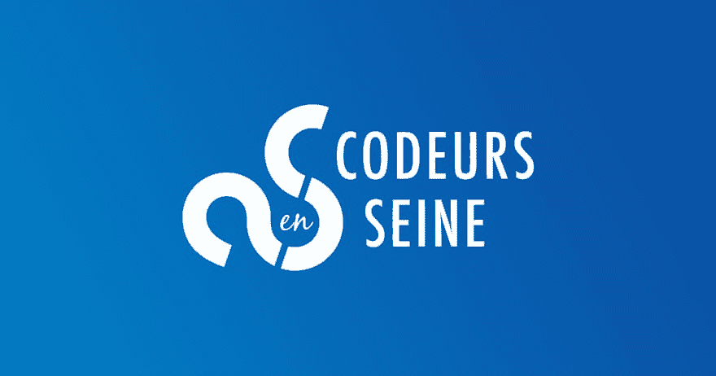
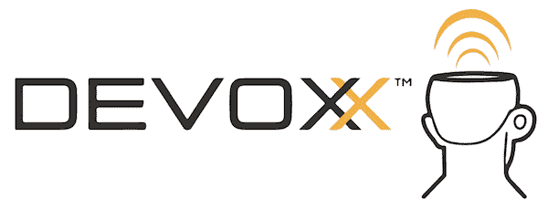

# 📛🗣️:你参加过哪些 dev 会议？

> 原文：<https://dev.to/biros/--what-dev-conferences-did-you-attend-32p8>

# 嗨伙计们！

> 你参加过开发会议吗？

我已经发展了近 20 年，但我直到 2016 年才发现 dev 会议。那一年，我有机会参加了在巴黎举行的非常著名的 [devoxx](https://www.devoxx.fr/) 会议。机票、火车和酒店房间都由我的公司支付。

非常激动人心！见到这么多开发者，听到一些著名的演讲者谈论热门话题，得到我的第一个贴纸...😉

也是在这件事之后，我在公司社交网络上写了我的第一篇博文。我开始写博客。

我通常在参加这种活动时会尽量保持开放的态度。我不会去谈论我最喜欢的筹码。我更喜欢参加一些关于外来技术的会谈(**区块链**，**铁锈**，...)或者听到在生产中尝试新事物的人的反馈( **CQRS** 、 **docker** 、**微服务**，...).我也喜欢谈论**测试**、 **devops** 和**敏捷**。

现在，让我向你介绍我有机会参加的项目。

# BreizhCamp

🔗*[www . breizhcamp . org](https://www.breizhcamp.org/)*
🐦*[【Twitter . com/breizhcamp】](https://twitter.com/breizhcamp)*
📆*2019 年 3 月 20 日至 22 日*
🗺 *[驯鹿](https://www.google.fr/maps/place/Rennes)(*
💵 *👩‍💻 *~800 名观众**

 ** * *

# 编码员在塞纳

🔗*[【www . codeursousene . com】](https://www.codeursenseine.com)*
🐦*[【Twitter . com/code ursulane】](https://twitter.com/codeursenseine)*
📆*2019 年 11 月 21 日*
🗺 *[车轮](https://www.google.fr/maps/place/Rouen)(*
💵*自由*
👩‍💻 *~900 名观众*

* * *

# 德沃克斯法国

🔗*[www . devo xx . fr](https://www.devoxx.fr/)*
🐦
📆 *17-19 / 04 / 2019*
🗺️ *[帕里斯](https://www.google.fr/maps/place/Paris) (🇫🇷)*
💵*605*T20】👩‍💻 *~3000 名与会者*

* * *

> 你呢，你参加了哪些会议？*