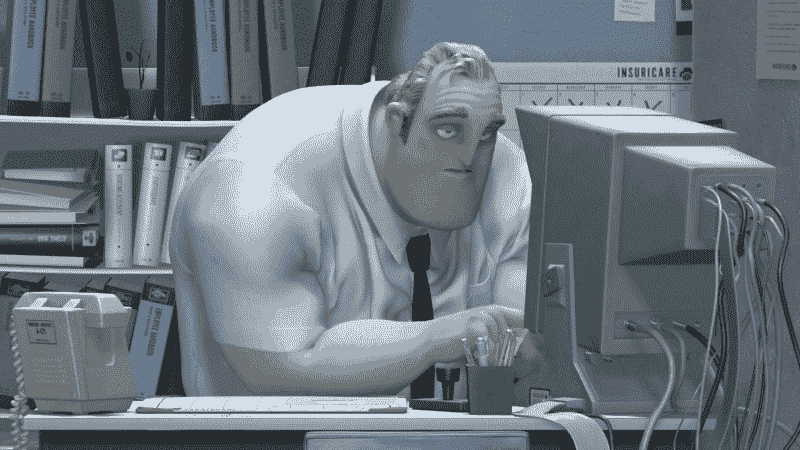
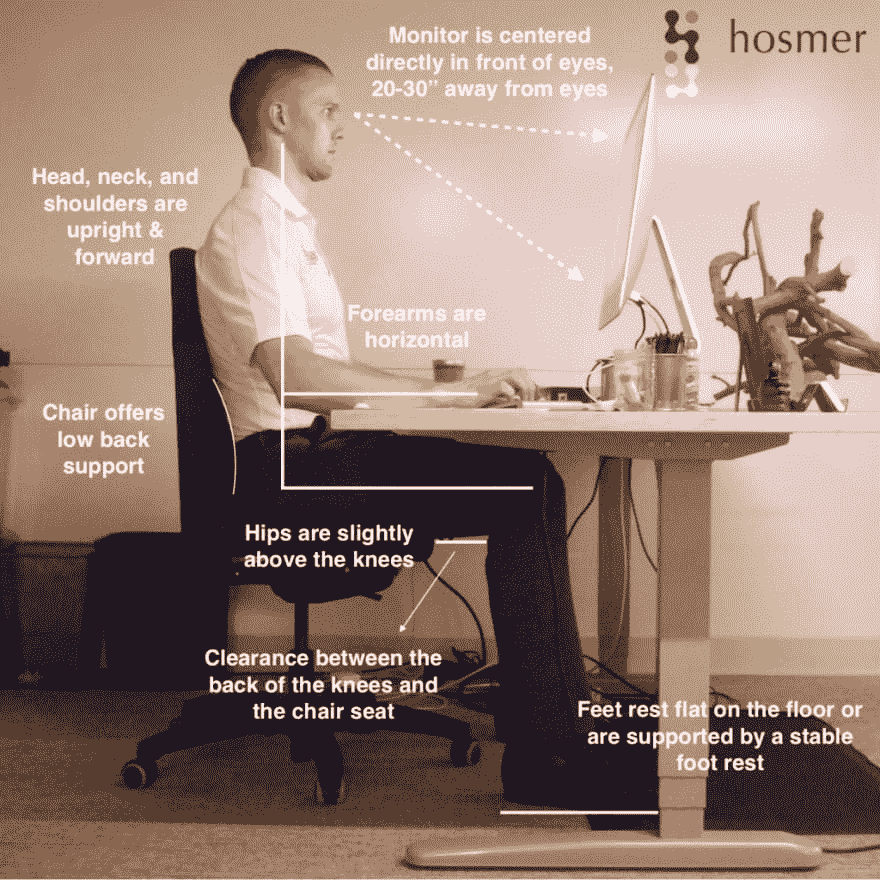

# 开发人员的人体工程学

> 原文：<https://dev.to/natreid/ergonomics-for-devs-103i>

当谈到使用我的笔记本电脑的人体工程学和自我护理时，我过去认为有两种人:带着健身球椅、站立式办公桌和其他小发明的人，以及我们这些伸长脖子不停编码的普通人。

然而，事实是，绝对每个人都可以从他们的工作空间和笔记本电脑使用的任何数量的或大或小的变化中受益。姿势相关的疼痛可能不总是最大的问题，但是疼痛和不舒服是编写更糟糕代码的好方法。

如果你因伏案工作而感到酸痛，你可以做三件主要的事情:改变你的姿势，伸展身体，改变你的办公桌布置。

## 姿势

答案是，作为开发人员，或者一般的笔记本电脑用户，我们工作时有四个主要的压力区域:下背部、肩膀、脖子和手腕。对于你的脊椎和肩膀来说，在办公桌前使用笔记本电脑的关键问题是你的驼背。更具体地说，驼背包括弯曲的下背部，肩膀向前圆，可能有点紧张，脖子弯曲面对屏幕。

我肯定会有预感，尤其是当我非常专注或有压力的时候。一旦我开始思考这个问题，我就会试着放松自己，坐在一个完全中立的位置，肩膀向后，脖子伸直，手腕平放。我试图强迫自己保持完美的姿势。

以这种方式坐着感觉非常需要放松，但老实说，它并没有更舒服，经常感到紧张，一旦我停止关注我的姿势，我就会回到驼背。这让我意识到以“完美”的姿势坐着并不是答案，改善我的姿势才是。

找出最困扰你的地方，并改善你的姿势。

对于那些腰背痛的人(这是很常见的，在健康世界中被称为 LBP，多达 25%的办公室工作人员患有这种疾病！):将你的下半身在椅子上向后移动，并向后倾斜，直到你的下背部稍微向内弯曲。

对于那些肩膀疼痛的人:当你发现自己弯腰驼背时，将上半身向后倾斜，将肩膀向外展开。

对于那些颈部疼痛的人来说:尽可能降低你的座位，这样你就不会往下看，考虑向上抬起你的后脑勺来拉长脖子。

一般来说，只是更专注于姿势是随着时间的推移改善它的关键。因此，每当你记得调整时，花一点时间来巩固记忆，并感受你如何改变你的姿势。

## 拉伸

网上有无数关于办公桌前伸展运动提高机动性的资源(我最喜欢的一些是这里的和这里的)，但一般来说，任何拉伸和放松紧张肌肉的运动都对你有好处。当你感到酸痛时，任何良好拉伸的关键是你拉伸的肌肉尽可能放松，你只是利用你身体的重量，而不是其他肌肉的力量来拉伸。
一些最简单和不引人注目的伸展动作是:用手的重量将耳朵向肩膀倾斜，双手放在背后，然后抬起，同时拱起背部。

## 更改您的桌面设置

我尝试优化的两件主要事情是:一个是更高的显示器，另一个是离我适当距离的更低的键盘。

把显示器放在眼睛的高度是最好的位置，因为它迫使你的脖子伸直，并始终由你的背部支撑。为此，您可以做三件事:

*   如果您的工作场所有显示器，尽可能使用它们
*   让你的椅子尽可能低，这样显示器就相对高一些
*   向后倾斜您的显示器，以便在不弯曲脖子的情况下更容易向下看

对你的键盘来说，目标是始终保持你的手肘靠近你的身体，成大于 90 度的角度。这让你的手腕保持中立，也让你的肩膀更容易放松下来。键盘的最佳位置需要一点摆弄，对于各种身材的人来说是不同的，但一般来说越低越好(所以不要坐在椅子上太低！)而且越远越好(你的手肘甚至可能会放在桌子上！)直到你的手腕开始向上倾斜。

### 结论

有很多方法可以改善你的姿势，其中大多数都非常简单，完全免费，你只需要记住就可以了。但是如果你和我一样，你会经常为自己糟糕的姿势感到内疚，并犹豫是否要开始改正。

所以，不要被你应该做多少不同的事情来拥有完美的姿势所淹没，只要在你记得的时候在这里或那里做一些小小的调整，最终这些事情会成为习惯。突然你可能会意识到你的姿势实际上很好，如果你坚持下去，你会少很多痛苦！

也不要忘记，没有什么可以取代定期休息站起来走走——运动是治疗肌肉僵硬的最好方法！