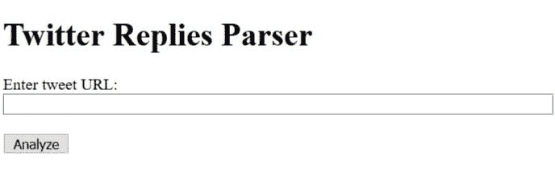

# twitter-Replies-parser——一个将 Twitter 回复转换成 JSON 的工具

> 原文：<https://dev.to/azure/twitter-replies-parser---a-tool-for-converting-twitter-replies-into-json-3j4a>

我和我的一些队友最近在 Twitter 上问 Node.js 的人他们使用什么工具，为什么喜欢他们。我们正在收集这些信息，以便帮助我们在微软的产品团队为 Azure 创建更好的 [Node.js 工具，为社区服务。事实证明，很多人在这个问题上有很多很好的意见和反馈。这太棒了！](https://docs.microsoft.com/en-us/javascript/azure/?view=azure-node-latest&wt.mc_id=devto-blog-brhugh)

不太好的是，我们收到了太多的回复，我们无法直接从网络客户端复制粘贴😱。那怎么办呢？当然是写点 JavaScript 啦！

尽管说起来容易做起来难。事实证明，Twitter 没有任何 API 可以用来回复一条推文。相反，我不得不使用搜索 API，然后手工创建回复树。通过一点编码工作和一些递归调用，我让它以很高的准确度工作。由于使用的方法，它不是 100%准确。我注意到，在对我的反馈请求的大约 60 条回复中，大约有 2-3 条推文被遗漏了，但已经足够接近了！

这个工具是一个 Node.js 应用程序，它通过一个简单的 web 应用程序启动一个 web 服务器，用于输入您想要获得回复的 tweet 的 URL。这肯定不太好，但是完成任务:

你可以在 GitHub 上查看这个工具，它是在 MIT 开源许可下发布的。我很想听听你的想法，如果你在使用它时遇到任何问题。