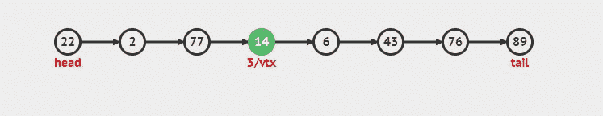
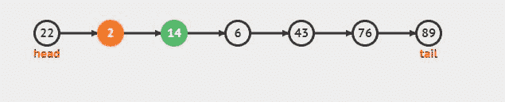
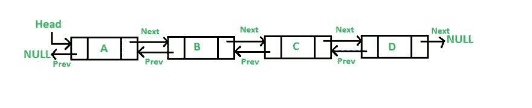

# 理解链表

> 原文 https://dev.to/trilemaestro92/understanding-linked-list-4hbp

问候程序员伙伴。

在这一部分中，我将分解链表数据结构...你将学习基本原理，它们是如何工作的，一个叫做“双向链表”的变体(我没有编造)，然后问这个问题...它们容易学吗？你应该学吗？剧透...你应该。

## 什么是链表？

链表是一种数据结构，由一组顶点(节点)组成，它们共同代表一个序列。每个顶点由数据和对序列中下一个顶点的引用(链接)组成。更简单地说，它是一种灵活的数据结构，可以存储许多节点，它通过让每个节点指向列表中的下一个节点来实现这一点。

链表及其变体被用作底层数据结构来实现列表、堆栈、队列和 ADT(抽象数据类型)。

情绪完全失控

1.  这个特殊的链表有 7 个节点，每个节点都有一个特定的变量，在这个例子中它们是数字[22，2，77，6，43，76，89]
2.  每个节点相互连接的箭头，这些箭头称为指针。
3.  “头”标签指示链表何时开始，而“尾”标签指示链表何时结束。
4.  如果你正看着尾节点，并想知道“嘿，不是链表中的每个节点都应该有一个指向下一个节点的指针吗？”你是 100%正确的，事实上最后一个节点有一个 next 指针值，它是 0 或者 null，这表明你已经到达了列表的末尾。

## 怎么用？

因为链表就是这样一种基本而简单的线性数据结构。它有一系列潜在的应用，如列表 ADT(抽象数据类型),如学生列表、事件列表、约会列表等。

如前所述，链表也被用作底层结构来创建其他更复杂的结构，如队列和堆栈。

此外，因为链表可以很容易地被重新排序、拆分、修剪、反转等等。它们对于排序这样的算法非常有用。

让我们试着从上面的链表例子中**搜索**一个值 *43*

情绪完全失控

1.  在链表中搜索相当简单，如果值是 43，算法将首先在头节点检查。如果没有，它将通过指针的方式继续到下一个节点，以此类推。
2.  您可以预测它将经过 4 个节点，直到到达值为 43 的节点。如果我们要搜索一个不在链表上的值，它将遍历整个链表并最终返回 null。

让我们试着**在链表的索引 3 处插入**一个值 *14*

情绪完全失控

1.  最初在索引 3 处是值为 6 的节点
2.  为了插入新节点(值 14 ),该算法首先从头遍历到索引 3，然后添加该节点。
3.  通过添加新节点，我们将索引 2 的指针(值 77)更改为指向新节点(值 14)。而插入的节点(值 14)指针现在指向索引节点 4(值 6)

时间**删除**链表中的一个节点。让我们删除索引 2 中的节点(值 77)

情绪完全失控

1.  这是一个相当简单的过程
2.  我们遍历索引 2 中的节点(值 77)，并将其从列表中删除。
3.  通过移除新节点，我们将索引 1(值 2)的指针改为现在从索引 3(值 14)指向新节点

总之，在搜索、插入或删除列表中的内容时，链表非常类似于数组。但是区别来自于大 O 符号和每个数据结构执行需要多长时间。

额外的....额外的

让我们来谈谈“双向链表”。因为上面所有的例子都被认为是单链表。下面是双向链表的一些基本信息。

引用自:Geeksforgeeks

双向链表包含一个额外的指针，通常称为前一个指针，以及下一个指针和数据，它们都在单向链表中。

双向链表(DDL)的一些优点:

1.  DLL 可以向前和向后两个方向遍历。
2.  你可以更有效地消除一个节点的缺点
3.  DDL 中的每个节点都需要额外的空间来存放前一个指针

## 为什么需要知道链表？

就线性数据结构而言，链表类似于数组。但是不像数组那样大小是固定的，我们必须事先知道元素的上限大小，不像链表那样更动态。另一个优点是易于插入/删除，在链表中，你不必像在数组中一样在插入/删除时创建空间和移动节点，你只需要在插入/删除新节点时改变指向新元素的指针。

就大 O 记法而言，访问和搜索的平均时间比数组慢θ(n)。插入和删除数据比数组快θ(1)。

希望这篇文章是有帮助的。

感谢你阅读我！