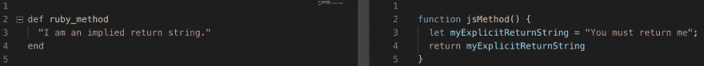
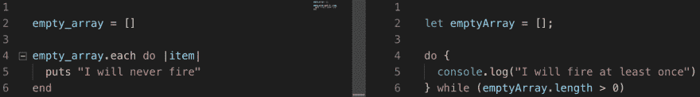
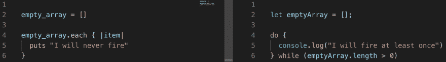
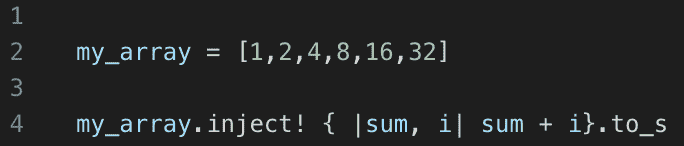
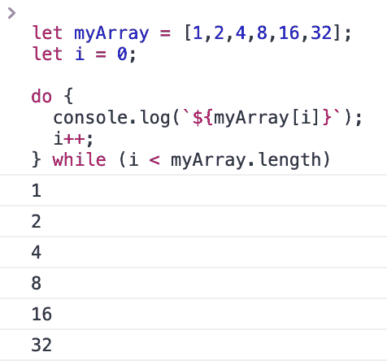
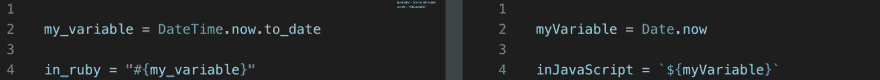
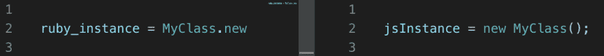
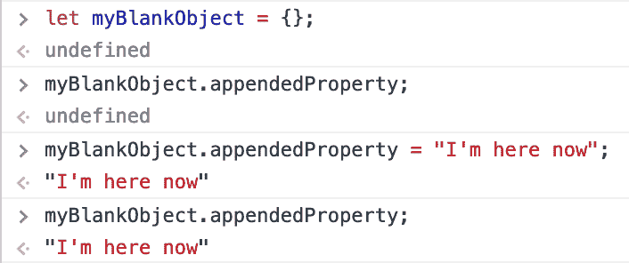

# JavaScript:ruby 爱好者入门

> 原文：<https://dev.to/allenwoods/javascript-a-primer-for-rubyists-3hep>

当我第一次在 [Flatiron](https://flatironschool.com/campuses/seattle/) 开始学习 Ruby 时，我带着我以前使用 JavaScript 的经验，希望能够缩小两种语法之间的差距。虽然理解编程基础的一些关键概念是有帮助的，但我很快发现自己处于一个非常陌生的隐含抽象领域，似乎与我以前所知道的一切都相反。

现在，我已经从 simple `do`和`def`的南岸跋涉了 6 周，一路到达 Rails 5 的北部高地，讽刺的是，我发现自己又一次踏上了熟悉的 JavaScript 领域。

在这里，我将努力从 Ruby 专家的角度描述 JavaScript 和 Ruby 语法之间的根本区别，并提供我在这两种语言之间切换时实现更好的思维灵活性的策略。

# 明确的暗示

从根本上说，Ruby 和 JavaScript 之间的主要区别在于 Ruby 被认为是“强类型的”，这意味着数据类型以非常特定的方式相互关联；虽然 JavaScript 被认为是“弱类型的”，这意味着数据类型更易变，可以以不太具体的方式相互关联。

Ruby 允许隐含的逻辑和显式的数据类型规则，而 JavaScript 需要显式的逻辑和更多隐含的数据类型规则。

规则集差异的一个很好的例子是 Ruby 如何将整数和浮点数视为独立的数据类型，它们必须进行转换才能相互作用，而 JavaScript 只是拥有可以是整数或浮点值的数字。

这显然意味着程序员在使用 JavaScript 时有了更多的自由，然而，当从 Rubyist 的背景中接受它时，同样的自由范围可能会产生意想不到的结果。

逻辑如何被区别对待的一个很好的例子是，除非在 JavaScript 中使用`return` bare word 显式返回一个值，否则函数有一个未定义的返回值。

这违背了 Ruby 习惯，Ruby 习惯在方法的最后一行使用隐含返回。但是在我学习编码的旅程中，如果有一件事已经变得很清楚，那就是重复产生知识，知识产生技能。换句话说，以标准化的方式做事有助于巩固概念。为此，我发现在我的最后一行上面使用一个注释`return`或者在 Ruby 的最后一行实际应用`return` bare word 有助于我在两种语言之间保持平衡。

# 做或不做，没有撬

JavaScript 中的`do`循环模拟的行为类似于 Ruby 中的`do`块，但它们有一个非常重要的区别。

*   Ruby 中的`do`块不会触发，如果它们的条件没有被满足，或者它们被传递到的迭代器至少不能触发一次。
*   在 JavaScript 中，`do`循环只有在执行完它们的代码后才评估它们的条件。

**这意味着 JavaScript 中的** `do` **循环总是至少触发一次，**如下图。

这两种语言之间`do`行为的差异是作为 Rubyist 导航 JavaScript 语法的第一个挑战。当我们用 JavaScript 编写代码时，我们在 Ruby 中开发的肌肉内存可以很容易地插入自己，甚至在它发生时我们都无法捕捉到它。幸运的是，我们可以在 Ruby 中使用一种策略来帮助最小化这种增长的痛苦。

### 卷发男生来救援了

有些情况仍然需要使用`do end`语法，比如将逻辑嵌入到`.erb`文件中。但是在大多数情况下，我发现开发跨语言肌肉记忆的最好方法是尽可能使用花括号在 Ruby 中传递块。

采用这种语法的另一个好处是，在遵循函数可读性的规则可以灵活地将逻辑写成单行的情况下，它为方法链接提供了可能性。

通过在组合中添加速记的`key: value`散列符号，在`do end`上使用花括号的情况得到了加强。当结合使用时，这些语法约定不仅适用于 JSON，也适用于 CSS，总体上创建了一个更加统一的 muscle 内存词汇表。

也许在适应最不受 very 爱好者欢迎的 JavaScript 时，最大的不同是缺少对类似于`binding.pry`或`byebug`的工具的原生支持。

虽然在 JavaScript 的上下文中，有针对这个问题的解决方案，如[本文](https://medium.com/@kevinyckim33/javascripts-equivalent-of-ruby-s-binding-pry-2cc895582943)作者[凯文·金](https://twitter.com/kevinyckim)所提到的，这些解决方案在功能上与`pry`同义，但是开发前端代码时出现的问题往往会在大多数时候在浏览器中表现得令人讨厌。

这些情况并不一定意味着给定的项目将在 NodeJS 上创建，或者在 Chrome 中测试时会出现给定的 bug。这意味着，尽管 NodeJS 或 Chrome 的开发者工具下有可用的工具，但有时这些工具可能并不适用。

输入我们的英雄:`console.log()`

### 总比不好，好

对`console.log()`如何工作的最简单的解释是，它是一个实用函数，将字符串参数的副本打印到浏览器的控制台窗口。通过使用模板文字将变量插入到字符串中，可以实现与`pry`类似的行为；尽管不是用户友好的。

**需要注意的是，根据调用** `console.log()` **的函数的范围，可能无法在控制台中呈现函数的输出。**

因此，最好知道如何使用`console.log()`，但是在决定如何开发项目的前端代码时，要考虑调试工具的可用性。

### 模板文字

幸运的是，将变量插入字符串的学习曲线要简单得多。语法几乎相同，如下所示。

有趣的事实:“反勾”字符的类型叫做“音调符号”,反勾字符本身的名字是“坟墓”。为了记住 JavaScript 中哪种类型的字符串引用允许插入，您可以使用心理联想:

> *“变量插值非常重要”*

# 反向实例化

从 Ruby 过渡到 JavaScript 最困难的一个方面是实例化一个类所涉及的肌肉内存。虽然我们总是用 Ruby 编写对`Class.new`的调用，但现在我们必须接受`new Class()`。这似乎是一个很小的差别，但是它对项目的流程有很大的影响。

因为我用 Ruby 编写的大多数类实例化现在都发生在 Rails 控制器内部，所以我发现在这两种语法之间实现标准化的一个策略是将我的`#new`动作完全抽象成一个`before_action`助手方法。这同时整理了我的代码，并允许我在心里将这两种情况概念化为独特的，避免了串扰。

# ES6 中的暴露狂

既然我们考虑了类是如何被实例化的，让我们后退一步，回顾一下像`before_action`这样的帮助方法是如何定义的。根据 Rails 惯例，这些方法在我们的控制器中的`private`裸字下面定义。这意味着在服务器请求期间创建控制器实例时，助手方法是该控制器实例的私有方法。JavaScript 的工作方式非常不同。

在撰写本文时，所有类实例的所有属性和方法在 JavaScript 中都是有效的(并且是本机的)公共的。

回到 JavaScript 暗示数据类型如何交互这一点，这种暗示的关系系统也扩展到了函数范围。通过利用 JavaScript 中函数作用域的工作方式，有可能实现与 Rails 中的`private` bare word 相同的行为，但是需要更多的工作和更高层次的理解。

目前，私有化类属性和方法的可用手段的复杂性超出了我的技能范围，这个主题是一个非常深的兔子洞，超出了本文的范围。关于这个过程的更多信息可以在[克里斯·费迪南迪](http://twitter.com/ChrisFerdinandi)的[这里](https://gomakethings.com/public-vs.-private-functions-in-javascript/)找到。

也就是说，与在 Ruby 中工作不同，在 JavaScript 中对数据进行操作并不总是对已经存在的数据进行操作，而是可以通过对数据存在的预期来创建数据，理解这一点很重要。

一个主要的例子是将一个值赋给一个不存在的对象属性，从而创建该值并将其附加到进程中的对象。

本文发表时，JavaScript 的最新标准仍然是 ES6。然而，该标准的下一个版本——目前称为 es next——预计将于 2019 年或之后不久发布。随之而来的是对私有类属性和方法的本地支持，这将消除使用闭包来隐藏类变量的必要性。

# 随它去吧

不幸的是，在这个足够大的房间里有一个语法差异的大象，无论任何语言的工作流程调整都无法隐藏它。这头大象是这两种语言之间陈述结构和裸词使用的不同方式。

本文的目的是从一个 Rubyist 的角度提供一些策略来减少用 JavaScript 编写时高层差异的影响。

由于关于你将会遇到的确切的句法差异的信息的广度，我推荐阅读 [Edozié Izegbu](https://twitter.com/edzye101) 的[这篇优秀的文章](https://medium.com/learning-to-code/ruby-vs-javascript-a-quick-comparison-ebd3b63ebc49)来更好地准备这些不可避免的症结。

# 结论

虽然我学习编码的旅程才刚刚开始，但我希望这些策略可以帮助指导或启发您开始标准化如何使用多种语言进行写作。