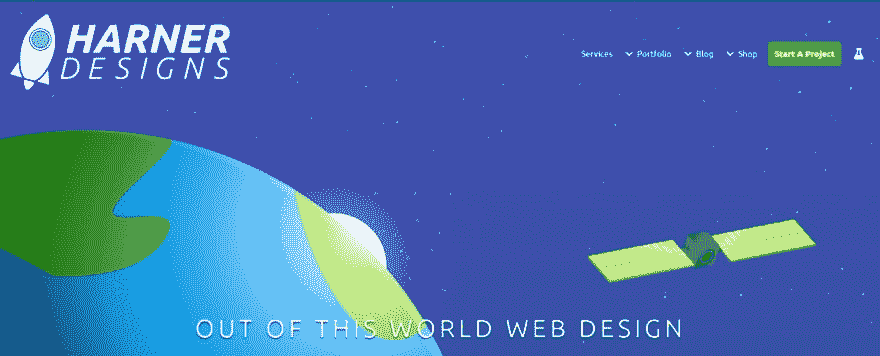

# 优化我的星星——PHP 生成的 SVG 与 Canvas

> 原文：<https://dev.to/jackharner/optimizing-my-stars--php-generated-svg-vs-canvas--3fle>

[](https://harnerdesigns.com/blog/optimizing-my-stars-php-generated-svg-vs-canvas/header/)

*最初发布于[HarnerDesigns.com](https://harnerdesigns.com/blog/optimizing-my-stars-php-generated-svg-vs-canvas/)T3】*

我喜欢太空。我是看着《星球大战》长大的，我仍然对 SpaceX 和 NASA 的工作着迷。用宇宙来设计我的投资组合是有意义的。显然，我需要一种在背景中有星星的方法。

我最初的想法是在 Illustrator 中创建一个大的星空背景，将其设置为`background-image`并完成它。最近我一直在使用 SVG，所以我决定用代码来代替。这个作品集是建立在 WordPress 上的，并且是从零开始开发的，所以我对 PHP 的能力了如指掌。

## PHP 生成的 SVG

```
 <?php $stars = 1000; ?>
    
      <g fill="#FFF" id="Stars">
        <?php while($stars > 0){
            $cx = mt_rand(0, 600);
            $cy = mt_rand(0, 600);
            $r = mt_rand(0,100) / 100;
            $o = mt_rand(0,100) / 100;
            echo '<circle cx="' . $cx . '" cy="' . $cy . '" r="' . $r .'" opacity ="'.$o.'"/>';
        $stars--;
        } ?>
      </g>
     
```

Enter fullscreen mode Exit fullscreen mode

只是一个简单的 While 循环，创建 1000 个不同的`<circle>`元素，具有不同的大小、位置和不透明度。工作起来很容易，但这种方法有几个问题。

### 创建了太多的 DOM 元素

这储存在一个`components/stars.php`文件中，当我需要星星时，我可以把它放在 WordPress 的`get_template_part('components/stars')`中。

我为了简单而开枪，结果打中了斯拉格西。

一次生成 1000 个 DOM 元素肯定对性能没有好处。Google 的 Lighthouse 测试表明“最佳点是树深度< 32 个元素，并且少于 60 个子/父元素”。肯定离 1000+差远了。

### 动画是不可能的

使用 SVG 制作星星的一个优点是能够轻松添加一些动画。让星星四处滑动来模拟太空飞行。在合理的范围内，SVG 在这方面很棒。强迫我的老式笔记本电脑以接近每秒 30 帧的速度在任何地方重新绘制 1000 个小圆圈是犯罪行为，可能违反了日内瓦公约。

## 帆布救驾！

```
 <canvas class="stars"></canvas> 
        var canvases = jQuery(".stars");

        canvases.each(function() {
            var ctx = jQuery(this)[0].getContext("2d");
            var mp = 1000;
            var particles = [];
            for (var i = 0; i < mp; i++) {
                particles.push({
                    x: Math.random() * W, //x-coordinate
                    y: Math.random() * H, //y-coordinate
                    r: Math.random() * 2, //radius
                    d: Math.random() * mp, //density
                    o: Math.random() - 0.5 //opacity
                });
            }

             function draw() {
                for (var i = 0; i < mp; i++) {
                    ctx.beginPath();
                    var p = particles[i];
                    ctx.fillStyle = "rgba(255,255,255," + p.o + ")";
                    ctx.moveTo(p.x, p.y);
                    ctx.arc(p.x, p.y, p.r + (p.x / jQuery(this).width()), 0, Math.PI * 2, true);
                    ctx.fill();
                }
            }
            draw();
        });
            // Wordpress makes you use `jQuery` instead of `$` 
```

Enter fullscreen mode Exit fullscreen mode

本质上和以前一样的循环，只是在画布上而不是在 DOM 中绘制元素。它目前生成一个粒子信息数组，然后循环遍历该数组来绘制星星。在我写这篇文章的时候，我想知道在绘制值的时候调用`math.random()`是否会更好。稍后可能会验证这一点。

## 总结

SVG 在很多方面都很棒。画很多星星不在其中。Canvas 更轻量级，不会阻塞 DOM，即使在旧设备上也能流畅地播放动画(在情理之中)。检查我的新的和改进的优化星在[哈纳设计](https://harnerdesigns.com)！(尽管如此，仍然需要实际制作它们的动画。)

## 最近的帖子

*   [免费账户的无限私人 GitHub 回购](https://harnerdesigns.com/blog/unlimited-private-github-repos-for-free-accounts/)
*   [big commerce 模板中的日期和时间具体通知](https://harnerdesigns.com/blog/date-time-specific-notices-in-bigcommerce-stencil/)
*   [WordPress 裁剪图像按钮变灰](https://harnerdesigns.com/blog/wordpress-crop-image-button-grayed-out/)