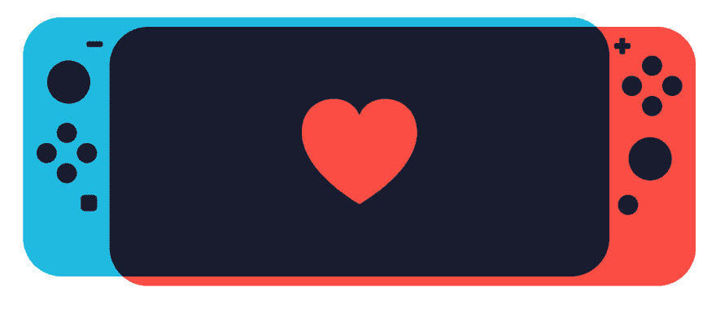
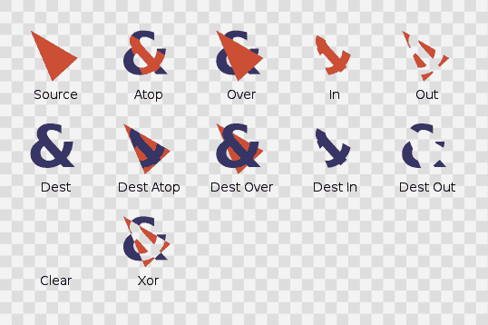
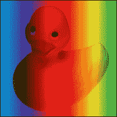
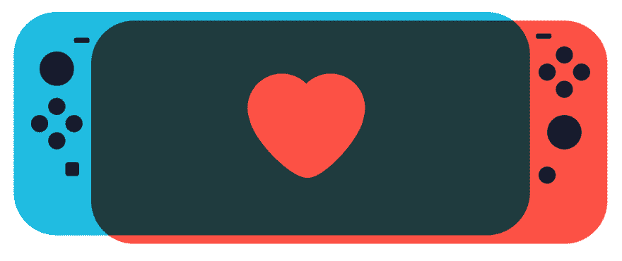

# 我如何开始阅读“混合-混合-模式”以及他们用它创造了什么

> 原文：<https://dev.to/wgao19/how-i-started-reading-mix-blend-mode-and-what-they-are-creating-with-it-pda>

我正在做这个由[路易·曼蒂亚](https://dribbble.com/mantia)设计的。乍一看，这个设计的所有特征似乎都很简单，除了靠近手持设备的交叉曲线。

我找到了交叉 div 的窍门。简单地说，我给了蓝色区域`overflow: hidden`，创建了一个额外的位于蓝色区域内部的 div，使其大小与红色区域相同，并使用精确的偏移量匹配位置。这让我微笑和自豪。

[https://codepen.io/wgao19/embed/vvZoQW?height=600&default-tab=result&embed-version=2](https://codepen.io/wgao19/embed/vvZoQW?height=600&default-tab=result&embed-version=2)

这里有一个解释 div 交集的代码笔。

[https://codepen.io/wgao19/embed/OqELEY?height=600&default-tab=result&embed-version=2](https://codepen.io/wgao19/embed/OqELEY?height=600&default-tab=result&embed-version=2)

但是我忍不住想知道:当浏览器呈现第二层时，不管是哪一层，它应该已经知道第一层了。那么，对于浏览器来说，对它下一步渲染的新图层进行某种计算，并产生某种混合效果不是很容易吗？

几个搜索让我来到了第一级的[合成和混合中指定的`mix-blend-mode`。这组规范定义了如何将形状和图像组合成一个图像。](https://drafts.fxtf.org/compositing-1/#canvascompositingandblending)

## 阅读说明书

[合成和混合](https://drafts.fxtf.org/compositing-1)准确描述了当它们堆叠在一起时如何产生最终的图形。“合成和混合”是一个单一的步骤(而不是两个步骤)。[最后一步，经过*过滤*、*裁剪*、*蒙版*](https://drafts.fxtf.org/compositing-1/#compositingandblendingorder) 。

构图使用波特达夫构图方法，给定两个图形——一个源和一个目的地——指定 12 种不同的模式来组合它们。

波特-达夫算子，图像归功于[http://ssp.impulsetrain.com/porterduff.html](http://ssp.impulsetrain.com/porterduff.html)

*，然后让你指定一个函数，在这个过程中计算最终的颜色。*

 *specs 很好地解释了整个过程，包括每种混合模式的直观感受，并给出了一个图形示例，其中浴缸中的黄色鸭子与彩虹混合。即使我的大学数学几乎都还给了我的教授，我也能通过观察推断出一些结论。我觉得这张规格图比这张 [*详细描述的堆叠背景*](https://www.w3.org/TR/CSS2/zindex.html) 更容易理解，哈哈。

它用一个例子解释了“乘”在混合中的含义:

> 源颜色乘以目标颜色，并替换目标颜色。
> 合成颜色总是至少与源颜色或目标颜色一样暗。将任何颜色与黑色相乘都会得到黑色。将任何颜色与白色相乘都会保留原始颜色。

[这里的](https://codepen.io/careecodes/pen/AXPaWY)是将所有的混合模式置为 select 的笔，在不同的输入颜色上显示视觉效果。

[https://codepen.io/careecodes/embed/AXPaWY?height=600&default-tab=result&embed-version=2](https://codepen.io/careecodes/embed/AXPaWY?height=600&default-tab=result&embed-version=2)

### 极限值

**受(相当差)[浏览器兼容性](https://caniuse.com/#search=mix-blend-mode)**

**产生的颜色受两个颜色输入的有限函数影响**

回到我开始的例子，用`mix-blend-mode`并不能很容易地产生精确的效果，你明白为什么了吗？

限制是，产生的颜色必须是通过获取源颜色和背景颜色计算的混合函数的输出。如果你想要一个不依赖于那些输入颜色的任意颜色，你不能简单地通过选择一个`mix-blend-mode`来得到它。

任天堂 Switch 的设计碰巧只使用了十字路口的概念。上面这张图片是我用`multiply`得到的最接近的。遗憾的是，原始设计中那种非常漂亮的深蓝色无法通过混合模式实现。

**性能**

我还没有找到一种方法来衡量这种性能。但我注意到 Chrome 几乎总是在混合前闪烁两个单独的层，有时是一个接一个。随着一些更复杂的混合，我的笔记本电脑开始轰鸣。

## 他们在用什么创造`mix-blend-mode`

为了了解设计者和开发者是如何使用`mix-blend-mode`的，我在 CodePen 中做了[搜索。我发现了许多漂亮的设计，为了便于参考，我将它们分成几类。但是请不要让他们限制了你的创造力。](https://codepen.io/search/pens?q=mix-blend-mode&page=1&order=popularity&depth=everything)

### 图像+单色文本创建蒙版效果/挖空文本

看看这个一行的图像遮罩方式，duos， [CodePen: Knockout Text](https://codepen.io/thebabydino/pen/qONMLv) :

[https://codepen.io/thebabydino/embed/qONMLv?height=600&default-tab=result&embed-version=2](https://codepen.io/thebabydino/embed/qONMLv?height=600&default-tab=result&embed-version=2)

[CodePen:带有 CSS 混合模式的挖空文本](https://codepen.io/stacy/pen/gLmQPY)

[https://codepen.io/stacy/embed/gLmQPY?height=600&default-tab=result&embed-version=2](https://codepen.io/stacy/embed/gLmQPY?height=600&default-tab=result&embed-version=2)

### 带`mix-blend-mode: screen`的 RGB，给人一种明亮的感觉

下一个出现的是一个可爱的蠢萌* *那些字母滚来滚去*。*我找不到更好的词。抱歉，不会说中文的人😂

[CodePen:字母混合混合模式](https://codepen.io/electerious/pen/pbBoqm)，[dribble Design:A](https://dribbble.com/shots/2903238-A)

[https://codepen.io/electerious/embed/pbBoqm?height=600&default-tab=result&embed-version=2](https://codepen.io/electerious/embed/pbBoqm?height=600&default-tab=result&embed-version=2)

[安卓牛轧糖更新动画](https://codepen.io/stevn/pen/kXyKjQ)

[https://codepen.io/stevn/embed/kXyKjQ?height=600&default-tab=result&embed-version=2](https://codepen.io/stevn/embed/kXyKjQ?height=600&default-tab=result&embed-version=2)

### 利用构图创造有趣的 UX，否则很难实现

接下来，我发现这种互动，如果没有`mix-blend-mode`的知识，将是如何创造的一个谜。JavaScript？

[CodePen: CSS 混合-混合-模式-黑/白文本-带有伪元素](https://codepen.io/maddesigns/pen/dpGVGw)

[https://codepen.io/maddesigns/embed/dpGVGw?height=600&default-tab=result&embed-version=2](https://codepen.io/maddesigns/embed/dpGVGw?height=600&default-tab=result&embed-version=2)

### 排版设计

[瑞士 css 卡](https://codepen.io/keukenrolletje/pen/YqdowX)

[https://codepen.io/keukenrolletje/embed/YqdowX?height=600&default-tab=result&embed-version=2](https://codepen.io/keukenrolletje/embed/YqdowX?height=600&default-tab=result&embed-version=2)

[CodePen:报价页面](https://codepen.io/hollyos/pen/yzPrMo)

这个有趣的设计使用叠加让背景色调覆盖文本颜色。

[https://codepen.io/hollyos/embed/yzPrMo?height=600&default-tab=result&embed-version=2](https://codepen.io/hollyos/embed/yzPrMo?height=600&default-tab=result&embed-version=2)

我已经为一些有趣的设计实现创建了一个 [CodePen Collection](https://codepen.io/collection/DkwvRw/) ，因为我想成为开发者和设计师的堂吉诃德:]

## 链接

*   [合成和混合级别 1](https://drafts.fxtf.org/compositing-1/)
*   波特达夫
*   [caniuse `mix-blend-mode`](https://caniuse.com/#search=mix-blend-mode)
*   [码笔搜索`mix-blend-mode`](https://codepen.io/search/pens?q=mix-blend-mode&page=1&order=popularity&depth=everything)*