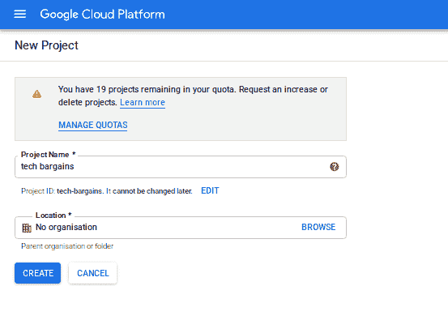
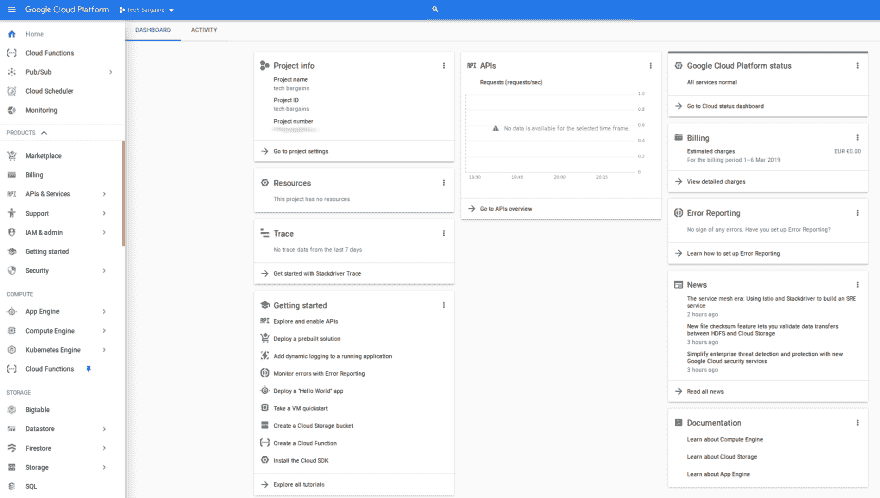
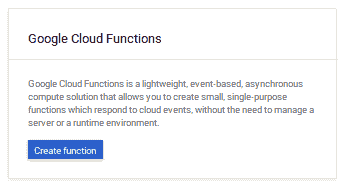
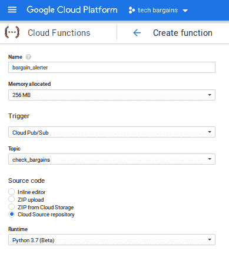
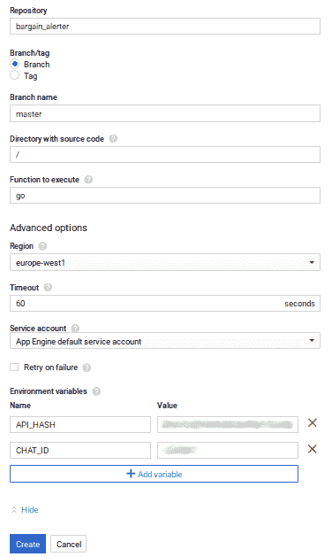
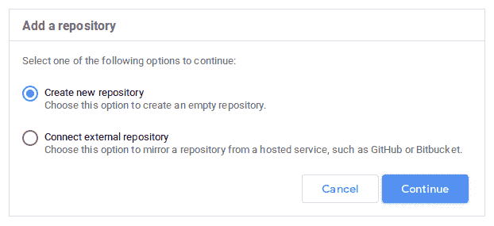
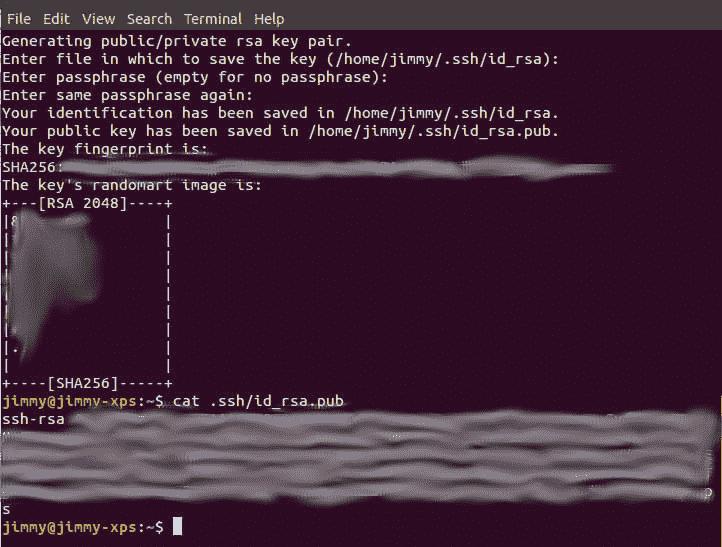
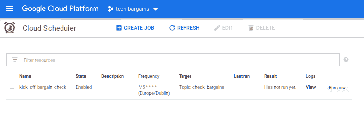

# Google Cloud 上的简单应用从头开始运行

> 原文：<https://dev.to/jamesmwhite/simple-app-on-google-cloud-functions-from-scratch-5c43>

## 要求

*   所需软件:python 3.7.x，pip3，git，ssh-keygen
*   时间:30 分钟
*   账户:
    *   用于信息传递的电报
    *   谷歌云免费层，需要信用卡:(
*   成本:0.00

## 为什么？

我想通过构建一个简单但有用的应用程序来学习如何使用谷歌云功能。

## 步骤

### 1。创建一个谷歌云账户

所以不幸的是，就像 AWS 一样，你需要一张信用卡来注册。目前，谷歌提供第一年 300 美元的信贷，但我们不想花任何信贷。

### 2。创建新项目

创建一个新项目并给它命名，这个项目将包含所有使用的云组件。

[](https://res.cloudinary.com/practicaldev/image/fetch/s--VjjzU1IZ--/c_limit%2Cf_auto%2Cfl_progressive%2Cq_auto%2Cw_880/https://thepracticaldev.s3.amazonaws.com/i/kpg0yjyb0xwpbm60znsk.png)
[T6】](https://res.cloudinary.com/practicaldev/image/fetch/s--RcdKFsgi--/c_limit%2Cf_auto%2Cfl_progressive%2Cq_auto%2Cw_880/https://thepracticaldev.s3.amazonaws.com/i/5oi7t0w5b8ryaqvhndlf.png)

### 3。云函数

这是定期执行的无服务器功能。云函数支持各种语言，我们将使用 python 3.7，它目前处于测试阶段，但不是谷歌的一切吗？；)

[](https://res.cloudinary.com/practicaldev/image/fetch/s--M7xEE-YR--/c_limit%2Cf_auto%2Cfl_progressive%2Cq_auto%2Cw_880/https://thepracticaldev.s3.amazonaws.com/i/dvmugngaene6300pptxi.png) 
使用下图中的设置...

[](https://res.cloudinary.com/practicaldev/image/fetch/s--GvWmm9AC--/c_limit%2Cf_auto%2Cfl_progressive%2Cq_auto%2Cw_880/https://thepracticaldev.s3.amazonaws.com/i/c7t5bfr35g2uul623ohf.png) 
使用下面截图中的设置，有些你可能希望更改:

*   存储库名称:使用您创建的存储库的名称
*   要执行的函数:要执行的 python 函数的名称
*   区域:选择最适合您的用例的区域
*   环境变量:添加尽可能多的 env 变量，选择合适的变量存储在这里。注意:在这个例子中，2 个秘密被存储为环境变量，以将它们从源代码中删除，更好的做法是使用谷歌 KMS 加密秘密并将其存储在云存储中，但这超出了本文的范围。

[](https://res.cloudinary.com/practicaldev/image/fetch/s--g4XGmlGH--/c_limit%2Cf_auto%2Cfl_progressive%2Cq_auto%2Cw_880/https://thepracticaldev.s3.amazonaws.com/i/djzp1rxbrr7byus8plli.png)

选择*创建*，功能将被创建，这可能需要几分钟时间，因为存储库被解析并验证与配置匹配，任何问题都将显示出来，并且必须在功能激活之前解决。

### 4。源回购

导航到左侧菜单工具部分下的*源库*。
选择*添加存储库*
选择*创建新存储库*并给它一个合适的名字。
[](https://res.cloudinary.com/practicaldev/image/fetch/s--ujCNRbhg--/c_limit%2Cf_auto%2Cfl_progressive%2Cq_auto%2Cw_880/https://thepracticaldev.s3.amazonaws.com/i/54parroianjizjzxjw0y.png) 
现在，您需要在本地克隆存储库，这样您就可以修改它并将更改推回。
如果您有 ssh 密钥，请跳过下一步，否则...
Linux:键入`ssh-keygen`并填写所需的详细信息

[](https://res.cloudinary.com/practicaldev/image/fetch/s--2SUBGU7y--/c_limit%2Cf_auto%2Cfl_progressive%2Cq_auto%2Cw_880/https://thepracticaldev.s3.amazonaws.com/i/iidkrd5b9hu5ed1av17n.png)

您的新密钥对将会在您指定的目录中，`.pub`文件将会上传到 Google。

注册密钥的时间到了，选择*注册 SSH 密钥*选项，并确保使用您的公钥，通常可以在这里找到:`~/.ssh/id_rsa.pub`

现在，使用所示命令克隆 repo:`git clone ....`

### 5。简单的源代码

代码非常简单，它在执行时做以下事情:

1.  下载 rss 并解析
2.  通过电报发送新的交易

```
import os, json, base64
from calendar import timegm
from datetime import datetime
import requests
import feedparser 

MINS_DIFF = 5
SLICKDEALS = 'https://slickdeals.net/newsearch.php?mode=frontpage&searcharea=deals&searchin=first&rss=1'

def go(event, context):
    num_deals_found = check_slick_deals()
    print(f'Found {num_deals_found} deals')

def check_slick_deals():
    items_found = 0
    try:
        NewsFeed = feedparser.parse(SLICKDEALS)
        for entry in NewsFeed.entries:
            publish_date = entry['published_parsed']
            # use appropriate timezone here 
            dt = datetime.fromtimestamp(timegm(publish_date)) 
            nownow = datetime.utcnow()
            mins_diff = abs((nownow - dt).total_seconds()) / 60
            if mins_diff < MINS_DIFF:
                items_found = items_found + 1
                send_message(f"{entry['title']} {entry['link']}")
    except Exception as e:
        print(f'Error parsing newsfeed: {e}')
    return items_found

def send_message(message):
    api_hash = os.environ.get('API_HASH', None)
    chat_id = os.environ.get('CHAT_ID', None)
    if api_hash is None or chat_id is None:
        print('Please set API_HASH and CHAT_ID env variables')
        return        
    api_url = f'https://api.telegram.org/bot{api_hash}'
    payload = {}
    payload['chat_id'] = chat_id
    payload['text'] = message
    r = requests.post(f'{api_url}/sendMessage', data=payload)

if __name__== "__main__":
    go(None, None) 
```

确保调用文件`main.py`并添加相应的`requirements.txt`，使用以下命令将它们推送到 git repo:

```
git add main.py requirements.txt
git commit -m 'adding initial files'
git push 
```

现在代码就在仓库里，准备由云函数执行。

### 6。云计划

我们现在有:

*   源代码在云回购中，随时可以被功能克隆
*   触发时执行源代码的云函数
*   收到消息时将触发源的发布订阅主题

我们只需要一些东西来添加消息和启动功能，云调度程序是完美的。

首先决定您希望函数执行的时间表。我选择每 5 分钟一次，这个 cron 是`*/5 * * * *`[。https://crontab.guru/](https://crontab.guru/)是一个很棒的网站，可以帮助创建准确的 cron 配置。

完成后，它应该看起来像这样:

[](https://res.cloudinary.com/practicaldev/image/fetch/s--V_HXhava--/c_limit%2Cf_auto%2Cfl_progressive%2Cq_auto%2Cw_880/https://thepracticaldev.s3.amazonaws.com/i/ihnyd6b8p9bur9n1bfka.png)

### 7。搞定了。

恭喜你，你的新应用程序生活在云中，处于休眠状态，直到一个计划将它从睡眠中唤醒。

一旦你创建了你的第一个无服务器应用程序，想想还有什么是可能的，这是令人兴奋的，请让我知道你创造了什么，我也会这样做:)