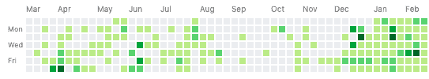
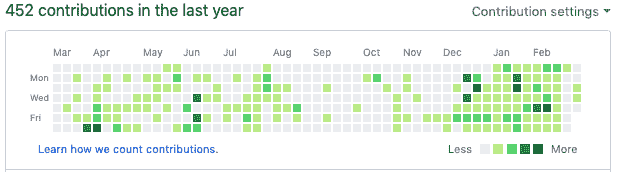

# #100DaysofCode 值不值？🤔

> 原文：<https://dev.to/xenoxdev/100daysofcode-worth-it-or-not--1dh8>

如果你使用 Twitter，你一定见过这个#100daysofcode 不时出现在你的 feed 中。我经常看到它，但从来没有尝试过。然而今年，我给自己做了一个承诺，那就是在 12 个月内做 12 个产品。对一些人来说可能听起来很奇怪，但是到目前为止它对我来说非常有效。

到目前为止，我们已经在 ProductHunt 上成功推出了 [2 款产品](https://www.producthunt.com/@sarthaksharma0/made)，完成了第三款产品的制作，第四款也已经开始工作。但挑战尚未完成；事实上远非如此。这只会让我更加兴奋。我很清楚这将是一个多么大的挑战，所以我做的第一件事就是几乎每天都开始工作，我对 GitHub 的贡献看起来就像这样:

当我上个月在台湾参加一些聚会时，有人问我是否在关注#100daysofcode 挑战。我说没有，但还是让我停下来想:“等等，我有吗？”因为我已经连续编码超过 45 天了。虽然我在度假，但在我的潜意识里，这个想法有点根深蒂固，我开始强迫自己每天至少在 GitHub 上提交一次。

我的推理是，既然我已经做了将近 50 天，为什么不把它正式化，一直做到 100 天呢？所以我继续每天提交，即使它只是 CSS 中的一个小变化。我很快开始感受到压力，很快意识到这不是我做事最有效率的方式。很多时候，我觉得我没有足够的时间去思考新的想法或做一些新的事情。所以我退出了，但这次经历让我意识到，很多人肯定和我有同样的感受。我问我那些已经完成挑战的开发人员朋友，他们是如何做到的。有些人说这很容易，因为他们每天都要为工作编码，所以每周有 5 天，他们只需要在周末编码。一些人实际上试图通过在私有回购上进行无意义的提交来欺骗系统，一个人甚至使用工具来生成虚假的 git 提交。

这一切让我意识到#100daysofcode 的一件事:

> “不是继续，都是开始。”

100 天的代码是一个挑战，就像所有这种性质的挑战一样(想想 NaNoWriMo，100DaysofDesign 等等。)，它的目的是点燃你体内的火。#100daysofcode 在初学者中很受欢迎，它是为了激励他们开始编写他们的第一行代码。作为一名前教师，我知道这样一个事实，即初学者经常花大部分时间观看视频，阅读文章，消化他们几个月甚至几年都不会用到的知识，而不是通过编写一些真正的代码来实际实现他们所学的知识。这一挑战激励他们这样做。

但是记住，你没必要完成它。如果你真的开始了，你就已经赢了。这个挑战的重点不是为了完成它而完成它，而是培养一个定期写代码的好习惯。你必须明白，这不是给那些阅读你的推文或浏览你的 Github 个人资料的人看的。这是给你的，只给你。所以不要欺骗系统，因为有时候失败也没什么。至少你体面地开始和失败了。

* * *

 
坐在**九份附近的悬崖上，想着这一切，⁨Taiwan⁩** 在第五十四天，我决定退出。我是说#100daysofcode，不是我的生活。😃

相反，我选择享受在台湾的最后几天。我去了东海岸附近的绿岛，这是我一生中最好的决定。我从未如此靠近过大海，所以这让我兴奋不已。绿岛是绝对华丽的-只要看看下面的照片-我希望不久的某一天我能再次看到它！

但在无忧无虑地旅行了几天后，一天晚上，我敢于打开我的笔记本电脑，重温一个老项目。在浏览它的节点模块文件夹时，我注意到了一些我以前没有注意到的东西。就这样，我为我的下一个产品找到了一个想法，这实际上是我目前正在开发的第四个产品。它叫做 **Moddoc** ，是一个开发者的工具。(我很快会分享更多细节！)

#### 结论

很简单，伙计们。不要把自己逼到压力让你看不到大局的地步。如果压力越来越大，100 天代码只会让你效率更低。所以，当压力达到峰值时，带上你的车，上路，休息一下。

记住，**忙！=高效**。

即使你做不到 100 天的代码，做 50 天或者 20 天，甚至一周。开始吧。这才是最重要的，开始。

* * *

非常感谢，朋友们。希望你喜欢我的文章，如果你喜欢，别忘了看看我的其他文章。
如果你有一个和#100daysofcode 相关的很酷的故事，请在下面的评论区分享。如果你没有，你和我一起在这里开始你自己的旅程怎么样？我总是渴望合作。😊

