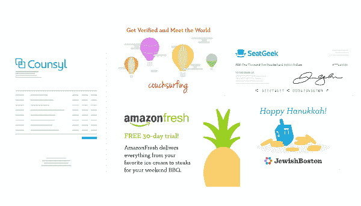
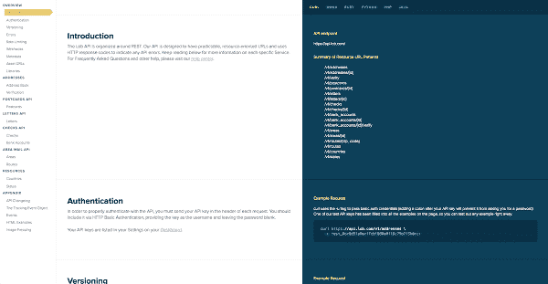
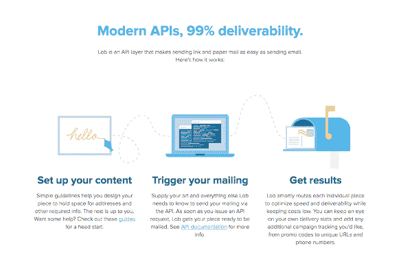
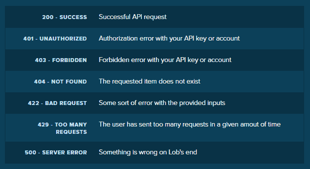

# 使用 PHP - 2022 使用 LOB REST API 通过邮政邮件发送明信片、信件和支票的教程

> 原文：<https://dev.to/mega6382/tutorial-on-sending-postcards-letters-and-checks-by-postal-mail-using-lob-rest-api-using-php-47p8>

### 什么是 Lob？

### 为什么要用 Lob？

### 服务

### 为什么要用 Lob？

### 程序员友好

### 集成支持

### 结论

### 什么是 Lob？

[Lob](http://synd.co/2iIU504) 是一家由风险投资支持的初创公司，总部位于加利福尼亚州旧金山，拥有超过 6000 家客户，包括亚马逊、Square 和 Counsyl。

他们提供基于云的打印和邮寄解决方案。以提供比构建内部打印解决方案更实惠、更简单的服务为使命。

Lob 是为开发人员构建的，为他们提供工具来构建强大的应用程序，并帮助他们的公司扩展物理邮件。

Lob 的计划是消除直接邮寄的复杂性，并为您提供一个更具创新性的系统，在该系统中，您可以轻松跟踪您的邮件，联系您的客户，而不必处理卡纸或去邮局的障碍。

[](https://res.cloudinary.com/practicaldev/image/fetch/s--R4Dpyjqh--/c_limit%2Cf_auto%2Cfl_progressive%2Cq_auto%2Cw_880/https://cdn-images-1.medium.com/max/600/0%2ABo4KDikzK-b-S6IF.png)

### 为什么要用 Lob？

Lob 的客户群包括 6000 多家公司，从财富 500 强公司(如亚马逊)到初创公司和个人开发者。如果您的系统中集成了 Lob，您就可以专注于您的客户，而不必处理打印和邮寄的麻烦。

[](https://res.cloudinary.com/practicaldev/image/fetch/s--4yYiK8Wx--/c_limit%2Cf_auto%2Cfl_progressive%2Cq_auto%2Cw_880/https://cdn-images-1.medium.com/max/600/0%2AI8l26v93kXEBIhnY.png)

Lob 基于按需付费模式。所以，你可以很容易地一次发送 1 封邮件或 100 万封邮件。

实体邮件比电子邮件有更高的打开率。你现在可能看不到，但是现在越来越多的创业公司开始将实体邮件作为他们的主要营销方式。

Epsilon 的一项调查结果显示，“每 1000 名现有客户收到一封直邮邮件，平均会有 34 人回复。对于电子邮件，平均回复率为 0.12%。”

现在，如果您打算采用物理邮件作为您的营销方法，还有什么比 Lob 更好的方法呢？Lob 是一种简单、丰富且价格合理的打印/邮寄解决方案。

### 服务

Lob 提供多种服务，帮助您发展业务，更好地接触客户。以下是 Lob 提供的主要服务。

### 明信片

通过使用 Lob API，您可以轻松地设计一个完全可定制的 HTML 明信片模板。然后，您可以发送定制的明信片，用于测试模板或用户采取的任何特定操作或您定义的特定事件。或者重新激活复发的用户。

### 字母

向您的用户发送信件，就像发送电子邮件一样简单。您可以按需生成每封电子邮件。您可以轻松地为您定义的事件或用户采取的操作自定义信函。

你可以安全快捷地寄信。您可以使用 Lob API 准确地发送每个文档，方法是确保每个文档仅供预期接收人查看。

### 检查

有了 Lob，您可以交付支票，并对支持、徽标、发票信息、说明和备忘录等进行各种定制，以尽可能清晰地进行支付。

现在，对于发送支票，安全性是必须具备的，没有人能提供比 Lob 更安全的交付系统。

借助 Lob API，每张支票都配有彩色背景、水印、微印边框、摩擦时会消失的热敏墨水和磁性墨水字符识别(MICR)编码，以方便银行处理并减少错误。

同样重要的是，通过在整个邮寄过程中跟踪支票的进度，您可以确保支票得到交付。

### 简单区域邮件

使用 Lob API，您可以轻松地用明信片定位整个邮政编码。这项服务尤其有利于初创企业，让未来的客户知道他们的存在。

借助 Lob API，您可以轻松获得基于邮政编码的人口统计数据，从而使您的活动更具体地针对年龄、收入以及住宅与商业划分。你可以做到这一切，而不必支付任何安装费，你只需支付你发送的内容。

### 地址验证

通过使用 Lob API，您可以轻松地立即验证邮寄地址，您还可以标准化地址，以帮助确保您的邮件到达所需的收件人。API 使用直接来自 USPS 的数据来纠正缺失的信息。最重要的是，所有国内地址都是免费的，国际地址也很便宜。

Couchsurfing 是一个充满活力的旅游社区，它使用 Lob 来自动化一切，从确保用户提供可交付的地址到按需结束地址验证明信片。

### 易于使用

Lob API 非常易于使用，为您提供了强大且可伸缩的邮件解决方案。Lob 使得发送物理邮件像发送电子邮件一样简单。

你可以很容易地跟踪你所有的邮件。您可以针对特定地区和人口统计数据开展活动。Lob 的 API 服务与 Sendgrid 或 Twilio 非常相似。Lob API 消除了发送邮件的所有痛苦，并且可以与许多内部应用程序集成。

### 程序员友好

Lob API 对程序员非常友好，它为多种编程语言提供了预构建的包装器，如 Java、PHP、Node、Python 和 Ruby。它还为所有这些包装器提供了[文档，以及示例代码](http://synd.co/2iIQO0T)。

[](https://res.cloudinary.com/practicaldev/image/fetch/s--ec3fbVpy--/c_limit%2Cf_auto%2Cfl_progressive%2Cq_auto%2Cw_880/https://cdn-images-1.medium.com/max/600/0%2AdWNZ2Een-c4yXzNh.png)

完整的[文档也可用于原始 API 请求](http://synd.co/2hwKkUP)。但是这里我们将讨论 PHP 包装器。您可以使用 composer 轻松安装 PHP 包装器，也可以直接从 Github 获得。

[](https://res.cloudinary.com/practicaldev/image/fetch/s--tB6Xy-Q1--/c_limit%2Cf_auto%2Cfl_progressive%2Cq_auto%2Cw_880/https://cdn-images-1.medium.com/max/600/0%2ANzuDtduupqsL6jKW.png)

现在，首先必须对所有请求进行身份验证，为了正确地对 Lob API 进行身份验证，应该在每个请求中发送 API 密钥。下面是一个如何使用授权启动包装器的例子:

```
$apiKey = 'test_0dc8d51e0acffcb1880e0f19c79b2f5b0cc';
    $lob = new \Lob\Lob($apiKey); 
```

Enter fullscreen mode Exit fullscreen mode

如您所见，使用 PHP 包装器非常简单和容易。

### 错误

以下是错误列表 HTTP 响应代码错误及其含义:

[](https://res.cloudinary.com/practicaldev/image/fetch/s--qQYCnoaF--/c_limit%2Cf_auto%2Cfl_progressive%2Cq_auto%2Cw_880/https://cdn-images-1.medium.com/max/634/0%2AhoyPHMHzSXzU51RF.png)

一般来说，2xx 表示成功，4xx 表示输入错误，5xx 表示 Lob 端出错。

### 网页挂钩

Webhooks 是一个非常好的功能，可以跟踪基于事件的通知，比如每当事件被触发时，Lob 会立即将该事件发送到 Lob 仪表板上为该事件指定的任何 URL。

但是首先您必须确保您订阅了环境中的事件(测试或现场)。

### 元数据

当向 Lob 的 API 发送请求时，可以附加元数据，这样以后就可以很容易地过滤掉请求。下面是如何将元数据附加到请求的示例:

```
$lob->postcards()->create(array(
        'description' => 'Demo Postcard job',
        'metadata[campaign]' => 'NEWYORK2015',
        'to' => 'adr_78c304d54912c502',
        'from' => 'adr_61a0865c8c573139',
        'front' => '<html style="margin: 130px; font-size: 50;">Front HTML for {{name}}</html>',
        'back' => '<html style="margin: 130px; font-size: 50;">Back HTML</html>',
        'data[name]' => 'Harry'
    )); 
```

Enter fullscreen mode Exit fullscreen mode

如您所见，上述请求包含带有关键字“campaign”的元数据。现在，要过滤掉包含特定元数据的请求，您需要这样做:

```
$lob->postcards()->all(array(
        'metadata[campaign]' => 'NEWYORK2015',
        'limit' => 2,
        'offset' => 0
    )); 
```

Enter fullscreen mode Exit fullscreen mode

### 用法

下面是使用 Lob API PHP 包装器验证邮寄地址的示例代码:

```
$lob->addresses()->verify(array(
        'address_line1' => '185 Berry Street',
        'address_city' => 'San Francisco',
        'address_state' => 'CA',
        'address_zip' => '94107'
    )); 
```

Enter fullscreen mode Exit fullscreen mode

下面是另一个代码示例，展示了如何使用 Lob API PHP 包装器设计明信片:

```
$lob->postcards()->create(array(
        'description' => 'Demo Postcard job',
        'to' => 'adr_78c304d54912c502',
        'from' => 'adr_61a0865c8c573139',
        'front' => '<html style="padding: 1in; font-size: 50;">Front HTML for {{name}}</html>',
        'back' => '<html style="padding: 1in; font-size: 20;">Back HTML for {{name}}</html>',
        'data[name]' => 'Harry'
    )); 
```

Enter fullscreen mode Exit fullscreen mode

数组关键字“to”和“from”的值是可以从 API 获得的地址 id。

您可以从这个简单的请求中获得一个地址列表:

```
$lob->addresses()->all(array(
        'limit' => 2,
        'offset' => 1
    )); 
```

Enter fullscreen mode Exit fullscreen mode

上述请求将带来所有与地址相关的数据，包括地址 ID。您可以在这个请求中使用元数据来获得更具体的结果。

Lob 的 API 还提供了一些其他资源，例如:

```
$lob->countries()->all(); 
```

Enter fullscreen mode Exit fullscreen mode

通过使用这个请求，您可以获得所有国家的列表，稍后您可以使用它来添加地址等..

现在，通过查看上面的代码示例，您可以清楚地看到，使用这个 API 是多么容易。

### 跟踪邮件

有了 Lob 的 API，你可以一路跟踪你的邮件。您可以轻松地监控您的明信片、信件、支票和文件到达预定收件人的途中。

您可以通过跟踪事件或添加独特的促销代码、URL 或电话号码来保持跟踪。您可以使用 webhooks 通过实时跟踪事件和 PDF 证明来跟踪您的邮件。

下面是每个扫描事件标签和描述的明细:

### 在途

邮件正在入境/始发设施进行处理。

### 在局部地区

邮件正在目的地工厂进行处理。

### 已处理发货

邮件已被批准在收件人最近的邮政机构投递。邮件应在此扫描事件后的 1 到 2 个工作日内到达邮箱。

### 改道

由于收件人地址变更、地址错误或 USPS 重新标记条形码/ID 标签区域，邮件被重新发送。

### 退回给寄件人

由于条形码、ID 标签区域或地址错误，邮件被退回给发件人。

### 集成支持

各种包装器可用于将 Lob API 集成到您的应用程序中，包括 PHP。如果您想要使用另一种语言，并且该语言没有可用的包装器，您可以轻松地为您的应用程序创建自定义 SDK。

Lob 还通过其集成合作伙伴提供集成，这些合作伙伴提供自己的各种服务。如果您在他们的网站上有一个帐户，您可以使用 API 键将这些帐户与您在 Lob 上的帐户集成。

Lob 也有一些合作伙伴应用程序，提供由 Lob 支持的直邮解决方案。您可以通过访问 Lob 网站上的集成页面，在应用程序上开始使用这些功能。

### 结论

[Lob](http://synd.co/2iIU504) 提供了几项有趣的服务，它们与众不同，因为它们在网络世界和必须在现实世界提供的服务之间架起了一座桥梁，比如通过邮政邮件递送的印刷邮件。

我希望这篇文章是一个好的开始，让你可以基于你还不知道的可以使用 REST APIs 实现的服务创建非常有趣的应用程序。

如果您喜欢这篇文章，请与其他开发人员同事分享。如果你有问题，请在下面发表评论。