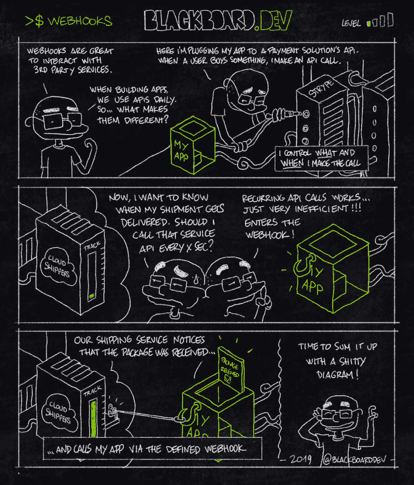
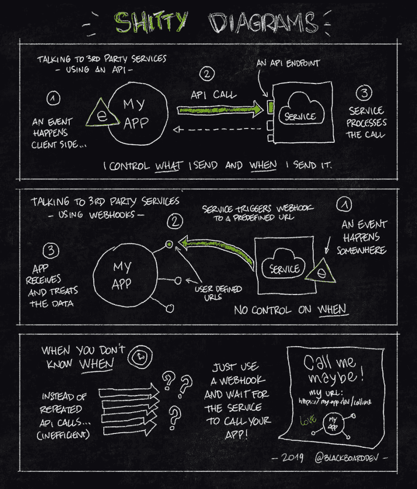

# 什么是网钩？

> 原文：<https://dev.to/blackboarddev/whats-a-webhook-2dlh>

Woot *(自动祝贺)*，我第一个发布的开发者🎉！！！
使用 **BlackboardDev** 的目的是以一种有趣且易于掌握的方式解释技术概念——*从简单到更高级*。

让我们从简单的 webhooks 开始吧！

感谢阅读！随意留下评论和建议(格式，主题，任何东西)

干杯，
BlackboardDev