# AWS: RDS 日志，导出到 CloudWatch 日志和 CloudFormation 模板

> 原文：<https://dev.to/setevoy/aws-rds-logs-export-to-the-cloudwatch-logs-and-cloudformation-template-5f9b>

[](https://res.cloudinary.com/practicaldev/image/fetch/s--eCoKOfdn--/c_limit%2Cf_auto%2Cfl_progressive%2Cq_auto%2Cw_880/https://rtfm.co.ua/wp-content/uploads/2014/11/aws-logo-square-02-e1417012834176.png) 我们有一堆与 MariaDB 的 AWS RDS。

后端开发人员要求我启用慢速请求日志，这样他们就可以调试他们的应用程序。

因此，任务是:启用 AWS RDS 日志记录，并配置导出到 CloudWatch 日志以供进一步分析。

和其他事情一样，我们的 RDS 实例是通过 CloudFormation 模板配置的，所以也将添加一些例子。

除了标准的一般/错误/慢速日志——还有 MariaDB 的审计插件来启用审计日志，但这是另一篇文章的主题。你可以在这里> > > 查看它的文档[。](https://docs.aws.amazon.com/AmazonRDS/latest/UserGuide/Appendix.MariaDB.Options.html#Appendix.MariaDB.Options.AuditPlugin.Options)

### 数据库参数组–启用日志

目前，我们的参数组如下所示:

```
...
    "MasterDBParamGroup": {
      "Type": "AWS::RDS::DBParameterGroup",
      "Properties": {
        "Description": "Master Database Parameter Group",
        "Family": "mariadb10.0",
        "Parameters" : {
          "net_read_timeout": 60
        },
        "Tags" : [
          {"Key" : "Name", "Value" : { "Fn::Join" : [ "-", [ {"Ref" : "AWS::StackName"}, "master-db-params"] ] } },
          {"Key" : "Env", "Value" : {"Ref" : "ENV"} }
        ]
      }
    },
... 
```

RDS 有四种日志类型:

*   审计
*   错误
*   一般
*   慢速查询

要启用它们，需要更新这些参数:

*   `slow_query_log`
*   `general_log`
*   `log_error`(默认启用)

更新这些也很好:

*   `long_query_time`–在请求被记录到慢速日志之前的时间(秒)
*   `log_output`–设置为*文件，以允许导出到*云观察日志

首先，让我们通过 AWS 用户界面来完成，然后将更新一个 CloudFormation 模板。

查找实例的参数组:

[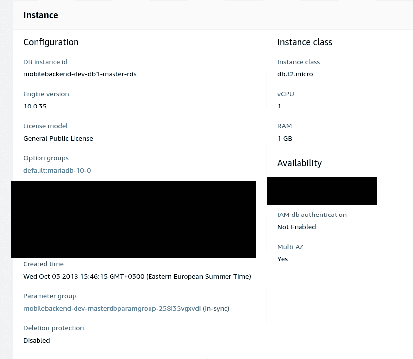](https://rtfm.co.ua/wp-content/uploads/2019/03/Screenshot_20190307_105835.png)

添加必要的选项:

[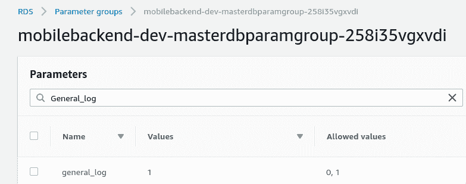](https://rtfm.co.ua/wp-content/uploads/2019/03/Screenshot_20190307_105955.png)

检查它们:

```
$ aws rds --profile bm-backend describe-db-parameters --db-parameter-group-name mobilebackend-dev-masterdbparamgroup-258i35vgxvdi | grep -A1 'slow_query_log\|general_log\|log_error'

"ParameterName": "general_log",
"ParameterValue": "1",

--

"ParameterName": "general_log_file",
"ParameterValue": "/rdsdbdata/log/general/mysql-general.log",

--

"ParameterName": "log_error",
"ParameterValue": "/rdsdbdata/log/error/mysql-error.log",

--

"ParameterName": "slow_query_log",
"ParameterValue": "1",

--

"ParameterName": "slow_query_log_file",
"ParameterValue": "/rdsdbdata/log/slowquery/mysql-slowquery.log", 
```

日志必须出现在*日志&事件*中。

另外–不要忘记将`log_output`设置为*文件*类型(默认值为*表*):

[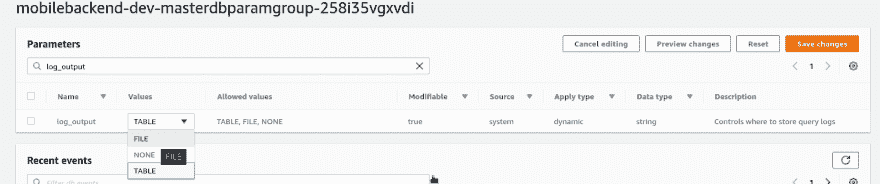](https://rtfm.co.ua/wp-content/uploads/2019/03/Screenshot_20190307_110859.png)

保存更改。

### CloudWatch 日志导出

转到 RDS 实例并点击*修改*:

[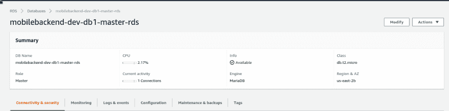](https://rtfm.co.ua/wp-content/uploads/2019/03/Screenshot_20190307_105659.png)

列表到底部，并选择要导出到 CloudWatch 的日志:

[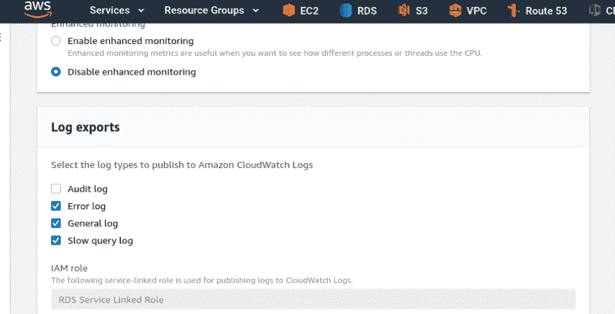](https://rtfm.co.ua/wp-content/uploads/2019/03/Screenshot_20190307_111710.png)

按*继续*，查看需要更新的设置列表，点击*修改 DB 实例*:

[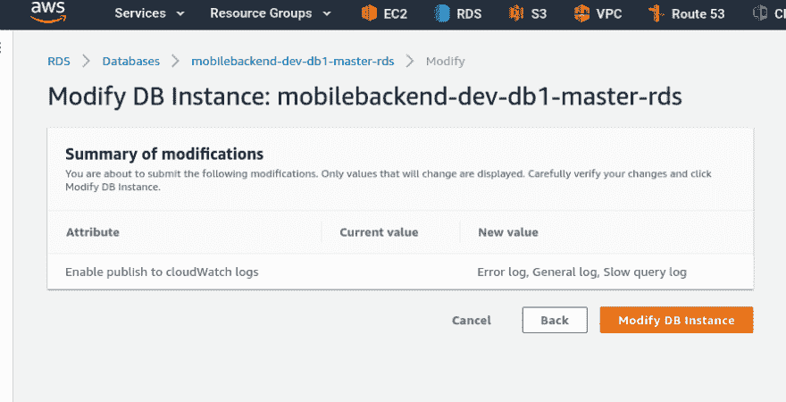](https://rtfm.co.ua/wp-content/uploads/2019/03/Screenshot_20190307_111753.png)

等待几分钟:

[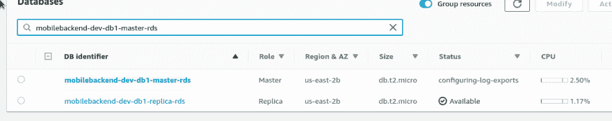](https://rtfm.co.ua/wp-content/uploads/2019/03/Screenshot_20190307_111819.png)

查看 CloudWatch 日志——瞧:

[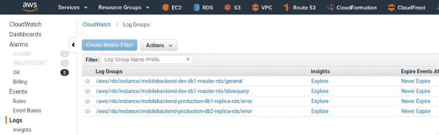](https://rtfm.co.ua/wp-content/uploads/2019/03/Screenshot_20190307_112043.png)

日志数据:

[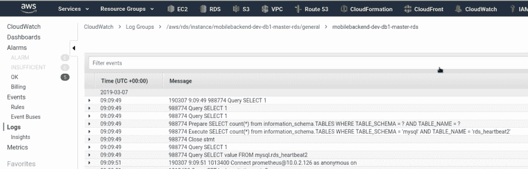](https://rtfm.co.ua/wp-content/uploads/2019/03/Screenshot_20190307_112231.png)

### 云生成模板

最后一件事是更新我们的 CloudFormation 模板，将更改应用到所有服务器。

这里我们需要更新 [`AWS::RDS::DBParameterGroup`](https://docs.aws.amazon.com/AWSCloudFormation/latest/UserGuide/aws-properties-rds-dbparametergroup.html) 资源并添加以下参数:

```
...
    "MasterDBParamGroup": {
      "Type": "AWS::RDS::DBParameterGroup",
      "Properties": {
        "Description": "Master Database Parameter Group",
        "Family": "mariadb10.0",
        "Parameters" : {
          "log_output": "FILE",
          "general_log": 1,
          "slow_query_log": 1,
          "long_query_time": 10,
          "log_queries_not_using_indexes": 1,
          "net_read_timeout": 60
        },
        "Tags" : [
          {"Key" : "Name", "Value" : { "Fn::Join" : [ "-", [ {"Ref" : "AWS::StackName"}, "master-db-params"] ] } },
          {"Key" : "Env", "Value" : {"Ref" : "ENV"} }
        ]
      }
    },
... 
```

下一步——启用导出:更新 [`AWS::RDS::DBInstance`](https://docs.aws.amazon.com/AWSCloudFormation/latest/UserGuide/aws-properties-rds-database-instance.html) 资源，添加 [`EnableCloudwatchLogsExports`](https://docs.aws.amazon.com/AWSCloudFormation/latest/UserGuide/aws-properties-rds-database-instance.html#cfn-rds-dbinstance-enablecloudwatchlogsexports) 和要导出的日志列表—*错误*、*一般*、*慢速查询*:

```
...
    "DB1MasterRDS" : {
      "Type" : "AWS::RDS::DBInstance",
      "Properties" : {
        "DBInstanceIdentifier" : { "Fn::Join" : [ "-", [ {"Ref" : "AWS::StackName"}, "db1-master-rds"] ] },
        "MasterUsername" : { "Ref" : "DB1RootUser" },
        "MasterUserPassword" : { "Ref" : "DB1RootPassword" },
        "AllocatedStorage" : { "Ref" : "DB1AllocatedStorage" },
        "Engine" : "mariadb",
        "StorageType": "gp2",
        "AutoMinorVersionUpgrade": false,
        "PubliclyAccessible" : false,
        "DBInstanceClass" : { "Ref" : "DB1MasterDBInstanceClass" },
        "DBSubnetGroupName" : { "Ref" : "DB1SubnetGroup" },
        "DBParameterGroupName" : {"Ref" : "MasterDBParamGroup" },
        "EnableCloudwatchLogsExports": [
              "error",
              "general",
              "slowquery"
            ],
        "BackupRetentionPeriod": {"Ref" : "BackupRetentionPeriod" },
        "PreferredBackupWindow": {"Ref" : "PreferredBackupWindow" },
        "VPCSecurityGroups" : [ { "Fn::GetAtt" : [ "MasterDBSecurityGroup", "GroupId" ] } ],
        "MultiAZ": {"Ref" : "MultiAZ" },
        "Tags" : [
          {"Key" : "Name", "Value" : { "Fn::Join" : [ "-", [ {"Ref" : "AWS::StackName"}, "db1-master-rds"] ] } },
          {"Key" : "Env", "Value" : {"Ref" : "ENV"} }
        ]
      },
      "DeletionPolicy" : "Snapshot"
    },
... 
```

运行堆栈更新:

[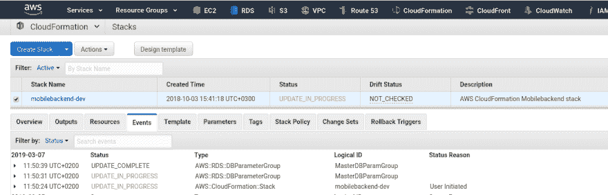](https://rtfm.co.ua/wp-content/uploads/2019/03/Screenshot_20190307_115129.png)

检查日志组:

[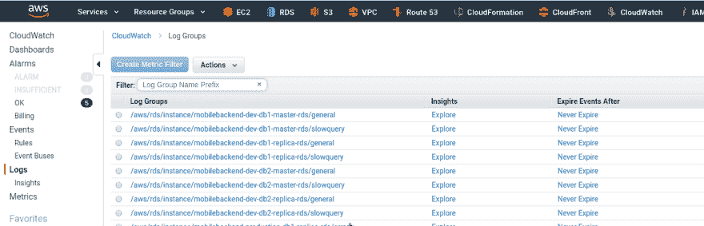](https://rtfm.co.ua/wp-content/uploads/2019/03/Screenshot_20190307_120934.png)

完成了。

### 类似的帖子

*   <small>05/29/2018</small>[Maria db:AWS RDS–查询时失去与 MySQL 服务器的连接](https://rtfm.co.ua/mariadb-aws-rds-lost-connection-to-mysql-server-during-query/) <small>(0)</small>
*   <small>10/27/2017</small>[【AWS:云形成】—rds PostgreSQL](https://rtfm.co.ua/aws-cloudfromation-shablon-dlya-rds-postgresql/)<small></small>
<small>*   <small>03/02/2018</small>[AWS:RDS–连接被拒绝и StorageFull](https://rtfm.co.ua/aws-rds-connection-refused-i-storagefull/) <small>(0)</small>*   <small>05/17/2018</small>[AWS:gdprиrds–миграцияна加密 RDS](https://rtfm.co.ua/aws-gdpr-i-rds-migraciya-na-encrypted-rds/) <small>(0)</small></small>

<small></small>