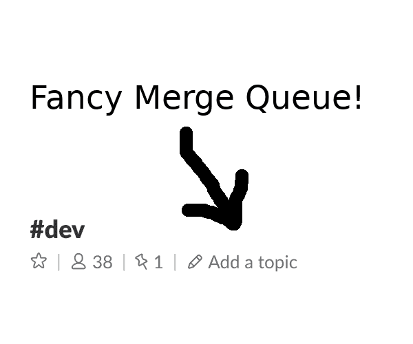

# 在 bug 被合并之前把它们找出来！

> 原文：<https://dev.to/nmattia/hunt-bugs-down-before-they-are-merged-1259>

我讨论了为什么在 master 中捕获 bug 比合并前的
更昂贵的几个原因，试图解释为什么有些人认为这不是真的，
并谈一点关于合并队列。

* * *

# 在 bug 合并前将其猎杀！

在我的一篇签名式的紧张公关评论中，我要求顽固的同事写更多的测试，这是我几次从他们那里听到的:

> 在一个 bug **被合并**到主分支
> 之后，修复它的成本**与在它被合并**到
> 主分支之前修复它的成本**相同。**

我不敢苟同！一旦一个 bug 出现在主代码库中，捕捉这个 bug 需要付出巨大的相关成本。归结起来有以下几个原因，我将在接下来的几节中
逐一描述:

*   当有人在主代码库中发现一个 bug 时，他们很可能不是在寻找 bug，而是在努力完成工作。
*   负责修复 bug 的人可能已经丢失了与错误代码相关的上下文，或者可能他们从一开始就没有任何上下文。
*   报告一个 bug 会以标签和拉请求(PRs)的形式产生噪音。

让我们直接跳进来吧！

*故事时间*

你是一家存储在线笔记的公司的前端工程师。你的任务是
编写一个自动完成功能，允许用户更快地找到笔记
:

```
 +-----------------------+  +------+
| Gr|                   |  | open |
+-----------------------+  +------+
|                       |
| Great minds.txt       |
|                       |
| Grocery list          |
|                       |
| Grrr! said the lion   |
|                       |
| ...                   |
+-----------------------+ 
```

下面的 HTTP 调用返回所有用户笔记的列表:

```
GET /users/<user>/notes?query=<prefix> 
```

### 它碍事

*故事时间*

<figure>[](https://res.cloudinary.com/practicaldev/image/fetch/s--R0ms7QNM--/c_limit%2Cf_auto%2Cfl_progressive%2Cq_auto%2Cw_880/https://nmattia.cimg/peanut_butter_cookies_nola.jpg) 

<figcaption>和#2 美洲！</figcaption>

</figure>

你一直在做惊人的工作。你有心流。心如止水。您已经完成了
您的前端更改。您启动了服务器的本地实例。

您尝试了一下，并意识到当没有匹配时服务器会出现故障。

你绝望了。你的心流走了。后端工程师的名字闪现在你的眼前。你考虑不邀请他们参加你的婚礼。你在脑海中列出了最有可能引入漏洞的人。你考虑
辞掉工作，去另一个国家当一名咖啡师——甚至可能是在新奥尔良的
。你需要一个特色菜，也许是花生酱饼干。你会
用你的花生酱饼干杀死它。从新英格兰到新墨西哥，人们都会知道他们。你会出名，几年后，竞选美国总统。然后你要考虑后勤问题:你的未婚妻
需要辞职，你需要雇佣搬家服务，你的狗可能
撑不过这次飞行。

您隐藏您的本地更改，并着手编写一个重现
问题的测试用例。

* * *

除非你是一名质量分析师，否则你可能不会四处寻找 bug 来取乐。我们大多数人在试图完成某件事的时候都会发现错误:
也许你只是在使用服务器，或者你正在编写一个新特性，而
依赖于一个不同的特性或功能。在
代码库中发现错误行为几乎总是令人烦恼，而不是惊喜。

如果错误在合并之前被发现，错误报告者很可能
是引入错误行为的人，并且很可能
已经预料到会遇到“一些”错误(第一次尝试就正确的软件
是一个神话，抱歉)。

### 它制造噪音

*故事时间*

> 你> @channel 我在
> `/users/foo/notes?query=bar`没有匹配的时候遇到服务器崩溃，有人知道这个吗？
> 
> tom >请在这里使用[@而不是@channel](https://dev.to/here)
> 
> pat> [@tom](https://dev.to/tom) 请不要使用“at”频道
> 
> jen > @你是的我认为这与#2551 有关
> 
> 2551 号已于上周修复
> 
> 好吧，没关系，不知道
> 
> mkt > @频道午餐？

* * *

无论你是在 Slack、GitHub、JIRA 报告问题，只要你说得出来，报告一个 bug 就会产生一些噪音。有些人需要贴上标签，试图帮助你找出原因，其他人可能会因为
额外的 Slack/GitHub/JIRA 通知而分心。

如果 bug 在合并到 master 之前被捕获，所有这些都可以避免:
bug 通常在代码成为主流
代码库的一部分之前不会被报告。

### The Hunt

<figure>

<figcaption>Mads “Hunter” Mikkelsen</figcaption>

</figure>

This one should be pretty straightforward. Finding a bug that's been introduced by a diff before merge into the master branch limits the search space to that diff only. Trying to find a bug on master means potentially having to consider the whole codebase, unless your codebase lends itself to things like bisecting.

### 缺乏上下文

*故事时间*

工程副总裁带着他一贯的冷漠走向你:

> 副总裁:你需要解决服务器崩溃的问题。
> 
> 你:但是！
> 
> 副总裁:我知道这不是你的专业领域，但是我们需要在
> 发布之前解决这个问题。
> 
> 你:但是！
> 
> 副总裁:看到光明的一面:你会学到一些生锈！
> 
> 你:但是...等等什么？
> 
> 是的，安迪上周重写了 rust 的后端。不过他现在正在度假。
> 
> 你:...
> 
> 副总裁:祝你好运！别忘了明天的工程早餐。

当副总裁离开时，你对自己唱道:

> ...波旁街上空有一只哞哞的叫声...

* * *

大多数时候没人知道 bug 在哪里，是谁引入的。这
意味着选择正确的工程师来追踪一个 bug 的几率大约
与试图猜测你的团队中谁最后被切除了扁桃体的几率相同-
如果有人真的被切除了扁桃体。

负责修复 bug 的人不太可能知道
有问题的那部分代码。即使引入这个 bug 的人正在寻找并修复它，这个人可能
已经有一段时间没有在代码库的那个部分工作了。上下文要么是不存在的，要么是随着时间的流逝而丢失的，这使得调试变得更长，更令人沮丧。

这可以通过在 bug 被写出来之后，在它们被合并之前就捕获它们来避免。

### 呻吟声

*故事时间*

> 你> @channel 我已经修复了服务器崩溃的问题，有人想回顾一下吗？
> 
> tom >请在这里使用[@而不是@channel](https://dev.to/here)
> 
> pat> [@tom](https://dev.to/tom) 请不要使用“at”频道
> 
> 是的，我马上就去看看
> 
> mol > @你确定 np
> 
> mkt > @频道茶歇？

<figure>

<figcaption>Where does it end?</figcaption>

</figure>

Fixed the issue? A new round of PRs and reviews creates even more noise. At best this justifies hiring the intern whose job it is to move JIRA tickets around. Most likely it's a waste of time for everyone involved.

### 为什么谬误？

那么*为什么*有些人倾向于认为合并新的
代码并在以后进行损害控制(也称为即兴编码)会更有效呢？嗯，在
短期内，它可以通过以下方式为实施者(让我们直言不讳
直言不讳:罪魁祸首)节省时间:

*   没有编写测试或提出足够的测试用例。
*   未经审查就可能合并。

这些可以在短期内为一个人节省时间，让他们更快地融合，然后继续做其他事情；然而，从更大的角度来看，时间和精力都被浪费了。

人们倾向于认为在 master 中修复 bug 并不一定比在合并之前发现它更糟糕的另一个原因是，人们通常没有意识到报告 bug 是有成本的。这个成本
随着订阅 bug 追踪器的人数、
参与分类和 QA 而线性增长。

如果你喜欢你的团队，请确保在其他人发现你的 bug 之前抓住它们！

## 附录:为了更大的利益合并队列

bug 并不是破解 master 的唯一方法，竞态条件也适用于
软件进程。当 CI 系统只在分支
上运行测试，而没有首先在主分支上重设基础时，可能会发生这种情况(注意:一些 CI 系统，如 [Travis](https://travis-ci.org/) 和
CircleCI，会在重设基础
或将其合并到主分支后，测试分支*和*)。下图列出了三个分支，
`master``bob`和`alice` :

```
 bob master alice
 .    ✓      .   master is green :)
      |
 .    +------+   Alice uses `makeRainbow()`
      |      |
 .    |      ✓   branch alice is green :)
      |      |
 +----+      |   Bob removes `makeRainbow()`
 |    |      |
 ✓    |      |   branch `bob` is green :)
 |    |      |
 +---->      |   branch "bob" is merged
      |      |
      ✓      |   master is green :)
      |      |
      <------+   branch "alice" is merged
      |
      x          master is red :(
      |
      v 
```

Alice 分叉一个分支并使用了函数`makeRainbow()`。
无虫引入，词人皆青，皆大欢喜。大约在同一时间，Bob 决定做一些
清理，分支 master，并删除函数`makeRainbow()`。从他
的角度来看，没有人用它，CI 是绿色的，大家都开心。

不管谁先合并——Alice 还是 Bob——最终结果都不会好:
Alice 的特性使用了 Bob 修改后代码库中不再存在的函数
。避免这些问题的解决方案是在运行 CI 测试之前总是
重定分支的基础:

```
 bob master alice
 .    ✓      .   master is green :)
      |
 .    +------+   Alice uses `makeRainbow()`
      |      |
 .    |      ✓   branch "alice" is green :)
      |      |
 +----+      |   Bob removes `makeRainbow()`
 |    |      |
 <----+      |   branch "bob" is rebased on master
 |    |      |
 ✓    |      |   branch "bob" is green and ready for merge :)
 |    |      |
 +---->      |   branch "bob" is merged
      |      |
      |      ?   merge is prevented on branch alice :|
      |      |
      +------>   branch "alice" is rebased on master
      |      |
      |      x   branch "alice" is red :(
      |      |
      |      |   Alice writes a new implementation of `makeRainbow()`
      |      |
      |      ✓   branch "alice" is green and ready for merge :)
      |      |
      <------+   branch "alice" is merged
      |
      ✓          master is green :)
      |
      v 
```

你唯一要做的就是确保没有分支被合并，除非
严格地位于主节点之上。最简单的解决方案是手动保持
跟踪应该合并的分支:

*   每当有人想合并时，他们的分支就会排队。
*   恰好有一个人从队列中弹出分支，重定它们的基，如果 CI 满意，就合并它们。

这是一个非常繁琐的过程，最好通过像 [bors-ng](https://github.com/bors-ng/bors-ng) 这样的工具实现自动化。

### 穷人的合并队列

合并队列不需要太花哨。当我们第一次意识到我们浪费了
很多时间来修复 rebase 问题时，我和我的团队想出了一个非常简单的
解决方案:将 PR 值保存在 Slack 频道的“主题”字段中。你
想合并做公关？将其添加到列表的右侧。最左边的 PR 不是
被合并就是 CI 失败？将其从列表中移除，并重新设定最左边的
公关。

<figure>[](https://res.cloudinary.com/practicaldev/image/fetch/s--Mrou_Gnk--/c_limit%2Cf_auto%2Cfl_progressive%2Cq_auto%2Cw_880/https://nmattia.cimg/slack-topic-merge-queue.png) 

<figcaption>节省一些成本！DIY 合并队列。</figcaption>

</figure>