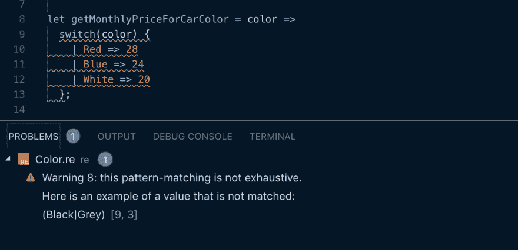

# ReasonML 变体简介

> 原文：<https://dev.to/iwilsonq/intro-to-reasonml-variants-28ec>

ReasonML 是一种超级快速、富于表现力的函数式编程语言。目前，它可以编译为针对 web 的优化 JavaScript，针对原生图形渲染的 WebGL/OpenGL，甚至原生字节码。

我最喜欢的一个 Reason 特性是变量数据类型。这些类型允许我们以合理的方式处理枚举，迫使我们处理特定场景的所有可能性。我们可以这样定义一个变量类型:

```
type color =
  | Red
  | Blue
  | White
  | Black
  | Grey; 
```

我们看到类型`color`可以表示为不同颜色的枚举。不太复杂，但也不太有启发性。在 JavaScript 中，我们可以用一个对象映射来处理这个问题:

```
const COLORS = {
  RED: 'red',
  BLUE: 'blue',
  WHITE: 'white',
  BLACK: 'black',
  GREY: 'grey',
} 
```

我在我的 JavaScript 项目中一直使用这样的地图，当你的目标是保持常量定义在同一个地方时，它们非常有用。如果需要更新、添加或删除字段，只需在一个位置完成。

如果这就是全部情况，我可能会认为像 Reason 这样的编译成 js 的编程语言不值得我花费精力去添加类型脚本支持。毕竟，它只为我们节省了很少的代码。

让我们看一个例子，看看 Reason 如何帮助我们解决普通 JavaScript 的不足。

```
function getMonthlyPriceForCarColor(color) {
  switch(color) {
    case COLORS.RED:
      return 28;
    case COLORS.BLUE:
      return 24;
    case COLORS.WHITE:
      return 20;
  }
} 
```

该函数获取一种颜色(从我们方便的颜色查找地图中)并返回给我们获得一辆特斯拉 Model S 的额外月价格。换句话说，获得一辆红色特斯拉花费更多，因为它是最好的颜色。

您可能注意到的另一件事是，我没有提供默认情况，作为一个不完美的程序员，我忽略了其他一些颜色。JavaScript 本身不会为此对我大喊大叫，所以我可能不得不艰难地发现我忘记了其他一些情况。

希望 QA 能在我的代码投入生产之前发现这个错误。但是，即使他们真的很彻底，我仍然不得不做出改变，并推动/审查更多的代码。如果我们的类型检查器可以即时提醒我们，那不是很好吗？

Reason 中的同一个函数看起来是这样的:

```
let getMonthlyPriceForCarColor = color =>
  switch(color) {
    | Red => 28
    | Blue => 24
    | White => 20
  }; 
```

首先，代码更少了，这很好，但是跑题了。在实践中，这个函数实际上会有红色的曲线下划线，提醒我们我们的切换并不详尽——它没有涵盖所有的可能性或我们的`color`变体。

发生这种情况时，错误消息实际上非常有用。

[](https://res.cloudinary.com/practicaldev/image/fetch/s--DPSjDnZ1--/c_limit%2Cf_auto%2Cfl_progressive%2Cq_auto%2Cw_880/https://thepracticaldev.s3.amazonaws.com/i/1np0nj7n0smydrprqmh9.png)

解决这个问题只需要您考虑其他可能性。

```
let getMonthlyPriceForCarColor = color =>
  switch(color) {
    | Red => 28
    | Blue => 24
    | White => 20
    | Black => 0
    | Grey => 0
  }; 
```

如果我们没有这个函数中每种可能性的案例，理性不会让我们编译我们的代码。这是我们拥有的强大的理性类型系统的一个例子。

## 变型为构造函数

正如我到目前为止所展示的，变体可以用作枚举，但是它们展示了一种将枚举提升到一个全新水平的能力。变体可以用作带参数的通用构造函数，允许开发人员根据他们的用例进一步定制应用程序。

例如，我们可以根据灰色的深浅来调整价格，甚至可以在 RGB 范围内指定一种完全任意的颜色。

将我们的颜色类型更新为如下:

```
type color =
  | Red
  | Blue
  | White
  | Black
  | Grey(float)
  | Rgb(int, int, int); 
```

现在，当我们运行我们的函数时，我们可以让客户选择他们想要的任何颜色。为了使定价更加合理，我们已经硬编码的值，我们将允许灰色的范围从$0 到$20。取决于在 0.0 和 1.0 之间给定的任何数字。

构造函数将是最昂贵的，因为我们必须创造新的油漆来满足需求。红色、蓝色和绿色的值越高，它就越接近 36 美元。

```
let getMonthlyPriceForCarColor = color =>
  switch(color) {
    | Red => 28
    | Blue => 24
    | White => 20
    | Black => 0
    | Grey(pct) => int_of_float(pct *. 20.0)
    | Rgb(red, green, blue) => {
      /* completely random calculation. Tesla probably does not do this */
      let sum = red + green + blue;
      if (sum > 500) {
        36
      } else {
        32
      }
    }
  };

Js.log(getMonthlyPriceForCarColor(Red));                /* 28 */
Js.log(getMonthlyPriceForCarColor(Grey(0.64)));         /* 12 */
Js.log(getMonthlyPriceForCarColor(Rgb(150, 210, 67)));  /* 32 */
Js.log(getMonthlyPriceForCarColor(Rgb(150, 210, 167))); /* 36 */ 
```

很漂亮吧？这个例子展示了像 Reason 这样健壮的类型安全语言的表达能力。

为了让这个例子更强大，我唯一要做的就是验证构造函数的输入。因此，为了让这篇文章轰动一时，我将创建一些辅助函数。

```
let validatePercentage = pct =>
  restrictRangef(pct, 0.0, 1.0);

let validateRgb = (red, blue, green) => {
  let red = restrictRange(red, 0, 255);
  let green = restrictRange(green, 0, 255);
  let blue = restrictRange(blue, 0, 255);
  (red, blue, green);
}; 
```

这些函数在一定程度上验证所需的输入，如果输入值过低或过高，它们会将其截断。下面是它们对应的`restrictRange`函数。

```
let restrictRange = (number, min, max) => 
  if (number > max) {
    max;
  } else if (number < min) {
    min;
  } else {
    number;
  };

let restrictRangef = (number, min, max) => 
  if (number > max) {
    max;
  } else if (number < min) {
    min;
  } else {
    number;
  }; 
```

最后要注意的是，我们必须为`int`和`float`类型提供单独的`restrictRange`函数。按照惯例，当我们有接受整数的函数时，它们的 float 变量将有相同的名字，但是在末尾有一个“f”。

当我们拥有更好的类型覆盖率时，这里的一点额外代码只是一个小小的代价。

最后，我可以用我们的新助手更新我们的`getMonthlyPriceForCarColor`函数:

```
let getMonthlyPriceForCarColor = color =>
  switch (color) {
  | Red => 28
  | Blue => 24
  | White => 20
  | Black => 0
  | Grey(pct) => int_of_float(validatePercentage(pct) *. 20.0)
  | Rgb(red, green, blue) => {
      let (r, g, b) = validateRgb(red, green, blue);
      let sum = r + g + b;
      if (sum > 500) {
        36
      } else {
        32
      };
    }
  }; 
```

## 就这样结束了

如果你想看看我写的示例文件，以确保我给你的是类型安全的代码，你可以在这里查看。

我们已经了解了变量，以及如何通过模式匹配将它们用于构造函数参数。这是一个超级强大的特性，在任何现代编程语言中都找不到。

当您构建一个具有完全类型安全的应用程序时，随着项目规模的增长和您开始进行重构，您开始获得好处。了解您的代码编译增加了您的信心，您不会破坏生产中的关键甚至基本功能。

如果你想继续关注未来的帖子，[在这里注册我的时事通讯](https://buttondown.email/iwilsonq)！