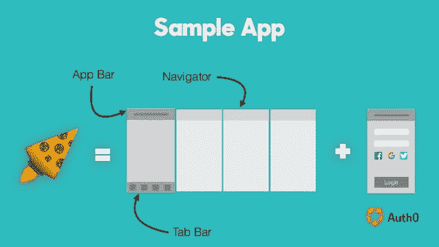
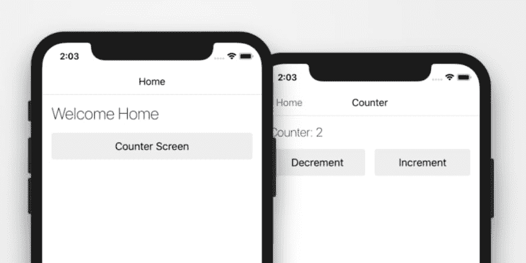

# 前 5 名 React 原生入门套件

> 原文：<https://dev.to/flatlogic/top-5-react-native-starter-kits-3kf>

React Native 允许我们创建一个为两个平台定制的样板文件。为 Android 和 iOS 创建应用的能力给了我们一个竞争优势——我们可以尽可能快地完成开发过程。

初学者工具包通常对开发实践和工具有自己的看法。有时候是一刀切，有时候定制和与某些服务集成的可能性更重要。你可以从这段代码中学习，获取灵感。这个选项对于那些刚接触 Native，但不熟悉 web 开发或编程的人特别有效。为了尽快学习，在预构建的应用程序或初学者工具包中学习最佳实践是非常有效的。毕竟代码不会说谎，只有注释有时候会说谎。

React Native 有效地减少了构建移动应用程序的时间和工作量。在生产模式下，您可以无缝更新您的应用。更重要的是，在发展中，有机会与他人分享你的工作。

在这篇文章中，我想向全世界传播我能在互联网上找到的最好的反应原生启动程序。人们可以抓住其中的一个，轻松启动自己的应用程序，进入移动开发世界。

## [反应原生启动器](https://reactnativestarter.com/)

 
**评级:*** ***

该初学者工具包的体系结构旨在创建可伸缩的应用程序。根据 React 本地 it 支持模块化应用程序的最佳实践进行构建。它是在 Redux library、Babel、React、Flow 和 ECMAScript 的帮助下完成的，这无疑是一大优势。在演示中，我们可以看到我们可以在应用程序中构建一个可定制的日历。此外，我们可以看到有三种网格样式可以使用，产品页面、图表、Instagram 样式的图库、用户资料、聊天和消息以及登录或注册屏幕。这款入门套件非常适合电子商务应用，并且拥有终身更新和支持。设计本身干净、现代、醒目。它使用了颜色渐变和简单曲线等趋势。

## [点燃](https://github.com/infinitered/ignite)

 
**评级:*** **

默认样板文件将在几秒钟内安装完毕。事实上，Ignite 更像是 React Native 的生成器。它有很多插件，或者你可以自己创建一个。Ignite 没有运行时，因为它是开发者工具，你不用想办法升级，它不是库，你不依赖它。它还有一个有趣的好处。它有自己的 React 本地编码社区。Ignite 可以在 macOS、Windows 甚至 Linux 上完美运行。您可以轻松地生成一个初学者应用程序以及一个自以为是的组件。它有 API 文档测试、便利屏幕、组件示例、生成器 CLI 和大量使用示例。

## [意大利香肠](https://github.com/futurice/pepperoni-app-kit)

 
**评级**** *

意大利香肠有许多现成的构建模块，可以帮助您创建一个具有通用功能的移动应用程序。它使用 Redux 库 Auth0 进行用户管理、登录和身份验证。推送通知、云就绪后端和群组消息无疑是这款入门套件的优势。但是意大利辣香肠不是万能的，你可能需要大量的定制来满足你的需求。这个项目与另一个名为雪花的项目有一些共同的特点，这个项目目前肯定更加成熟。然而，意大利香肠有一个现代化的架构，可以帮助您构建自己的架构，以加速跨平台移动应用程序的开发过程。

## [React 原生 Ting App](https://market.nativebase.io/view/react-native-ting-app)

 
**评级**** **

Ting 应用程序拥有所有必要的用户界面元素，并且是完全可定制的。九个现成的屏幕，如登录，注册，聊天，个人资料等。它不包括任何后端，它是作为一个用户界面主题。因此，它不与 API 调用连接，但它肯定为您提供了开发自己的应用程序所需的所有基本组件集合。您可以构建一个融合了 ES6 的高质量移动应用程序。这是有据可查的，挤满了流，反应导航和原生基地。Native Base 是 React Native 适应性最强的 UI 组件。因为我们知道我们可以使用大量可以定制的组件。由于其灵活性，Ting 是酒店应用的完美之选，实际上可以以任何方式定制。平坦光滑的 UX 和性能良好的用户界面是一大优势。

## [由上野反应本土首发](https://github.com/ueno-llc/react-native-starter)

 
**评级**** **

这个初学者工具包是由专业人士制作的。它允许您部署可靠的应用程序，从而节省时间和精力。它有自以为是的依赖，单元和集成测试和反应启动器导航 2。它没有现成的屏幕、UI 组件和 UX。但是它非常容易开始，实际上不需要任何东西来开始开发。你不需要环境变量。只需将这个 starter 克隆到您的文件夹中，您就可以用这个干净且高质量的代码创建自己的屏幕和组件。

最初发表于[https://flatlogic.com/blog/top-5-react-native-starter-kits/](https://flatlogic.com/blog/top-5-react-native-starter-kits/)