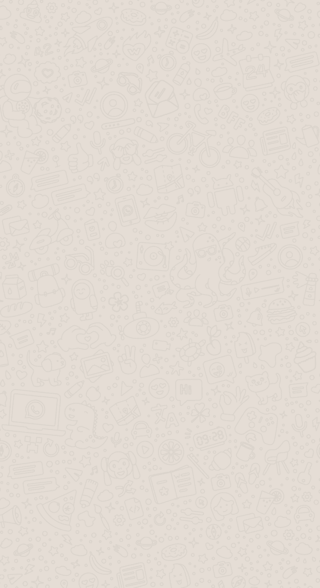

# 如何制作像默认 WhatsApp 壁纸一样的背景？

> 原文：<https://dev.to/davinaleong/how-to-make-backgrounds-like-the-default-whatsapp-wallpaper-24pc>

嗨，设计师们，

创建类似默认 WhatsApp 壁纸的“小字”背景的技巧是什么？我还需要它有响应能力，并且在不同的分辨率下形状是可区分的。我推测这是通过像`.svg`这样的矢量图形实现的？

另外，我如何制作“代码文本”背景？找不到这方面的参考图片，所以我会尽力解释我想达到的目的。我想要一个背景，基本上是一个柔和的颜色代码夹头。虽然背景文本是可区分的，但它不应该与前景内容冲突。

有什么技巧和窍门来实现这一点吗？或者至少是这些资源的链接？

我正在尝试为我正在制作的网站创建这样的背景。该网站的主题是围绕网络开发和编程。

谢了。