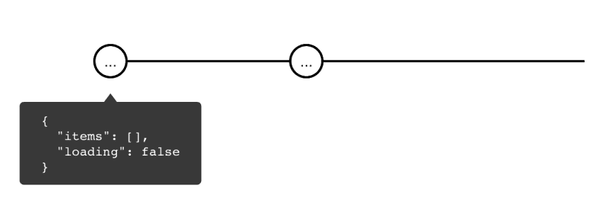
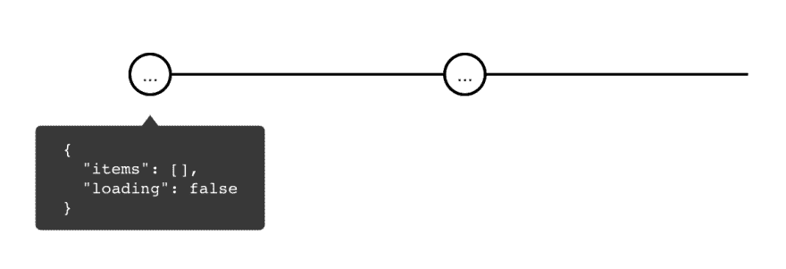
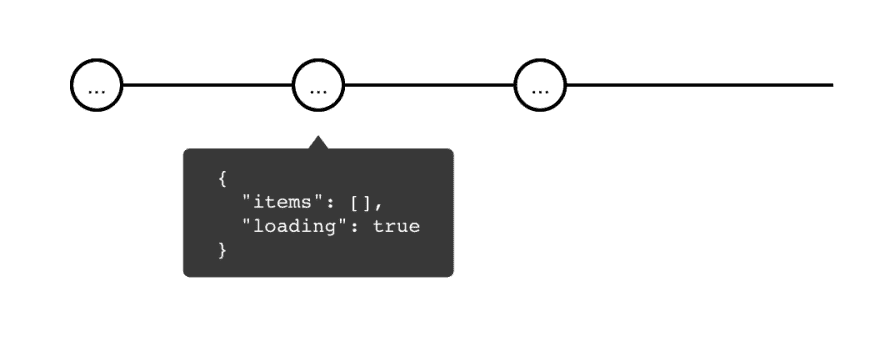
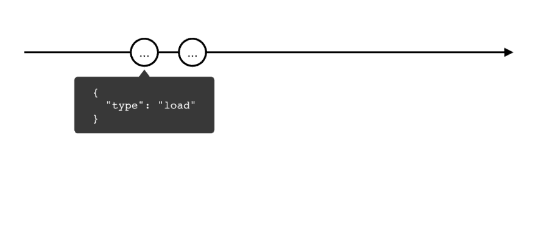
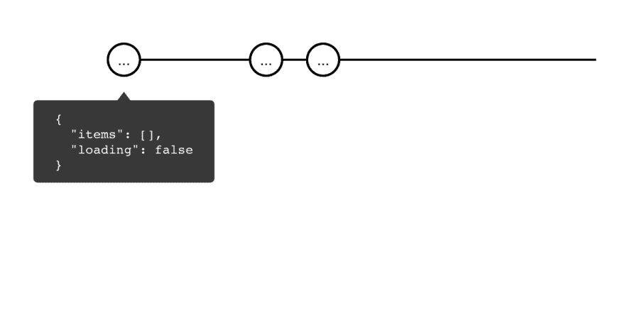
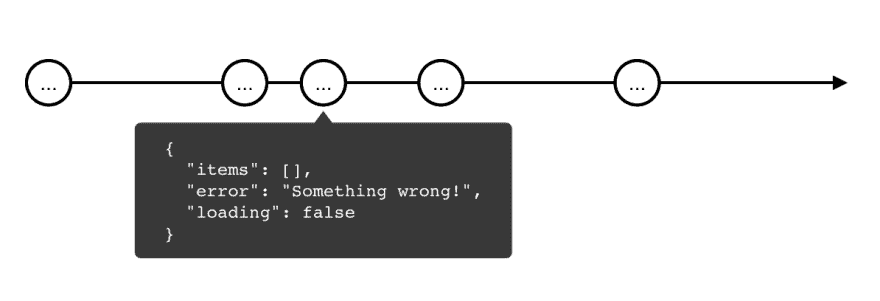
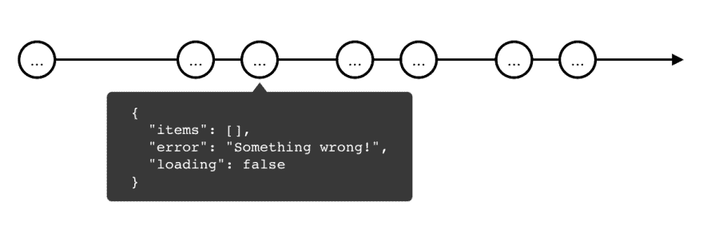

# 实践中的 RxJS

> 原文：<https://dev.to/thekiba/rxjs-in-practice-writing-our-own-ngrx-290i>

## 编写我们自己的 Ngrx

> [Redux](https://github.com/reduxjs/redux) 并不是唯一的**状态管理器**，事实上，我们可以轻松创建自己的。[所有](https://github.com/ngrx/platform) [流行的](https://github.com/ngxs/store)状态管理者对于**棱角分明的**要求把你的业务逻辑放在一个单体里面。因此，我敦促您在选择使用什么状态管理解决方案时要仔细考虑。

[ ](https://res.cloudinary.com/practicaldev/image/fetch/s--l1ot2If---/c_limit%2Cf_auto%2Cfl_progressive%2Cq_auto%2Cw_880/https://cdn-images-1.medium.com/max/2000/1%2AZGQtrlVpV6Z_Yr62cUlS2w.png) *状态 foxement*

我写这篇文章是因为我看到到处都有人在使用 [RxJS](https://rxjs-dev.firebaseapp.com/) 这个词。这里最常见的问题是不了解操作符、Rx 设计原则或缺乏对声明性和反应性的理解。在本帖中，我们将通过使用 **RxJS** 编写我们自己的 [Ngrx](https://github.com/ngrx/platform) 来涵盖最常见的情况。

### 我们想完成什么

—保持当前状态；
—改变状态；
—各种动作的处理；
—异步的东西；
—错误处理；
最后但同样重要的是，当我们**不再需要它的时候**摧毁这个国家。

## 一种状态的状态

[](https://res.cloudinary.com/practicaldev/image/fetch/s--0_XcWVaz--/c_limit%2Cf_auto%2Cfl_progressive%2Cq_auto%2Cw_880/https://cdn-images-1.medium.com/max/2000/0%2ATbPAvU9h8M_JhIv-.jpg)

为了这个例子，我们将存储一个简单的数字列表和装载指示器。界面如下:

```
interface ItemsState {
  items: number[];
  loading: boolean;
} 
```

让我们定义默认状态:

```
const defaultState: ItemsState = {
  items: [],
  loading: false
}; 
```

### [(中)](https://rxjs-dev.firebaseapp.com/api/index/function/of)

为了能够处理我们的状态，我们可以使用()操作符的**来创建一个[可观察值](https://rxjs-dev.firebaseapp.com/api/index/class/Observable)。**

创建一个包含一个或多个元素的流，该流在所有元素发送后立即完成。

```
state$: Observable<ItemsState> = of(defaultState); 
```

[](img/e1188fc4f356e4eb4e53ee62ed510d34.png)](https://res.cloudinary.com/practicaldev/image/fetch/s--2-Iinl5j--/c_limit%2Cf_auto%2Cfl_progressive%2Cq_auto%2Cw_880/https://cdn-images-1.medium.com/max/2316/1%2AJ_wApyKs1dJrxQnBzCi8XQ.png)

从图中我们可以看到， **Observable** 返回我们的默认状态并完成。让我们让溪流无限长。

### [永不](https://rxjs-dev.firebaseapp.com/api/index/const/NEVER)， [startWith()](https://rxjs-dev.firebaseapp.com/api/operators/startWith)

为了保持流的活力，我们可以使用 [Subject](https://rxjs-dev.firebaseapp.com/api/index/class/Subject) ，但是首先，让我们看看 **NEVER** 常量。我们稍后将触及**主题**，别担心。

**NEVER** 是 RxJS 中一个永远不会完成的简单流。

**startWith()** 为流创建初始值。再加上**从来没有**能代替**的()**操作员。

```
state$: Observable<ItemsState> =
  NEVER.pipe(
    startWith(defaultState)
  ); 
```

[](img/ff2e8239feb864a8fb976c76f47b6f65.png)](https://res.cloudinary.com/practicaldev/image/fetch/s--V5fL7kwf--/c_limit%2Cf_auto%2Cfl_progressive%2Cq_auto%2Cw_880/https://cdn-images-1.medium.com/max/2240/1%2AZwZ8Hfd8WdfwHOHhuGvqmQ.png)

请注意，现在我们的流永远不会结束，但每个用户都将使用**不同的流**，这意味着他们也将拥有**不同的数据**。接下来，我们要解决这个问题。

### [【publish replay()】](https://rxjs-dev.firebaseapp.com/api/operators/publishReplay)， [refCount()](https://rxjs-dev.firebaseapp.com/api/operators/refCount)

[](https://res.cloudinary.com/practicaldev/image/fetch/s--4HEX3LmH--/c_limit%2Cf_auto%2Cfl_progressive%2Cq_auto%2Cw_880/https://cdn-images-1.medium.com/max/2000/0%2A1rLeR4lsnyOMy_2E.jpg)

[BehaviorSubject](https://rxjs-dev.firebaseapp.com/api/index/class/BehaviorSubject) 通常用在我们需要有状态流的时候。在我们的例子中，最好的方法是使用 **publishReplay()** 和 **refCount()** 。

**publishReplay()** 创建一个消息缓冲区，并将缓冲区的大小作为第一个参数。新订户将立即获得这些缓冲的消息。在我们的例子中，我们只需要存储最后一条消息，所以我们将传递 1。

**refCount()** 实现了一个简单的 refCount 模式，用于确定流是否是活动的，这意味着它是否有订阅者。如果没有订阅者，**【ref count()**就会退订它，从而杀死流。

```
state$: Observable<ItemsState> =
  NEVER.pipe(
    startWith(defaultState),
    publishReplay(1),
    refCount()
  ); 
```

[](img/ff2e8239feb864a8fb976c76f47b6f65.png)](https://res.cloudinary.com/practicaldev/image/fetch/s--V5fL7kwf--/c_limit%2Cf_auto%2Cfl_progressive%2Cq_auto%2Cw_880/https://cdn-images-1.medium.com/max/2240/1%2AZwZ8Hfd8WdfwHOHhuGvqmQ.png)

通过这种方式，我们可以确保所有订户都拥有相同的流和相同的数据。

## 控制改变状态的流

[](https://res.cloudinary.com/practicaldev/image/fetch/s--FzbkJdQZ--/c_limit%2Cf_auto%2Cfl_progressive%2Cq_auto%2Cw_880/https://cdn-images-1.medium.com/max/2000/1%2AEsrhOXMipJ9vu1jD3zJyxg.png)

让我们定义我们想要如何控制它。控制状态的一种方式是创建和处理命令。界面看起来像这样:

```
interface Action {
  type: string,
  payload?: any
} 
```

**Type** 属性包含命令名，有效载荷携带命令的必要数据。

### [主题](https://rxjs-dev.firebaseapp.com/api/index/class/Subject)

现在我们要实现命令流，上面提到的 **Subject** 是这里的完美候选。它将创建一个不仅可读而且可写的双向流。

我们将使用**主题**创建名为 **actions$** 的命令流。

```
actions$: Subject<Action> = new Subject<Action>(); 
```

[](img/0a3900c20f5e59a357a381922f53c4dc.png)](https://res.cloudinary.com/practicaldev/image/fetch/s--pzUmWjaB--/c_limit%2Cf_auto%2Cfl_progressive%2Cq_auto%2Cw_880/https://cdn-images-1.medium.com/max/2000/1%2AA5ISVPuNjP2uTySibIIgKQ.png)

我们在这里创建了命令流，让我们通过将 **NEVER** 替换为 **actions$** 来将其与状态流绑定。

```
actions$: Subject<Action> = new Subject<Action>();

state$: Observable<ItemsState> =
  actions$.pipe(
    startWith(defaultState),
    publishReplay(1),
    refCount()
  ); 
```

[](https://res.cloudinary.com/practicaldev/image/fetch/s--SXzRhuBu--/c_limit%2Cf_auto%2Cfl_progressive%2Cq_auto%2Cw_880/https://cdn-images-1.medium.com/max/2260/1%2ALnTrl_wGzwlYABk2zNyeSw.png)

[](img/426657c61339b03e33de34102248a57d.png)](https://res.cloudinary.com/practicaldev/image/fetch/s--lqCvt75l--/c_limit%2Cf_auto%2Cfl_progressive%2Cq_auto%2Cw_880/https://cdn-images-1.medium.com/max/2220/1%2ApmHVbp1dFGnAb3tv2MsgaA.png)

现在我们有两个流:状态流和命令流。它们相互作用，但是我们的状态只是在每个命令下被重写。

## 命令处理

[](https://res.cloudinary.com/practicaldev/image/fetch/s--95-u4S_J--/c_limit%2Cf_auto%2Cfl_progressive%2Cq_auto%2Cw_880/https://cdn-images-1.medium.com/max/2000/0%2AoB2gq4X7VPfDLUVn.jpg)

为了处理命令，我们应该从流中获取状态和命令，改变状态并返回一个新的状态。我们有 **scan()** 操作员来处理这类事情。

### [扫描()](https://rxjs-dev.firebaseapp.com/api/operators/scan)

**scan()** 接收一个 reducer 函数，该函数从流中获取当前状态和新命令。

这里我们实现了 reducer 函数，并将其传递给 **scan()** 。

```
function stateReducer(
  state: ItemsState,
  action: Action
): ItemsState => {
  switch (action.type) {
    default:
      return state;
  }
}

state$: Observable<ItemsState> =
  actions$.pipe(
    startWith(defaultState),
    scan(stateReducer),
    publishReplay(1),
    refCount()
  ); 
```

[](https://res.cloudinary.com/practicaldev/image/fetch/s--hUqdheui--/c_limit%2Cf_auto%2Cfl_progressive%2Cq_auto%2Cw_880/https://cdn-images-1.medium.com/max/2324/1%2AWMggjnsgqu89bSUnd15lFA.png)

[](img/e225968775ce67a44891c7572b59333a.png)](https://res.cloudinary.com/practicaldev/image/fetch/s--qjeGKE2W--/c_limit%2Cf_auto%2Cfl_progressive%2Cq_auto%2Cw_880/https://cdn-images-1.medium.com/max/2132/1%2AEAJpapoJAtc1ZWI1wrbNgg.png)

现在，流保持它的状态，但是不对变化做出反应。下面是我们如何添加对**加载**和**加载成功**的处理:

```
function stateReducer(
  state: ItemsState,
  action: Action
): ItemsState => {
  switch (action.type) {
    case 'load':
      return { ...state, loading: true };
    case 'load success':
      return { ...state, loading: false };
    default:
      return state;
  }
}

state$: Observable<ItemsState> =
  actions$.pipe(
    startWith(defaultState),
    scan(stateReducer),
    publishReplay(1),
    refCount()
  ); 
```

[](https://res.cloudinary.com/practicaldev/image/fetch/s--mXv6BKor--/c_limit%2Cf_auto%2Cfl_progressive%2Cq_auto%2Cw_880/https://cdn-images-1.medium.com/max/2112/1%2A989IgpPvp74RUpEWPf1mkw.png)

[](img/34581c2fae038fd03b4ab885555a883c.png)](https://res.cloudinary.com/practicaldev/image/fetch/s--aWE_UIBe--/c_limit%2Cf_auto%2Cfl_progressive%2Cq_auto%2Cw_880/https://cdn-images-1.medium.com/max/2072/1%2ActOEOxGQEtqHelHzk1xoyw.png)

在**加载**和**加载成功**命令下，状态分别变为**加载:真**或**加载:假**。

## 效果处理

[](https://res.cloudinary.com/practicaldev/image/fetch/s--4apDi_P8--/c_limit%2Cf_auto%2Cfl_progressive%2Cq_auto%2Cw_880/https://cdn-images-1.medium.com/max/2000/0%2ARo6Z8WT_BWu91dGu)

我们的状态可以对**同步**命令做出反应。我们该如何处理**异步**的？我们需要一个接受命令并返回新命令的流。这是:

```
load$: Observable<Action> = actions$; 
```

### [滤镜()](https://rxjs-dev.firebaseapp.com/api/operators/filter)

首先，我们需要确保初始命令有 load 类型。为此，我们将使用 **filter()** 操作符。

**filter()** 决定命令是否可以向下传递。

```
load$: Observable<Action> =
  actions$.pipe(
    filter((action) => 'load' === action.type)
  ); 
```

为了提高代码的可读性，我们将创建一个定制的 **RxJS** 操作符。这被认为是一种好的做法。我们需要一个操作员来接受一种类型的命令并过滤掉其他命令。

```
function ofType<T extends Action>(
  type: string
): MonoTypeOperatorFunction<T> {
  return filter((action) => type === action.type);
}

load$: Observable<Action> =
  actions$.pipe(
    ofType('load')
  ); 
```

](img/071a7cf54fb45f4854945fd125aa4978.png)*[https://rxviz . com/v/moy 1 zeko](https://rxviz.com/v/moY1ZEKo)*

现在我们有了一个单独的接收特定类型命令的流，我们将使用它来异步加载数据。为了简单起见，我们将使用预定义的值和 **delay()** 来模拟网络上的负载。

### [延迟()](https://rxjs-dev.firebaseapp.com/api/operators/delay)

顾名思义， **delay()** 在指定的时间内暂停操作符链的执行，这里我们使用 1 秒。

```
function load(): Observable<number[]> {
  return of([ 1, 2, 3 ]).pipe(
    delay(1000)
  );
} 
```

[](img/8d1e46648ab16fa66890505edd9c3112.png)](https://res.cloudinary.com/practicaldev/image/fetch/s--PszHRVaj--/c_limit%2Cf_auto%2Cfl_progressive%2Cq_auto%2Cw_880/https://cdn-images-1.medium.com/max/2304/1%2AJQ61BtivPqJE0Y0btI5Bqg.png)

现在我们把 **load()** 函数拿出来，放在 **switchMap()** 里面。

### [t1](#switchmap)[交换图()](https://rxjs-dev.firebaseapp.com/api/operators/switchMap)

**switchMap()** 每次收到一个值就创建一个流。如果在接收新消息的时候，它已经在处理该消息了，它就结束旧的流。

```
load$: Observable<Action> =
  actions$.pipe(
    ofType('load'),
    switchMap(() => load())
  ); 
```

[](img/bf57a8f9d6d555f3da96fb080d9bd36b.png)](https://res.cloudinary.com/practicaldev/image/fetch/s--hUQpT2Lf--/c_limit%2Cf_auto%2Cfl_progressive%2Cq_auto%2Cw_880/https://cdn-images-1.medium.com/max/2364/1%2AUIrswZ7etBNsyTUCse2Fyg.png)

目前， **load$** stream 从 **load()** 函数返回数据，因此我们最终可以使用驻留在 payload 属性中的数据创建 **load success** 命令。我们将使用 **map()** 来实现这一点。

### [地图()](https://rxjs-dev.firebaseapp.com/api/operators/map)

map() 从流中获取数据，对其进行更改，然后将更改后的数据返回给流。

```
load$: Observable<Action> =
  actions$.pipe(
    ofType('load'),
    switchMap(() => load()),
    map((data): Action => ({
      type: 'load success',
      payload: data
    }))
  ); 
```

[](img/25bfbcee9f59d8825ebb3e58ee3ab3c9.png)](https://res.cloudinary.com/practicaldev/image/fetch/s--v-MZzSdj--/c_limit%2Cf_auto%2Cfl_progressive%2Cq_auto%2Cw_880/https://cdn-images-1.medium.com/max/2332/1%2AC_YW0UButTjhI7CHxbM8cA.png)*[https://rxviz . com/v/roq 7 和 2qJ](https://rxviz.com/v/RoQ7y2qJ)* 

因此，我们有一个接收命令、加载数据并以正确的形式返回数据的效果。

## 收拾一切

[](https://res.cloudinary.com/practicaldev/image/fetch/s--_CP04Gr7--/c_limit%2Cf_auto%2Cfl_progressive%2Cq_auto%2Cw_880/https://cdn-images-1.medium.com/max/2000/0%2ARnr3Vg2fiYwJFmEM.jpg)

在我们将转移到执行 **load success** 命令之前，我们需要做一些修改。我们应该删除**状态$** 和**动作$** 之间的直接依赖关系。这可以通过创建新的 **dispatcher$** 流来完成，该流只合并来自 **state$** 和 **load$** 的所有消息。本帖最后一个操作符来了: **merge()** 。

### [合并()](https://rxjs-dev.firebaseapp.com/api/index/function/merge)

**merge()** 从所有流中获取消息，并将它们放入它返回的一个流中。

```
dispatcher$: Observable<Action> = merge(actions$, load$); 
```

[](https://res.cloudinary.com/practicaldev/image/fetch/s--v71pMbJ5--/c_limit%2Cf_auto%2Cfl_progressive%2Cq_auto%2Cw_880/https://cdn-images-1.medium.com/max/2376/1%2Ao4lXvj8bLwt12JvvUE_hhw.png)

[](img/1c05da5d0c1eb13e150d11493c5aa130.png)](https://res.cloudinary.com/practicaldev/image/fetch/s--NjeTHWhO--/c_limit%2Cf_auto%2Cfl_progressive%2Cq_auto%2Cw_880/https://cdn-images-1.medium.com/max/2368/1%2AKfuQo5P8uACMQLE--pcnxQ.png)

为了将所有东西放在一起，我们用**调度器$** 替换**动作$** 流。

```
function stateReducer(state, action) {
  switch (action.type) {
    // ...
    case 'load success':
      return {
        ...state,
        items: action.payload,
        loading: false
      };
    // ...
  }
}

state$: Observable<ItemsState> =
  dispatcher$.pipe(
    startWith(defaultState),
    scan(stateReducer),
    publishReplay(1),
    refCount()
  ); 
```

[](https://res.cloudinary.com/practicaldev/image/fetch/s--d4Izq5OU--/c_limit%2Cf_auto%2Cfl_progressive%2Cq_auto%2Cw_880/https://cdn-images-1.medium.com/max/2340/1%2Ayiak-91ZmAVppGYkgfYiaA.png)

[](https://res.cloudinary.com/practicaldev/image/fetch/s--KCqGopC_--/c_limit%2Cf_auto%2Cfl_progressive%2Cq_auto%2Cw_880/https://cdn-images-1.medium.com/max/2272/1%2A33FoDtCWi7Inr9YQnHXFTw.png)

[](img/39dc8fadd8bd22af0d36f93d89fa789b.png)](https://res.cloudinary.com/practicaldev/image/fetch/s--pUy0wBjv--/c_limit%2Cf_auto%2Cfl_progressive%2Cq_auto%2Cw_880/https://cdn-images-1.medium.com/max/2176/1%2AHArD83Hd6ibuIl6BHPDlEA.png)

## 错误处理

[](https://res.cloudinary.com/practicaldev/image/fetch/s--zi9_gmWU--/c_limit%2Cf_auto%2Cfl_progressive%2Cq_auto%2Cw_880/https://cdn-images-1.medium.com/max/2000/0%2AjbL62H42kpZz7XkI.jpg)

更重要的一点是正确的错误处理。让我们做一个不断返回错误的请求。为此，创建一个新函数 **loadWithError()** ，它将在加载时模拟一个错误，同样延迟 1 秒。

### [计时器()](https://rxjs-dev.firebaseapp.com/api/index/function/timer)

**timer()** 在指定的时间后开始执行流，在我们的例子中是 1 秒后。

### [【开关映射图()](https://rxjs-dev.firebaseapp.com/api/operators/switchMapTo)

switchMapTo() 切换到流，在我们的例子中，我们简单地返回带有错误的流。

### [throwError()](https://rxjs-dev.firebaseapp.com/api/index/function/throwError)

创建一个有错误的流。

```
function loadWithError() {
  return timer(1000).pipe(
    switchMapTo(throwError('Something wrong!'))
  );
} 
```

让我们将它挂接到我们的 **load$** 效果中，并使用 **catchError()** 操作符进行错误处理。

### [catchError()](https://rxjs-dev.firebaseapp.com/api/operators/catchError)

**catchError()** 被触发，如果流**完成**出错并允许其被处理。

```
/**
 * Wrong code (!)
 **/

const load$ =
  actions$.pipe(
    ofType('load'),
    switchMap(() => loadWithError()),
    map((data) => ({
      type: 'load success',
      payload: data
    })),
    catchError((error) => of({
      type: 'load failed',
      payload: error
    }))
  );

/**
 * Wrong code (!)
 **/ 
```

并且我们将在我们的 **stateReducer()** 中处理收到的带有错误的命令。请注意，在加载初始化之后，我们重置了错误。

```
function stateReducer(state, action) {
  switch (action.type) {
    case 'load':
      return {
        ...state,
        error: null,
        loading: true
      };
    // ...
    case 'load failed':
      return {
        ...state,
        error: action.payload,
        loading: false
      };
    // ...
  }
} 
```

[](https://res.cloudinary.com/practicaldev/image/fetch/s--hT0LjRqb--/c_limit%2Cf_auto%2Cfl_progressive%2Cq_auto%2Cw_880/https://cdn-images-1.medium.com/max/2388/1%2A2mYoNWa83BlDwLiPMjxmrw.png)

[](img/f5d5dcb2d28bf19e251b1be7aea422e8.png)](https://res.cloudinary.com/practicaldev/image/fetch/s--yCHX0cXA--/c_limit%2Cf_auto%2Cfl_progressive%2Cq_auto%2Cw_880/https://cdn-images-1.medium.com/max/2404/1%2AiRNgzIzxAoD87mwjRVCitw.png)*[https://rxviz . com/v/7 ja 55 l0j](https://rxviz.com/v/7Ja55l0J)*

正如你所看到的，虽然发送了三个命令来下载，但是效果只在**起作用一次**。这是因为具有 **load$** 效果的流结束并且不再接收命令。让我们修理它。为此，我们需要将数据加载和错误处理的处理转移到 **switchMap()** 下。

```
const load$ =
  actions$.pipe(
    ofType('load'),
    switchMap(() =>
      loadWithError().pipe(
        map((data) => ({
          type: 'load success',
          payload: data
        })),
        catchError((error) => of({
          type: 'load failed',
          payload: error
        }))
      )
    )
  ); 
```

[](https://res.cloudinary.com/practicaldev/image/fetch/s--fc1BxrTL--/c_limit%2Cf_auto%2Cfl_progressive%2Cq_auto%2Cw_880/https://cdn-images-1.medium.com/max/2356/1%2ADpg6SzSi0JZ6k3GJe8SMJA.png)

[](img/cb7d66ef1607a9a5e501f1000c1e1e0a.png)](https://res.cloudinary.com/practicaldev/image/fetch/s--O7dp9hjo--/c_limit%2Cf_auto%2Cfl_progressive%2Cq_auto%2Cw_880/https://cdn-images-1.medium.com/max/2372/1%2Ap-kp4XSzD_ZkuPTszOeJvQ.png)

现在我们的错误被正确地处理了，并且有效果的流程在错误之后没有结束。干杯！

## 结论

[](https://res.cloudinary.com/practicaldev/image/fetch/s--wQke2NVj--/c_limit%2Cf_auto%2Cfl_progressive%2Cq_auto%2Cw_880/https://cdn-images-1.medium.com/max/2000/0%2AKlj8u7IU-s_l3OHG.jpg)

这不是一个生产就绪的解决方案，但即使在当前状态下，它也比现有工具提供了更多的自由！

对于 **RxJS** 新手来说，用这个解决方案试试其他的操作符或者自己写，比如 [select()](https://github.com/ngrx/platform/blob/master/docs/store/selectors.md#using-a-selector-with-the-store) 。

另外，注意这篇文章中的每个截图都有链接到**rxviz.com**，RxJS 游乐场。

关于 stackblitz.com 的完整解决方案。

[](https://res.cloudinary.com/practicaldev/image/fetch/s--SUeOzEbe--/c_limit%2Cf_auto%2Cfl_progressive%2Cq_66%2Cw_880/https://cdn-images-1.medium.com/max/2000/1%2ALDFhsPm7yxBuALVdixAlcg.gif)

你可以随时用[电报](https://t.me/thekiba)联系我。

别忘了在 [Twitter](https://twitter.com/thekiba_io) 、 [GitHub](https://github.com/thekiba) 和 [Medium](https://medium.com/@thekiba) 上关注我，💖拍手拍手🦄这个故事！