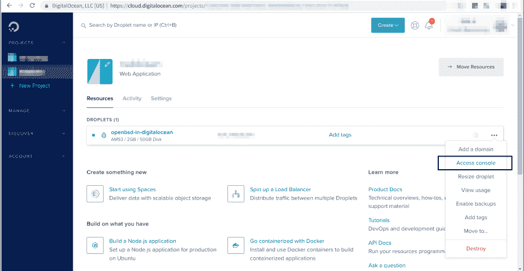
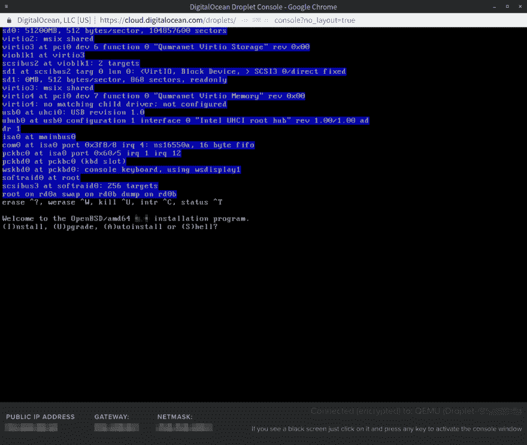
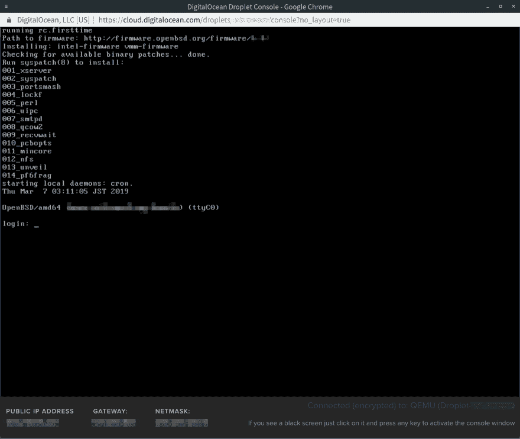

# DigitalOcean 上的自定义 OpenBSD Droplet

> 原文：<https://dev.to/nabbisen/custom-openbsd-droplet-on-digitalocean-4a9o>

*封面图片由 [KevinYi](https://pixabay.com/users/kevinyi-18324/) 原创，经过精心编辑。

## 总结

嗨:)
这个帖子展示了如何在[数字海洋](https://digitalocean.com)中创建 [OpenBSD](https://www.openbsd.org) 水滴。

这个过程简单而简单:

1.  数字海洋小组
    *   启用 SSH 登录，创建 [FreeBSD](https://www.freebsd.org/) drolpet。
2.  嘘
    *   下载映像。
    *   把它写入存储器。
3.  数字海洋水滴控制台
    *   重新启动并运行安装程序。

详细步骤如下。

<center>✿ ✿ ✿</center>

## 准备

#### 数字海洋面板

首先，(按需注册并)[登录 DigitalOcean](https://cloud.digitalocean.com/login) 。

然后，在数字海洋菜单中的**创建 FreeBSD 水滴**:[创建水滴](https://cloud.digitalocean.com/droplets/new)。

*注意:ufs 和 zfs 都可以接受。

记得**设置“添加您的 SSH 密钥”**。
此外，我们可以通过命令行生成密钥，如下所示:

```
$  ssh-keygen -t rsa -C "%YOUR-EMAIL-ADDRESS%" 
```

Enter fullscreen mode Exit fullscreen mode

#### SSH

**使用 SSH 客户端以根用户或超级用户身份连接到 droplet**:

```
$  ssh -i ~/.ssh/%id_rsa% root@%YOUR-HOST% 
```

Enter fullscreen mode Exit fullscreen mode

[下载](https://www.openbsd.org/faq/faq4.html#Download)安装程序镜像为`minirootXX.fs`文件:

```
#  fetch https://cdn.openbsd.org/pub/OpenBSD/6.5/amd64/miniroot65.fs
miniroot65.fs                                 100% of 4800 kB   35 MBps 00m00s 
```

Enter fullscreen mode Exit fullscreen mode

然后，停止交换:

```
#  # case ufs:
#  swapoff /dev/gpt/swap
#  # case zfs:
#  swapoff /dev/gpt/swap0 
```

Enter fullscreen mode Exit fullscreen mode

此外，停止 geom 调试，以便将数据写入存储器:

```
#  sysctl kern.geom.debugflags=0x10
kern.geom.debugflags: 0 ->  16 
```

Enter fullscreen mode Exit fullscreen mode

将安装程序镜像写入存储器:

```
#  dd if=miniroot65.fs of=/dev/vtbd0 bs=512k
9+1 records in
9+1 records out
4915200 bytes transferred in 0.032766 secs (150008149 bytes/sec) 
```

Enter fullscreen mode Exit fullscreen mode

你准备好“访问控制台”了吗？点击此按钮启动数字海洋控制台:

[](https://res.cloudinary.com/practicaldev/image/fetch/s--mMw7ThPU--/c_limit%2Cf_auto%2Cfl_progressive%2Cq_auto%2Cw_880/https://thepracticaldev.s3.amazonaws.com/i/qkl6n9ypq0pypnkptjbt.png)

让它开着。

好的。让我们重新启动虚拟机。
在您的 ssh 会话中键入以下内容:

```
#  reboot 
```

Enter fullscreen mode Exit fullscreen mode

现在，宋承宪完成了。切换到数字海洋控制台。

## 安装

#### 数字海洋水滴控制台

打开 DigitalOcean 控制台，等待启动完成。
OpenBSD 安装程序会像往常一样问你明确选择哪个选项！

[](https://res.cloudinary.com/practicaldev/image/fetch/s--G4dr5Zi4--/c_limit%2Cf_auto%2Cfl_progressive%2Cq_auto%2Cw_880/https://thepracticaldev.s3.amazonaws.com/i/x20l3ezky9q0znbigngv.png)

*提示:选择`shell`而不是`install`或`autoinstall`使我们能够应用全磁盘加密。
为此，在 shell 上运行如下命令(摘录):
`bioctl -c C -l /dev/sd0a softraid0`
之后运行`install`。

使用安装程序配置网络时，需要**使用控制台**底部的“公共 IP 地址”/“网关”/“网络掩码”的值，而不是 DHCP 等等:

*   vio0 的 IPv4 地址？= "公共 IP 地址"
*   vio0 的网络掩码？= "网络掩码"
*   默认 IPv4 路由= "网关"
*   DNS 域名服务器:8.8.8.8 8.8.4.4(例如)

您将通过 **http** 获得集合的位置。

完成所有安装并重启虚拟机后，您应该说“Hello，OpenBSD”:

[](https://res.cloudinary.com/practicaldev/image/fetch/s--pN1cFkUr--/c_limit%2Cf_auto%2Cfl_progressive%2Cq_auto%2Cw_880/https://thepracticaldev.s3.amazonaws.com/i/hi52nqiia07qhj2t6czz.png)

<center>✿ ✿ ✿</center>

祝您在 DigitalOcean 上享受 OpenBSD 带来的快乐计算，享受酷炫的系统和酷炫的服务: )