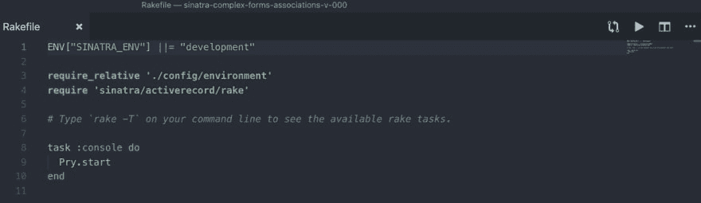
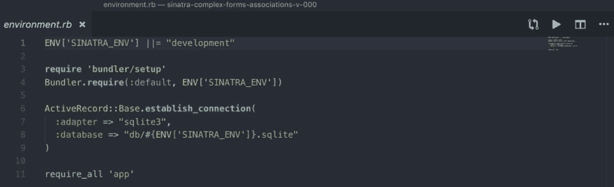
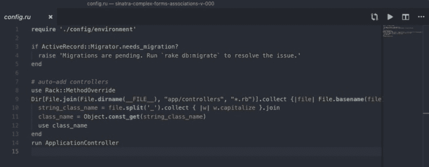
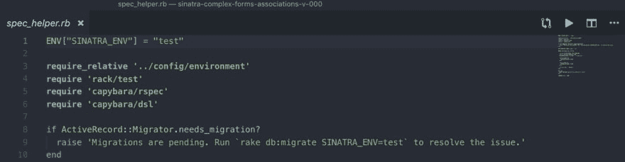

# 那是怎么回事！？:SINATRA_ENV

> 原文：<https://dev.to/meg_gutshall/whats-up-with-that-sinatraenv-b70>

如果您在熨斗学校的 Sinatra 活动记录区，您可能已经多次看到此错误消息:“迁移正在进行中。运行`rake db:migrate SINATRA_ENV=test`来解决问题。我们知道需要运行`rake db:migrate`来创建迁移表，但是`SINATRA_ENV`...那是怎么回事！？

首先，让我们一行一行地检查几个文件，这样我们就可以通过我们的应用程序跟踪`ENV["SINATRA_ENV"]`的旅程。为此，我使用了 [Sinatra 复杂形式协会实验室](https://github.com/meg-gutshall/sinatra-complex-forms-associations-v-000)。

## [构造文件](#rakefile)

`"SINATRA_ENV"`是 Ruby 的`ENV`散列的关键，定义了您的部署环境。这是在你的`Rakefile`中设定的。

[](https://res.cloudinary.com/practicaldev/image/fetch/s--pClX6GMP--/c_limit%2Cf_auto%2Cfl_progressive%2Cq_auto%2Cw_880/https://thepracticaldev.s3.amazonaws.com/i/zvixj1a7z2exbqj9j23c.jpg)T3】

```
1 . ENV["SINATRA_ENV"] ||= "development" 
```

在本部分的大多数实验中，这将是您的`Rakefile`的第一行。这意味着如果`"SINATRA_ENV"`还没有值，它的值将被设置为等于`"development"`。

```
3 . require_relative './config/environment' 
```

这将加载我们应用程序的`environment.rb`文件。

```
4 . require 'sinatra/activerecord/rake' 
```

这将从`sinatra-activerecord`宝石中加载耙子任务。第 8-10 行定义了一个自定义 Rake 任务，它启动了一个新的探查会话。

## Environment.rb

现在让我们检查一下我们的`config/environment.rb`文件。

[](https://res.cloudinary.com/practicaldev/image/fetch/s--yMEuXJXR--/c_limit%2Cf_auto%2Cfl_progressive%2Cq_auto%2Cw_880/https://thepracticaldev.s3.amazonaws.com/i/xav49qftkl6d9992m6w6.jpg)T3】

```
1 . ENV["SINATRA_ENV"] ||= "development" 
```

我们再次看到我们的`"SINATRA_ENV"`被定义。为了维护干代码，我从`Rakefile`中删除了第 1 行，我在实验室的所有测试仍然顺利通过。

```
3 . require 'bundler/setup'
4 . Bundler.require(:default, ENV['SINATRA_ENV']) 
```

在第 3 行和第 4 行，我们需要我们的 gem 和依赖项。第 3 行找到我们的`Gemfile`,并通过将它们添加到加载路径中，使其中包含的所有 gem(以及它们的依赖项)对 Ruby 可用。在第 4 行，我们要求我们的所有 gem(`:default`代表所有 gem，因为我们没有为这个应用程序创建 gem 组)以及我们的部署环境 hash 与活动记录 gem 一起使用。

```
6 . ActiveRecord::Base.establish_connection(
7 .   adapter: "sqlite3",
8 .   database: "db/#{ENV[‘SINATRA_ENV’]}.sqlite"
9 . ) 
```

在第 6 到 9 行，我们建立了数据库连接。我们的`adapter`设置我们用来保存数据的数据库管理系统的名称(全部用小写字母输入),我们的`database`设置应用程序数据库的路径。这个路径包括我们的部署环境散列，它是第 4 行的`Bundle.require`的一个参数，将根据我们的键值改变，指向其他数据库。

```
11 . require_all 'app' 
```

这会加载嵌套在`app`下的所有其他文件来运行程序。

## Config.ru

最后，让我们看看我们的`config.ru`文件。

[](https://res.cloudinary.com/practicaldev/image/fetch/s--dPb3gqRM--/c_limit%2Cf_auto%2Cfl_progressive%2Cq_auto%2Cw_880/https://thepracticaldev.s3.amazonaws.com/i/xr5iylg5oni6e2kqqdtv.jpg)T3】

```
1 . require './config/environment' 
```

同样，这将加载我们应用程序的`environment.rb`文件。注意到我们`Rakefile`中这一行和 3 行的区别了吗？两者做同样的事情，他们只是以不同的方式要求`environment.rb`文件。

```
3 . if ActiveRecord::Migrator.needs_migration?
4 .   raise 'Migrations are pending. Run `rake db:migrate` to resolve the issue.'
5 . end 
```

第 3 行到第 5 行检查以确保我们的迁移已经运行。如果没有，第 4 行的错误信息就会出现。

```
8 . use Rack::MethodOverride 
```

是一个 Sinatra 中间件，它拦截我们的应用程序运行的每个请求。它将通过把请求翻译成由`value`属性设置的任何内容来解释任何带有`name="_method"`的请求——在我们的 Sinatra 课程中通常是`PATCH`或`DELETE`。这一行必须放在`config.ru`文件中，在您想要访问中间件功能的所有控制器之上。

```
9 . Dir[File.join(File.dirname(__FILE__), "app/controllers", "*.rb")].collect {|file| File.basename(file).split(".")[0] }.reject {|file| file == "application_controller" }.each do |file|
10 .   string_class_name = file.split('_').collect { |w| w.capitalize }.join
11 .   class_name = Object.const_get(string_class_name)
12 .   use class_name
13 . end 
```

在第 9 行到第 13 行，我们安装了嵌套在`app/controllers`下的控制器。这些类也将作为中间件加载。在这种情况下，他们将是`use OwnersController`和`use PetsController`。注意`"application_controller"`是如何被拒绝的？这是因为它在下面的第 14 行被调用。

```
14 . run ApplicationController 
```

这一行创建了我们的`ApplicationController`类的一个实例，它可以响应来自客户端的请求。我们只能`run`一个等级，其余的通过`use`装载。

## 汇集一切

所以现在我们知道了每次运行`Rakefile`、`config/environment.rb`和`config.ru`文件时会发生什么。我们仍然需要回答`ENV["SINATRA_ENV"]`到底是什么的问题。

`ENV`是 Ruby 环境变量的一个类似散列的访问器。它会根据 Ruby 需要什么信息而变化。`ENV`访问器保存 Ruby 及其相应框架和 gem 的所有类型的信息。在我们的例子中，Ruby 需要定义一个`"SINATRA_ENV"`，所以它被添加为`ENV`的一个键。

当我们运行`learn`来测试我们的应用程序时，这会触发 gem RSpec，它将运行我们的`spec_helper.rb`文件。

[](https://res.cloudinary.com/practicaldev/image/fetch/s--Sjtg7Iv7--/c_limit%2Cf_auto%2Cfl_progressive%2Cq_auto%2Cw_880/https://thepracticaldev.s3.amazonaws.com/i/mv8kppugc236comeo31p.jpg)T3】

```
1 . ENV["SINATRA_ENV"] = "test" 
```

正如我们在第 1 行看到的，我们的`ENV["SINATRA_ENV"]`被设置为等于`"test"`，这样当我们按照第 3 行的指示转到我们的`environment.rb`文件时，`ENV["SINATRA_ENV"]`已经被赋值了，因此不采用`"development"`的值。这意味着在我们的`environment.rb`文件的第 4 行，部署环境散列依赖项的值为`"test"`，而在第 8 行，我们正在与一个完全不同的数据库建立连接——`db/test.sqlite`！该数据库包含匹配预期测试输出的种子数据。

第 4 行到第 6 行需要与测试相关的 gems。

```
8 . if ActiveRecord::Migrator.needs_migration?
9 .   raise 'Migrations are pending. Run `rake db:migrate SINATRA_ENV=test` to resolve the issue.'
10 . end 
```

第 8 到 10 行检查以确保我们的迁移已经运行。否则，第 9 行会出现错误消息...现在我们又兜了一圈。除非我们先运行迁移，否则应用程序将无法运行，因为我们没有任何信息可显示或操作。

我们的`spec_helper.rb`文件的其余部分配置应用程序进行测试，然后运行我们的`config.ru`文件。

## 散弹枪

我想指出最后一个区别。在 Sinatra 部分，我们了解了一个叫做`shotgun`的可信赖的小东西，它允许你用自动代码重载特性启动你的基于框架的 web 应用。它启动一个 Rack server 并监听任何请求，因此当您点击浏览器的刷新按钮时，您可以看到对已保存的代码所做的更改。你所要做的就是在你的终端键入`shotgun`来开始一个新的会话。

启动一个新的`shotgun`会话就像启动一个新的`rackup`会话，因为我们的应用程序首先加载的是我们的`config.ru`文件，在第一行，需要我们的`environment.rb`文件。在这一点上，`ENV["SINATRA_ENV"]`将被设置为等于`"development"`，我们的`environment.rb`文件的其余部分将被执行，将我们带回`config.ru`。同样，如果我们还没有运行我们的迁移，我们有机会在我们的`config.ru`文件的第 4 行产生一个错误消息。然而，这条消息只是说“运行`rake db:migrate`来解决问题”，而不是“运行`rake db:migrate SINATRA_ENV=test`来解决问题”，这是为什么？这是因为代码行`ENV["SINATRA_ENV"] ||= "development"`，它将`"development"`设置为`"SINATRA_ENV"`键的默认值。因为这是默认设置，所以我们不必在错误消息中指定另一个`"SINATRA_ENV"`。

## 结论

对我来说，一开始是一团乱麻，但是经过大量研究和深入钻研我的代码文件，我逐渐理解了它在我的程序中的用途。希望这篇文章也能帮助你更好地理解它。