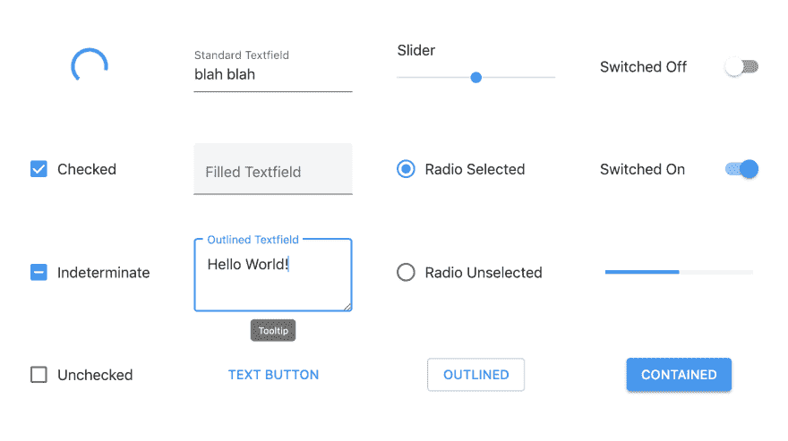

# 两天前我发布了 Matter

> 原文：<https://dev.to/finnhvman/two-days-ago-i-released-matter-53fe>

这是第一次发布[物质](https://github.com/finnhvman/matter)。我以前从未做过开源，所以这是我在这个场景中的第一次发布。

这个项目可以追溯到大约半年前，当时我只需要一些好看的组件来做一个 [CodePen 演示](https://codepen.io/finnhvman/full/oPwXRa)。按钮，滑块，开关，文本字段，网页的一些常用组件。我是一个材料设计的大粉丝，我找不到任何精益和简单的方法来将这些材料组件集成到我的笔中。我想实现它们应该不难。

我也是纯粹的 [CSS](https://codepen.io/finnhvman/full/xXpzVN) [Stuff](https://codepen.io/finnhvman/full/gzmMaa) 的忠实粉丝。我想知道这些组件是否可以不用 JavaScript 来完成。事实证明，有了这个限制，你可以走很长一段路。虽然功能还不完善，但对于很多用例来说已经足够了。

CodePen 有一个不错的社区，我收到了一些关于材料组件的反馈。然而，这些笔还是有点不实用。我的意思是，我花了相当多的时间来完善它们中的每一个，并且没有简单的方法让其他人从中受益。下一步:开源。

在过去的两个月里，我一直在为一个开源项目的典型问题寻找解决方案。我花在测试上的时间最多，我认为这是这个项目最好的事情之一！(但是你用 CSS 考什么？——你可能会问，嗯那是另一个故事了)。反正 Matter 有 [0.1.0 版本](https://github.com/finnhvman/matter/releases/tag/0.1.0)。不多，但这是诚实的工作:

我可以想象这个项目会有几个方向，我想知道会是哪一个...