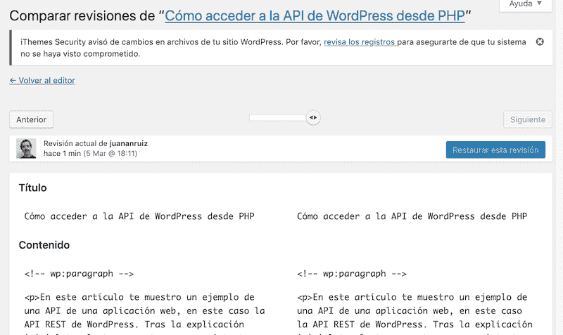

# 删除或限制 WordPress 中的文章版本？

> [https://dev . to/juananuiz/debires-删除或限制-WordPress-4n6g](https://dev.to/juananruiz/deberas-quitar-o-limitar-las-revisiones-de-artculos-en-wordpress-4n6g)中的文章修订版

用户在网络上无法原谅的一件事是速度慢。内容可能会变得更高或更低，设计也可能变得更具吸引力，如果他们发现任何有价值的东西，他们会一直陪伴着你。但是一个加载缓慢的网页是令人难以忍受的，如果加上谷歌的疯狂因为网络速度快，你就有了完美的风暴。

在 WordPress 中，需要控制的关键维之一是数据库的大小。创建文章或页面并进行修改时，系统会自动将不同版本保存到数据库中。在某些情况下，这非常有用，因为它允许您查看和检索旧版本的内容，但随着时间的推移，数据库中的修订越来越多，数据库的大小越来越大，并且您的站点开始刷新(在资源有限的 web 上，我甚至看到它阻止了新条目的创建)。

[](https://res.cloudinary.com/practicaldev/image/fetch/s--DFRRlZmq--/c_limit%2Cf_auto%2Cfl_progressive%2Cq_auto%2Cw_880/https://kungfupress.com/wp-content/uploads/2019/03/revisiones-entrada-baja.png)

因此，有必要寻求妥协的解决办法，以应对维持或不维持修订的困境。如果您有一个良好的备份计划，并且选择首先优化速度，则可以完全不使用审核系统。如果您想要中间解决方案，您至少可以限制保存的版本数。

另一个相当保守的解决方案是使用 WP-optimist 这样的插件，它允许您检查文章的修订总数并对其采取各种措施，但它也非常有用，因为它允许您查找孤立记录并将其从数据库中删除。

## **如何禁用代码**中的文章修订

为此，需要修改文件 **wp-config.php** 。第一步是访问网站上的文件，并备份该文件，以防无意中修改了不该修改的内容。

然后编辑该文件，并在行

$ table _ prefix =∞以下的部分

但始终在定义常数的行上方添加以下行:

```
define('WP\_POST\_REVISIONS', false); 
```

写得好很重要，如果在返回网页时看到错误或害怕的空白屏幕，请重新检查您写的内容，确保引号正确，句号和逗号等。文件中的位置也很重要，正如我之前所说的那样。但是也不要太害怕，如果你想成为 WordPress 的实施者或开发者，你必须习惯这些事情。为了更安静，你可以先在测试博客或本地练习。并始终记住，如果读取停止，则应事先从 wp-config.php 文件中提取备份。

这样您就移除了修补程式，但是 WordPress 会继续自动储存档案，这不会占用资料库空间，但是如果您不想经常这样做，您可以将预设时间从 1 分钟增加到 3 或 5 分钟。为此，在前面一行的上方添加以下内容:

```
define('AUTOSAVE\_INTERVAL', 300); 
```

这将自动管理设置为 300 秒，即 5 分钟。请记住，所有这些都必须超越

最后保存 wp-config.php 文件，您将看到修订选项不再显示在文章发布面板中。

## **如何(否)通过插件禁用文章修订。读完！**

事实证明，在寻找能够做到这一点的插件时，我几乎唯一能找到的是**【disable post revision】**([【https://WordPress . org/plugins/disable post revision/](https://wordpress.org/plugins/disable-post-revision/)，它是一个非常轻量级的插件，只适用于这些。它还提供了根据内容类型(页面、条目、媒体等)禁用标记的选项。

当我分析插件或将代码片段发布到此 web 时，我不满足于查找找到的第一个插件、测试该插件并向前移动。我喜欢看插件的代码看看它在内部做什么，看看它对网站、数据库等有什么影响。

[](https://res.cloudinary.com/practicaldev/image/fetch/s--lRxYHYh5--/c_limit%2Cf_auto%2Cfl_progressive%2Cq_auto%2Cw_880/https://kungfupress.com/wp-content/uploads/2019/03/disable_post_revision.png)

安装此外挂程式、设定此外挂程式并查看其运作方式后，我感到惊讶的是，虽然无法从「控制台」存取修正程式，但仍会继续记录修正程式。也就是说，外挂程式移除了您存取修补程式的优势，并继续让您留着棕色的允许将其储存在错误的资料库中！如果你想安装它！

## **如何使用**插件删除现有站点的旧修订

如果要查看以前未安装此类插件的现有站点，您可能会发现对某些内容进行了数百次修订，从而使数据库降级，那么迄今为止所看到的解决方案是无效的

要删除旧修订版，发光插件为**WP-optimized。**在开始使用本插件或任何致力于从数据库中删除内容的人之前，必须对数据库进行**是或是**备份。此外，第一次测试应该在本地 web 上进行，其测试内容您不介意丢失。如果您尚未安装备份插件，我建议您使用 upforce plus([https://upforceplus . com/](https://updraftplus.com/)

将插件安装到您的管理菜单中后，请查看选项**数据库，**选中选项**清除所有条目修订**，并给按钮**运行优化**。

你会看到 WP-optimist 还有很多选择，但在这篇文章中，我不想脱离我们的话题。

## **如何从代码中删除旧修订。**

要从代码中删除旧修订，您需要访问 WordPress 站点中的数据库，并在其上键入以下 SQL 语句:

```
DELETE FROM wp\_posts WHERE post\_type = "revision"; 
```

## 摘要

我想写一个简单的条目，说明如何在您的 wp-config.php 文件中添加一行，如果您需要禁用 WordPress 修补程序存储机制。建议您不要默认这样做，因为在许多情况下，您可以撤消我们对文章所做的更改，或从旧版本的页面中检索信息，这样做可能会对您有所帮助。

我只是想让你知道，所有这些修订都存储在数据库中，如果你有很多条目，并且对某些宿舍做了很多修订，可能会给系统带来负担。

一路上，我发现一个插件不按我说的做，我还留了一点儿黑板，因为它是官方存储库的插件。如果有人用了它，而且对你有用的话，请给我留下一个关于你使用的版本的评论，或者告诉我我做错了什么。