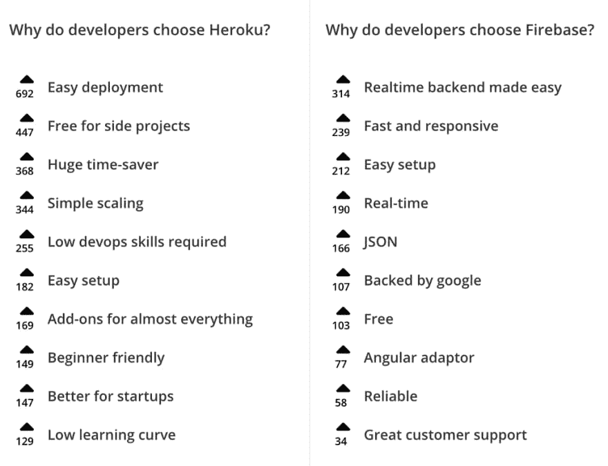
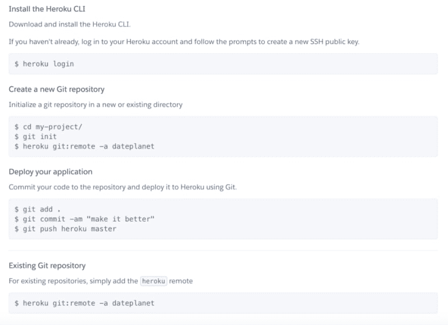
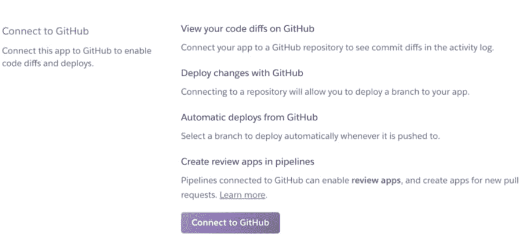

# 要不要建一个 web app？

> 原文：<https://dev.to/kcarrel/do-you-want-to-build-a-web-app-o6i>

熨斗学校的软件工程师沉浸式项目的第 6 周在这里意味着新的挑战和学习机会比比皆是！比如——我团队的 ruby on rails 项目如何从 Github 发布到互联网上进行演示？基本要求如下:

*   创建一个小组选择的 Rails 项目，该项目至少有 5 个模型和 20 个方法
*   除非获得批准，否则不得使用原料药
*   没有 Javascript
*   分析页面

过去模块 2 项目的例子利用 Heroku (a PaaS)或 Firebase (a Baas)来展示他们的项目。然而，我对这种服务的基础知识是零，我想在我们进入我们项目的本质之前，我会为这篇博客帖子投入 PaaS/BaaS 事实调查任务。

### 此亦须 PaaS

抛开可怕的双关语不谈——什么是 PaaS，作为一名学生开发人员，它如何融入我的成长？PaaS 代表**平台即服务**或**应用平台即服务。**这是一种云计算服务，为开发人员提供了一个开发、测试和启动应用程序的平台，无需担心设置服务器、存储或备份等后端任务。由于提供了重要的 PaaS 支持，开发人员可以将重点放在应用程序的前端设计和用户体验上。

**需要考虑的一些优势:**

*   PaaS 允许开发者测试新的语言、操作系统和数据库，而无需自己建立必要的基础设施
*   升级开发工具更加容易和快速
*   内置分析工具，用于识别业务洞察力和行为模式
*   可以提供建立和维护客户数据库等服务
*   使用 PostgreSQL 数据库管理系统代替 SQLite

PaaS 目标是关注底层基础设施，并涵盖 IT 团队通常拥有的操作方面。这使得开发人员能够更快地开发和交付应用程序——对于我们这样的学生来说，这是一个巨大的优势，他们可以在一周内完成项目。

**要考虑的缺点:**

*   需要开发人员构建和设置数据库
*   数据安全性—信息存储在异地

尽管有上面列出的缺点，PaaS 允许开发人员灵活地在平台上编程，而无需直接处理平台维护。

### 关于咩咩的一切

既然我们已经有了 PaaS 的定义，那么它与 BaaS 有什么不同呢？BaaS 代表 **Backend as a Service** as，它是一种云计算模型，作为中间件，供开发人员通过 API 和软件开发工具包将其移动或 web 应用程序连接到云服务。它是连接应用程序后端和前端的桥梁。

**需要考虑的一些优势:**

*   允许开发人员只关注他们的前端和用户体验
*   将您的 rails 应用程序链接到 Firebase 实时数据库的 5 步流程
*   非常适合快速启动和运行应用程序

**要考虑的几个缺点:**

*   BaaS 服务的主要缺点是您被一家供应商所束缚
*   主要面向移动应用
*   BaaS 不管理应用程序运行时和执行(责任在开发人员)

虽然 BaaS 有很多优势，但如果您希望在未来更换供应商(如 AWS)，它似乎有一个更陡峭的学习曲线，灵活性更低。

### **【fire base vs heroku】**

鉴于我们现在知道 PaaS 和 BaaS 是什么，很明显我们是在处理苹果和橘子。那么，我如何发现哪个水果类比适合我们的项目呢？以下是我在决策过程中最重要的三个考虑点:

*   估计项目的范围
*   两个军种的学习机会
*   考虑价格
*   未来灵活性

带着以上想法，我潜入 ruby on rails 开发者论坛和 StackShare(一个供开发者评估 SaaS 和开发者工具的排名网站)寻找指导。

以下是在 StackShare 上提供的 Heroku 和 Firebase 之间的有益比较。

<figure>

<figcaption></figcaption>

</figure>

鉴于这个项目的初学者性质，Heroku 似乎将提供最好的价格(免费)，两者中最低的学习曲线，以及灵活性/相对容易在将来将项目转移到 AWS(如果需要扩展的话)。

### 我需要英雄(ku)！

经过上述研究，我认为 Heroku 可能最适合我的小组的项目范围。尽管这需要更多的时间投入，但它提供了对后端过程更基本的控制。Heroku 的注册过程免费且简单——那么未来的项目集成将如何工作呢？

Heroku 提供了使用 Heroku CLI 或将 Github 直接连接到应用程序的选项。

**选项 1**

<figure> 

<figcaption>在命令行中轻松交互</figcaption>

</figure>

#### 选项 2

<figure> 

<figcaption>通过 Github</figcaption>

</figure>

简单一步连接

既然我们已经确定了 PaaS，那么是时候关注项目的核心并努力获得通过了！