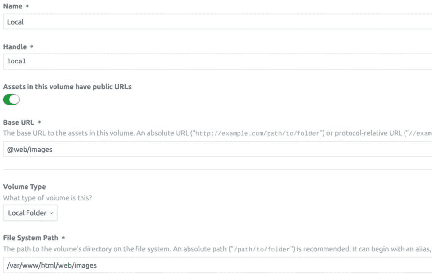
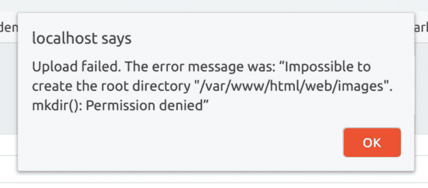

# 使用 Docker 的 CMS 开发工作流:第 1 部分-本地开发

> 原文：<https://dev.to/mattgrayisok/a-craft-cms-development-workflow-with-docker-part-1---local-development-24c8>

*原贴于[mattgrayisok.com](https://mattgrayisok.com)T3】*

当在许多项目中使用特定的技术和框架并围绕它们开发工作流时，很容易开始认为围绕它们建立起来的知识是理所当然的。尤其是当这些知识已经被整理成文或者已经成为你日常工作的一部分时。

我发现不时后退一步，回顾一下随着时间的推移积累起来的所有知识是很有帮助的。我认为从头到尾写下我目前的工艺流程中涉及的所有步骤可能是有用的。从让 Craft 在本地运行的基础，到构建和链接资产、测试和持续集成，再到在生产中使用 docker 进行原子部署。

如果你遵循这整个系列，你将从零开始构建一个现代的开发工作流程，在可预见的未来，它将为你的小型和大型工艺项目提供很好的服务。嗯，直到码头工人不再酷了...

## 先决条件

在本地使用 docker 的好处在于，无论您的项目使用什么技术，这几乎就是您需要在本地安装的全部内容。

因此，在我们陷入困境之前，我们唯一需要做的就是确保 docker 安装在您的开发机器上。

## 入门

让我们创建一个新的工作目录，以及一个保存项目源文件的子目录。我喜欢将项目的文件与用于构建它的工具分开，这样其他开发人员就可以更容易地分辨出哪些文件是特定于项目的，哪些文件是支持性的。

```
mkdir craft-in-docker
cd craft-in-docker
mkdir src 
```

我们需要的第一个文件是一个基本的工艺项目。我们可以使用 composer 为我们创建这些。

```
cd src
docker run --rm -v $(pwd):/app composer/composer create-project craftcms/craft .
sudo chown -R $USER:$USER . 
```

为什么我使用 docker 运行 composer？

我不喜欢在我的开发机器上安装东西——由于安装了不正确的工具版本，我在过去做了很多噩梦，我很高兴能够通过在 docker 容器中运行所有东西并在每次执行时选择合适的工具版本来避免所有这些垃圾。

我承认这有点冗长。请随意为您的`~/.bashrc`或`~/.zshrc`添加别名。我的工具都是这么做的。

当你以这种方式工作时，要小心权限。Docker 容器倾向于以根用户身份运行，所以一旦新文件被创建，你可能就没有写权限了。如果发生这种情况，你可以像我上面所做的那样。

现在我们已经建立了一个基础工艺项目，我们需要创建 docker 容器来容纳我们的新项目。

我们将从为配置文件创建一个目录结构开始。

```
cd ..
mkdir -p docker-config/php
mkdir -p docker-config/nginx 
```

我们将为我们的项目创建两个定制的 docker 容器，所以我们已经为每个容器创建了一个目录。这些目录将存放容器的主要配置脚本，以及它们需要的、与我们的 Craft 代码库不直接相关的任何其他脚本或资产。

让我们从为 php 容器创建一个`Dockerfile`开始。这个容器的唯一职责是运行 php-fpm:解析我们的 php 文件并返回适当的响应。

使用您最喜欢的编辑器，将以下内容添加到`docker-config/php/Dockerfile`。

```
FROM php:7.2-fpm

RUN apt-get update && apt-get install -y \
        libfreetype6-dev libjpeg62-turbo-dev \
        libmcrypt-dev libpng-dev libbz2-dev \
        libssl-dev autoconf \
        ca-certificates curl g++ libicu-dev \
        libmagickwand-dev mysql-client\
        && \
        pecl install imagick-3.4.3 mcrypt-1.0.1 \
        && \
        docker-php-ext-install \
        bcmath bz2 exif \
        ftp gd gettext mbstring opcache \
        shmop sockets sysvmsg sysvsem sysvshm \
        zip iconv pdo_mysql intl \
        && \
        docker-php-ext-configure gd --with-freetype-dir=/usr/include/ --with-jpeg-dir=/usr/include/ \
        && \
        docker-php-ext-enable imagick mcrypt

RUN curl -sS https://getcomposer.org/installer | php -- --install-dir=/usr/local/bin/ --filename=composer
RUN composer global require hirak/prestissimo

RUN echo "upload_max_filesize = 10M" > /usr/local/etc/php/php.ini && \
    echo "post_max_size = 10M" >> /usr/local/etc/php/php.ini && \
    echo "max_execution_time = 300" >> /usr/local/etc/php/php.ini && \
    echo "memory_limit = 256M" >> /usr/local/etc/php/php.ini

COPY --chown=www-data:www-data ./src /var/www/html

RUN composer install -d /var/www/html/ && \
    chown -R www-data:www-data /var/www/html/vendor && \
    chown -R www-data:www-data /var/www/html/composer.lock 
```

该文件首先设置我们的基础映像——我们将要构建的起点。在这种情况下，我们从官方的 php-fpm 7.2 映像开始，它附带了一个 php-fpm 解释器，没有其他的。

从这一点出发，我们安装了一些 OS 和 PHP 级别的依赖项，包括 Craft 需要运行的所有东西。

接下来，我们下载并安装 composer。这将允许我们从我们的容器中执行 composer，这样我们就可以做类似于`composer require`的事情，而不必像之前运行`composer create-project`时那样依赖外部映像。

我们还安装了 prestissimo，这大大加快了作曲的速度。

接下来我们设置一些 PHP ini 设置，因为 2MB 的上传限制永远不够大。

最后一步是将我们的项目复制到容器中并安装依赖项。我们只需将所有项目文件从 src 复制到容器的预配置 webroot 中，运行 composer install，然后调整一些文件权限。

当这个 docker 文件运行时，它将创建一个图像，其中包含了我们阅读和解释项目 PHP 文件所需的所有内容。然后，我们可以利用这个生成的图像做其他事情，比如安装临时测试代码或者将它部署到阶段和产品中。

我们的下一个任务是为 nginx 容器创建 Dockerfile。这个 Dockerfile 将创建一个映像，负责接收传入的流量，或者立即用静态文件的内容进行响应，或者将请求传递给我们的 PHP 容器进行处理。

将以下内容添加到`docker-config/nginx/Dockerfile`。

```
FROM nginx:1.15

COPY ./docker-config/nginx/default.conf /etc/nginx/conf.d/default.conf
COPY --chown=www-data:www-data ./src/web /var/www/html/web 
```

正如你所看到的，我们使用 nginx 作为我们的基本图像，然后复制一个新的默认配置文件以及我们的 Craft 项目的 web 文件夹。

我们需要覆盖默认配置，以便告诉 nginx 它应该将某些请求转发给我们的 PHP 容器。接下来让我们来看看。

将以下内容添加到`docker-config/nginx/default.conf`。

```
server {
    listen 80 default_server;
    root /var/www/html/web;
    index index.html index.php;
    charset utf-8;

    location / {
        try_files $uri $uri/ /index.php?$query_string;
    }

    access_log off;
    error_log  /var/log/nginx/error.log error;

    sendfile off;

    client_max_body_size 10m;

    gzip              on;
    gzip_http_version 1.0;
    gzip_proxied      any;
    gzip_min_length   500;
    gzip_disable      "MSIE [1-6]\.";
    gzip_types        text/plain text/xml text/css
                      text/comma-separated-values
                      text/javascript
                      application/x-javascript
                      application/javascript
                      application/atom+xml;

    location ~ \.php$ {
        fastcgi_split_path_info ^(.+\.php)(/.+)$;
        fastcgi_pass php:9000;
        fastcgi_index index.php;
        include fastcgi_params;
        fastcgi_param SCRIPT_FILENAME $document_root$fastcgi_script_name;
        fastcgi_intercept_errors off;
        fastcgi_buffer_size 16k;
        fastcgi_buffers 4 16k;
        fastcgi_read_timeout 300;
    }

    location ~ /\.ht {
        deny all;
    }
} 
```

对于 nginx 服务器来说，这是一个非常基本的设置，它将尝试使用本地磁盘上的文件来服务请求，如果找不到匹配的文件，该请求将被转换为对 index.php 的请求。然后，它将特殊规则请求定义为*。php 文件，这使得它们通过 fastCGI 被转发到另一个主机/端口组合。

要理解这个文件最重要的部分是:

```
fastcgi_pass php:9000; 
```

这一行告诉 nginx 应该将到达 PHP 容器的请求发送到哪里。具体来说，我们将这些请求转发到端口 9000 上名为 php 的主机。

我们的 nginx 容器如何知道如何找到我们的名为 php 的容器？我们将很快讨论这个问题...

在此之前，我们只需要跳回到 nginx Dockerfile 的最后一行，在这里我们将 web 目录复制到 nginx 容器的文件系统中。我们为什么要这么做？

当收到来自外界的请求时，它总是首先到达我们的 nginx 服务。Nginx 在处理静态文件请求方面非常快——这是它的设计初衷——所以我们没有必要向 PHP 转发任何静态文件请求，因为 PHP 在处理静态文件请求方面非常慢。然而，我们的两个容器有它们自己的、完全独立的文件系统。因此，我们需要确保他们每个人都能访问他们需要的所有文件，以便尽快完成工作。

由于 nginx 将只向公众提供静态文件，这些静态文件都将位于公众可访问的`web`文件夹中，这就是我们需要复制的全部内容。

所以现在我们有了创建两个 docker 图像所需的一切。我们可以在任何安装了 docker 的系统上执行这些映像，以便创建两个运行的容器，但是目前这些容器彼此不了解，也不能相互通信。我们可以通过使用 docker-compose 来解决这个问题，这是一个组织运行容器的配置和执行的工具。

将以下内容添加到项目目录根目录下的`docker-compose.yml`中:

```
version: '2'
services:
  nginx:
      build:
        context: .
        dockerfile: ./docker-config/nginx/Dockerfile
      ports:
          - 80:80
      volumes:
          - cpresources:/var/www/html/web/cpresources

  php:
      build:
        context: .
        dockerfile: ./docker-config/php/Dockerfile
      expose:
          - 9000
      volumes:
          - cpresources:/var/www/html/web/cpresources
      environment:
        ENVIRONMENT: dev
        DB_DRIVER: mysql
        DB_SERVER: database
        DB_USER: project
        DB_PASSWORD: project
        DB_DATABASE: project
        DB_SCHEMA: public
        DB_TABLE_PREFIX: craft_
        SITE_URL: http://localhost
        SECURITY_KEY: AAAAAAAAAAAAAAAAAAAAAAAAAAA

  database:
      image: mariadb:10.3
      volumes:
          - db-data:/var/lib/mysql
      ports:
          - 3306:3306
      environment:
          MYSQL_ROOT_PASSWORD: secret
          MYSQL_DATABASE: project
          MYSQL_USER: project
          MYSQL_PASSWORD: project

volumes:
  db-data:
  cpresources: 
```

这个文件允许我们定义一组容器，这些容器应该作为一个单独的集合来执行。它们都将共享一个公共网络，并且能够使用该文件中定义的名称相互寻址。

前面我们特别提到了一个事实，nginx 在端口 9000 上向一个名为 php 的主机发送所有的 PHP 文件请求。这个文件是定义该名称的地方。

类似地，我们在 PHP 容器中设置环境变量，告诉 Craft 使用一个名为 database 的数据库服务器。然后，我们使用预构建的 mariadb 映像创建这个容器。

我们的 nginx 和 php 容器被设置为使用我们已经创建的相关 docker 文件。

Craft 本身所要求的对这个文件的一个重要补充是，我们将一个共享的 cpresources 目录挂载到我们的 php 和 nginx 容器中。这是必要的，因为 Craft(实际上是 Yii)假设我们的 web 服务器和 PHP 服务器都可以访问同一个文件系统，然而，由于我们已经将它们分割到不同的容器中，它们并不可以。为了解决这个问题，我们创建了一个命名卷，并将其挂载到两个容器的文件系统中的相同位置。使用这种方法，当我们的 php 容器写入 cpresources 文件夹时，nginx 容器将立即访问这些文件。

让我们看看到目前为止我们的工作是否有回报。安顿下来，这需要几分钟...

```
docker-compose up 
```

您应该会看到您的两个映像正在构建。然后，它们将与 mariadb 映像一起被执行，以便创建三个可以相互通信的运行容器。

在我们的`docker-compose.yml`中，我们还告诉 nginx 通过将端口 80 绑定到本地主机的端口 80 来监听端口 80 上的传入流量。

(如果您看到一个错误，说明“端口已经分配”，这可能是因为您已经有一些正在运行的东西正在侦听传入的流量- MAMP，Apache，nginx 或类似的东西。在继续之前，您需要找到并关闭它，或者将`docker-compose.yml`中 nginx 的端口绑定更改为类似- 8080:80 的内容，改为监听 8080。)

点击一下这个:

[http://localhost/admin](http://localhost/admin)

希望你会看到 Craft 的安装页面，准备做它的事情。

请随意在你的新船坞环境中玩耍。

当你准备好的时候，在你的终端中 Ctrl+C 来停止容器的运行。

## 更新文件

在本地开发期间，我们想要做的一件非常强制性的事情是编辑我们项目的文件。如果我们做不到，我们就走不远。因此，让我们回顾一下我们当前的构建系统正在做什么:

*   我们正在创建一个包含 PHP 和所有 Craft 依赖项的图像
*   将我们的项目文件复制到此图像中
*   运行 composer install 以获取第三方 PHP 包
*   创建一个 nginx 镜像，它将流量路由到 PHP，也直接服务于静态文件
*   将我们的公共 web 文件夹复制到此映像中
*   使用 docker-compose 将这些与数据库连接在一起

我们的两个定制映像都依赖于将我们的文件复制到它们的文件系统中。一旦这样做了，如果不重建映像并使用它们来启动新的容器，我们真的没有办法对这些文件进行更改。这是一个问题，因为我们不希望每次对项目文件进行更改时都必须重新构建图像。

你可以通过编辑`src/templates/index.html`，看到刷新浏览器时没有任何影响来证明这一点。

要解决这个问题，我们需要将项目文件“挂载”到运行容器中。Docker 让这变得相对容易，我们所需要做的就是告诉它我们希望将主机文件系统上的哪些文件挂载到容器中，以及我们希望它们放在容器中的什么位置。

本质上，我们要做的是用开发机器上相同文件的链接替换我们在映像构建过程中复制的项目文件。这个挂载过程是在从映像创建容器时执行的，因此您可以将其视为对基本映像的执行时调整。图像是真理的源泉，但是我们可以对它做一些小小的改变，以便让它做一些有用的事情。

在`docker-compose.yml`中，将 nginx 和 php 卷更新为:

```
nginx:
      ...
      volumes:
          - cpresources:/var/www/html/web/cpresources
          - ./src/web:/var/www/html/web
  php:
      ...
      volumes:
          - cpresources:/var/www/html/web/cpresources
          - ./src/composer.json:/var/www/html/composer.json
          - ./src/composer.lock:/var/www/html/composer.lock
          - ./src/config:/var/www/html/config
          - ./src/modules:/var/www/html/modules
          - ./src/templates:/var/www/html/templates
          - ./src/web:/var/www/html/web 
```

这里我们告诉 docker-compose 将我们的主机文件系统的 web 文件夹挂载到 nginx 映像的 web 文件夹之上。我们还将项目的几个目录挂载到 php 容器中。为什么不是所有文件夹？两个原因:

挂载的文件系统可能会很慢，我们希望尽可能少的挂载。我们不想将供应商目录登记到我们的版本控制中。如果另一个开发人员克隆了这个项目，我们不希望我们的配置引用一个可能在我们的主机文件系统上不存在的目录。当 PHP 映像被构建时，无论如何都会在容器中创建供应商目录。从现在开始，每当我们在这些挂载目录中的一个目录下编辑我们的主机文件系统上的一个项目文件时，这个变化将立即反映在我们的两个运行的容器中。

使用 Ctrl+C 终止正在运行的容器(如果还没有的话),然后再次运行 docker-compose up，用新挂载的文件重新创建容器。刷新您的浏览器。

```
/var/www/html/config isn't writable by PHP. Please fix that. 
```

这有点令人难过。

为了弄清楚这里发生了什么，我们需要了解三件事:

*   Unix 权限
*   Docker 容器有自己的一组用户和组，完全独立于运行它们的主机
*   装入容器的文件带有它们的权限

因此，在我们的主机文件系统上，我们的项目文件很可能属于我们当前登录的用户(如果您在 windows YMMV 上)。我们可以用
来检查

```
ls -l

total 12
-rw-rw-r-- 1 matt matt 1121 Dec  4 11:29 docker-compose.yml
drwxrwxr-x 4 matt matt 4096 Dec  3 23:28 docker-config
drwxrwxr-x 8 matt matt 4096 Dec  3 23:28 src 
```

我的所有项目文件都归`matt`所有，并且分组为`matt`。您还可以看到，对于非 matt 和不属于 matt 组的用户，不允许写权限。

鉴于这个用户和组在我们的容器中不存在，难怪 PHP 在写入这些目录时会遇到问题。

解决这个问题有几种方法，各有利弊:

*   将容器内的用户 id 与主机上的用户 id 相匹配(不推荐-将构建的映像绑定到主机的配置)
*   更改主机上文件的所有者和组以匹配容器用户(不推荐-使文件难以在主机上编辑)
*   放宽主机上特定目录和文件的权限(推荐——但如果您正在处理敏感文件，请小心)

第三个选项是迄今为止最简单的，它可以防止您必须配置您的映像来匹配您的主机，这将使它很难在其他地方运行。

我们需要做的就是:

```
chmod -R 777 src/config
chmod 777 src/composer.* 
```

这些是我们从主机装载到容器中的东西，我们希望 Craft 能够编辑它们。通过将它们的权限设置为 777，我们允许任何用户(包括我们容器中的用户)对它们进行更改。

我们现在应该能够刷新我们的浏览器窗口，并看到以前的错误已经解决。

现在我们已经准备好开始配置 Craft，创建模板文件，并在我们的 web 文件夹中放置静态资产。

## 图片上传

为了允许通过 Craft 上传图像，我们需要设置一个资产源。在本地开发过程中，您可能希望使用本地文件系统资产源，并且上传文件的位置也可能在公共 web 目录中。

在上面的配置步骤中，我们将主机文件系统的 web 目录挂载到 PHP 和 nginx 容器中，因此 PHP 写入该文件夹的任何文件实际上都将被写入到我们的主机文件系统中，并且也会立即反映到我们的 nginx 容器中。

我们可以这样定义 Craft 中的新资产源:

[](https://res.cloudinary.com/practicaldev/image/fetch/s--CG4uUYHL--/c_limit%2Cf_auto%2Cfl_progressive%2Cq_auto%2Cw_880/https://mattgrayisok.com/uploads/_postImage/231/Screenshot-from-2018-12-04-12-27-41.jpg)

这是非常标准的，只需注意文件系统路径，这是 Craft 将上传文件写入的 PHP 容器内的路径。

保存后，我们可以尝试将图像上传到新的资产源。

[](https://res.cloudinary.com/practicaldev/image/fetch/s--tKPnpF4Z--/c_limit%2Cf_auto%2Cfl_progressive%2Cq_auto%2Cw_880/https://mattgrayisok.com/uploads/_postImage/232/Screenshot-from-2018-12-04-12-34-56.jpg)

我们收到这个错误是因为 Craft 试图在我们的主机文件系统的挂载的 web 目录中创建一个名为 images 的文件夹，但是我们没有更改任何允许这种情况发生的权限。

```
mkdir src/web/images
chmod 777 src/web/images
echo '*\n!.gitignore' > src/wimg/.gitignore 
```

通过在我们的主机文件系统上创建 images 文件夹并设置宽松的权限，我们允许 Craft 成功处理上传到该目录的图像。我还添加了一个`.gitignore`,首先防止测试上传被签入我们的版本控制，其次确保当任何其他开发人员克隆项目时创建这个目录。

## 检查日志

因为我们没有在 PHP 容器中的 Craft 存储文件夹上挂载任何东西，Craft 将把它的日志文件写到容器的文件系统中，而不是我们主机的文件系统中。这意味着没有明显的方法来检查它的内容。Docker 确实允许我们在容器内部执行操作，通过它我们可以实现这一点。

```
# Output the last 200 lines of the log
docker-compose exec php tail -n 200 /var/www/html/storage/logs/web.log

# Pipe the log file into a text editor for easy navigating
docker-compose exec php cat /var/www/html/storage/logs/web.log | gedit -
docker-compose exec php cat /var/www/html/storage/logs/web.log | mate 
```

为了改进日志审查的过程，还可以选择使用 Docker 的日志记录系统，这会给你更多的灵活性。

## 下一步

我们现在应该有了我们需要的一切来进行一些当地的发展。在本系列的下一部分中，我将介绍如何在 docker 中运行前端构建链，以便我们可以在不安装任何依赖项的情况下构建我们的 javascript 和 css，并确保我们的构建过程受版本控制并可在开发人员之间转移，而不会遇到所有这些经典的节点/npm 版本不匹配问题。