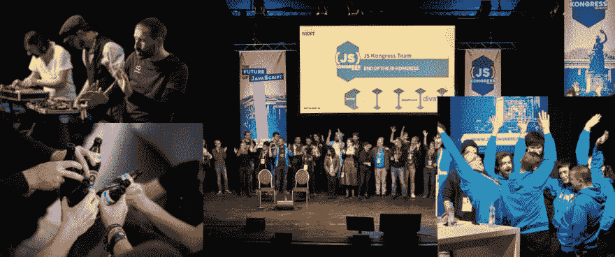

# #日本女作家的感觉

> 原文：<https://dev.to/jskongress/the-jskongress-feeling-463k>

<figure>

<figcaption>JS kong RESS 2017 印象:带翻译的乐队 9v，第 1 天晚上碰杯，第 2 天压轴，Orga-Team(从左至右)</figcaption>

</figure>

经过一天的准备，下周日晚上在 Alte Kongresshalle 再次“现场直播”将是一种很棒的感觉。带着这样的想法，赶紧去参加演讲者晚宴，然后顺便去参加会前聚会，欢迎来自世界各地的人们，他们来到这里只是因为一个令人惊叹的团队带来了一年多的热情、耐心、动力和爱，开始了一个国际社区会议，试图为这个可爱的 JavaScript 开源社区提供一个平台。

讨论反映基础设施和软件需求冠军联赛的技术的空间。我想我们可以说，仅仅几年之后，互联网就成了慕尼黑的客人。

没有 JavaScript，基于浏览器的互联网是不可想象的，没有 JavaScript，互联网不会有今天的 UX。这到底是好是坏，我们不得不一再质疑！但是今天 JS 是互联网事实上的 UX——没有这个社区就没有好的购物体验，没有跟踪，没有流量的货币化，

操***！想想吧！

下周与你们社区的人见面，重拾“互联网是我们设计的东西，而不是我们消费的东西”的热情，这将是非常美妙的。

关注事情的细节，热烈的讨论，在第一个晚上结束时喝了一杯酒和 9 伏特。会很好看的！同样在第二天，内啡肽会掩盖疲劳。

 JavaScript 社区

<figure></figure>

#### 作者:马尔科·恩格尔哈德

在 MySpace 出现之前很久，一个玩具收藏者网络社区的创始人，一个艺术家社区的创始人。Hackerbrücke 遇见联合创始人& Make Days、

UX it 顾问 CEO:agenten 和极客空间 9。自 1996 年起担任设计师。

* * *

*德文原版(如在* [*脸书上看到的*](https://www.facebook.com/marco.engelhard/posts/10158297753904447?%20__xts__%20%5B0%5D=68.ARBprVSR6kVtkU2ZHq4xXUqm0CXfbxFvcLdBt8Em-7l6jdL-L1qMyKj_2Zs9rOBX3BpEdXtKYfzQ5gQcKYL5vG3t0jrPQIZeAx-yh42OYd0%20__Kd4AQ3Buoxj69190WudGa-Nv4PKYCRqUGHnv2FYwiFhB7VFKn41cIOZPofZenNck0axyc5gRiDVWs0Hx-UA2gP2TPSmMMCj_puGag&__%20tn__=-R) *):*

下周日晚建成后，旧国会大厦再一次将是一种很棒的感觉□带着这张照片匆匆忙忙地去参加演讲人的晚宴，然后看完会前的聚会，欢迎来自世界各地的人们来到这里，这仅仅是因为一队铁锤般的好人带来了一年多的血液、耐心、动力和爱，并调动起来，建立了一个国际社团会议，试图为这个可爱的 JavaScript 开放源码社团提供一个平台。

讨论了重新反映基础架构和软件需求冠军联赛的技术领域。我想几年后我们可以说 JSK，我们在慕尼黑有互联网作为客人。

如果没有 JavaScript，基于浏览器的 Internet 现在就无法想象没有 JavaScript，Internet 就不会有今天的 UX。不管是好是坏，也要不断地质疑！但是现在 JavaScript 是互联网的 UX--没有这个社区，就没有购物的乐趣，没有跟踪，也没有流量货币化，

操***！想想吧！

接下来的一个星期里，人们会再次聚会，再次表达他们的热情:“互联网是我们设计的东西，而不是我们设计的东西

爱细枝末节的事，热烈的讨论，一杯饮料和 9 伏的电压来充实第一个晚上。会好起来的！即使在第二天，内皮素也会过度疲劳。

 JavaScript 社区

*本文作者是来自 JS Kongress Orga-Team 的 Marco e——发自内心！*

帖子[# JS KONGRESS feeling](https://js-kongress.com/2019/03/05/the-jskongress-feeling/)最早出现在 [JS KONGRESS 2020:扩展 JS——挑战极限:大规模平台、数据驱动架构和现代 API。](https://js-kongress.com)。