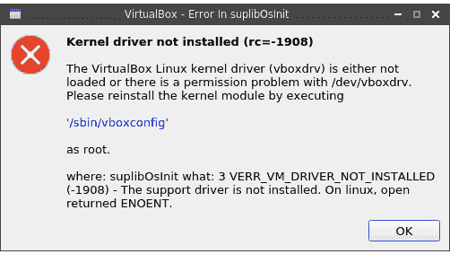

# Linux:VirtualBox Linux 内核驱动程序(vboxdrv)没有加载，或者/dev/vboxdrv 存在权限问题

> 原文：<https://dev.to/setevoy/linux-the-virtualbox-linux-kernel-driver-vboxdrv-is-either-not-loaded-or-there-is-a-permission-problem-with-devvboxdrv-44do>

[](https://res.cloudinary.com/practicaldev/image/fetch/s--FyPbe1qB--/c_limit%2Cf_auto%2Cfl_progressive%2Cq_auto%2Cw_880/https://rtfm.co.ua/wp-content/uploads/2012/11/virtualbox.jpeg) 每次安装完新的 VirtualBox 之后，我都会一次又一次地踩在同一个耙子上，不得不去谷歌问:

> VirtualBox Linux 内核驱动程序(vboxdrv)未加载，或者/dev/vboxdrv 存在权限问题

[](https://rtfm.co.ua/wp-content/uploads/2019/03/Screenshot_20190305_081734.png)

试图手动加载`vboxdrv`也会出现错误:

```
$ sudo modprobe vboxdrv
modprobe: FATAL: Module vboxdrv not found in directory /lib/modules/4.20.13-arch1-1-ARCH 
```

看起来内核版本是正确的，并且 PC 被重新启动:

```
$ uname -r
4.20.13-arch1-1-ARCH 
```

而且`rcvboxdrv`也没帮上忙(然而意料之中):

```
$ sudo rcvboxdrv
Unloading modules:
Loading modules: modprobe: FATAL: Module vboxnetadp not found in directory /lib/modules/4.20.13-arch1-1-ARCH
modprobe: FATAL: Module vboxnetflt not found in directory /lib/modules/4.20.13-arch1-1-ARCH
modprobe: FATAL: Module vboxpci not found in directory /lib/modules/4.20.13-arch1-1-ARCH
modprobe: FATAL: Module vboxdrv not found in directory /lib/modules/4.20.13-arch1-1-ARCH 
```

解决方案是，突然安装[`linux-headers`](https://www.archlinux.org/packages/core/x86_64/linux-headers/)——总是忘记它:

```
$ sudo pacman -S linux-headers 
```

其中包括所有必要的文件:

```
$ pacman -Ql linux-headers | grep vbox
linux-headers /usr/lib/modules/4.20.13-arch1-1-ARCH/build/drivers/staging/vboxvideo/
linux-headers /usr/lib/modules/4.20.13-arch1-1-ARCH/build/drivers/staging/vboxvideo/Kconfig
linux-headers /usr/lib/modules/4.20.13-arch1-1-ARCH/build/drivers/virt/vboxguest/
linux-headers /usr/lib/modules/4.20.13-arch1-1-ARCH/build/drivers/virt/vboxguest/Kconfig
linux-headers /usr/lib/modules/4.20.13-arch1-1-ARCH/build/include/config/drm/vboxvideo.h
linux-headers /usr/lib/modules/4.20.13-arch1-1-ARCH/build/include/config/vboxguest.h
linux-headers /usr/lib/modules/4.20.13-arch1-1-ARCH/build/include/linux/vbox\_utils.h
linux-headers /usr/lib/modules/4.20.13-arch1-1-ARCH/build/include/uapi/linux/vbox\_err.h
linux-headers /usr/lib/modules/4.20.13-arch1-1-ARCH/build/include/uapi/linux/vbox\_vmmdev\_types.h
linux-headers /usr/lib/modules/4.20.13-arch1-1-ARCH/build/include/uapi/linux/vboxguest.h 
```

另外，它被设置为 [`virtualbox-guest-dkms`](https://www.archlinux.org/packages/community/x86_64/virtualbox-guest-dkms/) 和 [`virtualbox-host-dkms`](https://www.archlinux.org/packages/community/x86_64/virtualbox-host-dkms/) 包的可选依赖项。

再次加载模块:

```
$ sudo rcvboxdrv
Unloading modules:
Loading modules: vboxnetadp vboxnetflt vboxpci vboxdrv 
```

运行你的 VirtualBox。

完成了。

### 类似的帖子

*   <small>02/15/2017</small>[Arch:Virtualbox–无内核 4 . 8 . 10-1-Arch headers](https://rtfm.co.ua/arch-virtualbox-no-kernel-4-8-10-1-arch-headers/)<small>(0)</small>
*   <small>2016 年 12 月 28 日</small>[【arch:оаоазоазоазоазоазоазоазоазоазоаззо】](https://rtfm.co.ua/arch-ustanovka-virtualbox-vagrant-i-docker/)
*   t08/09/2017 t1t 2 虚拟化:从 T3t 4 控制台创建和运行 VM