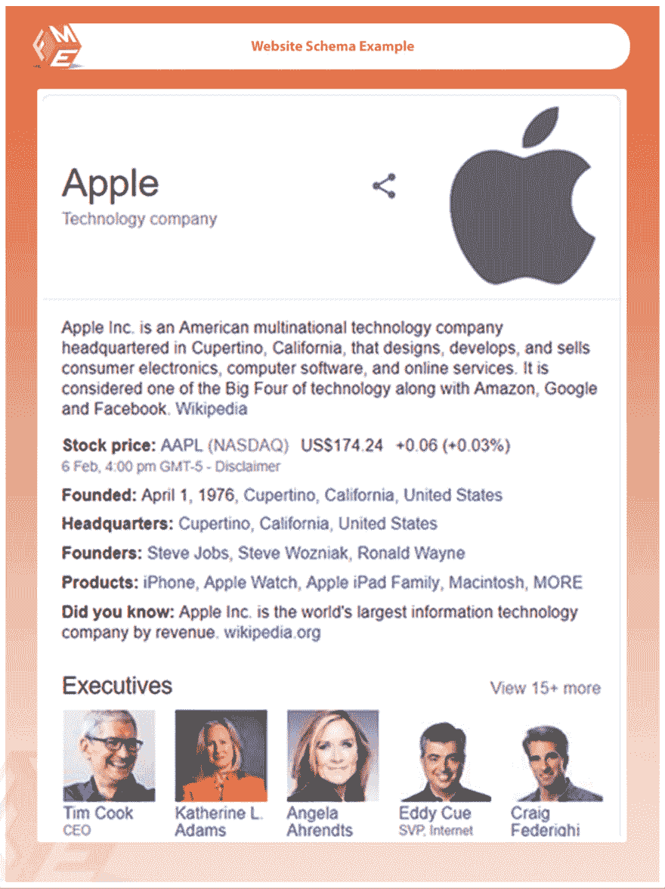
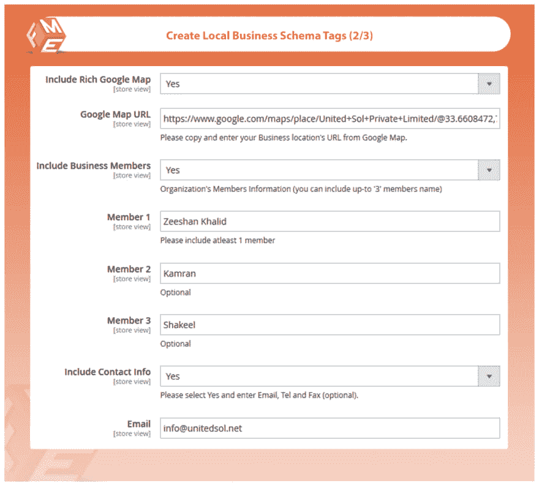
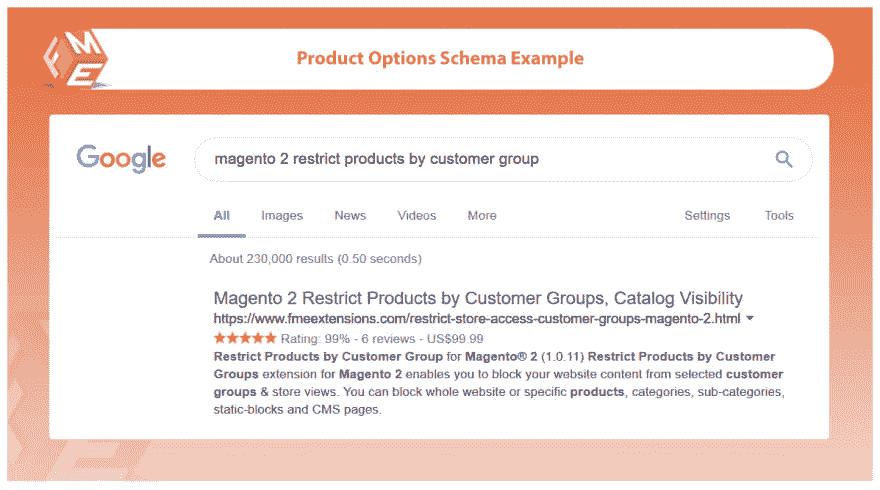

# 丰富的片段 Magento 2 的结构化数据

> 原文：<https://dev.to/simonwalkerfme/rich-snippets---structured-data-for-magento-2--1elh>

### **丰富的片段 Magento 2 的结构化数据**

#### **描述**

使用这个扩展，你可以为产品商业简介、社交链接、站点链接、搜索框、轮播、面包屑、Twitter 卡和脸书开放图添加模式标记。

给你的网站添加模式标记，提高你的点击率和搜索引擎优化性能。

### **主要特征**

### **添加网站和公司模式标签**

Rich Snippets 允许您显示您的联系信息以及公司业务标签

### **为本地业务添加模式标签**

在您当地的商业网站上添加 schema 标签将有助于您在当地吸引更多的客户。你可以展示你生意的重要细节来增加搜索结果的点击率。您可以显示以下详细信息

*   企业名称和标志
*   描述和企业网址
*   营业时间和价格范围
*   丰富的谷歌地图
*   商业成员
*   联系信息，即电子邮件、电话、传真
*   包含街道、城市、邮政编码、州和国家的地址

### **启用产品模式标签(评级、价格、股票等)**

使用这个扩展，您可以在搜索引擎结果页面上显示更多的页面细节。像价格，评级，股票等)，这有助于增加你的点击率，也增加长期搜索引擎优化得分。

### **添加模式标签以显示面包屑&搜索框**

您可以启用在搜索引擎结果页面上显示带有您的网站链接的搜索框。

### **在搜索引擎中突出显示社交档案**

你可以用丰富的片段展示你的社交媒体档案。

### **为转盘添加模式标签**

您可以添加链接，在一个吸引人的丰富片段的转盘中显示产品。

### **额外功能——脸书公开赛的标签&推特卡**

。

您可以启用 Twitter 和脸书标签，当您的链接被共享时，这些标签会为您的链接获取特色图片。

**了解更多详情&演示-** **[Magento 2 丰富片段](https://www.fmeextensions.com/google-rich-snippets-structured-date-extension-magento-2.html)**

[T25】](https://res.cloudinary.com/practicaldev/image/fetch/s--CFgkpYQO--/c_limit%2Cf_auto%2Cfl_progressive%2Cq_auto%2Cw_880/https://thepracticaldev.s3.amazonaws.com/i/76g5u1bcyqiyna9pxlns.png)