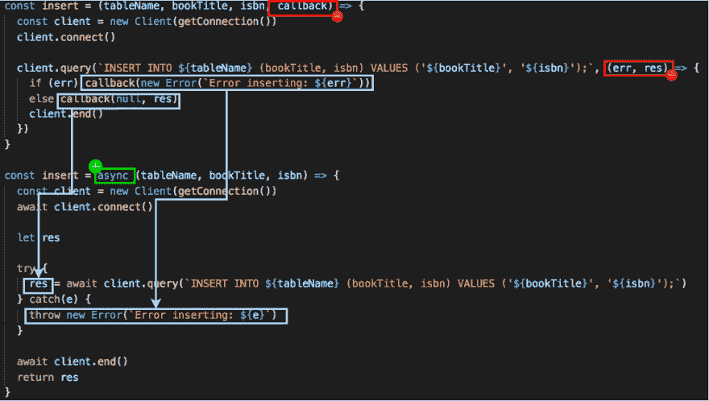
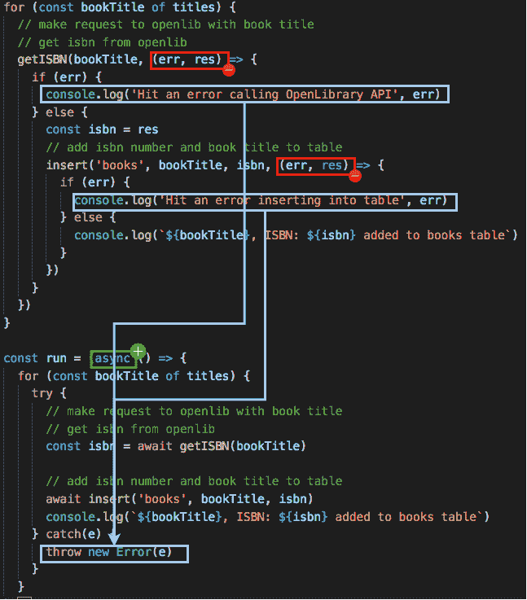

# 将 callback -> async/await 转换过程应用到现实世界的例子中

> 原文：<https://dev.to/ccleary00/applying-the-callback---asyncawait-conversion-process-to-a-real-world-example-4ii>

***原载于 [coreycleary.me](https://www.coreycleary.me/applying-the-callback-async-await-conversion-process-to-a-real-world-example/)** 。这是我的内容博客的交叉帖子。我每一两周发布一次新内容，如果你想直接在收件箱里收到我的文章，你可以[注册我的时事通讯](https://www.coreycleary.me/about/)！我也定期发送备忘单和其他赠品。*

这是我在[上发表的关于将回叫转化为承诺和`async/await`功能](https://www.coreycleary.me/how-to-rewrite-a-callback-function-in-promise-form-and-async-await-form-in-javascript/)的过程的后续文章。

在那篇文章中，我坚持使用`setTimeout`作为在代码中引入一些异步性的简单方法。但我理解，对于一些人来说，他们需要更多的真实世界的例子来阅读和体验，以便真正理解这个概念。

所以那篇文章更多的是关于过程，而这篇文章更多的是关于实现。在本帖中，我们将跳过承诺，直接从回拨进入`async/await`。

### 回调版本

我们的设想是，我们需要:

*   循环阅读一系列书名
*   对于每一个，用书名向 [Openlibrary API](https://openlibrary.org/developers/api) 发出请求
*   从 Openlibrary 获取 isbn
*   在“图书”表中插入 isbn 号和书名

下面是使用回调的代码，这是我们将要转换的:

```
const request = require('superagent')
const { Client } = require('pg')

const titles = ['Gullivers Travels', 'Gravitys Rainbow']

const getISBN = (bookTitle, callback) => {
  return request
    .get('http://openlibrary.org/search.json')
    .query({q: bookTitle})
    .end((err, res) => {
      if (err) return callback(new Error(`Error calling OpenLibrary: ${err}`))
      if (res.status === 200) {
        const parsed = JSON.parse(res.text)
        const first_isbn = parsed.docs[0].isbn[0]
        return callback(null, first_isbn)
      }
    }
  )
}

const getConnection = () => {
  return {
    host: 'localhost',
    database: 'books',
    password: null,
    port: 5432,
  }
}

const insert = (tableName, bookTitle, isbn, callback) => {
  const client = new Client(getConnection())
  client.connect()

  client.query(`INSERT INTO ${tableName} (bookTitle, isbn) VALUES ('${bookTitle}', '${isbn}');`, (err, res) => {
    if (err) callback(new Error(`Error inserting: ${err}`))
    else callback(null, res)
    client.end()
  })
}

// loop over titles
for (const bookTitle of titles) {
  // make request to openlib with book title
  // get isbn from openlib
  getISBN(bookTitle, (err, res) => {
    if (err) {
      console.log('Hit an error calling OpenLibrary API', err)
    } else {
      const isbn = res
      // add isbn number and book title to table
      insert('books', bookTitle, isbn, (err, res) => {
        if (err) {
          console.log('Hit an error inserting into table', err)
        } else {
          console.log(`${bookTitle}, ISBN: ${isbn} added to books table`)
        }
      })
    }
  })
} 
```

### 应用流程

让我们开始应用流程。

我们将从`getISBN`函数开始:

[](https://res.cloudinary.com/practicaldev/image/fetch/s--2xGxAJIp--/c_limit%2Cf_auto%2Cfl_progressive%2Cq_auto%2Cw_880/https://www.coreycleary.me/wp-content/uploads/2019/02/cb-getjson.png)

然后是`insert`函数，用于插入数据库:

[](https://res.cloudinary.com/practicaldev/image/fetch/s--1mMloIS0--/c_limit%2Cf_auto%2Cfl_progressive%2Cq_auto%2Cw_880/https://www.coreycleary.me/wp-content/uploads/2019/02/cb-insert.png)

现在，执行我们逻辑的“主”函数:

[](https://res.cloudinary.com/practicaldev/image/fetch/s--Uz3Q8LRe--/c_limit%2Cf_auto%2Cfl_progressive%2Cq_auto%2Cw_880/https://www.coreycleary.me/wp-content/uploads/2019/02/cb-run-1.png)

对于这最后一点代码，对于`async/await`版本需要注意的一点是，如果`getJSON`函数调用中有错误，它将被`catch(e)`块捕获，函数将退出。不会调用`insert`函数。如果我们想避免这种行为，我们也可以将每个 await 调用包装在它自己的 try/catch 中。这只是取决于您正在处理的代码/特性的需求。

### 异步/等待后

下面是完整的`async/await`版本:

```
const request = require('superagent')
const { Client } = require('pg')

const titles = ['Gullivers Travels', 'Gravitys Rainbow']

const getISBN = async (bookTitle) => {
  let response

  try {
    const apiResponse = await request
      .get('http://openlibrary.org/search.json')
      .query({q: bookTitle})

    const parsed = JSON.parse(apiResponse.text)
    response = parsed.docs[0].isbn[0]
  } catch(e) {
    throw new Error(`Error calling OpenLibrary: ${e}`)
  }

  return response
}

const getConnection = () => {
  return {
    host: 'localhost',
    database: 'books',
    password: null,
    port: 5432,
  }
}

const insert = async (tableName, bookTitle, isbn) => {
  const client = new Client(getConnection())
  await client.connect()

  let res

  try {
    res = await client.query(`INSERT INTO ${tableName} (bookTitle, isbn) VALUES ('${bookTitle}', '${isbn}');`)
  } catch(e) {
    throw new Error(`Error inserting: ${e}`)
  }

  await client.end()
  return res
}

const run = (async () => {
  for (const bookTitle of titles) {
    try {      
      // make request to openlib with book title
      // get isbn from openlib
      const isbn = await getISBN(bookTitle)

      // add isbn number and book title to table
      await insert('books', bookTitle, isbn)
      console.log(`${bookTitle}, ISBN: ${isbn} added to books table`)
    } catch(e) {
      throw new Error(e)
    }
  }
})() 
```

### 包扎

如果第一个帖子没有帮到你，希望看到一个像这样的例子。

下次你需要转换回调的时候，应用[这个过程](https://www.coreycleary.me/how-to-rewrite-a-callback-function-in-promise-form-and-async-await-form-in-javascript/)并参考这里的帖子，以便更容易地掌握如何远离回调！

我正在编写许多新内容，以帮助 Node 和 JavaScript 更容易理解。更容易，因为我觉得不需要像有时候那么复杂。如果你喜欢这篇文章，并发现它很有帮助[这里是再次链接](https://www.coreycleary.me/about/)订阅我的时事通讯！