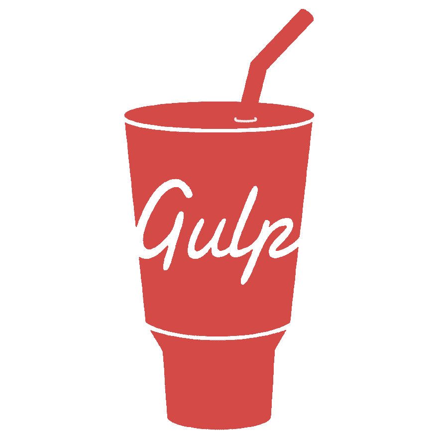
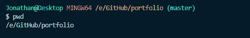
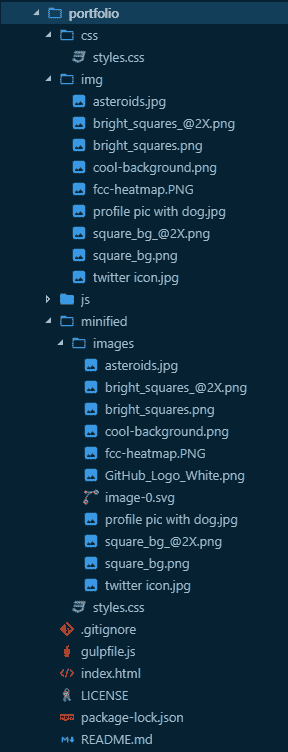
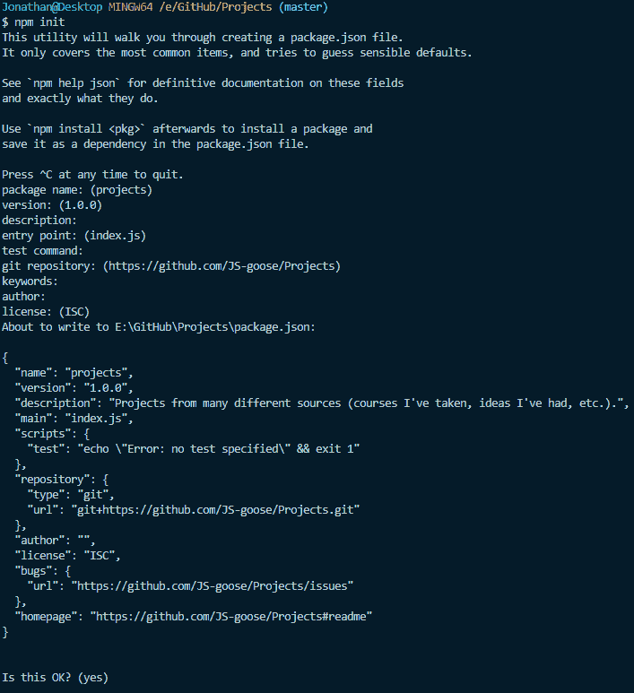
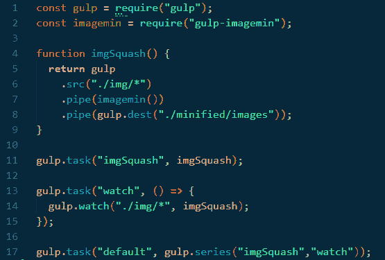

# 使用吞咽功能缩小图像

> 原文：<https://dev.to/jsgoose/minifying-images-with-gulp--gulp-imagemin-4pc1>

互联网上到处都是图片。你很难找到一个页面或应用程序不包含任何形式的图片。图像很棒，因为它们有助于讲述故事，强调我们生活中的重要部分。

但是如果你在任何方面都像我一样，你就会知道拥有一个大图片会严重影响你的网站/应用的性能。所以今天，我将教你如何使用 Gulp 和一个名为`gulp-imagemin`的`npm`包来动态缩小你的图片。

如果你不知道所有这些单词的意思，不要害怕！下面我有一些相关的和重要的链接/描述来帮助你跟上速度。

*   缩小是指删除源代码中不必要的部分以减小大小的行为或过程。
*   `Gulp`是一个 JavaScript 构建工具，允许你自动化你的工作流程的一部分，以简化你的过程。它会处理工作流程中一些不太有趣但很重要的方面(比如缩小图像尺寸)，这样你就可以专注于建筑。你可以在这里找到的[。](https://gulpjs.com/)
*   为了利用`npm`,我们需要安装`Node.js`,简而言之，这是一个允许开发者在服务器(后端)环境中使用 JavaScript 代码的框架。你可以在这里找到[节点。](https://nodejs.org/en/download/)
*   `npm`(节点包管理器)顾名思义。它是 JavaScript 的包管理器，是“世界上最大的软件注册表”。可以把`npm`想象成一个巨大的存储区，用来存放帮助开发人员的优秀的包/实用程序。你可以在这里[找到 NPM](https://www.npmjs.com/)。
*   是我之前提到的那些很棒的包之一。使用这个包，我们将能够在每次保存时自动缩小图像的大小。你可以在这里找到 gulp-imagemin。

好了，现在解释已经结束了，让我们开始有趣的部分吧，:D

## 项目文件结构

首先打开您选择的文本编辑器，为您的项目创建一个目录，或者如果您已经有一个目录，在您的终端中导航到该目录，并跳到**安装节点& npm 部分**。

如果你使用的是 [VS 代码](https://code.visualstudio.com/)，你可以点击`ctrl + ` (tilde)`找到终端内置的

下面是我的项目结构在终端中的样子:

<figure> 

<figcaption>我的项目文件结构在 VS 代码的终端</figcaption>

</figure>

内

下面是我的项目文件结构在 VS 代码中的样子:

<figure>

<figcaption>VS 代码浏览器窗格内我的项目文件结构</figcaption>

</figure>

正如你所看到的，我有一个单独的目录来存放我的基本文件和缩小文件。一旦你建立了你的项目目录，是时候开始安装我们需要的所有东西了。

## 正在安装节点和 npm

好了，现在我们的目录已经建立并运行了，让我们开始安装我们的依赖项。如果你已经安装了`Node & npm`，请随意跳到**安装吞咽&吞咽-图像部分**。

1.  首先，在您的终端中输入`node --v`,检查您是否安装了节点。如果你这么做了，你会得到类似于`v8.9.3`的东西
2.  如果您没有得到任何反馈或出现错误，只需从这里下载并[安装 Node。这可能需要几分钟，请耐心等待。](https://nodejs.org/en/download/)
3.  一旦安装了`Node.js`，你也就安装了`npm`，因为它是和`Node`捆绑在一起的。你可以在你的终端输入`npm -v`来检查`npm`的版本。你应该得到类似`6.4.1`的东西。
4.  接下来，我们需要为我们的项目创建一个`package.json`文件。我们通过使用命令`npm init`来做到这一点(在这里找到更多关于`[package.json](https://docs.nodejitsu.com/articles/getting-started/npm/what-is-the-file-package-json/)`T5 的信息)。你会被问一系列的问题，但是如果你不想回答，你可以不回答，只要按下回车键，直到你看到`Is this OK? (yes)`最后一次按下`Enter`，你就完成了这一部分。

<figure> 

<figcaption>在您的终端</figcaption>

</figure>

中完成 npm init 的步骤后，您应该会看到这个

您会注意到，这个文件是在与我开始创建的目录不同的目录中创建的。这是因为我可以提供一个例子，因为我以前已经在我当前的项目目录中安装了所有这些。

## 安装 Gulp & gulp-imagemin

一旦`Node & npm`安装完毕，我们现在可以按照以下步骤安装`Gulp & gulp-imagemin`:

1.  首先，在您的终端中键入`npm install --save-dev gulp`。如果你想知道`--save-dev`标志是做什么的，看看这个[栈溢出帖子](https://stackoverflow.com/questions/19223051/what-does-save-dev-mean-in-npm-install-grunt-save-dev)。
2.  再次强调，要有耐心，因为安装 Gulp 可能需要一分钟的时间，但你最终会得到这样的结果: `gulp@4.0.0 added 318 packages from 218 contributors and audited 6376 packages in 49.362s found 0 vulnerabilities`
3.  你可以在你的终端中输入`gulp -v`来检查你的 Gulp 版本，你会得到类似这样的东西:`[13:06:56] CLI version 2.0.1 [13:06:56] Local version 4.0.0`
4.  现在让我们通过键入`npm install --save-dev gulp-imagemin`来安装`gulp-imagemin`，你将再次得到类似这样的返回: `gulp-imagemin@5.0.3 added 232 packages from 97 contributors and audited 10669 packages in 39.103s found 0 vulnerabilities`
5.  这一部分的最后一步是创建我们的`gulpfile.js` ***这是非常重要的，你的文件有这个确切的名称，并在你的项目文件夹结构的最外层！***

## 编写代码——最后的乐趣！

好了，现在我们已经把所有的东西都安装到了正确的位置，让我们打开`gulpfile.js`并编写实际的代码来完成所有的艰苦工作。

1.  首先要求`gulp` - > `const gulp = require('gulp');`我们基本上是利用节点的模块系统来使用位于不同文件中的代码
2.  现在再次要求`gulp-imagemin` - > `const imagemin = require('gulp-imagemin');`我们利用模块系统在我们的项目中使用这段代码
3.  现在，我们需要写一个函数来完成所有的图像压缩:`function imgSquash() {
      **return** gulp  **.**src("./img/*")
      **.**pipe(imagemin())
      **.**pipe(gulp**.**dest("./minified/images"));
    }`
4.  如果你按照我的设置你的目录，上面的代码将会工作。如果你的目录看起来不同，你将需要改变`.src & .dest`行来匹配你的文件所在的位置和你希望它们在被缩小后被传送到的位置。
5.  基于任务运行，我们可以给它足够多的任务让它忙起来。一旦我们定义了完成繁重工作的实际函数，我们需要告诉`Gulp`如何处理这个函数:`gulp.task("imgSquash", imgSquash);`
6.  现在，我们希望`Gulp`观察给定目录的变化(新图像),当它检测到这些变化时，我们希望它自动运行我们的`imgSquash`函数，缩小我们的图像，并将它们传送到我们设置的目的地。我们通过定义另一个任务来实现监视目录:`gulp`**`.`**`task("watch", ()` **`=>`** `{
      gulp`**`.`**`watch("./img/*", imgSquash);
    });`
7.  编写代码的最后一步是定义最后一个任务，以连续调用我们的`imgSquash`和`watch`任务: `gulp`**`.`**`task("default",gulp`**`.`**`series("imgSquash","watch"));`这里的“默认”一词是指终端中的`gulp`一词，而`gulp.series`将确保`imgSquash`函数运行，并在 Gulp 之后立即观察目录的变化。

我们完成的文件应该是这样的:

<figure> 

<figcaption>这就是你完成 gulpfile.js 应该的样子</figcaption>

</figure>

保存这个文件，打开你的终端，输入`gulp`并按回车键。您应该会看到类似这样的内容:

<figure> 

<figcaption>终端查看运行后我们的大口任务</figcaption>

</figure>

正如你所看到的，每次一个新的文件被添加到基本目录，我们的任务就开始了，因为 Gulp 正在观察并立即运行我们的`imgSquash`函数来缩小我们的图像。当你使用完 Gulp 后，你可以在你的终端上点击`ctrl + c`来终止观察进程。

现在，您可以开始在您的网站/应用程序上使用您的缩小图像，并享受新发现的性能提升！

* * *

## 包裹

Gulp 是一个非常强大的 JavaScript 构建工具，它可以帮助自动化构建项目的一些更繁琐但重要的方面。只需不到一个小时的工作，您就可以缩小图像，从而减少加载时间，提高网站/应用程序的性能。太棒了，你应该为自己感到骄傲！

这只是像 Gulp 这样的构建工具可以帮助你的众多方式之一。它还可以有更多的帮助方式(缩小/连接 CSS/JS 文件),我希望你能探索其中一些令人敬畏的选项。

如果你喜欢这篇文章，一定要留下评论，让我知道你在做什么，以及 Gulp 如何帮助你专注于这个建筑。此外，当你在这里的时候，不要忘记注册**时事通讯**。你可以在这一页的右上角做。

一如既往，祝你有一个充满爱、快乐和编程的美好的一天！