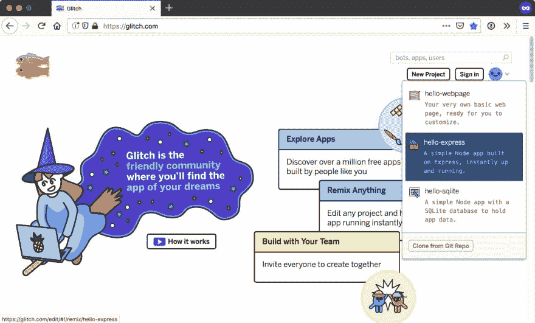
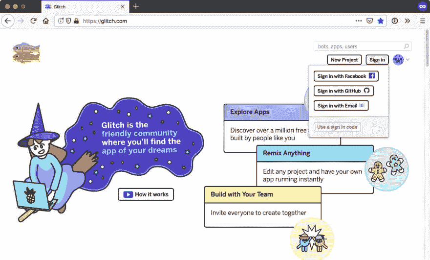
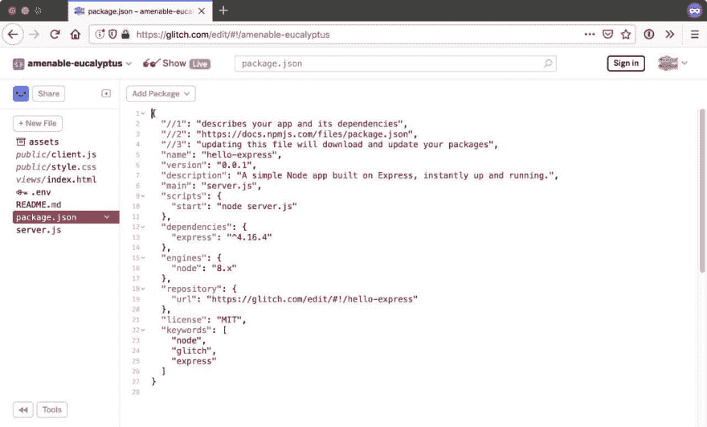
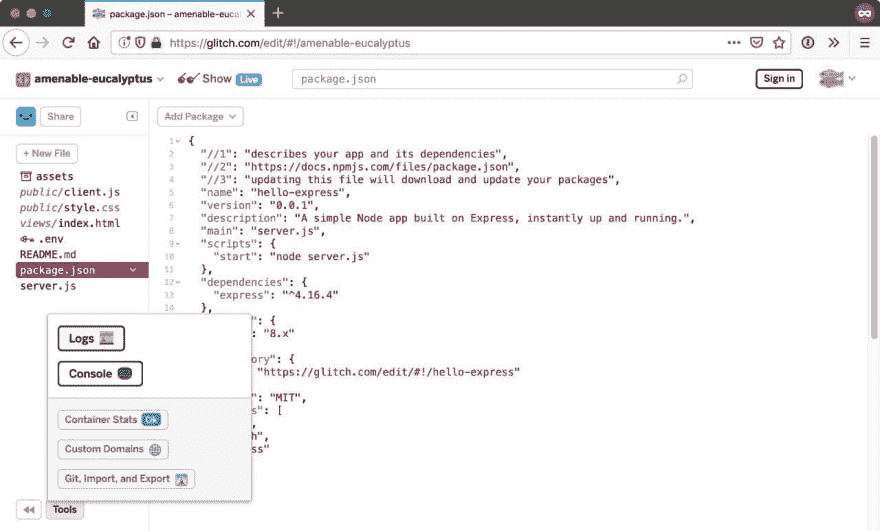
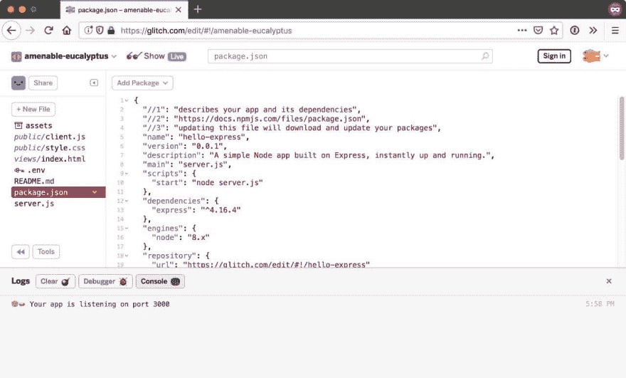
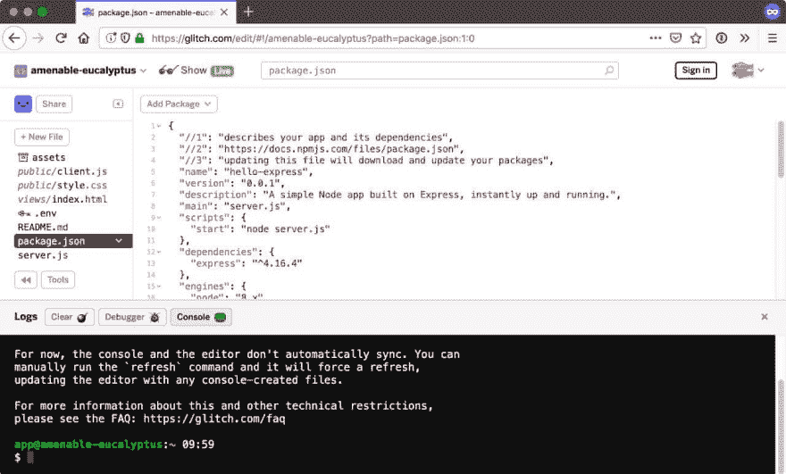
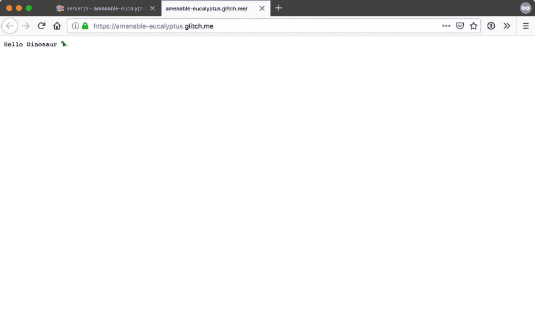
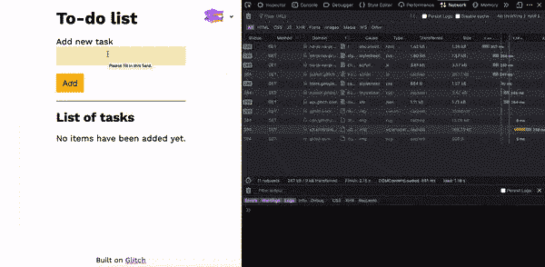
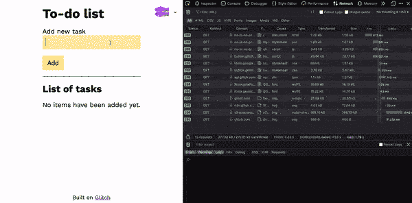

# 渐进增强练习

> 原文：<https://dev.to/huijing/an-exercise-in-progressive-enhancement-lk1>

在过去的几个月里，我有更多的机会在服务器端工作，特别是在 [Node.js](https://nodejs.org/en/) 和 [Glitch](https://glitch.com/) 已经成为我学习过程中不可或缺的一部分。

我最近参与的一个项目是一个很好的用例，让我熟悉了一个网站的实际实现，这个网站不需要 Javascript 也能工作，但一旦有了 Javascript，它就会得到增强。

有许多文章谈到渐进增强的好处，所有这些我都同意，但是作为一个不必太担心服务器端实现的人，我以前没有编写过满足它的服务器端代码。

这将是我在一个非常小的 Koa.js 待办事项列表应用程序上的渐进增强方法的思想过程和实现细节的书面记录。

*免责声明，这不是最好的代码，也不完全是最佳实践。但这是一个开始，而且只会越来越好。*

## 一个关于 Glitch 的基本 Koa.js 应用

如果你已经在使用 [Glitch](https://glitch.com/) ，请跳过这一切。对于那些还没有发现 Glitch 这个神奇平台的人来说，当你第一次登陆时，你可以选择你想要建立什么类型的项目。有 3 个预置，一个简单的网站(没有后端)，一个节点应用程序和一个 SQlite 数据库的节点应用程序。我选择了第二个选项。

[](https://res.cloudinary.com/practicaldev/image/fetch/s--i8fNhcow--/c_limit%2Cf_auto%2Cfl_progressive%2Cq_auto%2Cw_880/https://www.chenhuijing.com/asseimg/posts/progressive-enhancement/glitch-1280.jpg)

如果你想确保你的项目持续下去，注册一个故障账户是个好主意。Glitch 一直在相当频繁地进行功能改进，所以如果你阅读的是遥远的未来，这可能会改变，但在撰写本文时，他们支持通过脸书、GitHub、电子邮件或登录代码登录。

[](https://res.cloudinary.com/practicaldev/image/fetch/s--414vJDZh--/c_limit%2Cf_auto%2Cfl_progressive%2Cq_auto%2Cw_880/https://www.chenhuijing.com/asseimg/posts/progressive-enhancement/glitch2-1280.jpg)

默认情况下，Glitch 上的节点应用程序运行在 Express 上，这完全没问题。我选择在我的项目中使用 Koa.js，所以还需要几个步骤。

[](https://res.cloudinary.com/practicaldev/image/fetch/s--HIZ483bJ--/c_limit%2Cf_auto%2Cfl_progressive%2Cq_auto%2Cw_880/https://www.chenhuijing.com/asseimg/posts/progressive-enhancement/glitch3-1280.jpg)

如果你点击屏幕左下方的工具，你会看到一些选项，比如日志、控制台、容器统计等等。

[](https://res.cloudinary.com/practicaldev/image/fetch/s--NU9GaljS--/c_limit%2Cf_auto%2Cfl_progressive%2Cq_auto%2Cw_880/https://www.chenhuijing.com/asseimg/posts/progressive-enhancement/glitch4-1280.jpg)

在开发应用程序时打开日志是很好的，因为你的一切都会在这里显示出来。

[](https://res.cloudinary.com/practicaldev/image/fetch/s--piyH2l-N--/c_limit%2Cf_auto%2Cfl_progressive%2Cq_auto%2Cw_880/https://www.chenhuijing.com/asseimg/posts/progressive-enhancement/glitch5-1280.jpg)

要定制您想要在项目中使用的 npm 模块，您可以像访问本地机器或远程服务器一样访问命令行。需要注意的一点是，Glitch 使用`pnpm`作为包管理器，而不是`npm`。

[](https://res.cloudinary.com/practicaldev/image/fetch/s--FDiipU5V--/c_limit%2Cf_auto%2Cfl_progressive%2Cq_auto%2Cw_880/https://www.chenhuijing.com/asseimg/posts/progressive-enhancement/glitch6-1280.jpg)

通过运行以下命令删除 express:

```
pnpm uninstall express 
```

Enter fullscreen mode Exit fullscreen mode

然后，通过运行以下命令安装 KOA . js:

```
pnpm install koa --save 
```

Enter fullscreen mode Exit fullscreen mode

为了验证项目中使用的 npm 模块，您必须刷新环境:

```
refresh 
```

Enter fullscreen mode Exit fullscreen mode

完成后，您应该会在 Tools 旁边看到一个“错误”指示器。这很好，因为在`server.js`文件中，您需要的是不再存在的 Express 框架。

接下来要做的是重写基本的服务器代码来使用 Koa.js。

```
const Koa = require('koa')
const port = process.env.PORT || 3000
const app = new Koa()

app.use(async ctx => {
  ctx.body = 'Hello Dinosaur 🦖'
})

const listener = app.listen(port, function() {
  console.log('Your app is listening on port ' + listener.address().port)
}) 
```

Enter fullscreen mode Exit fullscreen mode

如果一切顺利，点击顶部导航栏上的 Show 按钮应该会在一个新窗口中触发您的应用程序，并显示文本“你好，恐龙🦖".

[](https://res.cloudinary.com/practicaldev/image/fetch/s--2Vw3ThJ6--/c_limit%2Cf_auto%2Cfl_progressive%2Cq_auto%2Cw_880/https://www.chenhuijing.com/asseimg/posts/progressive-enhancement/glitch7-1280.jpg)

## 使用的库

*   [Koa.js](https://koajs.com/) (及相关中间件)
*   [双节棍](https://mozilla.github.io/nunjucks/)
*   [lowdb](https://github.com/typicode/lowdb)
*   [lodash-id](https://github.com/typicode/lodash-id) (用于生成数据库 id)

Koa.js 是应用程序背后的框架，用于服务、路由、处理 API 请求和响应等。由于核心的 Koa.js 框架相当简单，所以必须在需要的地方添加各种中间件。对于这个项目，我添加了以下内容:

*   `koa-static`用于服务静态资产
*   `koa-bodyparser`用于处理通过 POST 请求发送的数据
*   `koa-router`为路由
*   用于渲染 nunjucks 模板(也需要安装 nunjucks)

Nunjucks 是用于在前端呈现数据的模板引擎，而 [lowdb](https://github.com/typicode/lowdb) 是一个非常简单的 JSON 数据库，非常适合这种应用程序的原型。所有与数据库相关的功能都可以很容易地换成另一个更“严肃”的数据库。

## 服务静态资产

```
const serve = require('koa-static')
app.use(serve('./public')) 
```

Enter fullscreen mode Exit fullscreen mode

这可能是要涵盖的最不复杂的部分，从 */public* 文件夹中提供 CSS 和客户端 Javascript 等静态资产。

## 基本路由和渲染

HTML 文件可以用`koa-views`渲染，它提供了一个`render()`函数。我还配置了应用程序来映射`.html`文件，以使用 Nunjucks 模板引擎。与数据库相关的功能将在下一节介绍。

```
const Router = require('koa-router')
const views = require('koa-views')
const router = new Router()

app.use(views('./views', { map: { html: 'nunjucks' }}))

router.get('/', (ctx, next) => {
  // Function to get items from database
  const items = dbGetItems()
  return ctx.render('./index', { items: items })
})

router.get('/clear', (ctx, next) => {
  dbClear()
  ctx.response.redirect('/')
})

app.use(router.routes()).use(router.allowedMethods()) 
```

Enter fullscreen mode Exit fullscreen mode

为了在没有客户端 Javascript 的情况下工作，我使用 HTML 表单来收集用户输入。这意味着还必须建立一些路线。为了在表单提交后更新页面，我包含了一个`ctx.response.redirect()`来刷新页面并呈现更新的内容。

```
/* This should appear before any routes */
app.use(bodyParser())

router.post('/add', (ctx, next) => {
  const payload = ctx.request.body
  // Function to add task to database
  dbAddTask(payload)
  ctx.status = 200
  ctx.response.redirect('/')
})

router.post('/update/:id', async (ctx, next) => {
  const id = ctx.params.id
  dbUpdateTask(id)
  ctx.status = 200
  ctx.response.redirect('/')
}) 
```

Enter fullscreen mode Exit fullscreen mode

`koa-router`还提供了一种通过`ctx.params`访问 URL 参数的方法，我利用这种方法找到相应的数据库条目进行更新。

## 与数据库交互

对于这个待办事项列表，任务将被存储在数据库中，以便在前端进行检索，并随着任务的完成而相应地更新。我在这里使用的是 lowdb，但是代码可以换成您选择的任何数据库。

```
const low = require('lowdb')
const FileSync = require('lowdb/adapters/FileSync')
const lodashId = require('lodash-id')

const adapter = new FileSync('.data/db.json')
const db = low(adapter)

/* Initial database setup */
db._.mixin(lodashId)
db.defaults({ items: [] }).write() 
```

Enter fullscreen mode Exit fullscreen mode

我的待办事项列表只有 4 个数据库操作，一个用于**添加新任务**的函数，一个用于**检索所有任务**的函数，一个用于**更新任务**的函数和一个用于**清空整个数据库**的函数。

```
function dbAddTask(data) {
  return db
    .get('items')
    .insert({ task: data.task })
    .write()
  console.log('New user inserted in the database')
}

function dbGetItems() {
  return db.get('items').value()
}

function dbUpdateTask(id) {
  db.get('items')
    .find({ id: id })
    .assign({ status: 'Done' })
    .write()
}

function dbClear() {
  db.get('items')
    .remove()
    .write()
  console.log('Database cleared')
} 
```

Enter fullscreen mode Exit fullscreen mode

此时，应用程序基本上可以工作了。您可以通过提交一个发送到`/add`端点的表单来添加一个新任务，通过发送到`/update/:id`端点来更新任务状态，页面将刷新以加载更新的内容。

[](https://res.cloudinary.com/practicaldev/image/fetch/s--wwkM3aMO--/c_limit%2Cf_auto%2Cfl_progressive%2Cq_66%2Cw_880/https://thepracticaldev.s3.amazonaws.com/i/nbcipivycbv2neiyvkee.gif)

## 添加客户端 Javascript

如果你不想每次添加或更新任务时都刷新，那么就需要一些 Ajax。我用 Fetch 来做这个，但是如果你想的话，你也可以用别的东西。

例如，当添加一个新任务时，我劫持了正常的表单提交，并使用 Fetch 向 */add* 路由发送一个带有 JSON 有效负载的 POST 请求。

```
const addItemForm = document.getElementById('addItemForm')
const addFormHandler = event => {
  event.preventDefault()
  const data = formToJson(addItemForm.elements)
  addItem(data)
  addItemForm.querySelector('input[name="task"]').value = ''
}
addItemForm.addEventListener('submit', addFormHandler, false)

const addItem = data => {
  fetch('/add', {
    method: 'post',
    headers: {
      'Content-Type': 'application/json'
    },
    body: JSON.stringify(data)
  })
  .then(function(res) { return res.json() })
  .then(function(data) { renderItemTable(data) })
  .catch(function(error) { console.log(error) })
} 
```

Enter fullscreen mode Exit fullscreen mode

这里我使用了一个实用函数，`formToJson()`来获取表单值并将它们格式化成一个 JSON 对象。我还使用`renderItemTable(data)`函数将响应数据解析到一个表中。

```
const renderItemTable = data => {
  const tableContent = document.getElementById('itemList')
  if (tableContent.children.length === 1) {
    tableContent.innerHTML = itemTableMarkup
    const itemRows = document.getElementById('itemRows')
    const newRow = document.createRange().createContextualFragment(renderItemRow(data))
    itemRows.appendChild(newRow)
  } else {
    const itemRows = document.getElementById('itemRows')
    const newRow = document.createRange().createContextualFragment(renderItemRow(data))
    itemRows.appendChild(newRow)
  }
} 
```

Enter fullscreen mode Exit fullscreen mode

如果数据库中没有任务，那么除了新任务之外，还必须生成表头。对于后续任务，可以将它们相应地附加到表中。模板文字使得标记生成更加容易。

```
const itemTableMarkup = `
  <div class="table">
    <div class="thead">
      <div class="tr">
        <div>#</div>
        <div>Task</div>
        <div>Status</div>
      </div>
    </div>
    <div class="tbody" id="itemRows">
    </div>
  </div>
  <a class="btn" href="clear">Clear database</a>
`

const renderItemRow = data => {
  const item = data.item
  const index = data.count
  return `
    <form class="tr jsItem" method="post" action="update/${item.id}" data-id=${item.id}>
      <div>${index}</div>
      <div>${item.task}</div>
      <div class="status-cell"> ${(status => {
         if(status) 
           return 'Done'
         else 
           return `<button class="jsItemDone">Mark done</button>`
         })(item.status)
       } </div>
  </form>
  `
} 
```

Enter fullscreen mode Exit fullscreen mode

在服务器端，根据是否使用 AJAX，响应会略有不同。

```
router.post('/add', (ctx, next) => {
  const payload = ctx.request.body
  const contentType = ctx.request.header['content-type']
  const nonAjax = contentType.includes('www-form')
  const newItem = dbAddTask(payload)
  ctx.status = 200

  if (nonAjax) {
    ctx.response.redirect('/')
  } else {
    const itemCount = dbItemCount()
    const resData = JSON.stringify({ 
      item: newItem,
      count: itemCount
    })
    ctx.body = resData
  }
}) 
```

Enter fullscreen mode Exit fullscreen mode

我使用 Content-Type 头作为标识符来区分请求是否是通过 AJAX 发出的。不确定这是不是正确的做事方式，但它确实有点作用？默认的表单提交会有`application/x-www-form-urlencoded`头，所以…

[](https://res.cloudinary.com/practicaldev/image/fetch/s--_A4MbC65--/c_limit%2Cf_auto%2Cfl_progressive%2Cq_66%2Cw_880/https://thepracticaldev.s3.amazonaws.com/i/roq9kzs6yfrg88jx1zp0.gif)

## 包装完毕

这是一个很小的项目，但是因为它的范围很小，它让我更容易挖掘绝对必要的东西，然后找出我需要哪些库来帮助我完成这项工作。(你看不到，但我花了很长时间才弄明白`koa-views`加`koa-router`加`koa-static`一起工作)

我发现，当从前端收集用户输入时，HTML 开箱即用可以处理很多事情，这导致所需的代码少得多。这并不是说客户端 Javascript 不好，因为当我用它更新内容时，体验更流畅(也更快)。

如果你对我用来使应用程序工作的全部代码感兴趣，整个项目都在进行中。请随意探索，重新组合，让它变得更好。

[](https://glitch.com/edit/#!/remix/no-js-no-problem)

附注:我是个故障迷。我不感到羞耻。试试看，你可能也会喜欢它。🙃