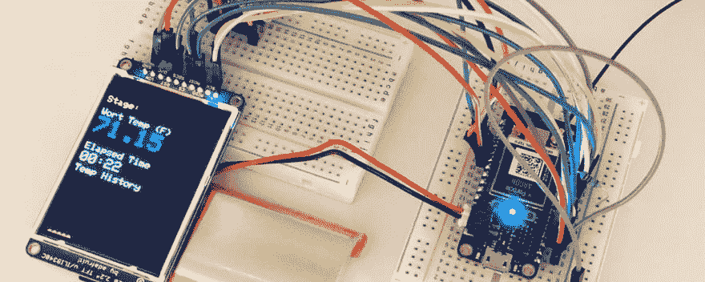
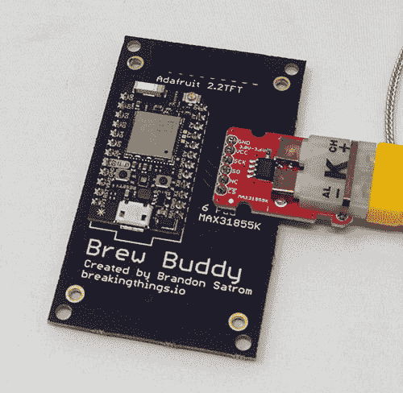
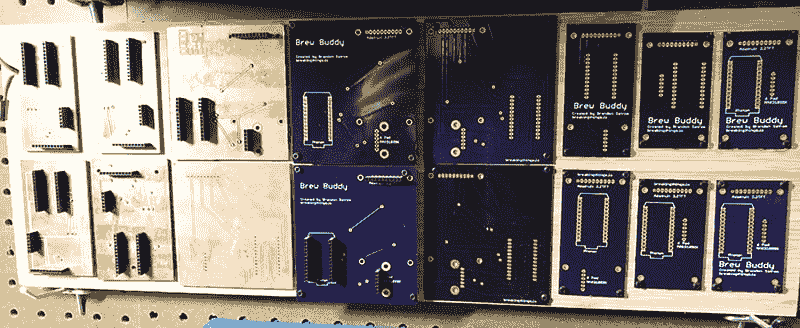
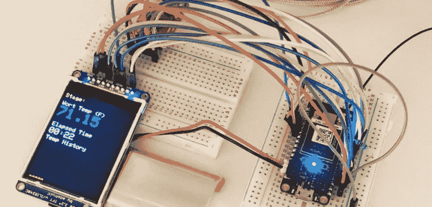
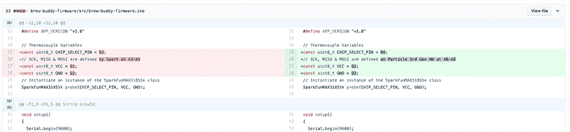
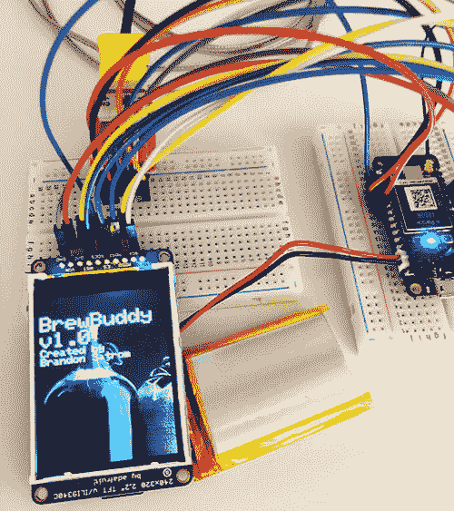

# 用粒子氩升级旧的自制项目

> 原文：<https://dev.to/particle/upcycling-an-old-homebrewing-project-with-a-particle-argon-587k>

[](https://res.cloudinary.com/practicaldev/image/fetch/s--DlzyJ4rJ--/c_limit%2Cf_auto%2Cfl_progressive%2Cq_auto%2Cw_880/https://thepracticaldev.s3.amazonaws.com/i/wmcv1lilznvflmdxkxh8.jpg)

新的第三代[粒子](https://particle.io)硬件在这里，有很多爱。我有一个旧的基于光子的项目，我一直渴望更新并添加一些新功能，所以我决定看看将基于光子的项目迁移到新的[氩](https://store.particle.io/products/argon-kit)，硬件，固件和所有东西会有多容易。

除了这篇文章之外，你也可以在过去几周我录制的一系列 [Twitch 直播流](https://twitch.tv/brandonsatrom)和[发布到 YouTube 的](https://www.youtube.com/channel/UCpYjkSkGOXAMXeZjZkbb-PQ)中了解这个构建的幕后。[这是这个系列的第一个视频](https://youtu.be/krEzdnlpqC0)。

## 介绍 Brew Buddy

我是一名家庭酿酒师，这并不奇怪，因为我住在德克萨斯州的奥斯汀。不仅家酿啤酒在这些地区很普遍，而且每个奥斯汀地区的家庭都必须至少有一个家酿啤酒厂才能申请城市居住权。

最后一句话不正确，但应该是正确的。

我从事自酿啤酒已经有八年了，我被它吸引的原因和许多人一样:与其说是为了最终产品，不如说是为了它的工艺和化学成分。就像烹饪和烘焙一样，用炼金术将离散的原料转化成令人愉快的东西是很有趣的。

## 当前 Brew 好友规格

作为一名技术人员和制造者，我探索如何将技术融入到我的酿造中并不奇怪。Brew Buddy 就是一个例子，它是一个联网的家酿监控系统，可以跟踪麦芽汁(由水、谷物、麦芽和啤酒花组成的啤酒前混合物)在酿造过程中烹饪阶段的温度。该项目的当前版本包括:

*   一个粒子光子作为项目的大脑
*   测量麦汁温度的 K 型热电偶
*   2.2 英寸 TFT 显示屏，用于显示温度读数和历史温度图
*   在 Eagle 设计并由 OSH Park 的优秀员工制造的定制 PCB

[](https://res.cloudinary.com/practicaldev/image/fetch/s--rMV4MMq_--/c_limit%2Cf_auto%2Cfl_progressive%2Cq_auto%2Cw_880/https://blog.particle.io/wp-content/uploads/2019/03/PhotonBB.png) 

<figcaption>最初的 Brew Buddy build 使用了一个带有定制 PCB 的光子。</figcaption>

光子驱动并协调电路板，同时将温度读数发布到粒子云中，这样我就可以直观地看到从一种饮料到下一种饮料的趋势。

Brew Buddy 是从一块试验板上开始的——就像这些东西通常会做的那样。一旦我的设计设定好了，我就用 CNC 铣削了几个 PCB 版本(我的第一个定制 PCB！)并且在我满意的时候，承包了一家 PCB 厂商生产。那是将近四年前的事了，Brew Buddy 准备升级了。

[](https://res.cloudinary.com/practicaldev/image/fetch/s--Dy3ZUJud--/c_limit%2Cf_auto%2Cfl_progressive%2Cq_auto%2Cw_880/https://blog.particle.io/wp-content/uploads/2019/03/BoardIterations.png) 

<figcaption>我用了多年的 Brew Buddy 定制 PCB 的各种迭代。</figcaption>

我有一些想法可以添加到这个项目中，比如一个基于压电的爆震传感器来检测发酵何时开始。Particle 新的第三代硬件是添加这些功能、设计新主板和探索将我的项目从光子移植到氩有多容易的完美动机。

剧透:太容易了！就像轻而易举地按下那个巨大的红色办公室供应链按钮。

## 试验新的原型

[](https://res.cloudinary.com/practicaldev/image/fetch/s--Iz5G1hFs--/c_limit%2Cf_auto%2Cfl_progressive%2Cq_auto%2Cw_880/https://blog.particle.io/wp-content/uploads/2019/03/FeatureLarge-1024x492.jpg) 

<figcaption>氩动力 Brew Buddy 的原型制作从一块试验板和跳线开始。</figcaption>

对于任何新的硬件项目，即使在更新或更换组件或 MCU 时，我也喜欢从一个由跳线组成的老鼠窝(试验板原型)开始。这是在花费时间和金钱来设计和订购电路板之前，确保我已经正确接线的重要一步。

额外的收获是，当我在电线之间眯着眼睛，试图把一切都放在正确的位置时，插在几乎看不见的小插槽中的杂乱电线愉快地提醒了我日益增长的年龄。

此外，在阻焊膜下将乱七八糟的电线变成铜迹线也非常神奇。它唤起了同样的感觉，就像 Monday.com 商业广告中的事情一样，我发现自己每次去 YouTube 看关于如何在超级粉碎兄弟公司打败我的孩子的视频时都不会跳过

## 我的 Brew Buddy 硬件迁移方法

对于 Brew Buddy 迁移，我的试验板原型有两个步骤:

1.  将现有组件(TFT 和热电偶)映射到氩气上的新引脚
2.  为 TFT 上的 SD 卡添加新的连接(这样我就可以在屏幕上显示位图)和一个薄压电作为“爆震传感器”

总而言之，我最终在 Argon 上使用了 11 个 GPIO 引脚，而在 Photon 上使用了 9 个，这只是为了获得项目中包含的功能。在添加新功能时，有一点反复试验，但是我能够在几个小时内完成并运行我的原型。

## 移植固件

[](https://res.cloudinary.com/practicaldev/image/fetch/s--R1D2EDMn--/c_limit%2Cf_auto%2Cfl_progressive%2Cq_auto%2Cw_880/https://blog.particle.io/wp-content/uploads/2019/03/CodeComparison.png) 

<figcaption>图片显示了光子和氩源代码变化之间的区别——只有三行需要更新。</figcaption>

随着试验板原型全部连线，是时候移植固件了。我预计这将包括三项任务:

1.  更新从光子到氩的引脚映射。
2.  如果需要，更新我使用的固件库。
3.  为爆震传感器添加库和新固件，并在 TFT 上显示图像。

进入这个阶段，我不确定每一步需要多长时间，尤其是前两步。我相信 [Device OS](https://www.particle.io/device-os/) 将确保两块板之间所需的变化最小，但我不知道“最小”意味着什么。

## 您的迁移可能有所不同…

注意，YMMV 取决于您在旧项目中使用的特性和库，我惊喜地发现，为了让我现有的基于光子的项目在 Argon 上运行，我必须更改总共三行代码。三个都是热电偶的 GPIO 引脚映射。如果你想要证据，你可以在这里看到[差异](https://github.com/bsatrom/brew-buddy/commit/5024e5ee0dca1f4a5d0951f375b1c2292cdf25f0#diff-059541daca1fa00a0e7e9fa4579ab0a3)。

[](https://res.cloudinary.com/practicaldev/image/fetch/s--_JqqdDTO--/c_limit%2Cf_auto%2Cfl_progressive%2Cq_auto%2Cw_880/https://blog.particle.io/wp-content/uploads/2019/03/BeerTFT2.png) 

<figcaption>测试氩动力 Brew Buddy 固件。</figcaption>

大部分工作是在物理引脚映射方面，因为我正在设置原型。由于 TFT 和热电偶都是 SPI 器件，我需要确保跳线连接到 Argon 的 SPI 引脚(A6-A8)，而不是光子的 A3-A5。

在固件库方面，一切都“正常工作”当我第一次开始这个项目时，我是手动包含 TFT 和热电偶的库，所以我唯一真正的步骤是在我的 [project.properties](https://github.com/bsatrom/brew-buddy/commit/7aa10f9ffbea99801ba9d6c5b2b7bed7eb690eb2) 文件中添加对库的引用，并从我的项目中删除库源文件。第一次尝试时一切都编译好了，我开始添加新特性。

有了新功能，我的工作量增加了一点。压电是一个简单的模拟传感器，很容易添加到我的项目。经过一段时间的反复试验，我能够对它进行校准，以检测发酵的光运动，我甚至添加了粒子的新睡眠模式支持，以便我的设备可以在烹饪完成后的 24-48 小时内离线，并在检测到第一个发酵迹象时醒来。

```
const uint8_t KNOCK_PIN = A4; 

int setBrewMode(String command) 
{
  if (command == "brew" && !isBrewingMode) 
  { 
    // Start brewing 
  } 
  else if (command == "ferment") 
  { 
    isBrewingMode = false; 
    isFermentationMode = true; 
    fermentationModeStartTime = millis();

    clearScreen();
    tft.setCursor(0, 140);
    printSubheadingLine("Waiting for");
    printSubheadingLine("Fermentation...");

    System.sleep(KNOCK_PIN, CHANGE);

    return 1;
  } 
  else if (command == "stop") 
  { 
    // Stop
  } 

  return 0; 
}

void loop()
{ 
  if (isFermentationMode)
  { 
    int16_t knockVal = analogRead(KNOCK_PIN) / 16;

    if (knockVal >= 6) 
    { 
      if (!isFermenting)
      { 
        isFermenting = true;
        fermentationStartTime = millis();
        lastKnock = fermentationStartTime;

        clearScreen();
        tft.setCursor(0, 10);
        tft.setTextColor(ILI9341_YELLOW);
        tft.setTextSize(2);
        tft.print("Fermentation started"); 
        tft.setTextColor(ILI9341_WHITE); 

        displayFermentationHeading();

        waitUntil(Particle.connected); 
        Particle.publish("fermentation/state", "start");
      }
    }
  } 
  else if (isBrewingMode)
  { 
    // Brewing mode logic
  }
} 
```

## Brew Buddy 现支持位图

将位图添加到 TFT 有点复杂，包括将`Adafruit_ImageReader`库移植到粒子生态系统([是公共的，所以请使用它！](https://github.com/bsatrom/Adafruit_ImageReader))。然而，有了一个新的库，只需要再多几行代码就可以在我的项目的闪屏上得到一个漂亮的图像。

```
Adafruit_ILI9341 tft = Adafruit_ILI9341(TFT_CS, TFT_DC, TFT_RST); 
Adafruit_ImageReader reader; 
SdFat sd; 

void setup()
{
  tft.begin(TFT_SPEED);

  if (!sd.begin(SD_CS))
  {
    sd.initErrorHalt();
  } 

  printSplash();
} 

void printSplash() 
{
  ImageReturnCode stat; 
  tft.setRotation(2);

  clearScreen();

  stat = reader.drawBMP("brew.bmp", tft, sd, 0, 0);

  delay(2000); tft.setCursor(0, 40); 
  printHeadingTextLine("BrewBuddy"); 
  printHeadingTextLine(APP_VERSION);
  printSubheadingLine("Created by"); 
  printSubheadingLine("Brandon Satrom");
  delay(3000);
} 
```

## 接下来是什么？

我很高兴地说，到目前为止，这个光子到氩的端口已经成功了！只需对固件做最少的改动，我就能接手一个旧项目，刷新它，并开始添加新功能。

当然，一个新的工作原型意味着一个借口，旋转一个新的董事会，并添加一些基于云的可视化我的酿造！请继续关注这篇文章的第二部分，在那里我将分享这个项目的其余部分和一个测试 brew 的结果！

与此同时，我会在周二和周四在 Twitch 上直播这个项目的几乎每一步。请务必跟随我，点击下面的链接观看最初几个视频的回放:

*   [第 1 部分–创建原型和移植固件](https://youtu.be/krEzdnlpqC0)
*   [第 2 部分–在 Eagle 中创建定制 PCB](https://youtu.be/AQd3qdI9BUE)
*   [第 3 部分–为 SD 读卡器和压电传感器添加新固件](https://youtu.be/EcKBL6Y56u8)
*   [第 4 部分–PCB 焊接和组装](https://youtu.be/OgW8yMLZE3Q)

几周后见！

帖子[用粒子氩](https://blog.particle.io/2019/03/04/upcycling-homebrewing/)升级一个旧的自制项目首先出现在[粒子博客](https://blog.particle.io)上。