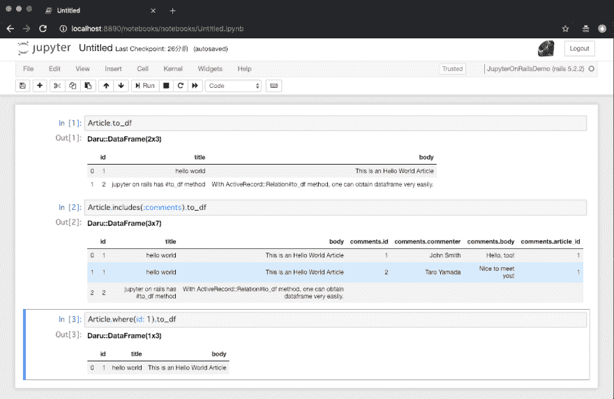
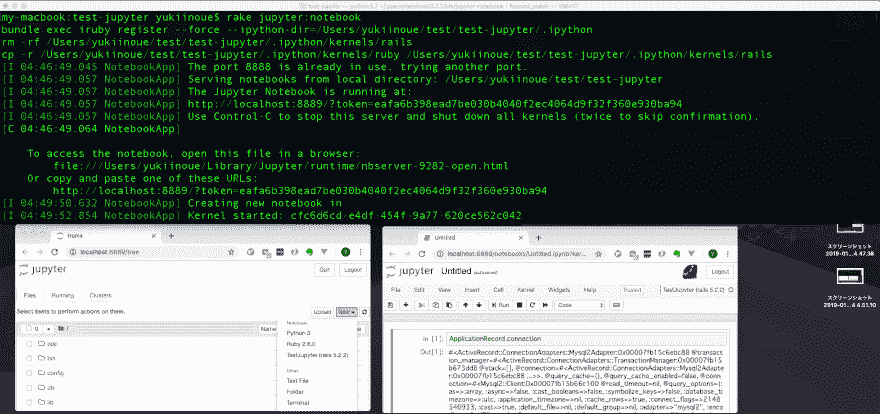
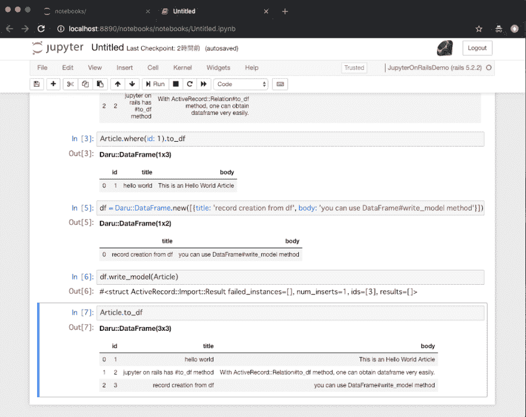

# 集成 Jupyter 笔记本和 Rails

> 原文：<https://dev.to/yukiinoue/integrating-jupyter-notebook-and-rails-43cc>

如果您曾经使用过 Jupyter 和 Rails，您可能希望在 Jupyter 笔记本中执行 Rails 代码。虽然已经可以实现了，但是体验并不是那么好；不像你乘火车时得到的那些开发人员的经验那样圆滑。

为了解决这个问题并使 Rails Jupyter 更友好，我制作了一个名为`jupyter_on_rails`的 gem。有了这个宝石，从事 Rails 项目将得到 Jupyter(笔记本)的帮助。

# 是什么成就

通过给你的 Rails 项目的`Gemfile`添加以下宝石，并使`bundle install`成功，

```
gem 'jupyter_on_rails'
gem 'ffi-rzmq' 
```

Enter fullscreen mode Exit fullscreen mode

实现了以下事情:

*   使用安装在项目本地的 Rails 应用程序内核启动 Jupyter 笔记本服务器的命令。
    *   内核配置仅限于您的项目；再也没有全局`iruby`配置头疼的烦恼，如果你懂我的意思。
*   在笔记本上实现活动记录操作的几种方法。

以下是您将实现的目标的示例截图:

[](https://res.cloudinary.com/practicaldev/image/fetch/s--urR2kaQI--/c_limit%2Cf_auto%2Cfl_progressive%2Cq_auto%2Cw_880/https://thepracticaldev.s3.amazonaws.com/i/kst8vr624mlrynwxr9kq.png)

# 明细

## 先决条件

要使用`jupyter_on_rails`，您需要在您的项目中有`jupyter`可用，并且您需要有成功安装依赖 gem 所需的所有库。

对于`jupyter`命令，您有两个选项。一种是通过使用例如`pip install jupyter`进行全局安装，或者通过在您的项目根目录下创建`pipenv`环境并在那里安装`jupyter`。我个人推荐使用 Pipenv。对于那些不熟悉`pipenv`的 ruby 爱好者来说，这是 python 的一个`bundler`。

您可以通过执行以下命令来检查 Jupyter notebook 是否安装正确:

```
$ jupyter notebook
# or, for those who use pipenv
$ pipenv run jupyter notebook 
```

Enter fullscreen mode Exit fullscreen mode

如果 jupyter 笔记本网页打开，那么`jupyter`安装成功。

接下来，您需要安装`jupyter_on_rails`和`ffi-rzmq`的依赖项所需的库。因为我不记得这些宝石到底需要什么，所以如果出现任何`bundle install`错误，请参考每个宝石的安装说明。我可以告诉你，如果你用的是 Mac，所有需要的库都可以用自制软件安装。

## 将`jupyter_on_rails`添加到 mac 并启动 Jupyter

一旦你准备好你的 jupyter，在你的`Gemfile`中放入下面的依赖项。

```
gem 'jupyter_on_rails'
gem 'ffi-rzmq' 
```

Enter fullscreen mode Exit fullscreen mode

然后`bundle install`。必要时安装库以确保安装成功。

之后，你可以执行下面的命令，启动一个安装了你的应用内核的 Jupyter。

```
$  bin/rake jupyter:notebook 
```

Enter fullscreen mode Exit fullscreen mode

下面是该命令执行后的图像。在顶部的终端，你可以看到`rake jupyter:notebook`命令启动了一个 jupyter 服务器，在左下方你可以看到当启动一个新的笔记本时，你可以选择 rails 应用。在右下方你可以看到`ApplicationRecord`，Rails 上下文中的一个类，可以在没有任何`require`或其他配置的情况下使用；它应该可以开箱即用。(如果你用过`rails console`，那么内核的上下文和那个上下文完全一样。)

如果由于 CDN 导致的大小调整，您很难查看该图像，请参考位于[https://raw . githubusercontent . com/Yuki-Inoue/jupyter _ on _ rails/master/the _ screen shot . png](https://raw.githubusercontent.com/Yuki-Inoue/jupyter_on_rails/master/the_screenshot.png)的原始图像。

[](https://res.cloudinary.com/practicaldev/image/fetch/s--TDXQPCX7--/c_limit%2Cf_auto%2Cfl_progressive%2Cq_auto%2Cw_880/https://raw.githubusercontent.com/Yuki-Inoue/jupyter_on_rails/master/the_screenshot.png)

## ActiveRecord 集成

`jupyter_on_rails`附带一些实用方法，帮助你在笔记本上操作 ActiveRecord。

最值得注意的是`ActiveRecord::Relation#to_df`方法。这将把您的`ActiveRecord::Relation`实例变成`Daru::DataFrame`实例。对于那些不熟悉 Dataframe 的人来说，它是一个类似表格的结构，可以用于进一步的数据操作。它也是木星友好型的。对于有 python 上下文的人来说，就是 ruby 中的`pandas.DataFrame`。

[](https://res.cloudinary.com/practicaldev/image/fetch/s--idZccw6w--/c_limit%2Cf_auto%2Cfl_progressive%2Cq_auto%2Cw_880/https://thepracticaldev.s3.amazonaws.com/i/s0kj4cq658k2t5u8xvy7.png)

上图显示了`#to_df`方法的工作原理。1.你可以把你的模型变成 DataFrame 2。创建数据帧 3 时会考虑到`includes`。它对关系起作用。

现在，你有了数据框架。关于如何使用实例，请参考官方文档。[https://github.com/SciRuby/daru](https://github.com/SciRuby/daru)

修改后，您可能希望将数据帧数据写回您的模型。可以通过`Daru::DataFrame#write_model(SomeModel)`来实现。下面是它执行后的截图。注意这是`jupyter_on_rails`对`daru`的扩展方法。

[](https://res.cloudinary.com/practicaldev/image/fetch/s--Jfq3YHGO--/c_limit%2Cf_auto%2Cfl_progressive%2Cq_auto%2Cw_880/https://thepracticaldev.s3.amazonaws.com/i/eeunc1oahqrdth7c7kkv.png)

# 幕后

`rake jupyter:notebook`命令在项目根创建一个`.ipython`配置。它基本上复制了`iruby`内核配置，并在那里添加了引导信息。内核启动 rails 所需的所有信息都存储为内核配置。在这个内核的每次调用中，`config/application.rb`被加载，`application.initialize_environment!`被调用，这样 Rails 配置就可用了。

# 反馈等。

下面是这个创业板的 Github 项目。对于 bugs 特性请求，请在那里提交。

[https://github.com/Yuki-Inoue/jupyter_on_rails](https://github.com/Yuki-Inoue/jupyter_on_rails)

* * *

感谢阅读。