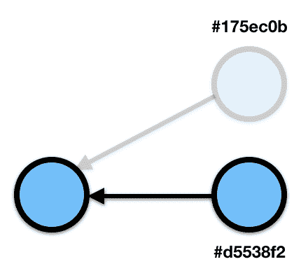
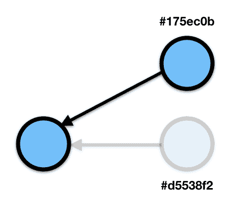

# Git 魔术 1:撤销 git 修正

> 原文：<https://dev.to/flyingdot/git-magic-1-undo-git-amend-196g>

Git 允许你在某种程度上建立你的历史，这样它就有了实际的价值，而不仅仅是一堆没有意义的描述。

保持历史清白的一个更简单的方法是使用`git commit —amend`。

```
touch a.txt
git add a.txt
git commit -m 'Add files'
git log
> 175ec0b 4 seconds ago Dani (HEAD -> master) Add files

touch b.txt
git add b.txt
git commit --amend
git log
> d5538f2 48 seconds ago Dani (HEAD -> master) Add files 
```

Enter fullscreen mode Exit fullscreen mode

因此，我们在这里用添加的文件修改了之前的提交。但是，如果我们在修改提交时犯了一个错误，添加了不应该添加或修改到上一次提交的内容，该怎么办呢？

## 影子世界

上面例子中的散列非常清楚地表明，我们的`amend`实际上并没有改变提交，而是创建了一个新的(175ec0b 和 d5538f2)。在 Git 中，你不会丢失任何你已经提交过一次的东西。第一次提交也是如此(175ec0b)。

我们的示例图现在看起来是这样的:
[](https://res.cloudinary.com/practicaldev/image/fetch/s--O82Tg0tQ--/c_limit%2Cf_auto%2Cfl_progressive%2Cq_auto%2Cw_880/https://thepracticaldev.s3.amazonaws.com/i/nghaae1gx1z2ndob6o70.png)

commit 175ec0b 仍然存在，但是无法通过图形访问它。有了这些信息，我们如何撤销修改就变得非常简单和明显了。:

```
git reset 175ec0b --soft
git status
> (...)
> Untracked files:
>   b.txt 
```

Enter fullscreen mode Exit fullscreen mode

或者在头指针上不使用带有偏移量的散列:

```
git reset 'HEAD@{1}' --soft 
```

Enter fullscreen mode Exit fullscreen mode

所以我们在当前头之前重置为一次提交。现在，更改再次被取消暂存，您可以再次提交它们。

当然，您也可以使用`git reflog`来定位提交。

现在图形看起来正好相反:
[](https://res.cloudinary.com/practicaldev/image/fetch/s--3G2ZaY8V--/c_limit%2Cf_auto%2Cfl_progressive%2Cq_auto%2Cw_880/https://thepracticaldev.s3.amazonaws.com/i/3t0b148al82ty7s3fkf2.png) 
再次:修改操作的结果提交仍然存在。所以错误修改的提交仍然存在，但是被孤立了。