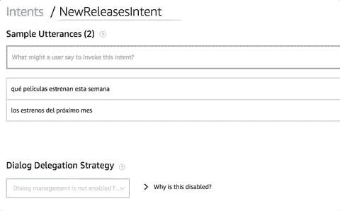
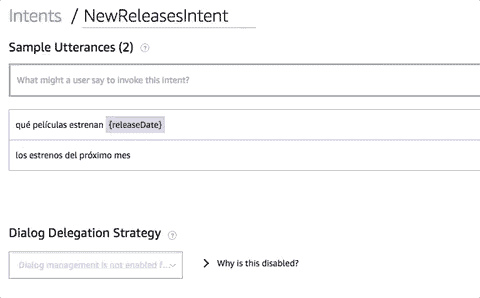
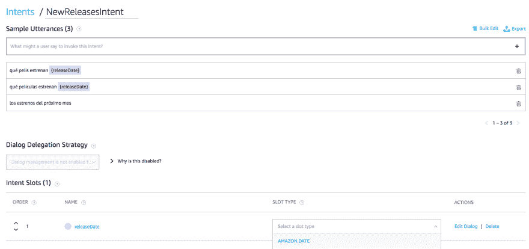
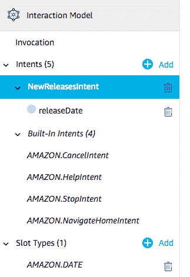
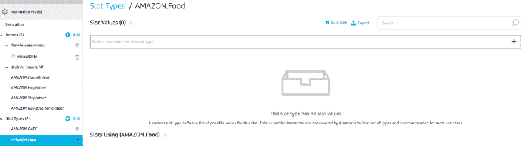
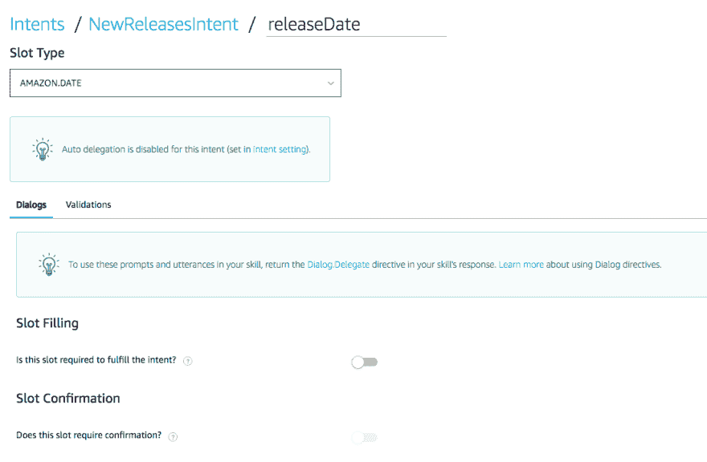

# 为 Alexa (VI)创建自定义技能:处理带日期的请求

> [https://dev . to/kini/创建-un-custom-skill-to-Alexa-VI-handle-request-with-date-14np](https://dev.to/kini/creando-un-custom-skill-para-alexa-vi-manejando-request-con-fechas-14np)

有了这些，我们就可以开始技能认证过程，因为我们有一些基本和实用的东西。但是，正如我在前面的帖子中所说的，我决定在发送之前先处理有日期的请求。不报道这件事在我看来留下了很差的经历。

## Caso de uso

我想支持的是一个用户在某一天要求看电影的情景。我认为一些基本的句子是:

*   "告诉我本周的电影明星"
*   "告诉我下周的毛皮"
*   "告诉我这个月的明星"

这样，在知道用户感兴趣的日期后，我就可以在背面过滤出符合该条件的星形。我也可以更好地应对这样的情况，例如，我当时没有明星，或者我没有理解你要求我做什么。

## 在交互组件模型中添加一个插槽

插槽只是一种信息，在用户请求时，在意图中可能会有所不同，我们需要了解这种信息。在“T0”亚马逊文档中可以看到一个详细的例子。

除了检测插槽中的螺母部分外，我们还必须为其指定类型。选择类型时，您可以:

*   从亚马逊预定义类型中选择一种。这些类型已经知道如何处理某些输入值，例如在某些情况下常用的日期或词语，例如城市名称或食物类型。在某些情况下，可以扩展接受这些类型的值。官方文件指出了哪些。
*   创建新类型。在这种情况下，我们需要为该类型命名，并提供一个需要处理的值列表。

在这种情况下，由于我们要处理日期，所以我选择使用插槽类型的构建日期: [Amazon.DATE.](https://developer.amazon.com/docs/custom-skills/slot-type-reference.html#date) 这样，Alexa 将把我们用插槽标识的零件转换成格式为 [ISO-8601](https://en.wikipedia.org/wiki/ISO_8601#Dates) 的日期。你可能并不总是知道在某个日期发生什么事情，那样的话，我们会有一个漂亮的`null`作为插槽值。请考虑这一点，因为您需要在服务器上处理它。另一个真实故事:)

要添加插槽，我们只需确定将拥有所需信息的供应部分。如果我们把这个应用到我刚才举的例子中:

*   "告诉我本周的电影明星" >插槽= `esta semana`
*   "告诉我下周的毛皮" >槽= `próxima semana`
*   "告诉我这个月的明星" >插槽= `este mes`

从 Alexa Developer Console 中，我们可以很容易地在自己的螺母上标识插槽:

*   如果我们已经定义了螺母，我们只需选择要将其作为插槽的部件，并为其命名即可。

*   如果放入新的螺母，我们可以像前面的示例一样直接指出插槽的对应部分。

在这两种情况下，都会在同一屏幕的底部表格中创建一个插槽。在此表中，我们可以指出其类型，在本例中为 Amazon.DATE。

此外，控制台的侧面板还会在“intent(意图)”和“slot type(类型)”下显示我们在 interactor 中开始使用的插槽。

这样，在所有将包含插槽的螺母中找到插槽后，我们就可以准备好基本模型，以便在我们的主要意图中接收日期。

### 插槽的高级版

在我们的技能中使用插槽时，我们可以在意图中编辑其类型或行为的某些方面。

关于类型，如前所述，我们可以在亚马逊预定义的一些插槽中添加额外的值。使用 Amazon.DATE 是不可能的，但是，举例来说，如果我们使用 Amazon.FOOD 类型的一个，那是可能的。

另一方面，对于意图使用插槽，有一些选项需要配置。要访问它们，只需单击“目的”(interaction model)下拉列表下的插槽名称，或单击记录目的的插槽的表中的“编辑对话框”(Edit Dialog)。在这两种情况下，您都会看到相同的屏幕。

就我个人而言，我没有触及上一次捕获中显示的任何选项，我将不详细介绍。我想改进模型并改善用户交互，最后我会通过这个屏幕。例如，当 Alexa 无法识别插槽值时，“插槽填充”选项可能对我非常有用(我需要确认它是否适用于这种情况)。“插槽确认”选项，我认为这将是一个不必要的步骤，但我可以在返回后端结果时重复客户处理的插槽的值，其风格为:“这些是本周电影首映给‘t0’

## 操作背面的槽

一旦我们设置了 interaction model，当用户使用上述短语提出请求时，我们将返回相应的值。

我给你们看的代码片段是处理我技能主要意图的类的一部分。我已将示例限于负责检索插槽值的行，但您可以在此查看整个类。

每个意图请求都可以访问插槽映射。该映射中的值条目是放置在模型中的插槽名称。就我而言，就像抓住插槽`releasesDate`并收回其价值一样简单。

根据插槽类型的不同，从该值出发，应做出适当的逻辑解释。就 Amazon.DATE 而言，了解 Alexa 给我们的日期格式，我们就可以应用我们想要的格式，从而与电影列表进行比较。

### 插槽中 null 值的情况

使用 Amazon 的 type 插槽。DATE 我遇到了在后台接收值`null`的情况。在后台日志中，我看到用户发出 Alexa 无法传递的请求，并且经过测试，从开发人员控制台中可以很容易地复制这些请求。

如果你看到代码，我在这种情况下所做的是编写一份不同的答复文本，我在答复中告诉你，我不理解你要求我提供的日期，并鼓励你再次提出要求。

如果我有一个插槽值，这是一个问题筛选电影并给出正确的答案，因为我知道有一些明星或因为我什么都没有。

* * *

配置插槽后，我们可以使用上面的 post 中显示的工具进行测试。一旦我们对行为感到满意，我们就会进入我们技能的认证过程。我将在下面的文章中与分析和记录主题一起讲述这一点。)