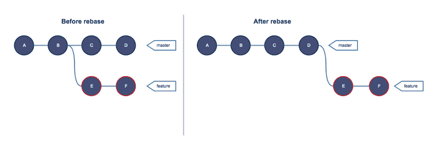
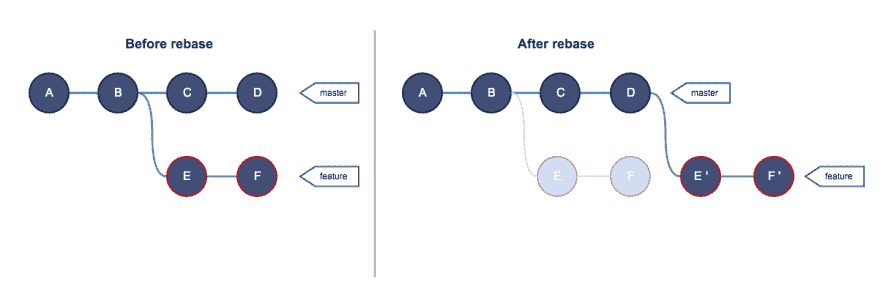
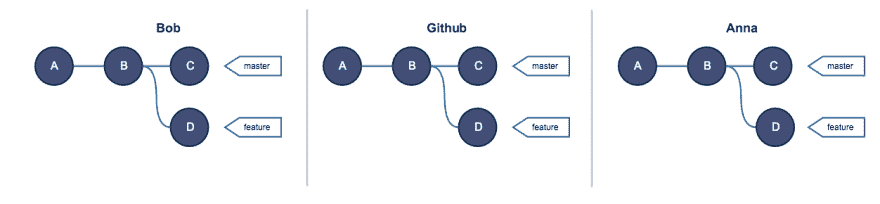
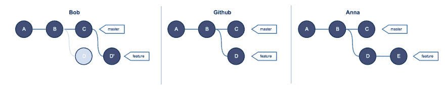
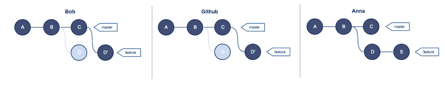
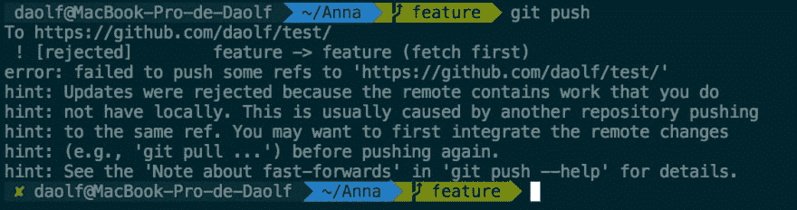
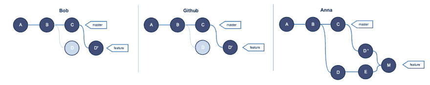
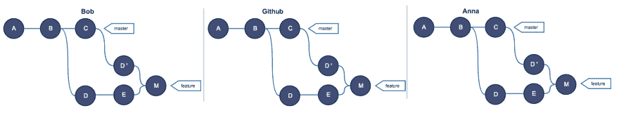
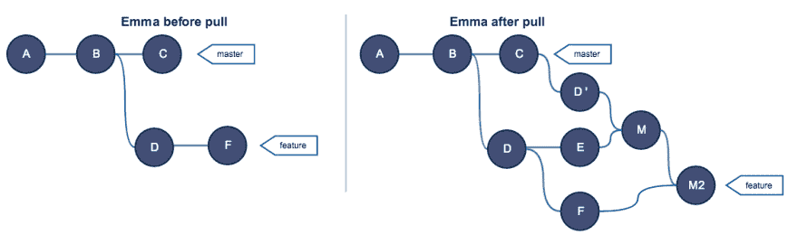

# Git Rebase 和黄金法则解释

> 原文：<https://dev.to/daolf/git-rebase-and-the-golden-rule-explained-13h6>

这篇文章是[这篇文章](https://dev.to/daolf/git-series-13-understanding-git-for-real-by-exploring-the-git-director--5bd0)的后续，在这篇文章中，我们探索了。git 目录。

### rebase 的基

当你想到什么是 git 中的 rebase 时，你可能会想到:

[](https://res.cloudinary.com/practicaldev/image/fetch/s--w6lSaqKw--/c_limit%2Cf_auto%2Cfl_progressive%2Cq_auto%2Cw_880/https://cdn-images-1.medium.com/max/2404/1%2AFNaZp740nmp8wz851BqcAg.png)

你可以说，当你重定基底时，你“拔掉”你想重定基底的树枝，然后“重新插”在另一根树枝的顶端。这与事实相差不远，但值得深究一下。如果你看一下[文档](https://git-scm.com/docs/git-rebase)，这是关于 rebase 的描述:

> “git-rebase:转发端口本地提交到更新的上游头”——git 文档

不是很有帮助不是吗？大致的翻译可以是:

> git-rebase:将所有提交从您的分支重新应用到另一个分支的尖端。

这里最重要的词是“重新应用”,因为 rebase 不仅仅是一个分支到另一个分支的 ctrl-x/ctrl-v。rebase 将从您所在的分支中依次获取所有提交，并将它们重新应用到目标。这种行为有两个主要含义:

1.  通过重新应用提交，git 创建了新的提交。那些新的提交，即使它们带来了相同的变化，也会被 git 视为完全不同和独立的。

2.  Git rebase 重新应用提交，并且不破坏旧的提交。这意味着即使在重定基础之后，您的旧提交仍然会在您的。git 目录。如果你不太熟悉 git 如何考虑和存储提交，你可以在这里学到一些有趣的东西。

因此，这可能更准确地反映了重定基数期间实际发生的情况:

[](https://res.cloudinary.com/practicaldev/image/fetch/s--A1rabf6v--/c_limit%2Cf_auto%2Cfl_progressive%2Cq_auto%2Cw_880/https://cdn-images-1.medium.com/max/2404/1%2Ap0EGOtTUhzpUnF5p2c2UAw.png)

如您所见，特性分支拥有全新的提交。如前所述，同样的变化，但是从 git 的角度来看是完全不同的对象。您还可以看到以前的提交没有被销毁。它们根本无法直接访问。如果你还记得的话，分支只是一个指向提交的指针。因此，如果分支和标签都不指向提交，那么提交几乎不可能实现，但是提交仍然存在。

现在让我们来谈谈这个著名的黄金法则。

### 换基的黄金法则

> “任何人都不得对共享分支进行重定基”——关于重定基的每个人

你可能遇到过这条规则，也许措辞不同。对于没有的人来说，这个规则相当简单。从来没有，从来没有，* *从来没有，**rebase 共享分支。我所说的共享分支指的是存在于远程存储库中的分支，并且您团队中的其他人可以提取它。

这个规则经常被当作神的真理，我认为如果你想提高对 g it 的理解，理解它可能是一件好事。

为了做到这一点，让我们想象一个 dev 违反规则的情况，看看会发生什么。

假设鲍勃和安娜都在从事同一个项目。以下是 GitHub 上 Bob、Anna 的回复和遥控器的概述:

[ ](https://res.cloudinary.com/practicaldev/image/fetch/s--qGHNS1Zq--/c_limit%2Cf_auto%2Cfl_progressive%2Cq_auto%2Cw_880/https://cdn-images-1.medium.com/max/2504/1%2Awxzwv6lSoduI8rKFrKCF4A.png) *每个人都与遥控器同步(GitHub)*

现在，Bob 无意中打破了 rebase 的黄金法则，同时 Anna 决定处理该特性并创建一个新的 commit:

[ ](https://res.cloudinary.com/practicaldev/image/fetch/s--hdM4YMFc--/c_limit%2Cf_auto%2Cfl_progressive%2Cq_auto%2Cw_880/https://cdn-images-1.medium.com/max/2864/1%2AXXo413qBib80JBSbQrqVaQ.png) *你看到什么来了吗？*

Bob 现在尝试推，他被拒绝了，并收到这样的信息:

[ with agnoster theme for those who cares](img/18531dc75dc4599e4fe52f38a526d048.png) ](https://res.cloudinary.com/practicaldev/image/fetch/s--ve5jgiSR--/c_limit%2Cf_auto%2Cfl_progressive%2Cq_auto%2Cw_880/https://cdn-images-1.medium.com/max/2260/1%2APZAACeGy9iYU2kwEHfec9g.png) * [哦我的 Zsh](https://github.com/robbyrussell/oh-my-zsh) 为关心的人准备的不可知论者主题*

这里 git 并不高兴，因为它不知道如何将 Bob 特性分支与 GitHub 特性分支合并。通常，当您在远程上推送分支时，git 会将您尝试推送的分支与当前在远程上的分支合并。事实上，git 试图快进你的分支，我们将在以后的文章中详细讨论。你必须记住的是，简单来说，远期回购不能处理 Bob 试图推动的重配分支。

Bob 的一个解决方案是进行 git 推送——force，基本上它告诉远程存储库:
“不要试图在我推送的内容和您已经拥有的内容之间进行合并或做任何工作。删除您的功能分支版本，我现在推出的是新的功能分支"
，这是我们最终得到的结果:

[ ](https://res.cloudinary.com/practicaldev/image/fetch/s--AbjyZfC6--/c_limit%2Cf_auto%2Cfl_progressive%2Cq_auto%2Cw_880/https://cdn-images-1.medium.com/max/3038/1%2AtqeYmgNpYKp4a8jmyKmdxw.png) *如果安娜知道将要发生什么，她今天早上就不会来上班了。*

现在安娜想要推动她的改变:

[](https://res.cloudinary.com/practicaldev/image/fetch/s--tlekly-q--/c_limit%2Cf_auto%2Cfl_progressive%2Cq_auto%2Cw_880/https://cdn-images-1.medium.com/max/2248/1%2Abe7e3r7D_gFvnIt_GAlNxA.png)

这是正常的，git 只是告诉 Anna 她没有功能分支的同步版本，即她的分支版本和 GitHub 分支版本不同。所以很自然，安娜拉。同样，当你推送时，git 试图将你的本地分支与远程回购中的内容合并，当你拉取时，git 试图将远程回购中的内容与你的本地分支中的内容合并。

在拉取之前，这些是远程和本地特征分支中的提交:

```
A--B--C--D'   origin/feature // GitHub
A--B--D--E    feature        // Anna 
```

Enter fullscreen mode Exit fullscreen mode

当你拉的时候，git 必须做一个合并来解决这个问题。事情是这样的:

[](https://res.cloudinary.com/practicaldev/image/fetch/s--wx8nHCzS--/c_limit%2Cf_auto%2Cfl_progressive%2Cq_auto%2Cw_880/https://cdn-images-1.medium.com/max/3224/1%2Af7dhTYNizT045XFCUgcc1Q.png)

提交 M 代表合并提交。Anna 和 GitHub 的功能分支最终合并的提交。安娜终于松了口气，她设法解决了所有的合并冲突，现在可以推进她的工作了。Bob 决定退出，现在每个人都同步了。

[](https://res.cloudinary.com/practicaldev/image/fetch/s--lzxbXYAU--/c_limit%2Cf_auto%2Cfl_progressive%2Cq_auto%2Cw_880/https://cdn-images-1.medium.com/max/3330/1%2APOHw-A3poPkF_0IRMHolSA.png)

看看这些乱七八糟的东西就足以让你相信黄金法则的有效性。你必须记住，你正站在一个只有一个人制造的混乱面前，站在一个只有两个人分享的树枝上。想象一下和一个 10 人的团队一起做这件事。人们使用 git 的众多原因之一是为了能够轻松地回到过去，历史越混乱，它就变得越复杂。

您还可以注意到，在远程上有重复的提交，D 和 D '有相同的一组更改。基本上，重复提交的数量可以和你的 rebased 分支中的提交数量一样多。

如果你仍然不相信，试着想象艾玛，第三个 dev。在鲍勃搞砸一切之前，她在特写部门工作，现在她想推。请注意，她在我们之前的小场景后推。

[ ](https://res.cloudinary.com/practicaldev/image/fetch/s--GxRRyXV7--/c_limit%2Cf_auto%2Cfl_progressive%2Cq_auto%2Cw_880/https://cdn-images-1.medium.com/max/2258/1%2ATRBHnwetziMTN0cSaNdwRA.png) *该死的鲍勃！*

更新:正如一些 redditor 提到的，这篇文章可能会让你认为 rebase 只能用于 rebase 一个分支在另一个分支之上。事实并非如此，你可以在同一个分支上 rebase，但这是另一个故事。

## 感谢阅读:

我希望你能从这篇文章中学到一些有价值的东西，并且它能让你更容易地使用 git。

你可以在这里阅读第三部[。](https://www.daolf.com/posts/git-series-part-3)

如果你喜欢 JS，我刚刚发表了一些你可能会喜欢的东西:

[](/daolf) [## 冒泡和捕获 JS 事件

### 皮埃尔 3 月 1 日 195 分钟阅读

#javascript #webdev #beginners #tutorial](/daolf/things-you-should-know-about-js-events-4k2l)

请在评论中告诉我你最近的困惑，不要害羞🙂如果你喜欢这篇文章，不要忘记订阅我的时事通讯，你还可以免费获得我下一本关于 git 的电子书的第一章(很快就会出版)。