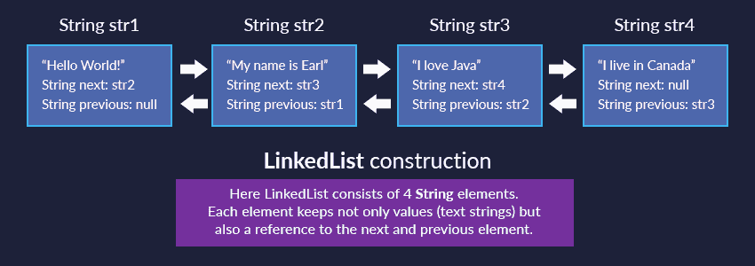
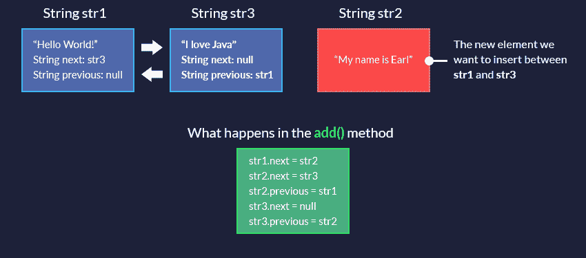
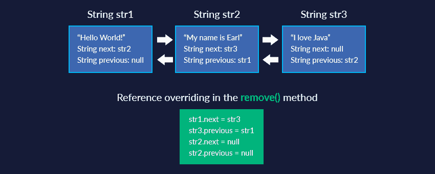
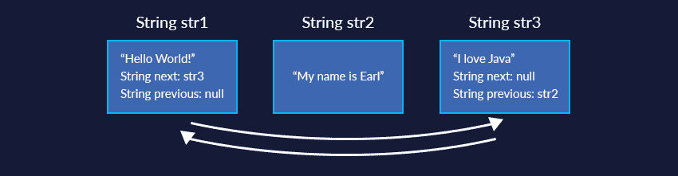

# 带示例的 Java 链接列表教程

> 原文：<https://dev.to/codegym_cc/java-linkedlist-tutorial-with-examples-3nmi>

[](https://res.cloudinary.com/practicaldev/image/fetch/s--9sfOG77e--/c_limit%2Cf_auto%2Cfl_progressive%2Cq_auto%2Cw_880/https://thepracticaldev.s3.amazonaws.com/i/a9xj96a85mays1lbon0u.png)

所有最新的 CodeGym 课程都是关于`ArrayList`的。这种数据结构非常方便和有用。它可以处理大量的任务。但是 Java 有很多其他的数据结构。

为什么？最重要的是，因为任务的范围是巨大的，并且**最有效的数据结构对于不同的任务**是不同的。

今天我们会遇到一个新的结构:`LinkedList`，一个双向链表。

让我们看看它是如何组织的，为什么它被称为双重链接，它与`ArrayList`有什么不同。

`LinkedList`中的元素实际上是单个链中的链接。除了数据，**每个元素还存储对前一个和后一个元素**的引用。这些引用允许您从一个元素移动到另一个元素。

这是你如何创建一个:

```
public class Main {

   public static void main(java.lang.String[] args) {

       String str1 = new String("Hello World!");
       String str2 = new String("My name is Earl");
       String str3 = new String("I love Java");
       String str4 = new String("I live in Canada");

       LinkedList<String> earlBio = new LinkedList<>();
       earlBio.add(str1);
       earlBio.add(str2);
       earlBio.add(str3);
       earlBio.add(str4);

       System.out.println(earlBio);

   }
} 
```

输出:

```
[Hello World! My name is Earl, I love Java, I live in Canada] 
```

下面是我们的列表:

[](https://res.cloudinary.com/practicaldev/image/fetch/s--r8tbaIGU--/c_limit%2Cf_auto%2Cfl_progressive%2Cq_auto%2Cw_880/https://codegym.cc/api/1.0/reimg/10000017/ddb43f41-c7d3-4504-85c3-04f45043744b%3Fsize%3D0)

让我们看看如何添加一个新元素。这是使用 **`add()`** 方法完成的。

```
earlBio.add(str2); 
```

在代码的这一点上，我们的列表由一个元素组成:字符串`str1`。

让我们看看图中接下来会发生什么:

[](https://res.cloudinary.com/practicaldev/image/fetch/s--4-kt2NyR--/c_limit%2Cf_auto%2Cfl_progressive%2Cq_auto%2Cw_880/https://codegym.cc/api/1.0/reimg/10000017/9859bb21-3f24-4e34-b033-1931836a7a8f%3Fsize%3D0)

因此，`str2`和`str1`通过存储在该列表节点中的 **`next`** 和 **`previous`** 链接在一起:

[](https://res.cloudinary.com/practicaldev/image/fetch/s--AZ8gVXjR--/c_limit%2Cf_auto%2Cfl_progressive%2Cq_auto%2Cw_880/https://codegym.cc/api/1.0/reimg/10000061/72466dc5-c916-41d2-9a1a-be26e1b86a29%3Fsize%3D0)

现在你应该明白双向链表的主要思想了。**正是这个链接链使得`LinkedList`元素成为一个列表。**不像`ArrayList` , `LinkedList`里面没有数组或者类似数组的东西。

任何(嗯，大部分)使用[数组列表](https://codegym.cc/quests/lectures/questsyntax.level07.lecture05)的工作都可以归结为使用内部数组。

**任何用`LinkedList`做的工作都归结为换链接。**

通过在列表中间添加一个元素可以非常清楚地看到这一点:

```
public class Main {

   public static void main(java.lang.String[] args) {

       String str1 = new String("Hello World!");
       String str2 = new String("My name is Earl");
       String str3 = new String("I love Java");
       String str4 = new String("I live in Canada");

       LinkedList<String> earlBio = new LinkedList<>();
       earlBio.add(str1);
       earlBio.add(str3);
       earlBio.add(1, str2);

       System.out.println(earlBio);

   }
} 
```

如您所见，重载的 **`add()`** 方法让您为一个新项目指定一个特定的索引。在这种情况下，我们想在`str1`和`str3`之间添加字符串`str2`。

这是内部将发生的情况:

[](https://res.cloudinary.com/practicaldev/image/fetch/s--hU5bwPFw--/c_limit%2Cf_auto%2Cfl_progressive%2Cq_auto%2Cw_880/https://codegym.cc/api/1.0/reimg/10000017/50c60ece-dd95-49c9-a00b-5092460d057d%3Fsize%3D0)

更改内部链接后，`str2`已成功添加到列表中:

[](https://res.cloudinary.com/practicaldev/image/fetch/s--1D4mFW5n--/c_limit%2Cf_auto%2Cfl_progressive%2Cq_auto%2Cw_880/https://codegym.cc/api/1.0/reimg/10000061/4bdfd57b-29a2-43d7-8592-495953c798a8%3Fsize%3D0)

现在，所有 3 个元素都已连接。您可以通过`next`链接从链上的第一个元素移动到最后一个元素，然后再返回。

所以，我们对插入相当满意，但是删除元素呢？

**原理完全一样。**我们只是更新了被删除元素的“左边和右边”两个元素中的链接:

```
public class Main {

   public static void main(java.lang.String[] args) {

       String str1 = new String("Hello World!");
       String str2 = new String("My name is Earl");
       String str3 = new String("I love Java");
       String str4 = new String("I live in Canada");

       LinkedList<String> earlBio = new LinkedList<>();
       earlBio.add(str1);
       earlBio.add(str3);
       earlBio.add(1, str2);

       earlBio.remove(1);
       System.out.println(earlBio);
   }
} 
```

如果我们删除索引为 1 的项目(它在列表的中间)，会发生以下情况:

[](https://res.cloudinary.com/practicaldev/image/fetch/s--gxDKxrug--/c_limit%2Cf_auto%2Cfl_progressive%2Cq_auto%2Cw_880/https://codegym.cc/api/1.0/reimg/10000061/6351bbad-4ace-46ef-84e3-fe1b92fd0b56%3Fsize%3D0)

更新链接后，我们得到了想要的结果:

[](https://res.cloudinary.com/practicaldev/image/fetch/s--7vuN-Ok---/c_limit%2Cf_auto%2Cfl_progressive%2Cq_auto%2Cw_880/https://codegym.cc/api/1.0/reimg/10000061/315aa18f-7717-4155-9495-612b55f8b374%3Fsize%3D0)

与`ArrayList`中的移除操作不同，这里不需要移动数组元素或做任何类似的事情。我们只是更新了`str1`和`str3`的链接。他们现在互相指向对方，而`str2`已经从链接链的中删除了*，不再是列表中的一部分。*

## 方法概述

`LinkedList`和`ArrayList`有很多相同的方法。

例如，两个类都有方法，如 **`add()`** ， **`remove()`** ， **`indexOf()`** ， **`clear()`** ， **`contains()`** (指示某项是否在列表中)， **`set()`** (替换现有元素)，以及 **`size()`** 。

尽管它们中的许多内部工作方式不同(正如我们在`add()`和`remove()`中发现的)，但最终结果是相同的。

然而，`LinkedList`有单独的方法来处理列表的开头和结尾，而`ArrayList`没有:

*   **`addFirst()`** 、 **`addLast()`** :这些方法用于将元素添加到列表的开头/结尾

```
public class Car {

   String model;

   public Car(String model) {
       this.model = model;
   }

   public static void main(String[] args) {
       LinkedList<Car> cars = new LinkedList<>();
       Car ferrari = new Car("Ferrari 360 Spider");
       Car bugatti = new Car("Bugatti Veyron");
       Car lambo = new Car("Lamborghini Diablo");
       Car ford = new Car("Ford Modneo");
       Car fiat = new Car("Fiat Ducato");

       cars.add(ferrari);
       cars.add(bugatti);
       cars.add(lambo);
       System.out.println(cars);

       cars.addFirst(ford);
       cars.addLast(fiat);
       System.out.println(cars);
   }

   @Override
   public String toString() {
       return "Car{" +
               "model='" + model + '\'' +
               '}';
   }
} 
```

输出:

```
Car{model='Ferrari 360 Spider'}, Car{model='Bugatti Veyron'}, Car{model='Lamborghini Diablo'}]
[Car{model='Ford Modneo'}, Car{model='Ferrari 360 Spider'}, Car{model='Bugatti Veyron'}, Car{model='Lamborghini Diablo'}, Car{model='Fiat Ducato'}] 
```

我们最终把“福特”排在榜首，“菲亚特”排在最后。

*   **`peekFirst()`** ， **`peekLast()`** :方法返回列表中的第一个/最后一个元素。如果列表是空的，他们返回`null`。

```
public static void main(String[] args) {
   LinkedList<Car> cars = new LinkedList<>();
   Car ferrari = new Car("Ferrari 360 Spider");
   Car bugatti = new Car("Bugatti Veyron");
   Car lambo = new Car("Lamborghini Diablo");

   cars.add(ferrari);
   cars.add(bugatti);
   cars.add(lambo);
   System.out.println(cars.peekFirst());
   System.out.println(cars.peekLast());
} 
```

输出:

```
Car{model='Ferrari 360 Spider'}
Car{model='Lamborghini Diablo'} 
```

*   **`pollFirst()`** 、 **`pollLast()`** :这些方法返回列表中的第一个/最后一个元素，并将其从列表中移除。如果列表为空，则返回 null

```
public static void main(String[] args) {
   LinkedList<Car> cars = new LinkedList<>();
   Car ferrari = new Car("Ferrari 360 Spider");
   Car bugatti = new Car("Bugatti Veyron");
   Car lambo = new Car("Lamborghini Diablo");

   cars.add(ferrari);
   cars.add(bugatti);
   cars.add(lambo);
   System.out.println(cars.pollFirst());
   System.out.println(cars.pollLast());

   System.out.println ("What's on the list?");
   System.out.println(cars);
} 
```

输出:

```
Car{model='Ferrari 360 Spider'}
Car{model='Lamborghini Diablo'}
What's left on the list?
[Car{model='Bugatti Veyron'}] 
```

*   **`toArray()`** :该方法返回一个包含列表项的数组

```
public static void main(String[] args) {
   LinkedList<Car> cars = new LinkedList<>();
   Car ferrari = new Car("Ferrari 360 Spider");
   Car bugatti = new Car("Bugatti Veyron");
   Car lambo = new Car("Lamborghini Diablo");

   cars.add(ferrari);
   cars.add(bugatti);
   cars.add(lambo);
   Car[] carsArray = cars.toArray(new Car[3]);
   System.out.println(Arrays.toString(carsArray));
} 
```

输出:

```
[Car{model='Ferrari 360 Spider'}, Car{model='Bugatti Veyron'}, Car{model='Lamborghini Diablo'}] 
```

现在我们知道了`LinkedList`是如何工作的，以及它的组织与`ArrayList`有何不同。使用`LinkedList`有什么好处？

最重要的是，**我们在列表中间工作时受益**。在`LinkedList`中间的插入和移除操作比在`ArrayList`中简单得多。我们只需更新相邻元素的链接，不需要的元素就会从链接链中“掉出”。

但是在一个`ArrayList`中，我们必须

*   检查是否有足够的空间(插入时)
*   如果没有，那么我们创建一个新的数组并将数据复制到那里(当插入时)
*   我们移除/插入元素，并将所有其他元素向右/向左移动(取决于操作的类型)。这个过程的复杂性很大程度上取决于列表的大小。复制/移动 10 个元素是一回事，对一百万个元素做同样的事情又是另一回事。

换句话说，如果列表中间的程序插入/移除操作在你的程序中最常见，`LinkedList`应该比`ArrayList`快。

## 理论上

```
public class Main {

   public static void main(String[] args) {
       List<Integer> list = new LinkedList<>();

       for (int i = 0; i < 5_000_000; i++) {
           list.add(new Integer(i));
       }

       long start = System.currentTimeMillis();

       for (int i = 0; i < 100; i++) {
           list.add(2_000_000, new Integer(Integer.MAX_VALUE));
       }
       System.out.println("Time taken by LinkedList (in milliseconds) = " + (System.currentTimeMillis()-start));
   }
} 
```

输出:

```
Time taken by LinkedList (in milliseconds) = 1873 
```

```
public class Main {

   public static void main(String[] args) {
       List<Integer> list = new ArrayList<>();

       for (int i = 0; i < 5_000_000; i++) {
           list.add(new Integer(i));
       }

       long start = System.currentTimeMillis();

       for (int i = 0; i < 100; i++) {
           list.add(2_000_000, new Integer(Integer.MAX_VALUE));
       }
       System.out.println("Time taken by ArrayList (in milliseconds) = " + (System.currentTimeMillis()-start));
   }
} 
```

输出:

```
Time taken by ArrayList (in milliseconds) = 181 
```

那是意想不到的！

我们执行了一个`LinkedList`应该更有效的操作:在列表中间插入 100 个条目。

我们的清单很庞大:500 万种元素。每次插入都要移动几百万个项目！

它是怎么赢的？

**首先，`ArrayList`访问元素所需的时间是固定的(常数)。**当你写

```
list.add(2_000_000, new Integer(Integer.MAX_VALUE)); 
```

那么`ArrayList` [2_000_000]就是一个具体的内存地址(毕竟链表是有内部数组的)。

但是，`LinkedList`没有数组。它将沿着链接链搜索元素编号 2_000_000。对于 LinkedList，这不是一个内存地址，而是一个仍然需要到达的链接:

***fist element . next . next . next . next . next . next . next . next . next . next . next . next . next . next . next . next . next . next . next . next . next . next . next . next . next . next……*T3】**

因此，在列表中间的每次插入(移除)过程中，`ArrayList`已经知道了要访问的确切内存地址，但`LinkedList`仍然需要“到达那里”。

其次，还有`ArrayList`本身的结构。一个特殊的内部函数(`System.arrayCopy()`)扩展内部数组，复制并移位所有元素。它非常快，因为它是为这项具体工作而优化的。

但是，当您不必“到达”某个特定的索引时，`LinkedList`就是赢家。假设我们在列表的最开始插入。

让我们尝试在那里插入一百万个元素:

```
public class Main {

   public static void main(String[] args) {
       getTimeMsOfInsert(new ArrayList());
       getTimeMsOfInsert(new LinkedList());
   }

   public static long getTimeMsOfInsert(List list) {
       // Write your code here
       Date currentTime = new Date();
       insert1000000(list);
       Date newTime = new Date();
       long msDelay = newTime.getTime() - currentTime.getTime(); // Calculate the difference
       System.out.println("The result in milliseconds: " + msDelay);
       return msDelay;

   }

   public static void insert1000000(List list) {
       for (int i = 0; i < 1000000; i++) {
           list.add(0, new Object());
       }
   }

} 
```

输出:

```
The result in milliseconds: 43448
The result in milliseconds: 107 
```

现在我们得到了一个完全不同的结果！

`ArrayList`花了超过 43 秒的时间在清单前面插入一百万个项目，而`LinkedList`只用了 0.1 秒就完成了！

受益于此，因为它不必每次都通过链接链运行到列表的中间。它会立即在列表的开头找到所需的索引，因此不同的算法已经是一个优势。:)

事实上，“`ArrayList`对`LinkedList`”的讨论非常广泛，我们不会在目前的水平上深入探讨。
你需要记住的主要事情是:

*   并非任何特定集合的所有理论优势在现实中都有效(我们在列表中间的例子中看到了这一点)

*   在选择收藏的时候不要采取极端的立场(`ArrayList`总是比较快。用了就不会错。很久没人用`LinkedList`)。

尽管就连`LinkedList`的作者约书亚·布洛赫也说事实如此。:)

然而，这种观点远非 100%正确，我们已经说服了自己。在我们之前的例子中，`LinkedList`是 400(！)快了几倍。另一件事是，很少有情况下`LinkedList`是最佳选择。但它们确实存在，而且在适当的时候`LinkedList`会给你丰厚的回报。别忘了我们在课程开始时说的话:**对于不同的任务，最有效的数据结构是不同的**。

在了解任务的所有条件之前，不可能 100%确定哪种数据结构是最好的。

稍后你会对这些收藏有更多的了解，会让选择变得更容易。但是最简单和最有效的选择总是相同的:在程序中使用的实际数据上尝试这两种方法。然后你将能够亲眼看到这两种类型的列表是如何执行的，你肯定不会出错。:)

之前发表在 [CodeGym 博客](https://codegym.cc/groups/posts/23-linkedlist)上。