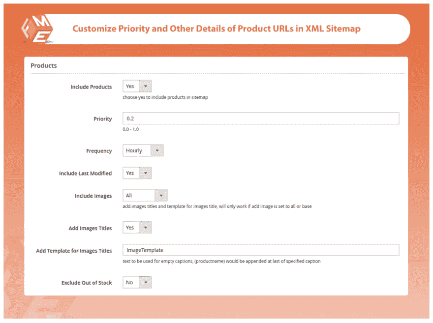
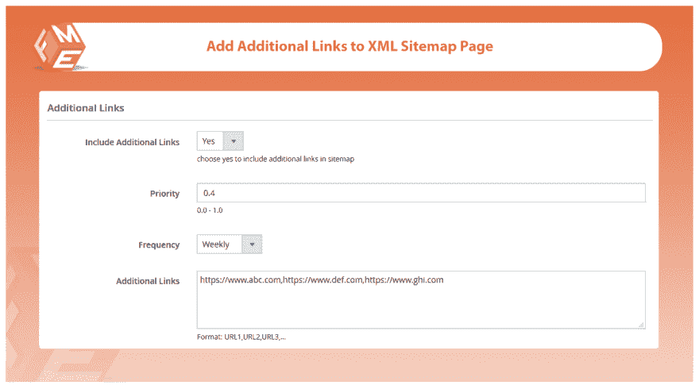
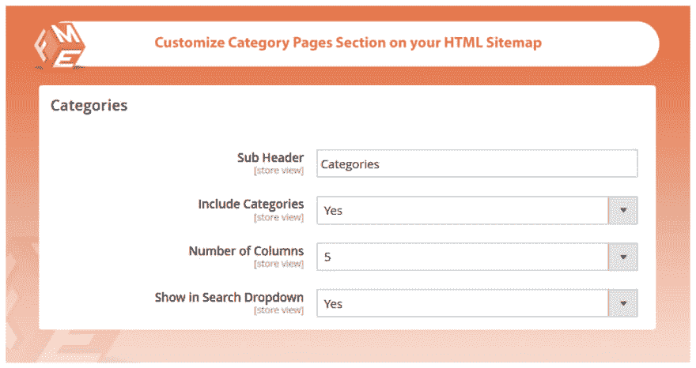
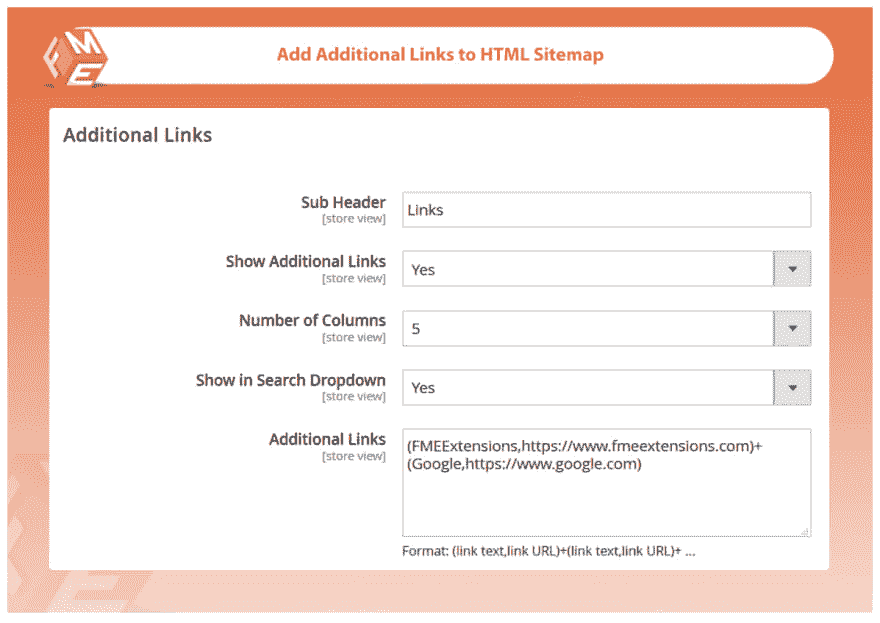

# Magento 2 的 HTML & XML SITEMAP PRO

> 原文：<https://dev.to/simonwalkerfme/html--xml-sitemap-pro-for-magento-2-31a7>

## **HTML&XML SITEMAP PRO for Magento 2**

Magento 2 HTML & XML 站点地图允许你创建多个站点地图。在谷歌这样的主要搜索引擎中更快地进行索引和排名的最佳解决方案。两个站点地图 HTML 帮助用户在你的站点上轻松导航& XML 站点地图帮助搜索引擎更好地理解你的站点。

您可以使用此扩展自定义 URL 的功能和外观。

## **主要特征**

### **生成多个 XML 站点地图**

您可以使用 HTML & XML Sitemap Pro 扩展为成千上万的网站 URL 创建多个 XML 站点地图，这将帮助您在搜索引擎中快速建立索引。

### **包括/排除产品、类别、CMS &来自 XML 站点地图的其他 URLs】**

你可以在生成站点地图时添加或删除图片 URL。添加图片网址将有助于提高你在谷歌图片搜索中的排名。

### **为每种类型的页面配置优先级&改变频率和其他细节**

您可以用不同的方式配置产品。

*   制品
*   种类
*   CMS 页面
*   附加链接

### **设置 Cronjob 自动向站点地图添加新的 URL**

通过设置 Cronjob，每天、每周或每月自动更新您的站点地图。

### **生成 HTML 网站地图**

HTML 网站地图帮助你的客户在你的网站上轻松导航。他们可以很容易地在你的网站上找到产品。

### **按字母顺序和类型(产品、类别、内容管理系统)对网址进行分类**

让您的网站更容易为您的客户导航。按照字母顺序和产品类型对你的产品进行分类。

### **包含/排除 HTML 网站地图中的产品、类别、内容管理系统&和其他网址**

您可以添加或删除 HTML 网站地图中的产品，类别，内容管理和其他网址。你也可以在你的 HTML 站点地图中隐藏缺货的商品，并使用这个扩展为它们添加新的商品。

**了解更多详情&演示-** **[Magento 2 网站地图](https://www.fmeextensions.com/xml-html-sitemap-seo-extension-magento-2.html)**

[T22】](https://res.cloudinary.com/practicaldev/image/fetch/s--7Hw_0Zr9--/c_limit%2Cf_auto%2Cfl_progressive%2Cq_auto%2Cw_880/https://thepracticaldev.s3.amazonaws.com/i/hu99z8n7belh22bivuq1.png)