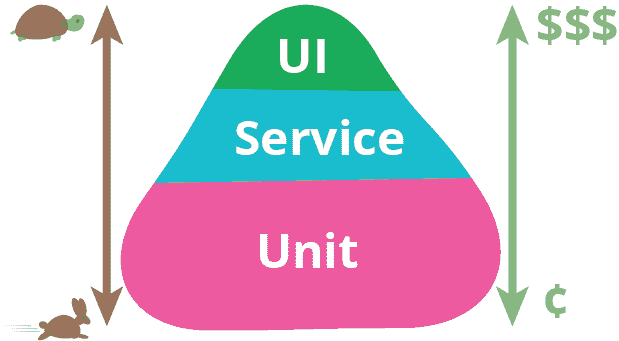
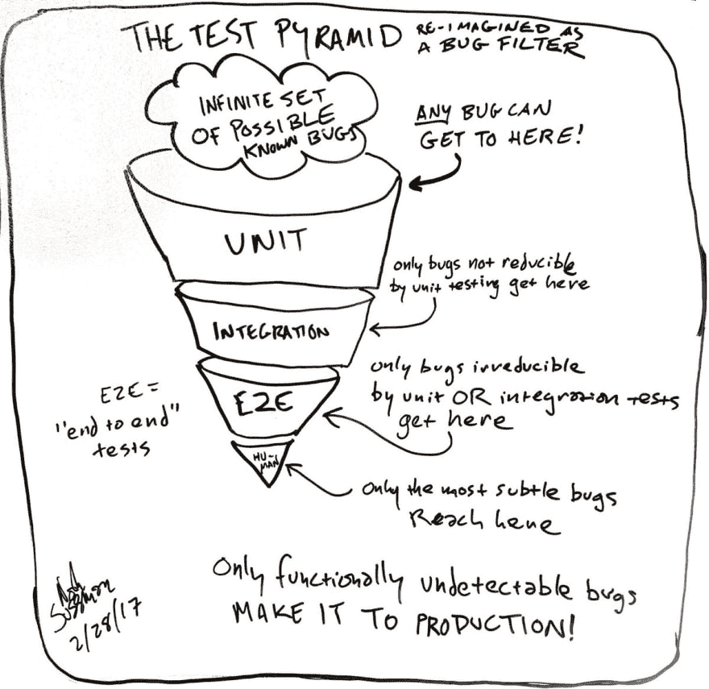
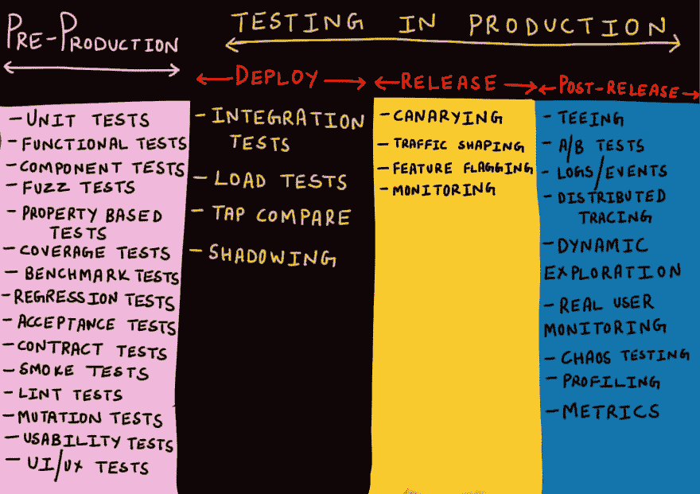
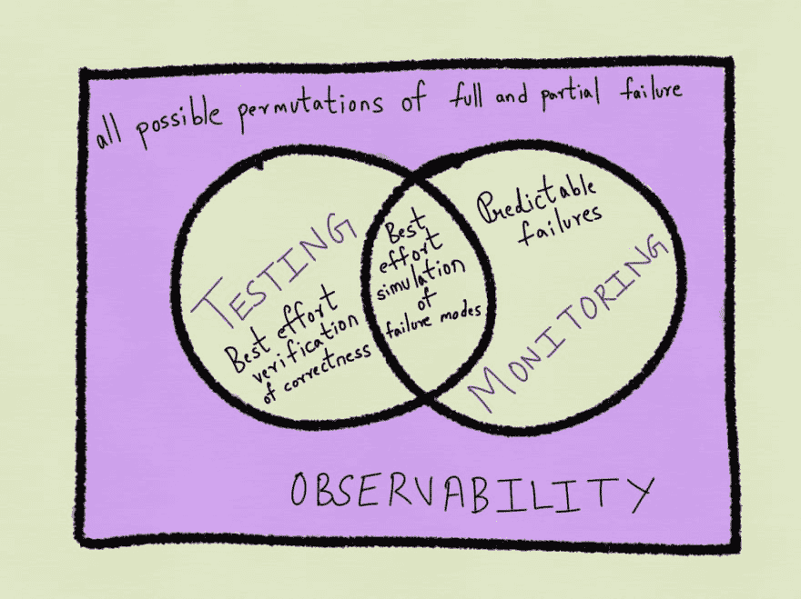
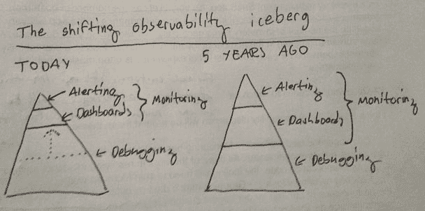

# 软件测试的发展

> 原文：<https://dev.to/alanmbarr/the-evolution-of-software-testing-54j>

## 团队努力

软件团队中的每个人都对软件的质量负责。软件测试的方向在哪里？在我们如何制造更好质量的软件中，这与开发人员、基础设施和测试人员有什么关系？

通常，当我们谈论自动化测试工作时，我们会讨论测试金字塔。这传达了我们测试中最有价值的地方及其速度。

这不是故事的唯一部分。随着软件的增长，测试变得更加微妙。我们如何捕捉进入生产环境的错误？

为了掌握持续集成和交付，我们需要安全地掌握生产中的测试。

随着我们制造和连接更多的系统，我们也增加了故障点。我们需要接受失败，并把它作为快速学习的经历。

我们怎样才能使我们的软件对维护它的人来说更安全呢？我们如何让使用它的人更安全？

我们制作的新软件必须是可观察和可解释的。如果不是这样，随着时间的推移，支持和维护的成本将会大大增加。

我们大部分时间花在追踪问题上

*   我们发现的问题有多少是因为我们有监控、警报和仪表板？
*   当出现重大问题时，一个人调试代码需要多长时间？
*   调试或找到追踪问题的正确信息有多容易？
*   我们正在培养什么习惯，以使团队更容易发现引入问题的地方？