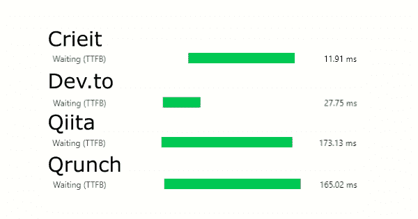
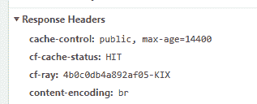

# Crieit 的文章详细页面在日本的技术类投稿服务中最快

> 原文:# t0]https://dev . to/dala 00/crie-12fe

Crieit 的文章详细信息页面的响应速度变得像 dev.to 一样快。 实际上比 dev.to 还快。 包括 Qiita 等在内，技术报道类服务是日本第一。

此图像比较了每个服务的文章页面响应所用的时间。 因为时间不同也有偏差，所以试着记了一下速度快的东西，但是国内的 Qiita 和 Qrunch 是 170 毫秒左右，爆速成为话题的 dev.to 也意外地是 30 毫秒左右，平均下来感觉有点慢。 而且 Crieit 只有 15 毫秒左右，所以是最快的。

作为确认方法，我认为很容易理解是从首页点击报道页的链接，还是在报道页上重新加载。

(本文之后的内容在应对后还在验证中，如果有错误的信息等的话请指出来就帮大忙了。)

## 为什么很快

其理由是，因为让用户用名为 Cloudflare 的 CDN 缓存在 Laravel 端动态渲染的 HTML，所以浏览网站的人的浏览器只是显示了它。 这意味着它与读取无程序的 html 文件处于同一级别。 实际上，阿部宽的主页也大概是 17 毫秒，速度差不多。

最近流行一个叫 Gatsby 的静态网站生成器。 这也是提前构建内容，在网站上只显示静态文件，所以可以最快地传递内容，也就是说完全处于同一水平。 而且像 Cloudflare 这样的 CDN 是从观众附近的服务器发送的，所以网络的延迟也非常少，会瞬间显示在浏览器上。 所以，快并不是什么了不起的事，要说理所当然就是理所当然的事。

mizchi 也在博客上说。

> 前端优化的最终解决方案之一是“在 CDN Edge 中缓存并返回 HTML”。

[边缘工作者帕阿斯·の·菲伊奥·が面白い -米琪的博客](https://mizchi.hatenablog.com/entry/2019/02/21/235403)

## 完美吗

一点也不完美。 本来现在只支持报道页面，所以其他页面和以前一样。

而且，因为每个页面都必须有人访问一次，所以只有在投稿后和编辑后还是老样子，平时谁也不访问的文章等都不会被缓存，所以必须在最初有人访问的时候让他尝尝重量。 具体来说，从 Chrome 的 Dev Tools 等来看，如下所示，如果响应 HIT，则缓存处于有效状态。 (如果为 MISS，则重新加载后会变为 HIT。)

还有，我自己的理解也不能说是完美的，所以也有可能是误会了什么。 虽然认识到只要 bot 访问一次就可以缓存，但是访问相应的文章后发现很多情况下意外地没有缓存。 也因为是发布不久的时期，有很多不明白的地方和没有充分确认的部分，所以这一点需要继续确认。

因此，如果文章标题也不在意字数的话，“Crieit 的文章详细页面的 HTML 获取响应只限于启用了 CDN 缓存的页面，在日本的技术类投稿服务中速度最快，但如果没有效果的话速度会非常慢”是正确的。

## 与 Gatsby 和 Hugo 的不同

你可能会想，如果使用最近流行的 Gatsby 或 Hugo 就好了，但是这些都需要事先构建，所以不能用于 Crieit 这样的用户投稿型服务。 (虽然可能有什么方法，但总的来说，实时反映似乎很难。)

因此，感觉让其直接缓存在服务器端渲染的内容是现实的。 也不需要构建。

## 有什么好处

### 快本身就好

总之快速本身就是好处。 慢了果然会很烦躁，搜索引擎方面也觉得越快越好。 而且访问时的心情也很大。

### 也没有服务器的负荷

因为是在 CDN 端发送，所以无法访问服务器。 因此，可以抑制服务器的负荷。 实际上，由于该服务器是 Google Compute Engine 最差劲的服务器，处于免费运行的水平，所以性能差，而且由于美国的地区，延迟也很大。 大致正常访问的话会花 1 秒左右的时间。 (因此，dev.to 给人的印象当然是 Qiita 和 Qrunch 也非常高速。)

嗯，这并不是什么大问题，但是随着文章和帖子的增加，网页也随之增加，随意巡视网站的不太了解的 bot 访问量也越来越多。 如果只是普通浏览的用户的访问完全没有问题，但是如果连这样的 bot 的访问也包含在内的话，我想极限会不会变快。

所以，从希望 bot 全部都不再来我们的服务器的想法出发，我也决定了应对。

## 具体是怎么做的

### 到底什么是云框架

所谓 CDN，是缓存各服务的静态内容，利用遍布世界各地的发布网络，从最近的据点进行发布的非常厉害的结构。

例如，Cloudflare 默认发送 js、css、图像。 由于 js 和 css 文件最近已构建，有时会达到数 MB，因此从服务器上发布时速度会慢很多。 其中初期下载需要几秒钟。 因为通过 CDN 发布的话可以瞬间发布，所以本来就已经到了没有 Cloudflare 就不成立的水平了。

默认情况下只发布上述文件，但是设置 Page rules 后，也可以以其他模式发布。 用它来设定文章的 URL 模式，并发布。

### 需要调整标题

但是，只是设置 Page rules 并不会缓存。 这是因为 Cloudflare 可以通过查看页面响应标头的内容来判断是否缓存。 如果规定了缓存期间，就可以在该期间废弃缓存并再次更新，原本就不缓存包含个人信息等而不应该缓存的页面等。

例如，如果是 Laravel 之类的，它包含缺省情况下全部禁用缓存的响应标头，因此不会缓存任何内容。 因此，必须返回用于配置 Middleware 和路由以允许缓存的响应标头。

具体来说，在 Cache-Control 报头中返回以下内容。 我们将为 CDN 创建一个 Middleware 组，并在该组的路由文件中写入路由。 不仅是标头，为了安全起见也禁用了会话。

#### 公共

这种家伙可以随心所欲地缓存哦。

#### s-maxage

面向 CDN 的缓存时间。 总之把它弄大了，让它永久缓存。 (虽然没有验证是否实际完成)

#### 最大年龄

面向浏览器的缓存时间。 如果未指定 s-maxage，则也用于 CDN 缓存时间。 如果太长，则无法注意到 CDN 端的缓存已断开，所以将其缩短。 即使浏览器缓存用完了，也只是拿来缓存 CDN，所以没有问题。

#### 不发送 Set-Cookie 报头

如果响应返回 Set-Cookie，则系统会判断它可能包含个人信息，并且不会进行缓存，因此不发送。

如果是 Laravel 的话，追加`\App\Http\Middleware\NoCookie::class`的中间件。 但是，在 web 的路由上只追加这个中间件似乎也不起作用，所以我想另外制作 CDN 用的中间件组比较好。

### 需要缓存的 purge

这样下去的话会被永久缓存，即使更新文章也不会反映出来。 因此，必须销毁缓存。

虽然可以在 Cloudflare 的管理画面中进行，但是因为还提供了 API，所以使用它。

[在 PHP 中经由 Cloudflare 的 API 删除缓存](https://crieit.net/posts/PHP-Cloudflare-API)

现在，在文章更新时，我们将推送缓存。 我觉得目前进展顺利。

### 如何管理登录状态

因为是静态缓存，所以只有在服务器端的模板上登录时才能显示这个，这样的事情就不能再发生了。 因此，我们决定保留登录到 vuex store 的状态，并在页面显示后只替换需要的位置。

虽然说要替换，但只是将 Vue 组件化，根据 Store 的信息切换显示。

### 如何处理实时数据

所谓实时数据，例如不能缓存但需要显示的注释和访问次数等。 这些在页面显示后，用 ajax 取来了。 也就是说，如果被缓存的话还可以，但是如果没有被缓存的话，包括页面的绘制在内的话，就会进行两次通信。

但是，这是独自为了计算访问量而本来就在进行通信，所以不会改变，和想要坚持到底的契机是为了 bot 对策，如果能减少其访问量的话应该没问题。 我想经常访问的页面大概会处于缓存状态，否则的页面也不会怎么访问，所以我想应该是误差吧。 总之，考虑到无视 bot，只关心实际来看的人的负荷就好了，我认为这是很大的好处。

## 问题点等的考察

因为还有谜题和问题点，所以我会继续考察。 也有可能只是误会为知识不足，所以知道的人请一定要给我建议。 另外，这个考察毕竟是 Cloudflare 的故事，其他的 CDN 服务也有可能完全没有关系。

### 未缓存？

尝试访问确认通过 Google Analytics 访问过的页面，或者在服务器日志中发现 bot 来了的页面，但是缓存大多没有效果。 (上述标头为 MISS 而不是 HIT )

因此，我担心没能很好地设定期限，或者原本就误解了 CDN 自身的规格。 但是，我想，如果每个网络区域都有缓存的话，也有可能会变成这样。

如上所述，并非所有 CDN 服务器都有缓存，因为内容是从邻近的区域分发的。 确实，如果密切合作的话，会成为失去响应速度的主要原因，所以我觉得每个区域的管理是否足够。 我想 purge 大概会全部联动进行吧。 (好像看到了在某个地方瞬间删除的记述)

或者 bot 式的访问不使用缓存而让其直接通过？

### 更新时需要 purge

后来我才注意到，仔细想想，即使更新了某些功能并发布了，HTML 也不会改变，所以不会反映出已经发布了。 构建的 JavaScript 文件虽然已经版本化了，但是它也不会看新版本的东西，所以最终更新什么的时候需要 purge，而且所有的页面都会变得很沉重。 更新得越频繁，缓存就越无效。 (尽管如此，情况与应对前没有变化)

因此，可能要先进行手动全 purge，累了之后可以自动部署现在手动进行的部署并将其编入其中，然后放弃 CDN 技术从最快的宝座上下来。

## 总结

因为有总之想试试使用 Cloudflare 的免费 CDN 艺的地方，所以试了一下。 虽然会收费，但是如果是其他的 CDN 服务的话，应该可以运用得更轻松一些。 如果是很少使用登录信息的服务等，也许可以马上导入。

由于在 Crieit 上主板的数据数量也在增加，所以我们也正在尝试 CDN 化。 因为有私人功能，所以在那一点上需要一些诀窍。 另外，我还想分析一下服务器端的访问日志的访问次数是如何变化的。 如果再有有趣的信息的话，我会把它写成报道。 (因为没有详细确认设定，所以可能已经消失了…)